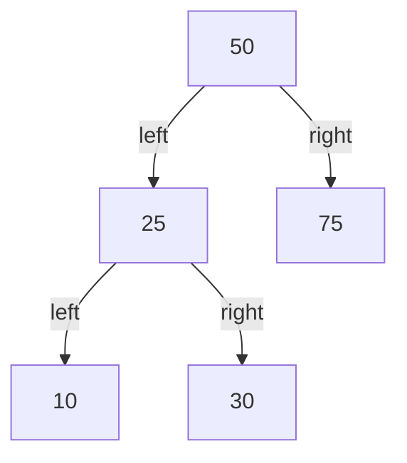
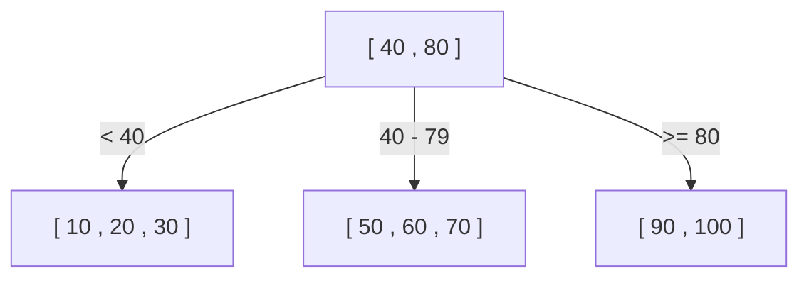
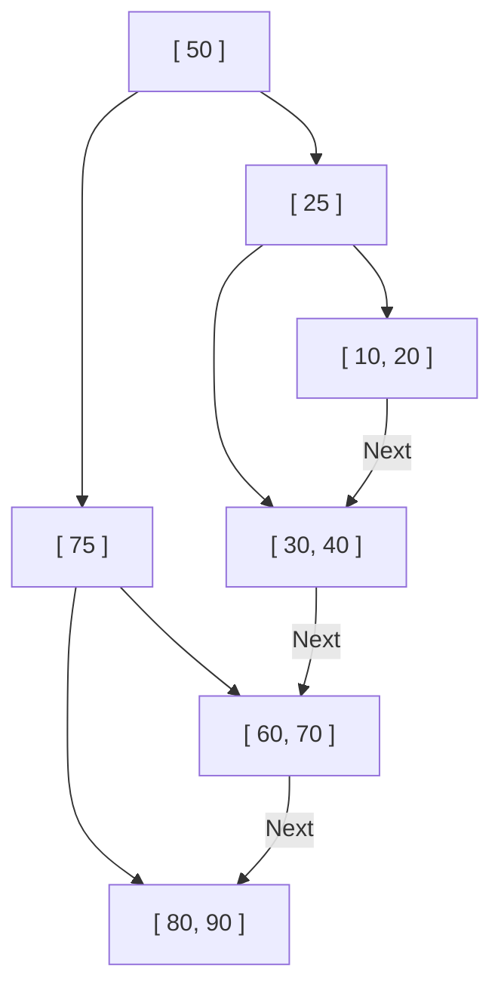

Por que os bancos de dados conseguem encontrar o dado desejado em uma fração de segundo, mesmo entre dezenas ou centenas de milhões de registros? Por trás disso, existe um mecanismo chamado "índice", e as estruturas de dados centrais que suportam esses índices são a **Árvore B (B-Tree)** e a **Árvore B+ (B+Tree)**.

Neste artigo, começaremos com a árvore de busca binária simples e exploraremos por que os bancos de dados relacionais (RDB) adotaram a Árvore B+, aprofundando-nos no processo de evolução e na sua estrutura interna.

## 1. As Limitações da Árvore de Busca Binária (BST)

Quando pensamos em uma estrutura de dados para acelerar a busca de dados, a primeira coisa que vem à mente pode ser a "Árvore de Busca Binária (Binary Search Tree: BST)". Na árvore de busca binária, cada nó tem no máximo dois filhos, com a propriedade de que o filho esquerdo é menor que o pai, e o filho direito é maior que o pai. Em um estado ideal, a complexidade computacional da busca seria $O(\log N)$, sendo extremamente rápida.

No entanto, existem problemas fatais em usar a árvore de busca binária diretamente como um índice de banco de dados.

### Desequilíbrio da Árvore
Se os dados continuarem sendo inseridos de forma ordenada, a árvore de busca binária se tornará como uma lista encadeada em linha reta, e a eficiência da busca se degradará para $O(N)$. Para evitar isso, existem "árvores de busca binária balanceadas", como a árvore AVL e a árvore rubro-negra, que ajustam automaticamente o equilíbrio para manter a altura da árvore em $\log N$.

### A Barreira da E/S de Disco
O maior desafio reside na **E/S (Entrada/Saída) de disco**. Para operações na memória, as árvores de busca binárias balanceadas são suficientemente rápidas, mas os índices de banco de dados são normalmente armazenados no disco (HDD ou SSD).
A leitura de dados do disco é um processo esmagadoramente mais lento em comparação com o cálculo da CPU ou acesso à memória. Além disso, o disco não lê os dados byte a byte, mas lê e escreve em **unidades agrupadas chamadas "blocos" ou "páginas" (por exemplo, 4KB ou 8KB)**.

Na árvore de busca binária, a quantidade de dados que um único nó possui é pequena, e a "altura (profundidade)" da árvore tende a ser profunda. Uma árvore profunda significa que muitos nós precisam ser atravessados desde a raiz até o nó folha desejado e, se cada nó exigir a leitura de uma página de disco diferente, ocorrerá uma enorme quantidade de E/S de disco e o desempenho cairá significativamente.

## 2. Árvore B (B-Tree): Reduzindo a Altura e Minimizando a E/S

A abordagem para reduzir o número de E/S de disco é clara: "**Tornar a altura da árvore o mais baixa (rasa) possível**". Para fazer isso, é necessário que um nó possa ter não apenas dois, mas muito mais nós filhos (de dezenas a centenas).
Esta é a ideia básica da **Árvore B (B-Tree)**.

A Árvore B é um tipo de "árvore n-ária" e possui as seguintes características:
- Armazena múltiplas chaves (dados) em um único nó.
- Ao alinhar o tamanho do nó com o tamanho da página do disco (ex: 4KB ou 8KB), muitas chaves podem ser lidas de uma só vez para a memória com uma única E/S de disco.
- Mantém sempre o equilíbrio perfeito (todos os nós folhas estão na mesma profundidade).

### Algoritmo de Busca na Árvore B
1. Lê o nó raiz do disco.
2. Escaneia (ou faz uma busca binária) o array de chaves dentro do nó para encontrar o ponteiro do nó filho que contém o valor desejado.
3. Lê o nó filho indicado pelo ponteiro do disco e repete o mesmo procedimento.
4. Quando encontra a chave desejada, obtém os dados associados a ela (ou o ponteiro para os dados reais no disco).

Por exemplo, suponha que temos uma Árvore B onde um único nó pode conter 100 chaves.
Mesmo com uma Árvore B de altura 3 (raiz, intermediário, folha), podemos armazenar $100 \times 100 \times 100 = 1.000.000$ (1 milhão) de registros. Em outras palavras, para encontrar um único registro entre 1 milhão, bastam **no máximo 3 E/S de disco**. Isso é uma melhoria dramática em comparação com uma árvore de busca binária, cuja altura seria em torno de 20, resultando em 20 operações de E/S.

## 3. Árvore B+ (B+Tree): A Evolução Definitiva no RDB

A Árvore B é uma estrutura de dados excelente, mas bancos de dados relacionais modernos como MySQL (InnoDB) e PostgreSQL adotam uma derivada da Árvore B, a **Árvore B+ (B+Tree)**, como seu índice.

Por que usar a Árvore B+ em vez da Árvore B? O motivo está na eficiência esmagadora das "consultas de intervalo (Range Query)" e do "acesso sequencial".

### Diferenças entre Árvore B e Árvore B+
A Árvore B+ faz as seguintes mudanças importantes em relação à Árvore B:

1. **Todos os dados são armazenados apenas nos nós folhas (Leaf)**
   - Na Árvore B, os dados reais (ou ponteiros para dados reais) eram armazenados no nó raiz e nós intermediários também.
   - Na Árvore B+, a raiz e os nós intermediários mantêm apenas os **"sinais (chaves de índice)"**, e não contêm dados reais de forma alguma. Todos os dados reais são colocados nos nós folhas do nível mais baixo.

2. **Os nós folhas estão conectados uns aos outros por uma lista duplamente encadeada**
   - Nós folhas adjacentes têm ponteiros entre si, permitindo seguir os dados horizontalmente de forma contínua.

### Por que a Árvore B+ é Ideal para RDB

#### 1. Aumento do Número de Chaves por Nó (Fanout)
Como a raiz e os nós intermediários não contêm dados reais, o número de "chaves e ponteiros" que podem ser armazenados em um único nó pode ser significativamente aumentado. Por exemplo, assumindo que o tamanho da página é o mesmo (4KB), enquanto a Árvore B poderia ter apenas 50 chaves por nó (pois também inclui dados), a Árvore B+ pode conter 500 chaves (pois contém apenas chaves).
Isso torna a altura da árvore ainda mais baixa, reduzindo a E/S de disco.

#### 2. Consultas de Intervalo (Range Query) Extremamente Rápidas
Em bancos de dados, consultas de intervalo como `SELECT * FROM users WHERE age BETWEEN 20 AND 30;` ocorrem frequentemente.
Se fizéssemos isso em uma Árvore B, teríamos que atravessar a árvore para cima e para baixo repetidas vezes para encontrar os dados que correspondem à condição, gerando E/S desnecessária.
Por outro lado, no caso da Árvore B+:
1. Primeiro, descemos pela árvore até encontrar o nó folha que serve como ponto de partida, `age = 20`.
2. Depois disso, basta ler horizontalmente (sequencialmente) ao longo da "lista encadeada" que conecta os nós folhas, até que a condição (`age <= 30`) não seja mais atendida.
Como o acesso sequencial no disco é extremamente rápido, essa característica cria uma vantagem esmagadora do ponto de vista da E/S de disco.

## 4. Divisão de Nó (Split) e Algoritmos de Inserção/Remoção

Os índices devem manter sempre o equilíbrio cada vez que os dados são adicionados ou removidos. A Árvore B+ possui um algoritmo para manter o equilíbrio automaticamente.

### Inserção e Divisão (Split)
Ao inserir uma nova chave, primeiro encontra-se o nó folha alvo usando o mesmo procedimento da busca, e a chave é adicionada lá.
Se esse nó já estiver cheio (tendo atingido o limite máximo), ocorre a **divisão do nó (Split)**.
1. Divide as chaves do nó cheio pela metade, criando dois novos nós (ou mantendo o nó original e criando mais um novo nó).
2. A chave do meio separada é **promovida para o nó pai**.
3. Se o nó pai também estiver cheio, ele é dividido da mesma forma, e essa divisão se propaga em cadeia para cima.
4. Quando a divisão finalmente atinge o nó raiz, um novo nó raiz é criado, e somente neste momento **a altura da árvore aumenta em um nível**.

Graças a esse processo de construção bottom-up, a Árvore B+ sempre mantém um "equilíbrio perfeito", onde a distância (profundidade) até os nós folhas é exatamente a mesma.

## 5. Conclusão

A razão pela qual os bancos de dados conseguem realizar buscas em alta velocidade se deve ao fato de usarem a **Árvore B+**, que foi projetada compreendendo profundamente o gargalo físico da E/S de disco e buscando minimizá-lo.
- Minimizar ao extremo a "altura" da árvore para alcançar os dados com o menor número possível de leituras.
- Concentrar os dados nos nós folhas, aumentando a densidade dos nós de índice.
- Conectar nós folhas através de uma lista encadeada, permitindo acessos de disco sequenciais eficientes em buscas de intervalo.

Não é apenas pela "complexidade do algoritmo", mas sim por sua otimização para as "características de hardware (acesso a páginas do disco)" que a Árvore B+ reina absoluta como líder nos bancos de dados por tantas décadas.
