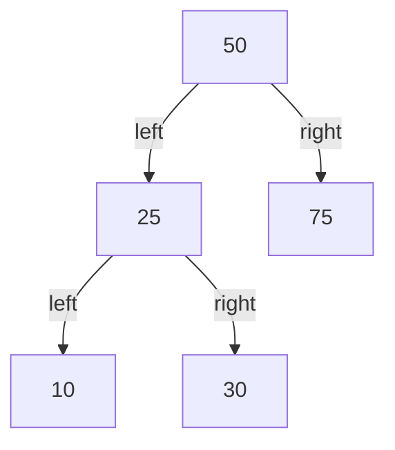
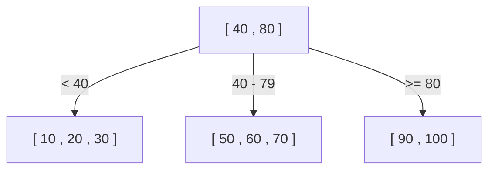
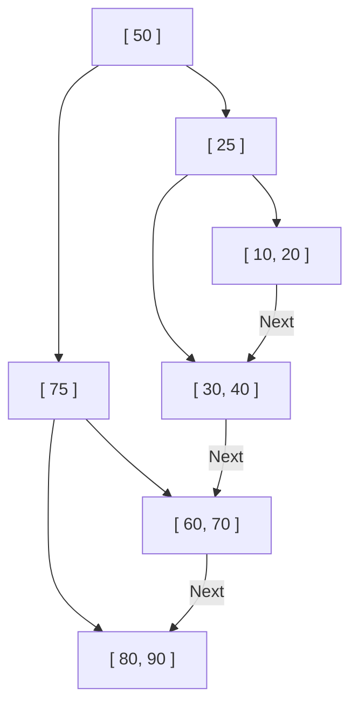

Почему базы данных могут найти нужные данные среди десятков и сотен миллионов записей за долю секунды? За этим стоит механизм, называемый «индексом», а его основой служит структура данных **B-дерево (B-Tree)** и **B+ дерево (B+Tree)**.

В этой статье мы начнем с простых бинарных деревьев поиска и подробно разберем эволюцию и внутреннюю структуру, объясняя, почему реляционные базы данных (RDB) стали использовать B+ деревья.

## 1. Ограничения бинарного дерева поиска (BST)

Возможно, первой структурой данных для ускорения поиска, которая приходит на ум, является «бинарное дерево поиска (Binary Search Tree: BST)». В бинарном дереве поиска каждый узел имеет максимум двух потомков: левый потомок меньше родителя, а правый — больше. В идеальном состоянии сложность поиска составляет $O(\log N)$, что очень быстро.

Однако использование бинарного дерева поиска в чистом виде в качестве индекса базы данных имеет фатальные проблемы.

### Нарушение баланса дерева
Если данные постоянно вставляются в отсортированном виде, бинарное дерево поиска превращается в прямой связный список, и эффективность поиска ухудшается до $O(N)$. Чтобы предотвратить это, существуют «сбалансированные бинарные деревья поиска», такие как АВЛ-деревья и красно-черные деревья, которые автоматически балансируют дерево, поддерживая его высоту на уровне $\log N$.

### Барьер дискового ввода-вывода
Главная проблема кроется в **дисковом вводе-выводе (I/O)**. Если операции выполняются в оперативной памяти, сбалансированного бинарного дерева поиска вполне достаточно, но индексы баз данных обычно хранятся на диске (HDD или SSD).
Чтение данных с диска — это процесс, который подавляюще медленнее по сравнению с вычислениями CPU или доступом к памяти. Кроме того, диск читает и пишет данные не по одному байту, а **крупными блоками (или страницами) (например, 4 КБ или 8 КБ)**.

В бинарном дереве поиска объем данных, содержащихся в одном узле, невелик, и «высота (глубина)» дерева часто становится большой. Большая глубина дерева означает, что для достижения нужного листового узла от корня необходимо пройти через множество узлов. Если для каждого узла придется считывать разные страницы диска, возникнет огромный объем дискового ввода-вывода, и производительность значительно упадет.

## 2. B-дерево (B-Tree): снижение высоты и минимизация ввода-вывода

Подход к сокращению количества операций ввода-вывода на диск ясен: «**сделать высоту дерева как можно меньше (мельче)**». Для этого необходимо, чтобы один узел имел не двух, а гораздо больше потомков (десятки или сотни).
Это и есть основная идея **B-дерева (B-Tree)**.

B-дерево является разновидностью «многопутевого дерева» и имеет следующие особенности:
- В одном узле хранится несколько ключей (данных).
- Размер узла сопоставляется с размером страницы диска (например, 4 КБ или 8 КБ), чтобы за одну операцию ввода-вывода можно было загрузить в память множество ключей.
- Всегда поддерживается идеальный баланс (все листовые узлы находятся на одной глубине).

### Алгоритм поиска в B-дереве
1. Загрузка корневого узла с диска.
2. Сканирование массива ключей в узле (или бинарный поиск) для нахождения указателя на дочерний узел, который содержит искомое значение.
3. Загрузка с диска дочернего узла по указателю и повторение того же процесса.
4. При нахождении искомого ключа, получение связанных с ним данных (или указателя на фактические данные на диске).

Предположим, у нас есть B-дерево, в котором один узел может содержать 100 ключей.
Даже при высоте дерева, равной 3 (корень, промежуточные, листья), оно может хранить $100 \times 100 \times 100 = 1,000,000$ (1 миллион) записей. То есть, чтобы найти нужную запись среди миллиона, потребуется **максимум 3 операции ввода-вывода**. По сравнению с бинарным деревом поиска, высота которого составила бы около 20, что привело бы к 20 операциям ввода-вывода, это кардинальное улучшение.

## 3. B+ дерево (B+Tree): вершина эволюции для RDB

Хотя B-дерево является отличной структурой данных, современные реляционные базы данных, такие как MySQL (InnoDB) и PostgreSQL, используют в качестве индексов его производную — **B+ дерево (B+Tree)**.

Почему B+ дерево, а не B-дерево? Причина кроется в невероятной эффективности «поиска по диапазону (Range Query)» и «последовательного доступа».

### Различия между B-деревом и B+ деревом
В B+ дерево внесены следующие важные изменения по сравнению с B-деревом:

1. **Все данные хранятся только в листовых узлах**
   - В B-дереве фактические данные (или указатели на них) хранились как в корневом, так и в промежуточных узлах.
   - В B+ дереве корень и промежуточные узлы содержат **только «указатели пути» (ключи индекса)** и вообще не содержат фактических данных. Все фактические данные размещаются в листовых узлах на самом нижнем уровне.

2. **Листовые узлы связаны между собой двусвязным списком**
   - Соседние листовые узлы имеют указатели друг на друга, что позволяет перемещаться по данным горизонтально.

### Почему B+ дерево идеально подходит для RDB

#### 1. Увеличение количества ключей на узел (Fanout)
Поскольку корень и промежуточные узлы не содержат фактических данных, количество «ключей и указателей», которые можно поместить в один узел, значительно возрастает. Например, если размер страницы составляет 4 КБ, в B-дереве узел мог бы вместить только 50 ключей из-за хранения данных, а в B+ дереве, где хранятся только ключи, узел может вместить 500.
Это еще больше уменьшает высоту дерева и сокращает дисковый ввод-вывод.

#### 2. Взрывная скорость поиска по диапазону (Range Query)
В базах данных часто выполняются запросы на поиск по диапазону, например `SELECT * FROM users WHERE age BETWEEN 20 AND 30;`.
При выполнении этого запроса в B-дереве приходится многократно перемещаться (обходить) по дереву вверх и вниз, чтобы найти подходящие данные, что приводит к лишним операциям ввода-вывода.
В случае B+ дерева:
1. Сначала мы спускаемся по дереву от корня вниз и находим листовой узел для начальной точки `age = 20`.
2. Затем просто последовательно (горизонтально) читаем «связный список» из листовых узлов, пока не закончится условие (`age <= 30`).
Поскольку последовательный доступ (непрерывное чтение) к диску происходит очень быстро, это свойство дает огромное преимущество с точки зрения дискового ввода-вывода.

## 4. Алгоритм разделения узлов (Split), вставки и удаления

Индексы должны постоянно поддерживать баланс при добавлении и удалении данных. В B+ дереве реализован алгоритм автоматического поддержания баланса.

### Вставка и разделение (Split)
При вставке нового ключа сначала с помощью той же процедуры, что и при поиске, находится целевой листовой узел, и ключ добавляется туда.
Если этот узел уже полон (достиг лимита), происходит **разделение узла (Split)**.
1. Ключи переполненного узла делятся пополам, образуя два новых узла (или исходный и один новый узел).
2. Разделенный центральный ключ **поднимается (promote) в родительский узел**.
3. Если родительский узел также полон, он тоже разделяется, и разделение распространяется вверх по цепочке.
4. Когда разделение доходит до корневого узла, создается новый корневой узел, и здесь **высота дерева увеличивается на один уровень**.

Благодаря этому процессу построения снизу вверх, B+ дерево всегда сохраняет «идеальный баланс», при котором расстояние (глубина) до всех листовых узлов абсолютно одинаково.

## 5. Заключение

Высокая скорость поиска в базах данных достигается благодаря глубокому пониманию физического узкого места, такого как дисковый ввод-вывод, и структуре **B+ дерева**, спроектированной для его минимизации.
- Максимальное снижение «высоты» дерева для достижения данных за минимальное количество операций чтения.
- Концентрация данных в листовых узлах для повышения плотности индексных узлов.
- Связывание листовых узлов в связный список для обеспечения последовательного доступа к диску при поиске по диапазону.

Тот факт, что B+ дерево оптимизировано не только для «вычислительной сложности алгоритма», но и под «аппаратные характеристики (доступ к страницам диска)», является главной причиной, почему оно на протяжении десятилетий остается королем баз данных.
