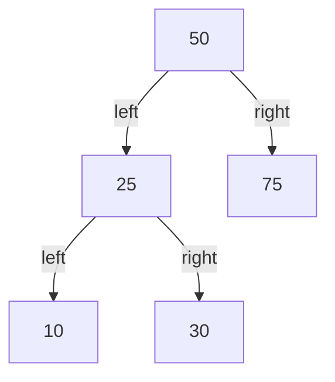
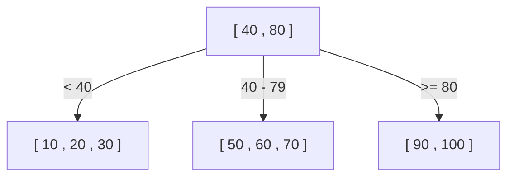
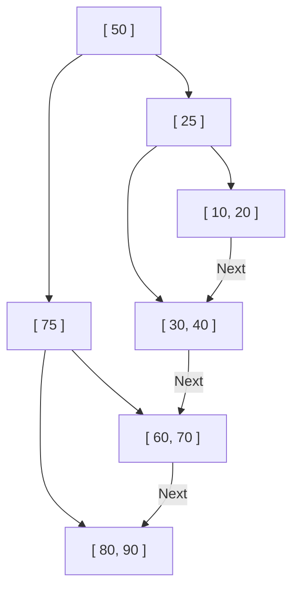

为什么数据库能够在千万甚至上亿条记录中，在转瞬之间找到目标数据呢？其背后是一种被称为“索引”的机制，而支撑这种索引的核心数据结构就是**B树（B-Tree）**和**B+树（B+Tree）**。

本文将从简单的二叉搜索树开始，深入探讨关系型数据库（RDB）为何最终选择采用B+树，并详细解析其演进过程与内部结构。

## 1. 二叉搜索树（BST）的局限性

说到加速数据搜索的数据结构，首先想到的可能就是“二叉搜索树（Binary Search Tree: BST）”。在二叉搜索树中，每个节点最多有两个子节点，并且具有左子节点小于父节点、右子节点大于父节点的性质。在理想状态下，搜索的时间复杂度为 $O(\log N)$，速度非常快。

然而，如果直接将二叉搜索树作为数据库的索引，会面临致命的问题。

### 树的平衡崩坏
如果数据以已排序的状态持续插入，二叉搜索树就会退化成像单向链表一样的结构，搜索效率会恶化到 $O(N)$。为了防止这种情况，“平衡二叉搜索树”（如 AVL树或红黑树）应运而生，它们会自动调整平衡，将树的高度保持在 $\log N$。

### 磁盘 I/O 的壁垒
最大的挑战在于**磁盘 I/O（输入/输出）**。如果是在内存中进行操作，平衡二叉搜索树已经足够快了；但数据库的索引通常保存在磁盘（HDD 或 SSD）上。
从磁盘读取数据，相比于 CPU 计算和内存访问，是一项极其缓慢的操作。此外，磁盘并不是逐字节地读取数据，而是以**“块”或“页”为单位（例如 4KB 或 8KB）进行批量读写**。

在二叉搜索树中，每个节点包含的数据量很小，导致树的“高度（深度）”容易变得很深。树很深意味着从根节点到达目标叶子节点需要遍历大量节点，如果每个节点都要读取不同的磁盘页，就会产生庞大的磁盘 I/O，导致性能显著下降。

## 2. B树（B-Tree）：抑制高度，最小化 I/O

减少磁盘 I/O 次数的方法很明确：**“尽可能降低（变浅）树的高度”**。为此，我们需要让一个节点拥有更多的子节点（几十到几百个），而不是仅仅两个。
这就是**B树（B-Tree）**的基本思想。

B树是一种“多路搜索树”，具有以下特点：
- 一个节点中存储多个键（数据）。
- 将节点的大小与磁盘的页大小（例如：4KB 或 8KB）对齐，使得一次磁盘 I/O 就能将许多键同时读取到内存中。
- 始终保持完全平衡（所有的叶子节点都处于同一深度）。

### B树的搜索算法
1. 从磁盘读取根节点。
2. 扫描（或二分查找）节点内的键数组，找到包含目标值的子节点指针。
3. 从磁盘读取指针所指向的子节点，重复相同步骤。
4. 找到目标键后，获取与之关联的数据（或指向磁盘上实际数据的指针）。

例如，假设有一棵B树，其每个节点可以容纳 100 个键。
即使是一棵高度仅为 3（根、中间、叶子）的B树，也能存储 $100 \times 100 \times 100 = 1,000,000$（100万）条数据。也就是说，在 100 万条数据中查找目标数据，**最多只需要 3 次磁盘 I/O**。与二叉搜索树高达约 20 的高度以及 20 次 I/O 相比，这简直是惊人的提升。

## 3. B+树（B+Tree）：RDB 中的终极进化形态

B树已经是一种非常优秀的数据结构，但 MySQL (InnoDB) 和 PostgreSQL 等现代关系型数据库，都采用了B树的衍生形态——**B+树（B+Tree）**作为索引。

为什么是B+树而不是B树？原因在于它对“范围查询（Range Query）”和“顺序访问”效率的压倒性提升。

### B树与B+树的区别
相比B树，B+树做了以下重要的改变：

1. **所有数据仅存储在叶子（Leaf）节点中**
   - 在B树中，根节点和中间节点也会存储实际数据（或指向实际数据的指针）。
   - 在B+树中，根节点和中间节点仅作为**“路标（索引键）”**，不包含任何实际数据。所有的实际数据都存放在最底层的叶子节点中。

2. **叶子节点之间通过双向链表相连**
   - 相邻的叶子节点互相持有指针，可以像一笔画一样横向遍历数据。

### 为什么B+树最适合 RDB

#### 1. 单个节点键数量（扇出）的增加
因为根节点和中间节点不包含实际数据，一个节点可以容纳的“键与指针”数量大幅增加。例如，假设页大小同为 4KB，在B树中由于还要存放数据，每个节点可能只能容纳 50 个；而在B+树中因为只有键，所以可以容纳 500 个。
这使得树的高度进一步降低，从而减少了磁盘 I/O。

#### 2. 范围查询（Range Query）的极速化
在数据库中，像 `SELECT * FROM users WHERE age BETWEEN 20 AND 30;` 这样的范围查询非常频繁。
如果使用B树执行这种操作，为了寻找符合条件的数据，就必须在树中不断地上下来回遍历（Traverse），从而产生无谓的 I/O。
而使用B+树时：
1. 首先从上到下遍历树，找到起始点 `age = 20` 的叶子节点。
2. 接下来只需沿着连接叶子节点的“链表”，横向（顺序地）读取数据，直到条件（`age <= 30`）结束。
由于磁盘的顺序访问（连续读取）速度非常快，从磁盘 I/O 的角度来看，这一特性带来了压倒性的优势。

## 4. 节点的分裂（Split）与插入・删除算法

每当添加或删除数据时，索引必须始终维持平衡。B+树拥有一套自动保持平衡的算法。

### 插入与分裂（Split）
插入新键时，首先按照搜索的步骤找到对应的叶子节点，并在其中添加键。
如果该节点已满（达到上限），就会发生**节点分裂（Split）**。
1. 将已满节点中的键一分为二，变成两个新节点（或是原来的节点加一个新节点）。
2. 将分裂后的中间键**向上提升（Promote）到父节点**。
3. 如果父节点也满了，父节点也会发生分裂，并进一步向上级连锁传播。
4. 当分裂最终达到根节点时，将创建一个新的根节点，这时**树的高度才会增加 1 层**。

通过这种自底向上的构建过程，B+树始终保持到达所有叶子节点的距离（深度）完全一致的“完全平衡”状态。

## 5. 总结

数据库之所以能够实现极速查询，归功于深刻理解磁盘 I/O 这个物理瓶颈，并为将其最小化而设计的**B+树**。
- 将树的“高度”降到最低，用极少的读取次数触达数据。
- 将数据集中于叶子节点，提高索引节点的密度。
- 用链表将叶子节点连接起来，实现范围查询时磁盘的顺序访问。

不仅仅是“算法的时间复杂度”，它对“硬件特性（磁盘页访问）”的极致优化，正是B+树几十年来稳居数据库王者宝座的最大原因。
