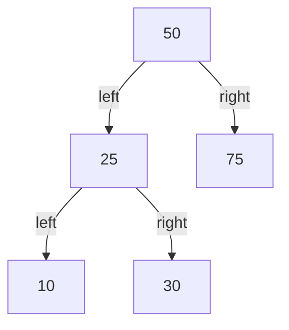
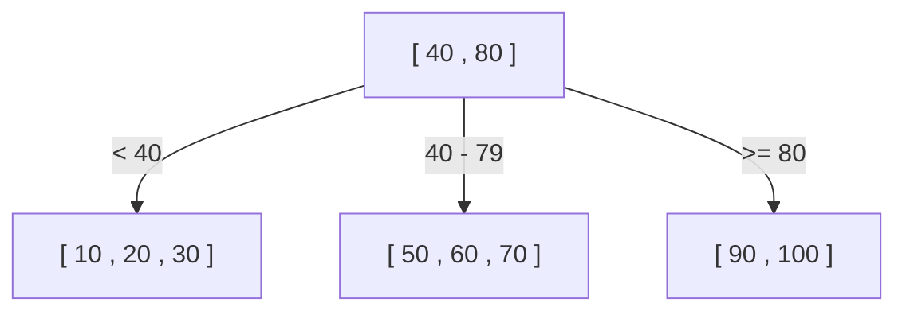
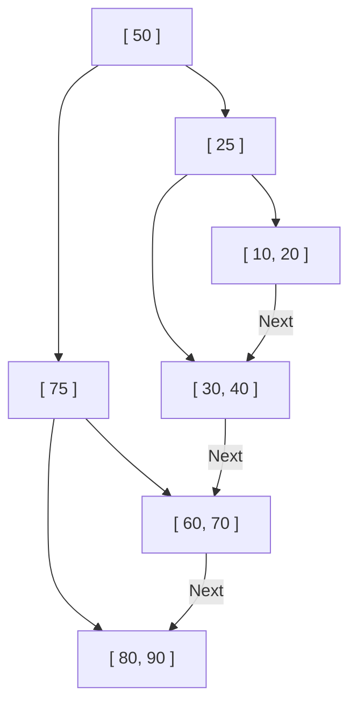

資料庫為什麼能從幾千萬、幾億筆紀錄中，在一瞬間找出目標資料呢？其背後有一套稱為「索引（Index）」的機制，而支撐這個索引的核心資料結構就是**B樹（B-Tree）**與**B+樹（B+Tree）**。

本文將從簡單的二元搜尋樹開始，深入探討為何關聯式資料庫（RDB）最終採用了 B+樹，並詳細解說其演進過程與內部結構。

## 1. 二元搜尋樹（BST）的極限

說到加速資料搜尋的資料結構，首先想到的可能是「二元搜尋樹（Binary Search Tree: BST）」。二元搜尋樹的特性是每個節點最多有兩個子節點，左邊的子節點比父節點小，右邊的子節點比父節點大。在理想狀態下，搜尋的時間複雜度為 $O(\log N)$，速度非常快。

然而，若將二元搜尋樹直接作為資料庫的索引，會存在致命的問題。

### 樹的平衡崩壞
如果資料以已排序的狀態持續插入，二元搜尋樹會變成像是一條直線的鏈結串列，搜尋效率會惡化至 $O(N)$。為了防止這種情況，出現了 AVL 樹或紅黑樹等「平衡二元搜尋樹」，自動調整平衡，將樹的高度維持在 $\log N$。

### 磁碟 I/O 的瓶頸
最大的挑戰在於**磁碟 I/O（輸入/輸出）**。如果是記憶體上的操作，平衡二元搜尋樹已經足夠快了，但資料庫的索引通常儲存在磁碟（HDD 或 SSD）中。
從磁碟讀取資料，比起 CPU 的運算或記憶體存取，是壓倒性緩慢的處理。此外，磁碟並非一次讀取一個位元組，而是以**稱為「區塊（Block）」或「分頁（Page）」的固定大小單位（例如 4KB 或 8KB）來進行讀寫**。

在二元搜尋樹中，單一節點包含的資料量很小，樹的「高度（深度）」容易變得很深。樹的深度深，意味著從根節點到目標葉節點需要經過許多節點；如果每個節點都需要讀取不同的磁碟分頁，就會產生龐大的磁碟 I/O，導致效能大幅下降。

## 2. B樹（B-Tree）：抑制高度，最小化 I/O

減少磁碟 I/O 次數的方法很明確，就是「**盡可能降低（變淺）樹的高度**」。為此，必須讓一個節點不僅擁有兩個子節點，而是能擁有更多（數十到數百個）子節點。
這正是**B樹（B-Tree）**的基本思想。

B樹是一種「多叉樹」，具有以下特徵：
- 一個節點內存放多個鍵值（資料）。
- 將節點的大小配合磁碟的分頁大小（例如：4KB 或 8KB），使得一次磁碟 I/O 就能將大量的鍵值讀入記憶體。
- 始終保持完全平衡（所有的葉節點都在相同的深度）。

### B樹的搜尋演算法
1. 從磁碟中讀取根節點。
2. 掃描（或二分搜尋）節點內的鍵值陣列，找到包含目標值的子節點指標。
3. 從磁碟中讀取指標指向的子節點，並重複相同步驟。
4. 找到目標鍵值後，取得與之關聯的資料（或指向磁碟上實際資料的指標）。

舉例來說，假設有一棵 B樹，每個節點可以容納 100 個鍵值。
即使高度只有 3（根、中間、葉）的 B樹，也能容納 $100 \times 100 \times 100 = 1,000,000$（100 萬）筆資料。也就是說，從 100 萬筆資料中尋找目標的 1 筆，**最多只需要 3 次磁碟 I/O**。與二元搜尋樹在相同資料量下高度約為 20、會產生 20 次 I/O 相比，這是戲劇性的改善。

## 3. B+樹（B+Tree）：RDB 的終極進化型

B樹是非常優秀的資料結構，但 MySQL（InnoDB）或 PostgreSQL 等現代的關聯式資料庫，都採用了 B樹的衍生型**B+樹（B+Tree）**作為索引。

為什麼是 B+樹而不是 B樹？原因在於「範圍搜尋（Range Query）」與「循序存取（Sequential Access）」的效率有著壓倒性的提升。

### B樹與 B+樹的差異
B+樹對 B樹進行了以下重要的修改：

1. **所有資料都只存放在葉（Leaf）節點**
   - 在 B樹中，根節點和中間節點也會存放實際資料（或指向實際資料的指標）。
   - 在 B+樹中，根節點和中間節點**只擁有「路標（索引鍵）」**，完全不存放實際資料。所有的實際資料都放在最底層的葉節點。

2. **葉節點之間以雙向鏈結串列相連**
   - 相鄰的葉節點互相持有指標，可以像一筆畫一樣在橫向上遍歷資料。

### B+樹最適合 RDB 的理由

#### 1. 增加每個節點的鍵值數量（Fanout）
因為根節點和中間節點不存放實際資料，單一節點能容納的「鍵值與指標」數量可以大幅增加。例如，假設分頁大小同為 4KB，B樹因為包含了資料，每個節點可能只能容納 50 個鍵值；而 B+樹因為只有鍵值，就可以容納 500 個。
這使得樹的高度變得更低，進一步減少了磁碟 I/O。

#### 2. 範圍搜尋（Range Query）的極速化
資料庫中頻繁執行類似 `SELECT * FROM users WHERE age BETWEEN 20 AND 30;` 的範圍搜尋。
如果在 B樹中執行，為了尋找符合條件的資料，必須在樹中來來回回（遍歷）好幾次，產生無謂的 I/O。
另一方面，如果是 B+樹：
1. 首先從樹的上方往下找，找到起點 `age = 20` 的葉節點。
2. 接下來只要沿著葉節點相連的「鏈結串列」，向橫向（循序）讀取，直到條件（`age <= 30`）結束為止即可。
由於磁碟的循序存取（連續讀取）速度非常快，這項特性在磁碟 I/O 觀點上帶來了壓倒性的優勢。

## 4. 節點分裂（Split）與插入・刪除的演算法

每當有資料新增或刪除時，索引必須隨時維持平衡。B+樹擁有自動保持平衡的演算法。

### 插入與分裂（Split）
插入新鍵值時，首先透過與搜尋相同的步驟找到目標葉節點，並在該處加入鍵值。
如果該節點已經滿了（達到上限），就會發生**節點分裂（Split）**：
1. 將滿載節點的鍵值平分，變成兩個新節點（或保留原節點並新增另一個節點）。
2. 將分裂出來的中間鍵值，**往上提取（Promote）到父節點**。
3. 如果父節點也滿了，父節點同樣會分裂，分裂動作會連鎖向上傳遞。
4. 最終若分裂達到根節點，就會建立新的根節點，這時**樹的高度才會變深 1 層**。

透過這種由下而上（Bottom-up）的建構過程，B+樹始終能保持到達葉節點距離（深度）完全一致的「完全平衡」。

## 5. 總結

資料庫之所以能實現高速搜尋，都要歸功於深刻理解磁碟 I/O 這個物理瓶頸，並設計來將其最小化的**B+樹**：
- 將樹的「高度」壓到最低，以最少的讀取次數到達資料。
- 將資料集中於葉節點，提高索引節點的密度。
- 將葉節點以鏈結串列相連，讓範圍搜尋時能進行循序的磁碟存取。

不僅僅是「演算法的時間複雜度」，更針對「硬體特性（磁碟的分頁存取）」進行最佳化，這正是 B+樹數十年來穩坐資料庫王者寶座的最大理由。
