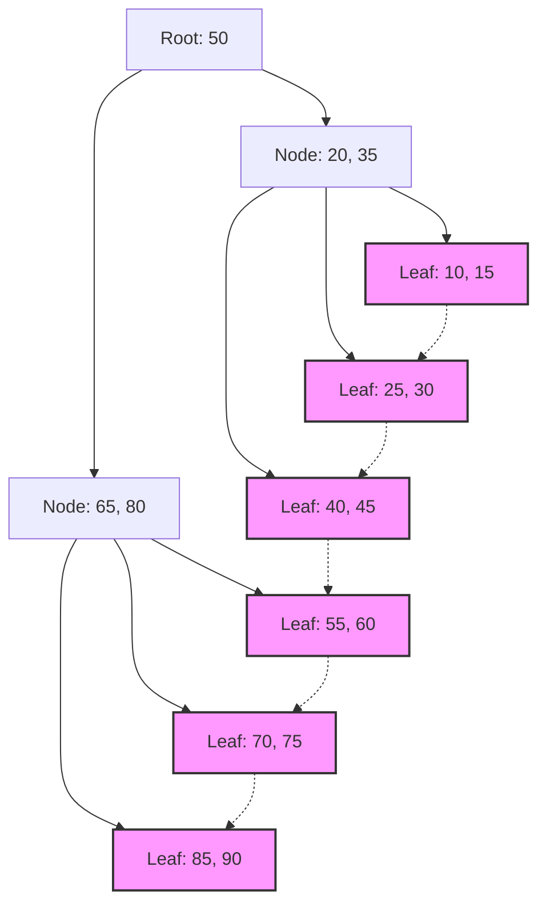

## 1. لقاء فهارس قواعد البيانات مع أشجار B

في الأنظمة الحديثة، تشكل قواعد البيانات أساس التطبيقات. تعد القدرة على البحث واستخراج البيانات المطلوبة في غضون أجزاء من الألف من الثانية من بين ملايين أو مليارات السجلات واحدة من أهم ميزات أنظمة إدارة قواعد البيانات (DBMS). ما يدعم سرعة البحث المذهلة هذه هو **الفهرس** (Index)، وهيكل البيانات الكامن وراءه هو **شجرة B** (B-[Tree](https://kenji.blog/ar/p/tree-graph-data-structures-search-dfs-bfs-dijkstra/)) ومشتقاتها **شجرة B+** (B+Tree).

في هذه المقالة، سنتعمق في سبب اختيار قواعد البيانات العلائقية لعائلة **أشجار B** بدلاً من أشجار البحث الثنائية أو جداول التجزئة، من خلال استكشاف طبيعة إدخال/إخراج القرص (Disk I/O)، ونظرية هياكل البيانات، والتحليل الرياضي، والتنفيذ الفعلي للكود.

## 2. إدخال/إخراج القرص (Disk I/O) وجدار التسلسل الهرمي للذاكرة

يختلف الحل الأمثل عند التعامل مع هياكل البيانات في الذاكرة مقارنة بالتعامل معها على القرص. يتم حفظ بيانات قواعد البيانات في وحدات التخزين (HDD أو SSD) من أجل استمراريتها.

### 2.1 وحدة الكتلة (Block) أو الصفحة (Page)

الوصول إلى التخزين أبطأ بكثير مقارنة بالوصول إلى الذاكرة (RAM). لذلك، يقوم نظام التشغيل والأجهزة بقراءة وكتابة البيانات ليس بايتًا ببايت، بل بوحدات ثابتة الطول تسمى **الكتلة** أو **الصفحة** (على سبيل المثال 4 كيلوبايت أو 8 كيلوبايت).

عندما تبحث قاعدة البيانات في الفهرس، فإن تقليل عدد المرات التي يتم فيها تحميل الصفحات من القرص إلى الذاكرة (**عدد مرات إدخال/إخراج القرص**) هو العامل الأهم الذي يحدد أداء البحث.

### 2.2 حدود شجرة البحث الثنائية (BST)

في البحث على مستوى الذاكرة، توفر أشجار البحث الثنائية المتوازنة مثل **شجرة البحث الثنائية** ([Binary Search](https://kenji.blog/ar/p/search-algorithms-linear-binary-hash-table-principles/) Tree: BST) و **الشجرة الحمراء والسوداء** (Red-Black Tree) بحثًا سريعًا بتعقيد زمني يبلغ $ O(\log N) $. ومع ذلك، عند تطبيق ذلك مباشرة على قواعد البيانات الموجودة على القرص، تنشأ مشكلة خطيرة.

في الشجرة الثنائية، تحتوي العقدة الواحدة على عقدتين فرعيتين كحد أقصى. مع زيادة عدد العناصر $ N $، يزداد عمق الشجرة $ h $ بشكل متناسب مع $ \log_2 N $. على سبيل المثال، إذا كان $ N = 1,000,000 $، فإن ارتفاع الشجرة سيكون حوالي 20. بافتراض وضع كل عقدة في صفحة قرص مختلفة، سيحدث 20 عملية إدخال/إخراج عشوائية للقرص في أسوأ الحالات. وهذا يمثل تأخيرًا قاتلًا لقاعدة البيانات.

لذلك، من خلال تقليل "ارتفاع" الشجرة بشكل كبير والسماح للعقدة الواحدة بالاحتفاظ بالعديد من المفاتيح، يمكن الحصول على كمية كبيرة من المعلومات في عملية إدخال/إخراج واحدة للقرص، وهذا ما يعرف بـ **شجرة B**.

## 3. هيكل بيانات شجرة B والتحليل الرياضي

**شجرة B** (B-Tree) هي نوع من الأشجار المتعددة (N-ary tree) حيث تكون جميع العقد الورقية في نفس العمق، ويمكن لكل عقدة أن تحتوي على عدة مفاتيح وعدة عقد فرعية.

### 3.1 تعريف وخصائص شجرة B

تتميز شجرة B بمتغير يسمى **الدرجة الدنيا** (Minimum degree) $ t $ ($ t \ge 2 $).

1. تحتوي جميع العقد على $ 2t - 1 $ مفتاحًا كحد أقصى.
2. تحتوي جميع العقد باستثناء عقدة الجذر على $ t - 1 $ مفتاحًا كحد أدنى.
3. إذا كانت العقدة تحتوي على $ k $ مفتاح، فإنها ستحتوي على $ k + 1 $ عقدة فرعية.
4. توجد جميع العقد الورقية في نفس العمق (الارتفاع $ h $).
5. المفاتيح داخل العقدة مرتبة تصاعديًا.

نتيجة لذلك، من خلال مطابقة حجم العقدة مع حجم صفحة القرص في نظام التشغيل (مثل 4 كيلوبايت أو 8 كيلوبايت)، يمكن جلب العديد من المفاتيح إلى الذاكرة في عملية جلب واحدة من القرص.

### 3.2 التحليل الرياضي للارتفاع والتعقيد الحسابي

يعتمد عدد مرات إدخال/إخراج القرص لعمليات البحث والإدراج والحذف في شجرة B على ارتفاع الشجرة $ h $.
بافتراض أن العدد الإجمالي للمفاتيح هو $ n $ والدرجة الدنيا هي $ t $، فإن الحد الأقصى لارتفاع شجرة B $ h $ يُعبر عنه كما يلي:

$$
h \le \log_t \frac{n+1}{2}
$$

نظرًا لأن أساس اللوغاريتم $ t $ كبير جدًا (عادةً من المئات إلى الآلاف)، فإن الارتفاع $ h $ يصبح صغيرًا جدًا. على سبيل المثال، إذا كان $ t = 100 $، فإن عقدة الجذر ستحتوي على مفتاح واحد على الأقل، والمستوى 1 سيحتوي على عقدتين على الأقل، والمستوى 2 سيحتوي على ما لا يقل عن $ 2t = 200 $ عقدة، وتتوسع بشكل أسي حتى العقد الورقية.
حتى مع مليار سجل، يظل ارتفاع الشجرة حوالي 3 إلى 4، ولا تتطلب سوى 3 إلى 4 عمليات إدخال/إخراج للقرص.

دعونا نحلل أيضًا وقت المعالجة في الكتل.

$$
\begin{align*}
T_{search}(N) &= O(h) \\\\
&\le O(\log_t N)
\end{align*}
$$

هذا يثبت رياضيًا أن **شجرة B** فعالة للغاية في البحث داخل البيانات الضخمة.

## 4. معيار قواعد البيانات: التطور إلى شجرة B+

ما يتم استخدامه فعليًا في أنظمة [RDBMS](https://kenji.blog/ar/p/rdbms-transaction-acid-isolation-level-lock/) (مثل InnoDB في MySQL أو PostgreSQL) هو إصدار محسّن من شجرة B يسمى **شجرة B+** (B+[Tree](https://kenji.blog/ar/p/tree-graph-data-structures-search-dfs-bfs-dijkstra/)).

### 4.1 الاختلافات بين شجرة B وشجرة B+

في شجرة B، يتم تخزين البيانات الفعلية (أو المؤشرات إلى البيانات) في كل من العقد الداخلية والعقد الورقية. من ناحية أخرى، تتميز **شجرة B+** بالخصائص التالية:

1. **يتم تخزين جميع البيانات في العقد الورقية فقط**. تحتفظ العقد الداخلية بالمفاتيح (الفهارس) لأغراض التوجيه فقط.
2. **يتم ربط العقد الورقية ببعضها البعض بواسطة قائمة مرتبطة (مؤشرات)**. هذا يجعل الوصول التسلسلي وعمليات بحث النطاق (Range Query) سريعة للغاية.

### 4.2 أسباب اعتماد شجرة B+

من خلال إزالة المؤشرات إلى البيانات الفعلية من العقد الداخلية، أصبح من الممكن حزم المزيد من المفاتيح في عقدة داخلية واحدة (صفحة). نتيجة لذلك، يزداد عدد التفرعات (Fan-out) بشكل أكبر، ويتم الحفاظ على ارتفاع الشجرة $ h $ عند مستوى أقل، مما يقلل من عدد مرات إدخال/إخراج القرص.

علاوة على ذلك، في عمليات بحث النطاق المستخدمة بشكل متكرر في SQL مثل `WHERE id BETWEEN 10 AND 100`، تتطلب شجرة B اجتياز الشجرة عدة مرات. ولكن مع **شجرة B+**، بمجرد العثور على العقدة الورقية لنقطة البداية مرة واحدة، يمكن قراءة البيانات باستمرار ببساطة عن طريق اتباع روابط العقد الورقية.


*(الشكل: هيكل شجرة B+. العقد الورقية مرتبطة في شكل سلسلة)*

## 5. مثال تطبيقي لشجرة B (محاكاة باستخدام Python)

هنا، سنقوم بتعميق فهمنا من خلال تنفيذ الهيكل الأساسي للعقدة في شجرة B وخوارزميات البحث والإدراج باستخدام Python.

```python
class BTreeNode:
    def __init__(self, t, leaf=False):
        self.t = t          # الدرجة الدنيا
        self.leaf = leaf    # ما إذا كانت عقدة ورقية
        self.keys = []      # قائمة المفاتيح
        self.children = []  # قائمة العقد الفرعية

class BTree:
    def __init__(self, t):
        self.root = BTreeNode(t, True)
        self.t = t

    def search(self, k, node=None):
        """البحث عن المفتاح k في شجرة B"""
        if node is None:
            node = self.root

        i = 0
        while i < len(node.keys) and k > node.keys[i]:
            i += 1

        if i < len(node.keys) and node.keys[i] == k:
            return (node, i)
        
        if node.leaf:
            return None
        
        return self.search(k, node.children[i])

    def insert(self, k):
        """إدراج المفتاح k في شجرة B"""
        root = self.root
        if len(root.keys) == (2 * self.t) - 1:
            # إذا كانت عقدة الجذر ممتلئة، قم بإنشاء جذر جديد وتقسيمه
            temp = BTreeNode(self.t, False)
            self.root = temp
            temp.children.append(root)
            self.split_child(temp, 0)
            self.insert_non_full(temp, k)
        else:
            self.insert_non_full(root, k)

    def split_child(self, x, i):
        """تقسيم العقدة الفرعية الممتلئة"""
        t = self.t
        y = x.children[i]
        z = BTreeNode(t, y.leaf)
        
        x.children.insert(i + 1, z)
        x.keys.insert(i, y.keys[t - 1])
        
        z.keys = y.keys[t: (2 * t) - 1]
        y.keys = y.keys[0: t - 1]
        
        if not y.leaf:
            z.children = y.children[t: 2 * t]
            y.children = y.children[0: t]

    def insert_non_full(self, x, k):
        """الإدراج في عقدة غير ممتلئة"""
        i = len(x.keys) - 1
        if x.leaf:
            x.keys.append(0)
            while i >= 0 and k < x.keys[i]:
                x.keys[i + 1] = x.keys[i]
                i -= 1
            x.keys[i + 1] = k
        else:
            while i >= 0 and k < x.keys[i]:
                i -= 1
            i += 1
            if len(x.children[i].keys) == (2 * self.t) - 1:
                self.split_child(x, i)
                if k > x.keys[i]:
                    i += 1
            self.insert_non_full(x.children[i], k)

# مثال على استخدام شجرة B
btree = BTree(3) # الدرجة الدنيا t=3
keys_to_insert = [10, 20, 5, 6, 12, 30, 7, 17]
for key in keys_to_insert:
    btree.insert(key)

result = btree.search(12)
if result:
    print(f"تم العثور على المفتاح 12: مفاتيح العقدة {result[0].keys}")
else:
    print("لم يتم العثور على المفتاح")
```

كما يتضح من هذا التنفيذ، يتم الحفاظ على توازن الشجرة بالكامل من خلال تقسيم (Split) العقد من الأسفل إلى الأعلى عند الضرورة أثناء إدراج البيانات في شجرة B. نتيجة لذلك، لا يتدهور أداء البحث بغض النظر عن ترتيب إدراج البيانات.

## 6. الخلاصة والتطور

تعتبر **شجرة B** و **شجرة B+** هياكل بيانات يمكن وصفها بالتحفة الفنية، حيث تم تصميمها بهدف تقليل تكاليف إدخال/إخراج القرص في الأنظمة القائمة على الأقراص. إنها تمزج بشكل مثالي بين خصائص الأجهزة المادية والخوارزميات الرياضية، من خلال هياكل أشجار سطحية ذات عدد تفرعات عالٍ، وتحسين الوصول التسلسلي.

في السنوات الأخيرة، مع انتشار أقراص SSD، ظهرت هياكل بيانات جديدة مثل **شجرة LSM** (Log-Structured Merge-[Tree](https://kenji.blog/ar/p/tree-graph-data-structures-search-dfs-bfs-dijkstra/)) لتقليل تضخيم الكتابة (Write Amplification). ومع ذلك، من حيث التوازن بين أداء القراءة وبحث النطاق، والاستقرار في معالجة المعاملات، لا تزال **شجرة B+** تهيمن كملك مطلق في قواعد البيانات العلائقية.

إن فهم ما يحدث داخل قاعدة البيانات يرتبط بشكل مباشر بتحسين الاستعلامات وتصميم الفهارس المناسبة. بناءً على النظريات الموضحة في هذه المقالة، حاول بكل تأكيد مراقبة سلوك الفهارس في عمليات قاعدة البيانات اليومية.
