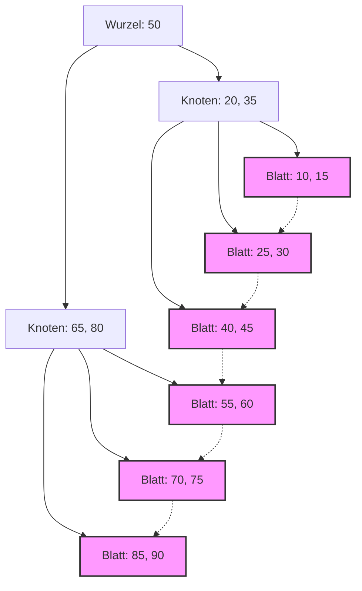

## 1. Die Begegnung von Datenbankindizes und B-Bäumen

In modernen Systemen bilden Datenbanken das Fundament von Anwendungen. Die Fähigkeit, aus Millionen oder Milliarden von Datensätzen in Millisekunden die gewünschten Daten zu suchen und auszugeben, ist eine der wichtigsten Funktionen eines Datenbankmanagementsystems (DBMS). Diese erstaunliche Suchgeschwindigkeit wird durch den **Index** unterstützt, und die dahinter stehende Datenstruktur ist der **B-Baum** (B-[Tree](https://kenji.blog/de/p/tree-graph-data-structures-search-dfs-bfs-dijkstra/)) und dessen Ableitung, der **B+-Baum** (B+Tree).

In diesem Artikel befassen wir uns eingehend damit, warum relationale Datenbanken die **B-Baum**-Familie anstelle von binären Suchbäumen oder Hash-Tabellen wählen. Dabei beleuchten wir die Eigenschaften von Festplatten-I/O, die Theorie von Datenstrukturen, mathematische Analysen und tatsächliche Code-Implementierungen.

## 2. Die Barriere zwischen Festplatten-I/O und Speicherhierarchie

Die optimale Lösung unterscheidet sich, je nachdem, ob Datenstrukturen im Arbeitsspeicher oder auf der Festplatte verarbeitet werden. Daten in einer Datenbank werden zur Persistenz auf einem Speichermedium (HDD oder SSD) gespeichert.

### 2.1 Die Einheit eines Blocks (Seite)

Der Zugriff auf den Speicher (Festplatte) ist im Vergleich zum Zugriff auf den Arbeitsspeicher (RAM) extrem langsam. Aus diesem Grund lesen und schreiben das Betriebssystem und die Hardware Daten nicht byteweise, sondern in Einheiten fester Länge (z.B. 4 KB oder 8 KB), die als **Blöcke** (Blocks) oder **Seiten** (Pages) bezeichnet werden.

Wenn eine Datenbank in einem Index sucht, ist die Minimierung der Anzahl der Ladevorgänge von Seiten von der Festplatte in den Arbeitsspeicher ( **Anzahl der Festplatten-I/Os** ) der wichtigste Faktor, der die Suchleistung bestimmt.

### 2.2 Die Grenzen des binären Suchbaums (BST)

Bei der Suche im Arbeitsspeicher ermöglichen balancierte binäre Suchbäume wie der **binäre Suchbaum** ([Binary Search](https://kenji.blog/de/p/search-algorithms-linear-binary-hash-table-principles/) Tree: BST) oder der **Rot-Schwarz-Baum** (Red-Black Tree) eine schnelle Suche mit einer Zeitkomplexität von $ O(\log N) $. Wenn diese jedoch direkt auf eine Datenbank auf der Festplatte angewendet werden, treten schwerwiegende Probleme auf.

Ein Binärbaum hat maximal zwei untergeordnete Knoten (Kinder) pro Knoten. Wenn die Anzahl der Elemente $ N $ zunimmt, wächst die Höhe des Baumes $ h $ proportional zu $ \log_2 N $. Zum Beispiel bei $ N = 1.000.000 $ beträgt die Höhe des Baumes etwa 20. Nimmt man an, dass sich jeder Knoten auf einer anderen Festplattenseite befindet, kommt es im schlimmsten Fall zu 20 zufälligen Festplatten-I/Os. Dies ist eine fatale Verzögerung für eine Datenbank.

Um dies zu lösen, wurde der **B-Baum** entwickelt. Hierbei wird die "Höhe" des Baumes extrem reduziert, und ein einziger Knoten erhält viele Schlüssel, sodass mit einem einzigen Festplatten-I/O eine große Menge an Informationen abgerufen werden kann.

## 3. Datenstruktur des B-Baums und mathematische Analyse

Ein **B-Baum** (B-Tree) ist eine Art von Mehrwegebaum (N-ary tree), bei dem sich alle Blattknoten auf der gleichen Tiefe befinden und jeder Knoten mehrere Schlüssel und mehrere untergeordnete Knoten (Kinder) haben kann.

### 3.1 Definition und Eigenschaften des B-Baums

Der B-Baum wird durch den Parameter **Mindestgrad** (Minimum Degree) $ t $ ( $ t \ge 2 $ ) charakterisiert.

1. Alle Knoten haben maximal $ 2t - 1 $ Schlüssel.
2. Alle Knoten außer dem Wurzelknoten haben mindestens $ t - 1 $ Schlüssel.
3. Wenn ein Knoten $ k $ Schlüssel hat, besitzt dieser Knoten $ k + 1 $ untergeordnete Knoten.
4. Alle Blattknoten befinden sich auf der gleichen Tiefe (Höhe $ h $).
5. Die Schlüssel innerhalb eines Knotens sind in aufsteigender Reihenfolge sortiert.

Indem die Größe eines Knotens an die Festplattenseitengröße des Betriebssystems (z. B. 4 KB oder 8 KB) angepasst wird, können mit einem einzigen Festplattenzugriff viele Schlüssel in den Speicher geladen werden.

### 3.2 Mathematische Analyse von Höhe und Komplexität

Die Anzahl der Festplatten-I/Os für Suche, Einfügen und Löschen in einem B-Baum hängt von der Höhe des Baumes $ h $ ab.
Wenn die Gesamtzahl der Schlüssel $ n $ und der Mindestgrad $ t $ ist, wird die obere Grenze der Höhe $ h $ des B-Baums wie folgt dargestellt:

$$
h \le \log_t \frac{n+1}{2}
$$

Da die Basis dieses Logarithmus $ t $ sehr groß ist (normalerweise Hunderte bis Tausende), wird die Höhe $ h $ sehr klein. Wenn zum Beispiel $ t = 100 $, hat der Wurzelknoten mindestens einen Schlüssel, auf Ebene 1 gibt es mindestens 2 Knoten, auf Ebene 2 mindestens $ 2t = 200 $ Knoten, und der Baum breitet sich exponentiell bis zu den Blattknoten aus.
Selbst bei 1 Milliarde Datensätzen bleibt die Höhe des Baumes bei etwa 3 bis 4, und es sind nur 3 bis 4 Festplatten-I/Os erforderlich.

Lassen Sie uns auch die Verarbeitungszeit in Blöcken analysieren.

$$
\begin{align*}
T_{search}(N) &= O(h) \\\\
&\le O(\log_t N)
\end{align*}
$$

Dies untermauert mathematisch, dass der **B-Baum** bei der Suche in sehr großen Datenmengen äußerst effizient ist.

## 4. Der Datenbank-Standard: Die Evolution zum B+-Baum

In tatsächlichen [RDBMS](https://kenji.blog/de/p/rdbms-transaction-acid-isolation-level-lock/) (wie MySQL InnoDB oder PostgreSQL) wird eine verbesserte Version des B-Baums, der **B+-Baum** (B+[Tree](https://kenji.blog/de/p/tree-graph-data-structures-search-dfs-bfs-dijkstra/)), verwendet.

### 4.1 Unterschiede zwischen B-Baum und B+-Baum

Beim B-Baum werden die eigentlichen Daten (oder Zeiger auf Daten) sowohl in den inneren Knoten als auch in den Blattknoten gespeichert. Im Gegensatz dazu weist der **B+-Baum** die folgenden Merkmale auf:

1. **Die Daten werden nur in den Blattknoten gespeichert**. Innere Knoten enthalten nur Schlüssel (Indizes) für das Routing.
2. **Die Blattknoten sind durch eine verkettete Liste (Zeiger) miteinander verbunden**. Dadurch werden sequenzielle Zugriffe und Bereichssuchen (Range Queries) extrem schnell.

### 4.2 Gründe für die Verwendung des B+-Baums

Durch das Entfernen von Zeigern auf echte Daten aus inneren Knoten können mehr Schlüssel in einen einzigen inneren Knoten (eine Seite) gepackt werden. Dies erhöht den Verzweigungsgrad (Fan-out) weiter, die Höhe $ h $ des Baumes wird niedriger gehalten, und die Anzahl der Festplatten-I/Os wird reduziert.

Darüber hinaus müssen bei Bereichssuchen wie `WHERE id BETWEEN 10 AND 100`, die in SQL häufig verwendet werden, beim B-Baum viele Traversierungen des Baumes durchgeführt werden. Beim **B+-Baum** hingegen genügt es, einmal den Start-Blattknoten zu finden, und man kann durch Verfolgen der Links der Blattknoten kontinuierlich Daten auslesen.


*(Abbildung: Struktur eines B+-Baums. Die Blattknoten sind wie eine Kette miteinander verbunden)*

## 5. B-Baum-Implementierungsbeispiel (Simulation mit Python)

Hier implementieren wir die grundlegende Knotenstruktur eines B-Baums sowie Such- und Einfügealgorithmen in Python, um das Verständnis zu vertiefen.

```python
class BTreeNode:
    def __init__(self, t, leaf=False):
        self.t = t          # Mindestgrad
        self.leaf = leaf    # Ob es ein Blattknoten ist
        self.keys = []      # Liste der Schlüssel
        self.children = []  # Liste der untergeordneten Knoten

class BTree:
    def __init__(self, t):
        self.root = BTreeNode(t, True)
        self.t = t

    def search(self, k, node=None):
        """Sucht den Schlüssel k im B-Baum"""
        if node is None:
            node = self.root

        i = 0
        while i < len(node.keys) and k > node.keys[i]:
            i += 1

        if i < len(node.keys) and node.keys[i] == k:
            return (node, i)
        
        if node.leaf:
            return None
        
        return self.search(k, node.children[i])

    def insert(self, k):
        """Fügt den Schlüssel k in den B-Baum ein"""
        root = self.root
        if len(root.keys) == (2 * self.t) - 1:
            # Wenn der Wurzelknoten voll ist, neue Wurzel erstellen und teilen
            temp = BTreeNode(self.t, False)
            self.root = temp
            temp.children.append(root)
            self.split_child(temp, 0)
            self.insert_non_full(temp, k)
        else:
            self.insert_non_full(root, k)

    def split_child(self, x, i):
        """Teilt einen vollen untergeordneten Knoten"""
        t = self.t
        y = x.children[i]
        z = BTreeNode(t, y.leaf)
        
        x.children.insert(i + 1, z)
        x.keys.insert(i, y.keys[t - 1])
        
        z.keys = y.keys[t: (2 * t) - 1]
        y.keys = y.keys[0: t - 1]
        
        if not y.leaf:
            z.children = y.children[t: 2 * t]
            y.children = y.children[0: t]

    def insert_non_full(self, x, k):
        """Einfügen in einen nicht vollen Knoten"""
        i = len(x.keys) - 1
        if x.leaf:
            x.keys.append(0)
            while i >= 0 and k < x.keys[i]:
                x.keys[i + 1] = x.keys[i]
                i -= 1
            x.keys[i + 1] = k
        else:
            while i >= 0 and k < x.keys[i]:
                i -= 1
            i += 1
            if len(x.children[i].keys) == (2 * self.t) - 1:
                self.split_child(x, i)
                if k > x.keys[i]:
                    i += 1
            self.insert_non_full(x.children[i], k)

# Anwendungsbeispiel für den B-Baum
btree = BTree(3) # Mindestgrad t=3
keys_to_insert = [10, 20, 5, 6, 12, 30, 7, 17]
for key in keys_to_insert:
    btree.insert(key)

result = btree.search(12)
if result:
    print(f"Schlüssel 12 wurde gefunden: Knotenschlüssel {result[0].keys}")
else:
    print("Schlüssel wurde nicht gefunden")
```

Wie aus dieser Implementierung ersichtlich ist, wird der Baum beim Einfügen in einen B-Baum nach Bedarf von unten nach oben geteilt (Split), sodass der Baum perfekt balanciert (Balanced) bleibt. Dadurch verschlechtert sich die Suchleistung nicht, unabhängig davon, in welcher Reihenfolge die Daten eingefügt werden.

## 6. Zusammenfassung und Ausblick

Der **B-Baum** und der **B+-Baum** sind Meisterwerke von Datenstrukturen, die darauf ausgelegt sind, die I/O-Kosten in plattenbasierten Systemen zu minimieren. Durch die Kombination einer flachen Baumstruktur aufgrund eines hohen Verzweigungsgrades, der Optimierung für sequenziellen Zugriff und mathematischer Algorithmen verschmelzen die physikalischen Eigenschaften von Geräten perfekt miteinander.

In den letzten Jahren sind mit der Verbreitung von SSDs neue Datenstrukturen wie der **LSM-Baum** (Log-Structured Merge-[Tree](https://kenji.blog/de/p/tree-graph-data-structures-search-dfs-bfs-dijkstra/)) entstanden, um die Schreibverstärkung (Write Amplification) zu unterdrücken. Doch aufgrund der Ausgewogenheit zwischen Leseleistung und Bereichssuchen sowie der Stabilität bei der Transaktionsverarbeitung bleibt der **B+-Baum** der absolute König unter den relationalen Datenbanken.

Das Verständnis dessen, was im Inneren einer Datenbank vor sich geht, steht in direktem Zusammenhang mit der Abfrageoptimierung (Query Optimization) und dem richtigen Index-Design. Wir hoffen, dass Sie die in diesem Artikel erläuterte Theorie als Grundlage nutzen, um das Verhalten von Indizes bei Ihren alltäglichen Datenbankoperationen zu beobachten.
