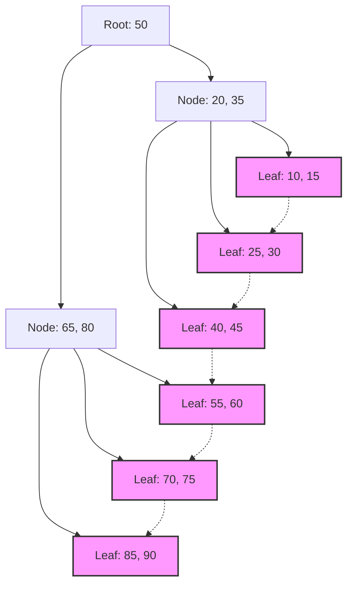

## 1. Encounter Between Database Indexes and B-Trees

In modern systems, databases are the backbone of applications. The ability to search and output desired data in milliseconds from millions or hundreds of millions of records is one of the most important features of a database management system (DBMS). Supporting this incredible search speed is the **index**, and the data structure behind it is the **B-Tree** and its derivative, the **B+Tree**.

In this article, we dive deeply into why relational databases choose the **B-Tree** family over binary search trees or hash tables, blending the characteristics of disk I/O, data structure theory, mathematical analysis, and actual code implementation.

## 2. Disk I/O and the Wall of Memory Hierarchy

The optimal solution differs between handling data structures in memory versus on disk. Database data is stored in storage (HDD or SSD) for persistence.

### 2.1 The Unit Called a Block (Page)

Access to storage is overwhelmingly slow compared to access to memory (RAM). Therefore, the OS and hardware read and write data not byte by byte, but in fixed-length units called **blocks** or **pages** (e.g., 4KB or 8KB).

When a database searches an index, minimizing the number of times pages are loaded from the disk to memory ( **disk I/O count** ) is the most significant factor determining search performance.

### 2.2 Limits of Binary Search Trees (BST)

For searches in memory, balanced binary search trees like **Binary Search Trees** (BST) and **Red-Black Trees** enable fast searches with a time complexity of $ O(\log N) $. However, applying this directly to a database on disk causes serious problems.

A binary tree has a maximum of two child nodes per node. As the number of elements $ N $ increases, the tree height $ h $ deepens in proportion to $ \log_2 N $. For example, if $ N = 1,000,000 $, the tree height is about 20. Assuming each node is located on a different disk page, a maximum of 20 random disk I/Os will occur. This is a fatal delay for a database.

Therefore, the **B-Tree** was created by making the "height" of the tree extremely low and having a single node hold many keys so that a large amount of information can be acquired with a single disk I/O.

## 3. Data Structure and Mathematical Analysis of B-Trees

A **B-Tree** is a type of N-ary tree where all leaf nodes are at the same depth, and each node can have multiple keys and multiple child nodes.

### 3.1 Definition and Properties of B-Trees

A B-Tree is characterized by a parameter called the **minimum degree** $ t $ ( $ t \ge 2 $ ).

1. All nodes have at most $ 2t - 1 $ keys.
2. All nodes except the root have at least $ t - 1 $ keys.
3. If a node has $ k $ keys, it has $ k + 1 $ child nodes.
4. All leaf nodes are at the same depth (height $ h $ ).
5. Keys within a node are sorted in ascending order.

By matching the node size to the OS disk page size (e.g., 4KB or 8KB), many keys can be brought into memory with a single disk fetch.

### 3.2 Mathematical Analysis of Height and Computational Complexity

The disk I/O counts for searching, inserting, and deleting in a B-Tree depend on the tree's height $ h $.
Let $ n $ be the total number of keys and $ t $ be the minimum degree, the upper bound of the B-Tree height $ h $ is shown as follows.

$$
h \le \log_t \frac{n+1}{2}
$$

Because the base of this logarithm $ t $ is very large (usually hundreds to thousands), the height $ h $ is extremely small. For example, if $ t = 100 $, the root node has at least 1 key, level 1 has at least 2 nodes, level 2 has at least $ 2t = 200 $ nodes, and it expands exponentially down to the leaf nodes.
Even with 1 billion records, the tree height will be around 3 to 4, meaning only 3 to 4 disk I/Os are needed.

Let's also analyze the processing time by block.

$$
\begin{align*}
T_{search}(N) &= O(h) \\\\
&\le O(\log_t N)
\end{align*}
$$

This mathematically supports that the **B-Tree** is extremely efficient in searching large-scale data.

## 4. Database Standard: Evolution to B+Trees

What is actually used in RDBMS (like MySQL's InnoDB and PostgreSQL) is the **B+Tree**, an improved version of the B-Tree.

### 4.1 Differences Between B-Trees and B+Trees

In a B-Tree, actual data (or pointers to data) is stored in both internal nodes and leaf nodes. On the other hand, a **B+Tree** has the following characteristics:

1. **All data is stored only in leaf nodes**. Internal nodes hold only keys (indexes) for routing.
2. **Leaf nodes are connected by a linked list (pointers)**. This makes sequential access and range queries extremely fast.

### 4.2 Reasons for Adopting B+Trees

By eliminating pointers to actual data from internal nodes, more keys can be packed into a single internal node (page). This further increases the fan-out, keeps the tree height $ h $ lower, and reduces the number of disk I/Os.

Furthermore, in range queries frequently used in SQL like `WHERE id BETWEEN 10 AND 100`, a B-Tree requires traversing the tree multiple times, but with a **B+Tree**, once the starting leaf node is found, data can be read continuously just by following the links of the leaf nodes.


*(Figure: Structure of a B+Tree. Leaf nodes are linked in a chain)*

## 5. B-Tree Implementation Example (Simulation in Python)

Here, we will implement the basic node structure of a B-Tree, as well as the search and insert algorithms in Python to deepen our understanding.

```python
class BTreeNode:
    def __init__(self, t, leaf=False):
        self.t = t          # Minimum degree
        self.leaf = leaf    # Whether it is a leaf node
        self.keys = []      # List of keys
        self.children = []  # List of child nodes

class BTree:
    def __init__(self, t):
        self.root = BTreeNode(t, True)
        self.t = t

    def search(self, k, node=None):
        """Search for key k in the B-Tree"""
        if node is None:
            node = self.root

        i = 0
        while i < len(node.keys) and k > node.keys[i]:
            i += 1

        if i < len(node.keys) and node.keys[i] == k:
            return (node, i)
        
        if node.leaf:
            return None
        
        return self.search(k, node.children[i])

    def insert(self, k):
        """Insert key k into the B-Tree"""
        root = self.root
        if len(root.keys) == (2 * self.t) - 1:
            # If the root node is full, create a new root and split
            temp = BTreeNode(self.t, False)
            self.root = temp
            temp.children.append(root)
            self.split_child(temp, 0)
            self.insert_non_full(temp, k)
        else:
            self.insert_non_full(root, k)

    def split_child(self, x, i):
        """Split a full child node"""
        t = self.t
        y = x.children[i]
        z = BTreeNode(t, y.leaf)
        
        x.children.insert(i + 1, z)
        x.keys.insert(i, y.keys[t - 1])
        
        z.keys = y.keys[t: (2 * t) - 1]
        y.keys = y.keys[0: t - 1]
        
        if not y.leaf:
            z.children = y.children[t: 2 * t]
            y.children = y.children[0: t]

    def insert_non_full(self, x, k):
        """Insert into a non-full node"""
        i = len(x.keys) - 1
        if x.leaf:
            x.keys.append(0)
            while i >= 0 and k < x.keys[i]:
                x.keys[i + 1] = x.keys[i]
                i -= 1
            x.keys[i + 1] = k
        else:
            while i >= 0 and k < x.keys[i]:
                i -= 1
            i += 1
            if len(x.children[i].keys) == (2 * self.t) - 1:
                self.split_child(x, i)
                if k > x.keys[i]:
                    i += 1
            self.insert_non_full(x.children[i], k)

# B-Tree usage example
btree = BTree(3) # Minimum degree t=3
keys_to_insert = [10, 20, 5, 6, 12, 30, 7, 17]
for key in keys_to_insert:
    btree.insert(key)

result = btree.search(12)
if result:
    print(f"Key 12 found: Node keys {result[0].keys}")
else:
    print("Key not found")
```

As can be seen from this implementation, insertion into a B-Tree splits nodes from bottom to top as needed, keeping the tree completely balanced. Thus, search performance does not degrade regardless of the order in which data is inserted.

## 6. Conclusion and Future Directions

The **B-Tree** and **B+Tree** can be said to be masterpiece data structures designed to minimize I/O costs in disk-based systems. The physical device characteristics and mathematical algorithms are brilliantly fused, such as a shallow tree structure due to a high fan-out and optimization of sequential access.

In recent years, with the spread of SSDs, new data structures such as the **LSM-Tree** (Log-Structured Merge-Tree) have appeared to suppress write amplification. However, in terms of the balance between read performance and range searches, and stability in transaction processing, the **B+Tree** still continues to reign as the absolute champion in relational databases.

Understanding what happens inside the database is directly linked to query optimization and appropriate index design. Based on the theory explained in this article, please observe the behavior of indexes in your daily database operations.
