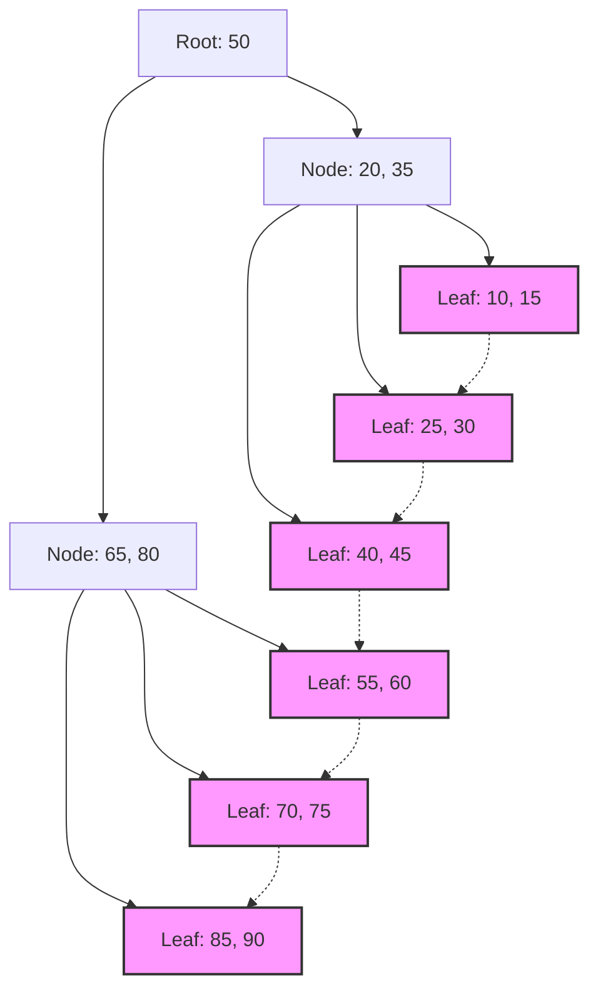

## 1. El encuentro entre los índices de bases de datos y los B-[Tree](https://kenji.blog/es/p/tree-graph-data-structures-search-dfs-bfs-dijkstra/)

En los sistemas modernos, las bases de datos son el núcleo de las aplicaciones. La capacidad de buscar y recuperar los datos deseados en milisegundos entre millones o miles de millones de registros es una de las funciones más importantes de un sistema de gestión de bases de datos (DBMS). Esta increíble velocidad de búsqueda está respaldada por los **índices** (índices), y la estructura de datos detrás de ellos es el **B-Tree** (Árbol B) y su derivado, el **B+Tree** (Árbol B+).

En este artículo, profundizaremos en por qué las bases de datos relacionales eligen la familia **B-Tree** en lugar de los árboles de búsqueda binaria o las tablas hash, examinando la naturaleza del I/O de disco, la teoría de estructuras de datos, el análisis matemático y la implementación de código real.

## 2. El I/O de disco y la barrera de la jerarquía de memoria

La solución óptima difiere cuando se manejan estructuras de datos en la memoria en comparación con el disco. Los datos de la base de datos se almacenan en almacenamiento (HDD o SSD) para su persistencia.

### 2.1 La unidad llamada bloque (página)

El acceso al almacenamiento es abrumadoramente más lento en comparación con el acceso a la memoria (RAM). Por lo tanto, el sistema operativo y el hardware leen y escriben datos en unidades de longitud fija llamadas **bloques** o **páginas** (por ejemplo, 4KB u 8KB) en lugar de un byte a la vez.

Cuando una base de datos busca en un índice, minimizar el número de veces que se carga una página del disco a la memoria ( **recuento de I/O de disco** ) es el factor más importante que determina el rendimiento de la búsqueda.

### 2.2 Los límites de los árboles de búsqueda binaria (BST)

En la búsqueda en memoria, los árboles de búsqueda binaria equilibrada como el **Árbol de Búsqueda Binaria** ([Binary Search](https://kenji.blog/es/p/search-algorithms-linear-binary-hash-table-principles/) Tree: BST) y el **Árbol Rojo-Negro** (Red-Black Tree) permiten búsquedas rápidas con una complejidad computacional de $ O(\log N) $. Sin embargo, si esto se aplica directamente a una base de datos en disco, surge un problema grave.

Un árbol binario tiene un máximo de dos nodos hijos por nodo. A medida que aumenta el número de elementos $ N $, la altura del árbol $ h $ se vuelve proporcionalmente más profunda a $ \log_2 N $. Por ejemplo, si $ N = 1,000,000 $, la altura del árbol será de aproximadamente 20. Suponiendo que cada nodo está ubicado en una página de disco diferente, en el peor de los casos ocurrirán 20 operaciones de I/O de disco aleatorias. Este es un retraso fatal para una base de datos.

Por lo tanto, al reducir extremadamente la "altura" del árbol y permitir que un solo nodo contenga muchas claves, el **B-Tree** se diseñó para poder recuperar una gran cantidad de información con un solo I/O de disco.

## 3. Estructura de datos y análisis matemático de los B-Tree

El **B-Tree** es un tipo de árbol n-ario (N-ary tree) donde todos los nodos hoja están a la misma profundidad y cada nodo puede tener múltiples claves y múltiples nodos hijos.

### 3.1 Definición y propiedades de los B-Tree

Un B-Tree se caracteriza por el parámetro de **grado mínimo** $ t $ ($ t \ge 2 $).

1. Todos los nodos tienen como máximo $ 2t - 1 $ claves.
2. Todos los nodos excepto el nodo raíz tienen al menos $ t - 1 $ claves.
3. Si un nodo tiene $ k $ claves, tiene $ k + 1 $ nodos hijos.
4. Todos los nodos hoja existen a la misma profundidad (altura $ h $).
5. Las claves dentro de un nodo están ordenadas en forma ascendente.

Como resultado, al hacer coincidir el tamaño del nodo con el tamaño de la página del disco del sistema operativo (por ejemplo: 4KB u 8KB), se pueden cargar numerosas claves en la memoria en una sola recuperación de disco.

### 3.2 Análisis matemático de altura y complejidad

El número de I/O de disco para búsquedas, inserciones y eliminaciones en un B-Tree depende de la altura del árbol $ h $.
Donde $ n $ es el número total de claves y $ t $ es el grado mínimo, el límite superior de la altura $ h $ del B-Tree se muestra a continuación.

$$
h \le \log_t \frac{n+1}{2}
$$

Dado que la base $ t $ de este logaritmo es muy grande (generalmente de cientos a miles), la altura $ h $ se vuelve muy pequeña. Por ejemplo, en el caso de $ t = 100 $, el nodo raíz tiene al menos 1 clave, el nivel 1 tiene al menos 2 nodos, el nivel 2 tiene al menos $ 2t = 200 $ nodos y se expande exponencialmente hacia los nodos hoja.
Incluso con mil millones de registros, la altura del árbol estará alrededor de 3 o 4, lo que significa que el I/O de disco será de solo 3 a 4 veces.

Analicemos también el tiempo de procesamiento por bloque.

$$
\begin{align*}
T_{search}(N) &= O(h) \\\\
&\le O(\log_t N)
\end{align*}
$$

Esto prueba matemáticamente que el **B-Tree** es extremadamente eficiente en la búsqueda de datos a gran escala.

## 4. El estándar de la base de datos: La evolución hacia el B+Tree

Lo que se usa en los [RDBMS](https://kenji.blog/es/p/rdbms-transaction-acid-isolation-level-lock/) reales (como InnoDB de MySQL y PostgreSQL) es el **B+[Tree](https://kenji.blog/es/p/tree-graph-data-structures-search-dfs-bfs-dijkstra/)**, una versión mejorada del B-Tree.

### 4.1 Diferencias entre B-Tree y B+Tree

En un B-Tree, los datos reales (o punteros a los datos) se almacenan tanto en los nodos internos como en los nodos hoja. Por otro lado, el **B+Tree** tiene las siguientes características.

1. **Todos los datos se almacenan únicamente en los nodos hoja**. Los nodos internos solo mantienen las claves (índices) para el enrutamiento.
2. **Los nodos hoja están conectados entre sí mediante una lista enlazada (punteros)**. Esto hace que el acceso secuencial y las consultas de rango (Range Query) sean extremadamente rápidos.

### 4.2 Razones para adoptar el B+Tree

Al eliminar los punteros a datos reales de los nodos internos, es posible empaquetar más claves en un solo nodo interno (página). Esto incrementa aún más el número de ramificaciones (Fan-out), mantiene la altura del árbol $ h $ más baja y reduce la cantidad de I/O de disco.

Además, en búsquedas de rango que se utilizan con frecuencia en SQL como `WHERE id BETWEEN 10 AND 100`, un B-[Tree](https://kenji.blog/es/p/tree-graph-data-structures-search-dfs-bfs-dijkstra/) requiere atravesar el árbol muchas veces. Sin embargo, con un **B+Tree**, una vez que se encuentra el nodo hoja de inicio, los datos se pueden leer continuamente simplemente siguiendo los enlaces de los nodos hoja.


*(Figura: Estructura del B+[Tree](https://kenji.blog/es/p/tree-graph-data-structures-search-dfs-bfs-dijkstra/). Los nodos hoja están enlazados en forma de cadena)*

## 5. Ejemplo de implementación del B-Tree (Simulación en Python)

Aquí implementaremos en Python la estructura básica del nodo de un B-Tree, y los algoritmos de búsqueda e inserción para profundizar nuestra comprensión.

```python
class BTreeNode:
    def __init__(self, t, leaf=False):
        self.t = t          # Grado mínimo
        self.leaf = leaf    # ¿Es un nodo hoja?
        self.keys = []      # Lista de claves
        self.children = []  # Lista de nodos hijos

class BTree:
    def __init__(self, t):
        self.root = BTreeNode(t, True)
        self.t = t

    def search(self, k, node=None):
        """Busca la clave k en el B-Tree"""
        if node is None:
            node = self.root

        i = 0
        while i < len(node.keys) and k > node.keys[i]:
            i += 1

        if i < len(node.keys) and node.keys[i] == k:
            return (node, i)
        
        if node.leaf:
            return None
        
        return self.search(k, node.children[i])

    def insert(self, k):
        """Inserta la clave k en el B-Tree"""
        root = self.root
        if len(root.keys) == (2 * self.t) - 1:
            # Si el nodo raíz está lleno, crea una nueva raíz y divide
            temp = BTreeNode(self.t, False)
            self.root = temp
            temp.children.append(root)
            self.split_child(temp, 0)
            self.insert_non_full(temp, k)
        else:
            self.insert_non_full(root, k)

    def split_child(self, x, i):
        """Divide un nodo hijo que está lleno"""
        t = self.t
        y = x.children[i]
        z = BTreeNode(t, y.leaf)
        
        x.children.insert(i + 1, z)
        x.keys.insert(i, y.keys[t - 1])
        
        z.keys = y.keys[t: (2 * t) - 1]
        y.keys = y.keys[0: t - 1]
        
        if not y.leaf:
            z.children = y.children[t: 2 * t]
            y.children = y.children[0: t]

    def insert_non_full(self, x, k):
        """Inserción en un nodo que no está lleno"""
        i = len(x.keys) - 1
        if x.leaf:
            x.keys.append(0)
            while i >= 0 and k < x.keys[i]:
                x.keys[i + 1] = x.keys[i]
                i -= 1
            x.keys[i + 1] = k
        else:
            while i >= 0 and k < x.keys[i]:
                i -= 1
            i += 1
            if len(x.children[i].keys) == (2 * self.t) - 1:
                self.split_child(x, i)
                if k > x.keys[i]:
                    i += 1
            self.insert_non_full(x.children[i], k)

# Ejemplo de uso del B-Tree
btree = BTree(3) # Grado mínimo t=3
keys_to_insert = [10, 20, 5, 6, 12, 30, 7, 17]
for key in keys_to_insert:
    btree.insert(key)

result = btree.search(12)
if result:
    print(f"Se encontró la clave 12: Claves del nodo {result[0].keys}")
else:
    print("No se encontró la clave")
```

Como puede verse en esta implementación, la inserción en un B-[Tree](https://kenji.blog/es/p/tree-graph-data-structures-search-dfs-bfs-dijkstra/) mantiene el árbol perfectamente equilibrado (Balanced) al dividir (Split) los nodos de abajo hacia arriba según sea necesario. Como resultado, sin importar en qué orden se inserten los datos, el rendimiento de búsqueda no se degradará.

## 6. Conclusión y desarrollo

El **B-Tree** y el **B+Tree** son estructuras de datos que pueden considerarse obras maestras diseñadas para minimizar los costos de I/O en sistemas basados en disco. Combinan maravillosamente las características de los dispositivos físicos y los algoritmos matemáticos, como una estructura de árbol poco profunda con un alto número de ramificaciones y optimización del acceso secuencial.

En los últimos años, con la popularidad de los SSD, han surgido nuevas estructuras de datos como los **LSM-Tree** (Log-Structured Merge-Tree) para suprimir la amplificación de escritura (Write Amplification). Sin embargo, el **B+Tree** todavía reina como el rey absoluto en las bases de datos relacionales en términos del equilibrio entre el rendimiento de lectura y las búsquedas de rango, así como la estabilidad en el procesamiento de transacciones.

Comprender lo que sucede dentro de una base de datos conduce directamente a la optimización de consultas y al diseño adecuado de índices. Le animamos a observar el comportamiento de los índices en las operaciones diarias de bases de datos basándose en la teoría explicada en este artículo.
