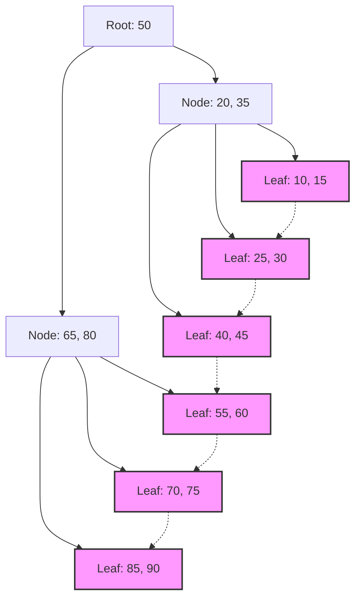

## 1. La rencontre entre les index de base de données et les arbres B

Dans les systèmes modernes, la base de données constitue le cœur des applications. La capacité de rechercher et de renvoyer les données souhaitées parmi des millions, voire des centaines de millions d'enregistrements en quelques millisecondes est l'une des fonctions les plus importantes d'un système de gestion de base de données (SGBD). Ce qui permet cette vitesse de recherche fulgurante, c'est l' **index** , et la structure de données qui le sous-tend est l' **arbre B** (B-[Tree](https://kenji.blog/fr/p/tree-graph-data-structures-search-dfs-bfs-dijkstra/)) ainsi que son dérivé, l' **arbre B+** (B+Tree).

Dans cet article, nous explorerons en profondeur pourquoi les bases de données relationnelles choisissent la famille des **arbres B** plutôt que les arbres binaires de recherche ou les tables de hachage, en examinant la nature des E/S disque, la théorie des structures de données, l'analyse mathématique, et des implémentations de code réelles.

## 2. Les E/S disque et le mur de la hiérarchie mémoire

La solution optimale diffère selon que l'on manipule une structure de données en mémoire ou sur disque. Les données des bases de données sont stockées sur des supports de stockage (HDD ou SSD) pour des raisons de persistance.

### 2.1 L'unité appelée bloc (ou page)

L'accès au stockage est considérablement plus lent que l'accès à la mémoire (RAM). Par conséquent, le système d'exploitation et le matériel ne lisent pas ni n'écrivent les données octet par octet, mais par unités de longueur fixe (par exemple, 4 Ko ou 8 Ko) appelées **blocs** ou **pages** .

Lorsqu'une base de données effectue une recherche dans un index, la réduction du nombre de chargements de pages du disque vers la mémoire ( **nombre d'E/S disque** ) est le facteur le plus déterminant pour les performances de recherche.

### 2.2 Les limites des arbres binaires de recherche (BST)

Pour les recherches en mémoire, les arbres binaires de recherche équilibrés comme l' **arbre binaire de recherche** ([Binary Search](https://kenji.blog/fr/p/search-algorithms-linear-binary-hash-table-principles/) Tree : BST) ou l' **arbre rouge-noir** (Red-Black Tree) permettent une recherche rapide avec une complexité de $ O(\log N) $ . Cependant, si on les applique tels quels à une base de données sur disque, de graves problèmes surviennent.

Dans un arbre binaire, un nœud a au maximum deux nœuds enfants. Lorsque le nombre d'éléments $ N $ augmente, la hauteur de l'arbre $ h $ croît proportionnellement à $ \log_2 N $ . Par exemple, si $ N = 1,000,000 $ , la hauteur de l'arbre est d'environ 20. En supposant que chaque nœud est placé sur une page de disque différente, cela générerait au pire 20 E/S disque aléatoires. Il s'agit d'un délai fatal pour une base de données.

C'est pourquoi l' **arbre B** a été conçu pour réduire drastiquement la "hauteur" de l'arbre et permettre à un seul nœud de contenir de nombreuses clés, permettant ainsi d'obtenir une grande quantité d'informations en une seule E/S disque.

## 3. Structure de données et analyse mathématique de l'arbre B

L' **arbre B** (B-Tree) est un type d'arbre n-aire (N-ary tree) où tous les nœuds feuilles se trouvent à la même profondeur, et où chaque nœud peut contenir plusieurs clés et plusieurs nœuds enfants.

### 3.1 Définition et propriétés de l'arbre B

L'arbre B est caractérisé par un paramètre appelé **degré minimum** $ t $ ( $ t \ge 2 $ ).

1. Tous les nœuds ont au maximum $ 2t - 1 $ clés.
2. À l'exception du nœud racine, tous les nœuds ont au moins $ t - 1 $ clés.
3. Si un nœud possède $ k $ clés, alors ce nœud a $ k + 1 $ nœuds enfants.
4. Tous les nœuds feuilles sont situés à la même profondeur (hauteur $ h $ ).
5. Les clés au sein d'un nœud sont triées par ordre croissant.

Ainsi, en adaptant la taille du nœud à la taille de la page disque de l'OS (par ex. 4 Ko ou 8 Ko), il est possible de charger un grand nombre de clés en mémoire lors d'une seule lecture sur disque.

### 3.2 Analyse mathématique de la hauteur et de la complexité

Le nombre d'E/S disque pour la recherche, l'insertion et la suppression dans un arbre B dépend de la hauteur de l'arbre $ h $ .
En considérant $ n $ comme le nombre total de clés et $ t $ comme le degré minimum, la limite supérieure de la hauteur $ h $ de l'arbre B est donnée par :

$$
h \le \log_t \frac{n+1}{2}
$$

Comme la base de ce logarithme $ t $ est très grande (généralement de plusieurs centaines à plusieurs milliers), la hauteur $ h $ devient très petite. Par exemple, si $ t = 100 $ , le nœud racine contient au moins 1 clé, le niveau 1 contient au moins 2 nœuds, le niveau 2 contient au moins $ 2t = 200 $ nœuds, et ainsi de suite de manière exponentielle jusqu'aux nœuds feuilles.
Même avec 1 milliard d'enregistrements, la hauteur de l'arbre reste autour de 3 à 4, ce qui nécessite seulement 3 à 4 E/S disque.

Analysons également le temps de traitement au niveau des blocs.

$$
\begin{align*}
T_{search}(N) &= O(h) \\\\
&\le O(\log_t N)
\end{align*}
$$

Cela confirme mathématiquement que l' **arbre B** est extrêmement efficace pour la recherche dans des données à grande échelle.

## 4. Le standard des bases de données : l'évolution vers l'arbre B+

Dans les SGBDR réels (comme InnoDB de MySQL ou PostgreSQL), c'est l' **arbre B+** (B+Tree), une version améliorée de l'arbre B, qui est utilisé.

### 4.1 Différences entre l'arbre B et l'arbre B+

Dans un arbre B, les données réelles (ou les pointeurs vers ces données) sont stockées à la fois dans les nœuds internes et les nœuds feuilles. En revanche, l' **arbre B+** présente les caractéristiques suivantes :

1. **Toutes les données sont stockées uniquement dans les nœuds feuilles.** Les nœuds internes ne contiennent que les clés (index) pour le routage.
2. **Les nœuds feuilles sont reliés entre eux par une liste chaînée (pointeurs).** Cela rend les accès séquentiels et les recherches par plage (Range Query) extrêmement rapides.

### 4.2 Raisons de l'adoption de l'arbre B+

L'élimination des pointeurs vers les données réelles dans les nœuds internes permet d'entasser davantage de clés dans un seul nœud interne (page). Cela augmente encore le facteur de ramification (Fan-out), maintient la hauteur de l'arbre $ h $ encore plus basse et réduit le nombre d'E/S disque.

De plus, pour des recherches par plage souvent utilisées en SQL telles que `WHERE id BETWEEN 10 AND 100`, un arbre B nécessiterait de parcourir l'arbre plusieurs fois, alors qu'avec un **arbre B+**, une fois le nœud feuille de départ trouvé, il suffit de suivre les liens des nœuds feuilles pour lire les données de manière continue.


*(Figure : Structure de l'arbre B+. Les nœuds feuilles sont reliés en chaîne)*

## 5. Exemple d'implémentation d'un arbre B (Simulation en Python)

Ici, nous allons approfondir notre compréhension en implémentant la structure de base d'un nœud d'arbre B et les algorithmes de recherche et d'insertion en Python.

```python
class BTreeNode:
    def __init__(self, t, leaf=False):
        self.t = t          # Degré minimum
        self.leaf = leaf    # Indique s'il s'agit d'un nœud feuille
        self.keys = []      # Liste des clés
        self.children = []  # Liste des nœuds enfants

class BTree:
    def __init__(self, t):
        self.root = BTreeNode(t, True)
        self.t = t

    def search(self, k, node=None):
        """Recherche la clé k dans l'arbre B"""
        if node is None:
            node = self.root

        i = 0
        while i < len(node.keys) and k > node.keys[i]:
            i += 1

        if i < len(node.keys) and node.keys[i] == k:
            return (node, i)
        
        if node.leaf:
            return None
        
        return self.search(k, node.children[i])

    def insert(self, k):
        """Insère la clé k dans l'arbre B"""
        root = self.root
        if len(root.keys) == (2 * self.t) - 1:
            # Si le nœud racine est plein, crée une nouvelle racine et divise-la
            temp = BTreeNode(self.t, False)
            self.root = temp
            temp.children.append(root)
            self.split_child(temp, 0)
            self.insert_non_full(temp, k)
        else:
            self.insert_non_full(root, k)

    def split_child(self, x, i):
        """Divise un nœud enfant plein"""
        t = self.t
        y = x.children[i]
        z = BTreeNode(t, y.leaf)
        
        x.children.insert(i + 1, z)
        x.keys.insert(i, y.keys[t - 1])
        
        z.keys = y.keys[t: (2 * t) - 1]
        y.keys = y.keys[0: t - 1]
        
        if not y.leaf:
            z.children = y.children[t: 2 * t]
            y.children = y.children[0: t]

    def insert_non_full(self, x, k):
        """Insertion dans un nœud non plein"""
        i = len(x.keys) - 1
        if x.leaf:
            x.keys.append(0)
            while i >= 0 and k < x.keys[i]:
                x.keys[i + 1] = x.keys[i]
                i -= 1
            x.keys[i + 1] = k
        else:
            while i >= 0 and k < x.keys[i]:
                i -= 1
            i += 1
            if len(x.children[i].keys) == (2 * self.t) - 1:
                self.split_child(x, i)
                if k > x.keys[i]:
                    i += 1
            self.insert_non_full(x.children[i], k)

# Exemple d'utilisation de l'arbre B
btree = BTree(3) # Degré minimum t=3
keys_to_insert = [10, 20, 5, 6, 12, 30, 7, 17]
for key in keys_to_insert:
    btree.insert(key)

result = btree.search(12)
if result:
    print(f"Clé 12 trouvée : Clés du nœud {result[0].keys}")
else:
    print("Clé non trouvée")
```

Comme on peut le voir dans cette implémentation, l'insertion dans un arbre B maintient l'arbre parfaitement équilibré (Balanced) en divisant (Split) les nœuds de bas en haut selon les besoins. Ainsi, quel que soit l'ordre dans lequel les données sont insérées, les performances de recherche ne se dégradent pas.

## 6. Résumé et perspectives

L' **arbre B** et l' **arbre B+** sont des chefs-d'œuvre de structures de données conçus dans le but de minimiser les coûts d'E/S dans les systèmes basés sur disques. Les caractéristiques des dispositifs physiques et les algorithmes mathématiques sont parfaitement fusionnés, tels qu'une structure d'arbre peu profonde due à un facteur de ramification élevé, et une optimisation des accès séquentiels.

Récemment, avec la démocratisation des SSD, de nouvelles structures de données comme l' **arbre LSM** (Log-Structured Merge-[Tree](https://kenji.blog/fr/p/tree-graph-data-structures-search-dfs-bfs-dijkstra/)) sont apparues pour réduire l'amplification d'écriture (Write Amplification). Cependant, pour ce qui est du compromis entre les performances de lecture et de recherche par plage, ainsi que la stabilité dans le traitement des transactions, l' **arbre B+** continue de régner en maître absolu dans les bases de données relationnelles.

Comprendre ce qui se passe à l'intérieur d'une base de données est directement lié à l'optimisation des requêtes et à la conception d'index appropriés. En vous basant sur la théorie expliquée dans cet article, essayez d'observer le comportement des index dans vos opérations quotidiennes de base de données.
