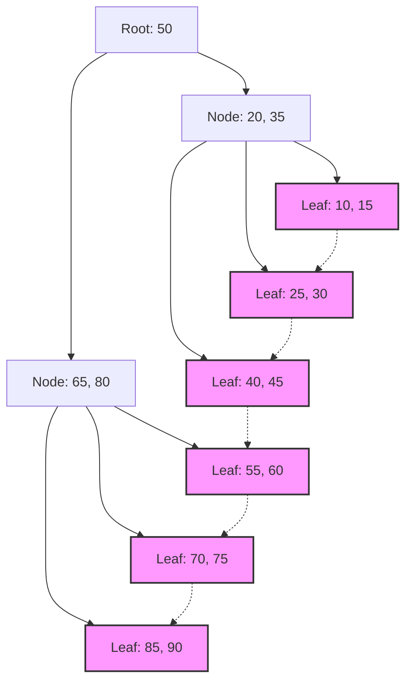

## 1. डेटाबेस इंडेक्स और B-Tree का मिलन

आधुनिक प्रणालियों में, डेटाबेस अनुप्रयोगों (applications) का मूल आधार है। लाखों-करोड़ों रिकॉर्ड्स में से वांछित डेटा को मिलीसेकंड में खोजने और आउटपुट करने की क्षमता, डेटाबेस मैनेजमेंट सिस्टम (DBMS) के सबसे महत्वपूर्ण कार्यों में से एक है। इस अद्भुत खोज गति का आधार **इंडेक्स** (सूचकांक) है, और इसके पीछे की डेटा संरचना **B-Tree** और इसका व्युत्पन्न (derivative) **B+Tree** है।

इस लेख में, हम इस बात पर गहराई से विचार करेंगे कि क्यों रिलेशनल डेटाबेस बाइनरी सर्च ट्री या हैश टेबल के बजाय **B-Tree** परिवार का चयन करते हैं। इसे डिस्क I/O की प्रकृति, डेटा संरचना के सिद्धांत, गणितीय विश्लेषण और वास्तविक कोड कार्यान्वयन के माध्यम से समझाया जाएगा।

## 2. डिस्क I/O और मेमोरी पदानुक्रम (hierarchy) की बाधा

जब डेटा संरचना को मेमोरी में संभाला जाता है और जब इसे डिस्क पर संभाला जाता है, तो सर्वोत्तम समाधान भिन्न होते हैं। डेटाबेस का डेटा स्थायीकरण (persistence) के लिए स्टोरेज (HDD या SSD) में सहेजा जाता है।

### 2.1 ब्लॉक (पेज) की इकाई

मेमोरी (RAM) तक पहुँचने की तुलना में स्टोरेज तक पहुँचना बहुत धीमा है। इसलिए, OS और हार्डवेयर डेटा को 1-बाइट करके नहीं, बल्कि **ब्लॉक** या **पेज** नामक निश्चित लंबाई की इकाइयों (उदाहरण के लिए 4KB या 8KB) में पढ़ते और लिखते हैं।

जब डेटाबेस इंडेक्स खोजता है, तो डिस्क से मेमोरी में पेजों को लोड करने की संख्या ( **डिस्क I/O की संख्या** ) को कम करना खोज प्रदर्शन (performance) को निर्धारित करने वाला सबसे बड़ा कारक बन जाता है।

### 2.2 बाइनरी सर्च ट्री (BST) की सीमाएँ

मेमोरी में खोज के लिए, **बाइनरी सर्च ट्री** (Binary Search Tree: BST) और **रेड-ब्लैक ट्री** (Red-Black Tree) जैसे संतुलित बाइनरी सर्च ट्री $ O(\log N) $ की जटिलता के साथ तेज़ खोज को संभव बनाते हैं। हालाँकि, अगर इसे सीधे डिस्क पर डेटाबेस में लागू किया जाए, तो गंभीर समस्याएँ उत्पन्न होती हैं।

एक बाइनरी ट्री में एक नोड के अधिकतम 2 चाइल्ड नोड हो सकते हैं। जैसे-जैसे तत्वों की संख्या $ N $ बढ़ती है, पेड़ की ऊँचाई $ h $, $ \log_2 N $ के अनुपात में गहरी होती जाती है। उदाहरण के लिए, यदि $ N = 1,000,000 $ है, तो पेड़ की ऊँचाई लगभग 20 होगी। यह मानते हुए कि प्रत्येक नोड एक अलग डिस्क पेज पर रखा गया है, सबसे खराब स्थिति में 20 रैंडम डिस्क I/O होंगे। डेटाबेस के लिए यह एक बहुत बड़ी देरी (delay) है।

इसलिए, पेड़ की "ऊँचाई" को बहुत कम करके और एक ही नोड में कई कुंजियों (keys) को रखकर, 1 डिस्क I/O में बड़ी मात्रा में जानकारी प्राप्त करने के लिए **B-Tree** का निर्माण किया गया।

## 3. B-Tree की डेटा संरचना और गणितीय विश्लेषण

**B-Tree** एक प्रकार का मल्टी-वे ट्री (N-ary tree) है जहाँ सभी लीफ नोड समान गहराई पर होते हैं, और प्रत्येक नोड में कई कुंजियाँ (keys) और कई चाइल्ड नोड हो सकते हैं।

### 3.1 B-Tree की परिभाषा और गुण

B-Tree की विशेषता एक पैरामीटर **न्यूनतम डिग्री (minimum degree)** $ t $ ($ t \ge 2 $) द्वारा तय होती है।

1. सभी नोड्स में अधिकतम $ 2t - 1 $ कुंजियाँ (keys) होती हैं।
2. रूट नोड को छोड़कर सभी नोड्स में कम से कम $ t - 1 $ कुंजियाँ (keys) होती हैं।
3. यदि किसी नोड में $ k $ कुंजियाँ हैं, तो उस नोड के $ k + 1 $ चाइल्ड नोड होंगे।
4. सभी लीफ नोड समान गहराई (ऊँचाई $ h $) पर मौजूद होते हैं।
5. नोड के अंदर की कुंजियाँ आरोही क्रम (ascending order) में सॉर्ट की गई होती हैं।

इसके परिणामस्वरूप, नोड के आकार को OS के डिस्क पेज आकार (उदाहरण: 4KB या 8KB) से मिलाकर, एक डिस्क फ़ेच (fetch) में कई कुंजियों को मेमोरी में लाया जा सकता है।

### 3.2 ऊँचाई और जटिलता का गणितीय विश्लेषण

B-Tree में खोजने, डालने (insert) और हटाने (delete) के लिए डिस्क I/O की संख्या पेड़ की ऊँचाई $ h $ पर निर्भर करती है।
यदि कुल कुंजियों की संख्या $ n $ है और न्यूनतम डिग्री $ t $ है, तो B-Tree की ऊँचाई $ h $ की ऊपरी सीमा (upper bound) इस प्रकार दी जाती है:

$$
h \le \log_t \frac{n+1}{2}
$$

चूंकि इस लॉगरिदम का आधार $ t $ बहुत बड़ा है (आमतौर पर सैकड़ों से हजारों), ऊँचाई $ h $ बहुत छोटी हो जाती है। उदाहरण के लिए, यदि $ t = 100 $ है, तो रूट नोड में कम से कम 1 कुंजी, लेवल 1 में कम से कम 2 नोड, लेवल 2 में कम से कम $ 2t = 200 $ नोड होते हैं, और यह लीफ नोड्स तक घातांकीय (exponentially) रूप से फैलता है।
यहाँ तक कि 1 अरब रिकॉर्ड होने पर भी, पेड़ की ऊँचाई लगभग 3 से 4 तक ही रहती है, जिसका अर्थ है कि केवल 3 से 4 डिस्क I/O की आवश्यकता होती है।

आइए ब्लॉक में प्रोसेसिंग समय का भी विश्लेषण करें।

$$
\begin{align*}
T_{search}(N) &= O(h) \\\\
&\le O(\log_t N)
\end{align*}
$$

यह गणितीय रूप से साबित करता है कि **B-Tree** बड़े पैमाने के डेटा की खोज में अत्यंत कुशल है।

## 4. डेटाबेस का मानक: B+Tree के रूप में विकास

वास्तविक [RDBMS](https://kenji.blog/hi/p/rdbms-transaction-acid-isolation-level-lock/) (जैसे MySQL का InnoDB या PostgreSQL) में, B-Tree के उन्नत संस्करण, **B+Tree** का उपयोग किया जाता है।

### 4.1 B-Tree और B+Tree के बीच अंतर

B-Tree में, वास्तविक डेटा (या डेटा का पॉइंटर) आंतरिक (internal) नोड्स और लीफ नोड्स दोनों में संग्रहीत किया जाता है। दूसरी ओर, **B+Tree** में निम्नलिखित विशेषताएँ होती हैं:

1. **डेटा केवल लीफ नोड्स में संग्रहीत किया जाता है** । आंतरिक नोड्स केवल रूटिंग (routing) के लिए कुंजियाँ (इंडेक्स) रखते हैं।
2. **लीफ नोड्स एक-दूसरे से लिंक्ड लिस्ट (पॉइंटर्स) के माध्यम से जुड़े होते हैं** । यह अनुक्रमिक (sequential) एक्सेस और रेंज क्वेरी (Range Query) को बहुत तेज़ बनाता है।

### 4.2 B+Tree को अपनाने का कारण

आंतरिक नोड्स से वास्तविक डेटा के पॉइंटर्स को हटाकर, एक आंतरिक नोड (पेज) में अधिक कुंजियों (keys) को पैक करना संभव हो गया है। इससे फैन-आउट (Fan-out) और भी बढ़ जाता है, जिससे पेड़ की ऊँचाई $ h $ कम रहती है और डिस्क I/O की संख्या कम हो जाती है।

इसके अलावा, SQL में अक्सर उपयोग की जाने वाली रेंज खोज जैसे `WHERE id BETWEEN 10 AND 100` में, B-Tree को पेड़ को बार-बार ट्रैवर्स करना पड़ता है, लेकिन **B+Tree** के साथ, एक बार शुरुआत का लीफ नोड मिल जाने के बाद, आप केवल लीफ नोड के लिंक का पालन करके डेटा को लगातार पढ़ सकते हैं।


*(चित्र: B+Tree की संरचना। लीफ नोड्स श्रृंखला (chain) के रूप में जुड़े हुए हैं)*

## 5. B-Tree कार्यान्वयन का उदाहरण (Python सिमुलेशन)

यहाँ, हम B-Tree की मूल नोड संरचना और खोज तथा इंसर्शन एल्गोरिदम को Python में लागू करके समझेंगे।

```python
class BTreeNode:
    def __init__(self, t, leaf=False):
        self.t = t          # न्यूनतम डिग्री
        self.leaf = leaf    # क्या यह लीफ नोड है
        self.keys = []      # कुंजियों की सूची
        self.children = []  # चाइल्ड नोड्स की सूची

class BTree:
    def __init__(self, t):
        self.root = BTreeNode(t, True)
        self.t = t

    def search(self, k, node=None):
        """B-Tree से कुंजी k खोजें"""
        if node is None:
            node = self.root

        i = 0
        while i < len(node.keys) and k > node.keys[i]:
            i += 1

        if i < len(node.keys) and node.keys[i] == k:
            return (node, i)
        
        if node.leaf:
            return None
        
        return self.search(k, node.children[i])

    def insert(self, k):
        """B-Tree में कुंजी k डालें"""
        root = self.root
        if len(root.keys) == (2 * self.t) - 1:
            # यदि रूट नोड भरा हुआ है, तो एक नया रूट बनाएं और विभाजित करें
            temp = BTreeNode(self.t, False)
            self.root = temp
            temp.children.append(root)
            self.split_child(temp, 0)
            self.insert_non_full(temp, k)
        else:
            self.insert_non_full(root, k)

    def split_child(self, x, i):
        """भरे हुए चाइल्ड नोड को विभाजित करें"""
        t = self.t
        y = x.children[i]
        z = BTreeNode(t, y.leaf)
        
        x.children.insert(i + 1, z)
        x.keys.insert(i, y.keys[t - 1])
        
        z.keys = y.keys[t: (2 * t) - 1]
        y.keys = y.keys[0: t - 1]
        
        if not y.leaf:
            z.children = y.children[t: 2 * t]
            y.children = y.children[0: t]

    def insert_non_full(self, x, k):
        """उस नोड में डालें जो भरा नहीं है"""
        i = len(x.keys) - 1
        if x.leaf:
            x.keys.append(0)
            while i >= 0 and k < x.keys[i]:
                x.keys[i + 1] = x.keys[i]
                i -= 1
            x.keys[i + 1] = k
        else:
            while i >= 0 and k < x.keys[i]:
                i -= 1
            i += 1
            if len(x.children[i].keys) == (2 * self.t) - 1:
                self.split_child(x, i)
                if k > x.keys[i]:
                    i += 1
            self.insert_non_full(x.children[i], k)

# B-Tree का उपयोग उदाहरण
btree = BTree(3) # न्यूनतम डिग्री t=3
keys_to_insert = [10, 20, 5, 6, 12, 30, 7, 17]
for key in keys_to_insert:
    btree.insert(key)

result = btree.search(12)
if result:
    print(f"कुंजी 12 मिल गई: नोड कुंजी {result[0].keys}")
else:
    print("कुंजी नहीं मिली")
```

जैसा कि इस कार्यान्वयन से देखा जा सकता है, B-Tree में इंसर्शन के दौरान आवश्यकतानुसार नोड्स को नीचे से ऊपर की ओर विभाजित (Split) किया जाता है, जिससे पेड़ पूरी तरह से संतुलित (Balanced) रहता है। इसके कारण, डेटा किसी भी क्रम में डाला जाए, खोज प्रदर्शन में कोई गिरावट नहीं आती है।

## 6. निष्कर्ष और विकास

**B-Tree** और **B+Tree** को मास्टरपीस डेटा संरचनाएँ कहा जा सकता है, जिन्हें डिस्क-आधारित प्रणालियों में I/O लागत को कम करने के उद्देश्य से डिज़ाइन किया गया है। उच्च फैन-आउट के कारण उथली (shallow) पेड़ संरचना, और अनुक्रमिक (sequential) एक्सेस का अनुकूलन, भौतिक उपकरणों की विशेषताओं और गणितीय एल्गोरिदम का एक अद्भुत संलयन (fusion) है।

हाल के वर्षों में, SSD के लोकप्रिय होने के साथ राइट एम्प्लीफिकेशन (Write Amplification) को कम करने के लिए **LSM-Tree** (Log-Structured Merge-Tree) जैसी नई डेटा संरचनाएँ भी सामने आई हैं। हालाँकि, पढ़ने के प्रदर्शन और रेंज खोज के संतुलन, तथा ट्रांज़ैक्शन प्रोसेसिंग में स्थिरता के मामले में, **B+Tree** आज भी रिलेशनल डेटाबेस के निर्विवाद राजा के रूप में स्थापित है।

डेटाबेस के अंदर क्या हो रहा है, यह समझना सीधे तौर पर क्वेरी अनुकूलन और उचित इंडेक्स डिज़ाइन से जुड़ा है। इस लेख में समझाए गए सिद्धांत के आधार पर, कृपया अपने दैनिक डेटाबेस संचालन में इंडेक्स के व्यवहार का निरीक्षण (observe) करने का प्रयास करें।
