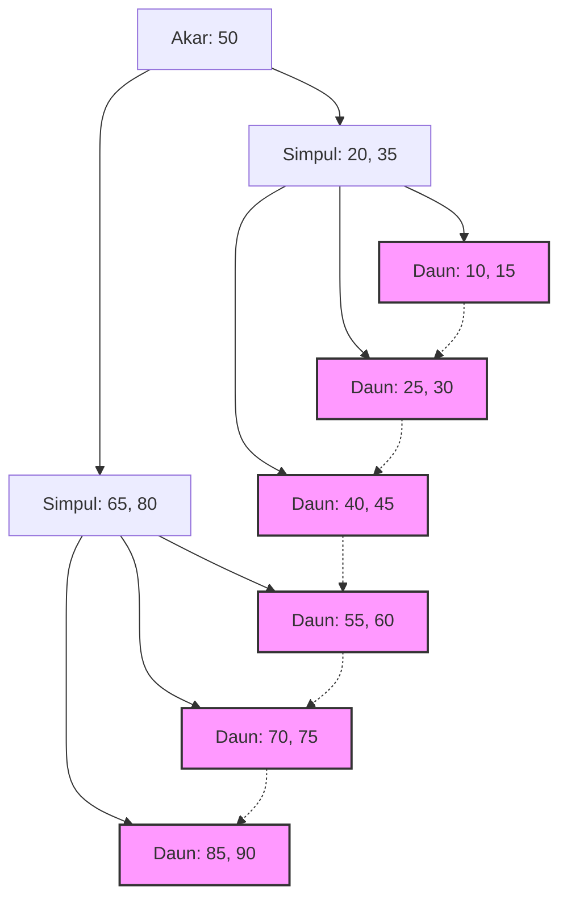

## 1. Pertemuan Antara Indeks Basis Data dan B-Tree

Dalam sistem modern, basis data adalah tulang punggung dari sebuah aplikasi. Kemampuan untuk mencari dan menghasilkan data yang diinginkan dalam hitungan milidetik dari jutaan bahkan ratusan juta rekaman adalah salah satu fungsi paling penting dari Sistem Manajemen Basis Data (DBMS). Kecepatan pencarian yang luar biasa ini didukung oleh **indeks**, dan struktur data di baliknya adalah **B-Tree** serta turunannya, yaitu **B+Tree**.

Dalam artikel ini, kita akan membahas secara mendalam mengapa basis data relasional tidak memilih pohon pencarian biner atau tabel hash, melainkan keluarga **B-Tree**, dengan mempertimbangkan sifat-sifat I/O disk, teori struktur data, analisis matematis, dan contoh implementasi kode.

## 2. Dinding Antara I/O Disk dan Hierarki Memori

Solusi optimal akan berbeda ketika menangani struktur data di dalam memori dibandingkan di dalam disk. Data dalam basis data disimpan dalam penyimpanan (HDD atau SSD) agar persisten.

### 2.1 Unit yang Disebut Blok (Halaman)

Akses ke penyimpanan jauh lebih lambat dibandingkan dengan akses ke memori (RAM). Oleh karena itu, OS dan perangkat keras tidak membaca dan menulis data byte demi byte, melainkan dalam unit berukuran tetap yang disebut **blok** atau **halaman** (misalnya 4KB atau 8KB).

Ketika basis data melakukan pencarian pada indeks, meminimalkan jumlah halaman yang dimuat dari disk ke memori ( **jumlah I/O disk** ) adalah faktor penentu terbesar untuk performa pencarian.

### 2.2 Keterbatasan Pohon Pencarian Biner (BST)

Dalam pencarian di dalam memori, pohon pencarian biner seimbang (Balanced Binary Search Tree) seperti **Pohon Pencarian Biner** (Binary Search Tree: BST) atau **Pohon Merah-Hitam** (Red-Black Tree) memungkinkan pencarian cepat dengan kompleksitas $ O(\log N) $. Namun, jika diterapkan secara langsung pada basis data di disk, hal ini akan menimbulkan masalah serius.

Pohon biner memiliki maksimal dua simpul anak untuk setiap simpulnya. Seiring bertambahnya jumlah elemen $ N $, tinggi pohon $ h $ akan semakin dalam secara proporsional terhadap $ \log_2 N $. Sebagai contoh, jika $ N = 1,000,000 $, tinggi pohon akan menjadi sekitar 20. Jika kita mengasumsikan setiap simpul ditempatkan pada halaman disk yang berbeda, dalam kasus terburuk akan terjadi 20 kali I/O disk secara acak. Ini merupakan keterlambatan yang fatal bagi basis data.

Oleh karena itu, **B-Tree** diciptakan dengan cara merendahkan "tinggi" pohon secara ekstrem, di mana satu simpul memiliki banyak kunci, sehingga sejumlah besar informasi dapat diambil hanya dalam satu kali I/O disk.

## 3. Struktur Data B-Tree dan Analisis Matematis

**B-Tree** adalah jenis pohon n-ary (N-ary tree) di mana semua simpul daun berada pada kedalaman yang sama, dan setiap simpul dapat memiliki beberapa kunci serta beberapa simpul anak.

### 3.1 Definisi dan Sifat B-Tree

B-Tree dicirikan oleh parameter yang disebut **derajat minimum** $ t $ ($ t \ge 2 $).

1. Setiap simpul memiliki maksimal $ 2t - 1 $ buah kunci.
2. Semua simpul selain simpul akar memiliki setidaknya $ t - 1 $ buah kunci.
3. Jika sebuah simpul memiliki $ k $ buah kunci, simpul tersebut akan memiliki $ k + 1 $ buah simpul anak.
4. Semua simpul daun berada pada kedalaman (tinggi $ h $) yang sama.
5. Kunci di dalam simpul diurutkan secara menaik.

Dengan menyesuaikan ukuran simpul terhadap ukuran halaman disk pada OS (misalnya: 4KB atau 8KB), banyak kunci dapat diambil ke dalam memori hanya dalam satu kali pengambilan disk (disk fetch).

### 3.2 Analisis Matematis tentang Tinggi dan Kompleksitas

Jumlah I/O disk untuk pencarian, penyisipan, dan penghapusan dalam B-Tree bergantung pada tinggi pohon $ h $.
Jika jumlah total kunci adalah $ n $ dan derajat minimum adalah $ t $, batas atas untuk tinggi $ h $ dari B-Tree ditunjukkan sebagai berikut.

$$
h \le \log_t \frac{n+1}{2}
$$

Karena basis logaritma $ t $ sangat besar (biasanya berkisar ratusan hingga ribuan), tinggi $ h $ menjadi sangat kecil. Sebagai contoh, jika $ t = 100 $, simpul akar akan memiliki setidaknya 1 kunci, level 1 memiliki setidaknya 2 simpul, level 2 memiliki setidaknya $ 2t = 200 $ simpul, dan akan meluas secara eksponensial hingga ke simpul daun.
Bahkan untuk 1 miliar rekaman, tinggi pohon hanya akan berada di kisaran 3 hingga 4, yang berarti I/O disk hanya akan terjadi sekitar 3 hingga 4 kali saja.

Mari kita analisis juga waktu pemrosesan pada blok.

$$
\begin{align*}
T_{search}(N) &= O(h) \\\\
&\le O(\log_t N)
\end{align*}
$$

Hal ini membuktikan secara matematis bahwa **B-Tree** sangat efisien untuk pencarian dalam skala data yang sangat besar.

## 4. Standar Basis Data: Evolusi ke B+Tree

Dalam praktiknya, RDBMS (seperti InnoDB pada MySQL atau PostgreSQL) menggunakan versi perbaikan dari B-Tree, yaitu **B+Tree**.

### 4.1 Perbedaan Antara B-Tree dan B+Tree

Pada B-Tree, data aktual (atau pointer menuju data) disimpan baik pada simpul internal maupun simpul daun. Di sisi lain, **B+Tree** memiliki karakteristik sebagai berikut.

1. **Semua data hanya disimpan pada simpul daun**. Simpul internal hanya menyimpan kunci (indeks) untuk perutean.
2. **Setiap simpul daun saling terhubung dengan linked list (pointer)**. Hal ini membuat akses sekuensial dan pencarian rentang (Range Query) menjadi sangat cepat.

### 4.2 Alasan Memilih B+Tree

Dengan menghilangkan pointer ke data aktual dari simpul internal, sebuah simpul internal (halaman) dapat memuat lebih banyak kunci. Hal ini lebih lanjut meningkatkan jumlah percabangan (Fan-out), sehingga tinggi pohon $ h $ dapat ditekan menjadi lebih rendah, dan jumlah I/O disk semakin berkurang.

Selain itu, pada pencarian rentang seperti `WHERE id BETWEEN 10 AND 100` yang sering digunakan dalam SQL, jika menggunakan B-Tree kita harus melintasi pohon berkali-kali. Namun dengan **B+Tree**, setelah menemukan simpul daun sebagai titik awal sebanyak satu kali, kita dapat membaca data secara berurutan hanya dengan menelusuri tautan antar simpul daun.


*(Gambar: Struktur B+Tree. Simpul-simpul daun dihubungkan membentuk rantai)*

## 5. Contoh Implementasi B-Tree (Simulasi dengan Python)

Di sini, kita akan memperdalam pemahaman dengan mengimplementasikan struktur simpul dasar serta algoritma pencarian dan penyisipan B-Tree menggunakan Python.

```python
class BTreeNode:
    def __init__(self, t, leaf=False):
        self.t = t          # Derajat minimum
        self.leaf = leaf    # Apakah ini simpul daun
        self.keys = []      # Daftar kunci
        self.children = []  # Daftar simpul anak

class BTree:
    def __init__(self, t):
        self.root = BTreeNode(t, True)
        self.t = t

    def search(self, k, node=None):
        """Mencari kunci k dari B-Tree"""
        if node is None:
            node = self.root

        i = 0
        while i < len(node.keys) and k > node.keys[i]:
            i += 1

        if i < len(node.keys) and node.keys[i] == k:
            return (node, i)
        
        if node.leaf:
            return None
        
        return self.search(k, node.children[i])

    def insert(self, k):
        """Menyisipkan kunci k ke dalam B-Tree"""
        root = self.root
        if len(root.keys) == (2 * self.t) - 1:
            # Jika simpul akar penuh, buat akar baru dan pisahkan
            temp = BTreeNode(self.t, False)
            self.root = temp
            temp.children.append(root)
            self.split_child(temp, 0)
            self.insert_non_full(temp, k)
        else:
            self.insert_non_full(root, k)

    def split_child(self, x, i):
        """Memisahkan simpul anak yang penuh"""
        t = self.t
        y = x.children[i]
        z = BTreeNode(t, y.leaf)
        
        x.children.insert(i + 1, z)
        x.keys.insert(i, y.keys[t - 1])
        
        z.keys = y.keys[t: (2 * t) - 1]
        y.keys = y.keys[0: t - 1]
        
        if not y.leaf:
            z.children = y.children[t: 2 * t]
            y.children = y.children[0: t]

    def insert_non_full(self, x, k):
        """Penyisipan ke simpul yang belum penuh"""
        i = len(x.keys) - 1
        if x.leaf:
            x.keys.append(0)
            while i >= 0 and k < x.keys[i]:
                x.keys[i + 1] = x.keys[i]
                i -= 1
            x.keys[i + 1] = k
        else:
            while i >= 0 and k < x.keys[i]:
                i -= 1
            i += 1
            if len(x.children[i].keys) == (2 * self.t) - 1:
                self.split_child(x, i)
                if k > x.keys[i]:
                    i += 1
            self.insert_non_full(x.children[i], k)

# Contoh penggunaan B-Tree
btree = BTree(3) # Derajat minimum t=3
keys_to_insert = [10, 20, 5, 6, 12, 30, 7, 17]
for key in keys_to_insert:
    btree.insert(key)

result = btree.search(12)
if result:
    print(f"Kunci 12 ditemukan: Kunci simpul {result[0].keys}")
else:
    print("Kunci tidak ditemukan")
```

Seperti yang bisa dilihat dari implementasi ini, proses penyisipan pada B-Tree akan memisahkan (Split) simpul dari bawah ke atas sesuai kebutuhan, sehingga pohon tersebut tetap terjaga keseimbangannya (Balanced). Dengan demikian, bagaimanapun urutan data yang disisipkan, performa pencarian tidak akan mengalami penurunan.

## 6. Kesimpulan dan Perkembangan

**B-Tree** dan **B+Tree** bisa dibilang sebagai struktur data mahakarya yang dirancang dengan tujuan meminimalkan biaya I/O pada sistem berbasis disk. Sifat-sifat perangkat fisik serta algoritma matematis menyatu dengan indah dalam bentuk struktur pohon yang dangkal berkat jumlah percabangan yang tinggi, serta optimasi akses sekuensial.

Dalam beberapa tahun terakhir, dengan semakin populernya SSD, struktur data baru seperti **LSM-Tree** (Log-Structured Merge-Tree) telah bermunculan untuk menekan amplifikasi penulisan (Write Amplification). Namun, dalam hal keseimbangan antara performa membaca dan pencarian rentang, serta stabilitas pemrosesan transaksi, **B+Tree** masih terus menduduki takhtanya sebagai penguasa absolut dalam basis data relasional.

Memahami apa yang terjadi di dalam basis data berhubungan langsung dengan kemampuan mengoptimalkan kueri dan merancang indeks dengan tepat. Berdasarkan teori yang telah dijelaskan dalam artikel ini, kami mengundang Anda untuk mengamati perilaku indeks dalam operasi basis data harian Anda.
