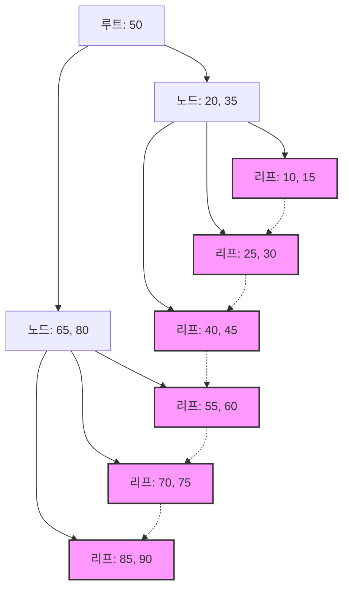

## 1. 데이터베이스 인덱스와 B-트리의 만남

현대 시스템에서 데이터베이스는 애플리케이션의 근간을 이루는 존재입니다. 수백만, 수억 개의 레코드 중에서 목적하는 데이터를 밀리초 단위로 검색하여 출력하는 능력은 데이터베이스 관리 시스템(DBMS)의 가장 중요한 기능 중 하나입니다. 이 경이로운 검색 속도를 뒷받침하는 것이 **인덱스** (색인)이며, 그 이면에 있는 데이터 구조가 **B-트리** (B-Tree) 및 그 파생인 **B+트리** (B+Tree)입니다.

본 기사에서는 왜 관계형 데이터베이스가 이진 탐색 트리나 해시 테이블이 아닌 **B-트리** 제품군을 선택하는지에 대해 디스크 I/O의 성질, 데이터 구조의 이론, 수학적 분석, 그리고 실제 코드 구현을 곁들여 깊이 파헤쳐 봅니다.

## 2. 디스크 I/O와 메모리 계층의 벽

데이터 구조를 메모리상에서 다룰 때와 디스크상에서 다룰 때는 최적해가 다릅니다. 데이터베이스의 데이터는 영구화를 위해 스토리지(HDD나 SSD)에 저장됩니다.

### 2.1 블록(페이지)이라는 단위

스토리지에 대한 액세스는 메모리에 대한 액세스(RAM)와 비교하여 압도적으로 느립니다. 따라서 OS나 하드웨어는 데이터를 1바이트씩이 아니라 **블록** 또는 **페이지** 라고 불리는 고정 길이 단위(예: 4KB나 8KB)로 읽고 씁니다.

데이터베이스가 인덱스를 검색할 때 디스크에서 메모리로 페이지를 로드하는 횟수( **디스크 I/O 횟수** )를 최소한으로 억제하는 것이 검색 성능을 결정짓는 가장 큰 요인이 됩니다.

### 2.2 이진 탐색 트리(BST)의 한계

메모리상에서의 검색에 있어서 **이진 탐색 트리** (Binary Search Tree: BST)나 **레드-블랙 트리** (Red-Black Tree) 등의 균형 이진 탐색 트리는 $ O(\log N) $ 의 계산 복잡도로 고속 검색이 가능합니다. 그러나 이를 그대로 디스크상의 데이터베이스에 적용하면 심각한 문제가 발생합니다.

이진 트리는 하나의 노드가 최대 2개의 자식 노드를 가집니다. 요소 수 $ N $ 이 증가하면 트리의 높이 $ h $ 는 $ \log_2 N $ 에 비례하여 깊어집니다. 예를 들어 $ N = 1,000,000 $ 인 경우, 트리의 높이는 약 20이 됩니다. 각 노드가 다른 디스크 페이지에 배치되어 있다고 가정하면, 최악의 경우 20번의 랜덤 디스크 I/O가 발생합니다. 이는 데이터베이스에 있어 치명적인 지연입니다.

그래서 트리의 '높이'를 극단적으로 낮추고, 하나의 노드에 많은 키를 가지게 함으로써 한 번의 디스크 I/O로 대량의 정보를 얻을 수 있도록 한 것이 **B-트리** 입니다.

## 3. B-트리의 데이터 구조와 수학적 분석

**B-트리** (B-Tree)는 모든 리프 노드가 같은 깊이에 있으며, 각 노드가 여러 개의 키와 여러 개의 자식 노드를 가질 수 있는 다항 트리(N-ary tree)의 일종입니다.

### 3.1 B-트리의 정의와 성질

B-트리는 파라미터인 **최소 차수** $ t $ ( $ t \ge 2 $ )에 의해 특징지어집니다.

1. 모든 노드는 최대 $ 2t - 1 $ 개의 키를 가진다.
2. 루트 노드를 제외한 모든 노드는 최소한 $ t - 1 $ 개의 키를 가진다.
3. 노드가 $ k $ 개의 키를 가지는 경우, 해당 노드는 $ k + 1 $ 개의 자식 노드를 가진다.
4. 모든 리프 노드는 같은 깊이(높이 $ h $ )에 존재한다.
5. 노드 내의 키는 오름차순으로 정렬되어 있다.

이로 인해 노드의 크기를 OS의 디스크 페이지 크기(예: 4KB나 8KB)에 맞춤으로써 한 번의 디스크 페치로 다수의 키를 메모리로 가져올 수 있습니다.

### 3.2 높이와 계산 복잡도의 수학적 분석

B-트리의 검색, 삽입, 삭제의 디스크 I/O 횟수는 트리의 높이 $ h $ 에 의존합니다.
키의 총수를 $ n $ , 최소 차수를 $ t $ 라고 할 때, B-트리의 높이 $ h $ 의 상한은 다음과 같이 나타납니다.

$$
h \le \log_t \frac{n+1}{2}
$$

이 로그의 밑 $ t $ 가 매우 크기 때문에(보통 수백~수천), 높이 $ h $ 는 매우 작아집니다. 예를 들어, $ t = 100 $ 인 경우, 루트 노드에는 적어도 1개의 키, 레벨 1에는 적어도 2개의 노드, 레벨 2에는 적어도 $ 2t = 200 $ 의 노드가 존재하며 리프 노드까지 지수 함수적으로 확장됩니다.
10억 개의 레코드라 하더라도 트리의 높이는 3~4 정도로 유지되며, 디스크 I/O는 불과 3~4회면 충분하게 됩니다.

블록에서의 처리 시간에 대해서도 분석해 봅시다.

$$
\begin{align*}
T_{search}(N) &= O(h) \\\\
&\le O(\log_t N)
\end{align*}
$$

이를 통해 **B-트리** 가 대규모 데이터의 검색에 있어서 극히 효율적이라는 것이 수학적으로 뒷받침됩니다.

## 4. 데이터베이스의 표준: B+트리로의 진화

실제 [RDBMS](https://kenji.blog/ko/p/rdbms-transaction-acid-isolation-level-lock/)(MySQL의 InnoDB나 PostgreSQL 등)에서 사용되는 것은 B-트리의 개량판인 **B+트리** (B+Tree)입니다.

### 4.1 B-트리와 B+트리의 차이

B-트리에서는 내부 노드와 리프 노드 양쪽에 실제 데이터(또는 데이터에 대한 포인터)가 저장됩니다. 반면, **B+트리** 에는 다음과 같은 특징이 있습니다.

1. **데이터는 모두 리프 노드에만 저장된다** . 내부 노드는 라우팅을 위한 키(인덱스)만을 유지한다.
2. **리프 노드끼리 연결 리스트(포인터)로 이어져 있다** . 이로 인해 순차적인 액세스나 범위 검색(Range Query)이 극히 고속이 된다.

### 4.2 B+트리를 채택하는 이유

내부 노드에서 실제 데이터로의 포인터를 배제함으로써 하나의 내부 노드(페이지)에 더 많은 키를 채워 넣을 수 있게 되었습니다. 이로 인해 분기 수(Fan-out)가 더욱 증대하고 트리의 높이 $ h $ 가 더 낮게 억제되어 디스크 I/O 횟수가 줄어듭니다.

또한 SQL에서 빈번히 사용되는 `WHERE id BETWEEN 10 AND 100` 과 같은 범위 검색에서, B-트리에서는 트리를 여러 번 순회해야 하지만 **B+트리** 라면 시작 지점의 리프 노드를 한 번 찾은 후에는 리프 노드의 링크를 따라가는 것만으로 연속적으로 데이터를 읽어낼 수 있습니다.


*(그림: B+트리의 구조. 리프 노드가 체인 형태로 연결되어 있음)*

## 5. B-트리의 구현 예시 (Python을 통한 시뮬레이션)

여기에서는 B-트리의 기본적인 노드 구조와 검색 및 삽입 알고리즘을 Python으로 구현하여 이해를 넓힙니다.

```python
class BTreeNode:
    def __init__(self, t, leaf=False):
        self.t = t          # 최소 차수
        self.leaf = leaf    # 리프 노드인지 여부
        self.keys = []      # 키의 리스트
        self.children = []  # 자식 노드의 리스트

class BTree:
    def __init__(self, t):
        self.root = BTreeNode(t, True)
        self.t = t

    def search(self, k, node=None):
        """B-트리에서 키 k를 검색한다"""
        if node is None:
            node = self.root

        i = 0
        while i < len(node.keys) and k > node.keys[i]:
            i += 1

        if i < len(node.keys) and node.keys[i] == k:
            return (node, i)
        
        if node.leaf:
            return None
        
        return self.search(k, node.children[i])

    def insert(self, k):
        """B-트리에 키 k를 삽입한다"""
        root = self.root
        if len(root.keys) == (2 * self.t) - 1:
            # 루트 노드가 가득 찬 경우, 새로운 루트를 생성하고 분할
            temp = BTreeNode(self.t, False)
            self.root = temp
            temp.children.append(root)
            self.split_child(temp, 0)
            self.insert_non_full(temp, k)
        else:
            self.insert_non_full(root, k)

    def split_child(self, x, i):
        """가득 찬 자식 노드를 분할한다"""
        t = self.t
        y = x.children[i]
        z = BTreeNode(t, y.leaf)
        
        x.children.insert(i + 1, z)
        x.keys.insert(i, y.keys[t - 1])
        
        z.keys = y.keys[t: (2 * t) - 1]
        y.keys = y.keys[0: t - 1]
        
        if not y.leaf:
            z.children = y.children[t: 2 * t]
            y.children = y.children[0: t]

    def insert_non_full(self, x, k):
        """가득 차지 않은 노드에 대한 삽입"""
        i = len(x.keys) - 1
        if x.leaf:
            x.keys.append(0)
            while i >= 0 and k < x.keys[i]:
                x.keys[i + 1] = x.keys[i]
                i -= 1
            x.keys[i + 1] = k
        else:
            while i >= 0 and k < x.keys[i]:
                i -= 1
            i += 1
            if len(x.children[i].keys) == (2 * self.t) - 1:
                self.split_child(x, i)
                if k > x.keys[i]:
                    i += 1
            self.insert_non_full(x.children[i], k)

# B-트리의 사용 예시
btree = BTree(3) # 최소 차수 t=3
keys_to_insert = [10, 20, 5, 6, 12, 30, 7, 17]
for key in keys_to_insert:
    btree.insert(key)

result = btree.search(12)
if result:
    print(f"키 12를 찾았습니다: 노드 키 {result[0].keys}")
else:
    print("키를 찾지 못했습니다")
```

이 구현을 통해서도 알 수 있듯이, B-트리의 삽입은 필요에 따라 아래에서 위로 노드를 분할(Split)해 나감으로써 트리가 완전히 균형(Balanced)을 유지하게 됩니다. 이로 인해 어떤 순서로 데이터가 삽입되더라도 검색 성능이 저하되는 일은 없습니다.

## 6. 요약 및 발전

**B-트리** 및 **B+트리** 는 디스크 기반 시스템에서 I/O 비용의 최소화를 목적으로 설계된 걸작이라고 할 수 있는 데이터 구조입니다. 높은 분기 수로 인한 얕은 트리 구조, 순차 액세스의 최적화 등 물리적 디바이스의 특성과 수학적 알고리즘이 훌륭하게 융합되어 있습니다.

최근에는 SSD의 보급으로 쓰기 증폭(Write Amplification)을 억제하기 위한 **LSM-트리** (Log-Structured Merge-Tree) 등 새로운 데이터 구조도 등장하고 있지만, 읽기 성능과 범위 검색의 균형, 트랜잭션 처리에서의 안정성에 있어서 여전히 **B+트리** 는 관계형 데이터베이스의 절대적인 제왕으로 군림하고 있습니다.

데이터베이스 내부에서 무슨 일이 일어나고 있는지를 이해하는 것은 쿼리의 최적화나 적절한 인덱스 설계와 직결됩니다. 본 기사에서 해설한 이론을 바탕으로, 꼭 일상적인 데이터베이스 조작에서의 인덱스 동작을 관찰해 보시길 바랍니다.
