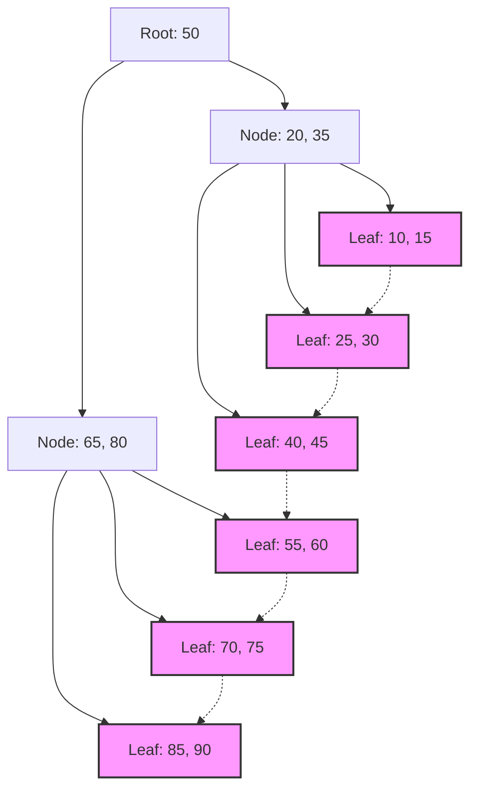

## 1. データベースインデックスとB木の出会い

現代のシステムにおいて、データベースはアプリケーションの根幹をなす存在です。数百万、数億というレコードの中から、目的のデータをミリ秒単位で検索し出力する能力は、データベース管理システム（DBMS）の最も重要な機能の一つです。この驚異的な検索速度を支えているのが **インデックス** （索引）であり、その背後にあるデータ構造が **B木** （B-Tree）およびその派生である **B+木** （B+Tree）です。

本記事では、なぜリレーショナルデータベースが二分探索木やハッシュ表ではなく、 **B木** ファミリーを選択するのかについて、ディスクI/Oの性質、データ構造の理論、数学的解析、そして実際のコード実装を交えて深く掘り下げます。

## 2. ディスクI/Oとメモリ階層の壁

データ構造をメモリ上で扱う場合と、ディスク上で扱う場合では、最適解が異なります。データベースのデータは永続化のためにストレージ（HDDやSSD）に保存されます。

### 2.1 ブロック（ページ）という単位

ストレージへのアクセスは、メモリへのアクセス（RAM）と比較して圧倒的に遅いです。そのため、OSやハードウェアはデータを1バイトずつではなく、 **ブロック** または **ページ** と呼ばれる固定長の単位（例えば4KBや8KB）で読み書きします。

データベースがインデックスを検索するとき、ディスクからメモリへページをロードする回数（ **ディスクI/O回数** ）を最小限に抑えることが、検索パフォーマンスを決定づける最大の要因となります。

### 2.2 二分探索木（BST）の限界

メモリ上での検索において、 **二分探索木** （Binary Search Tree: BST）や **赤黒木** （Red-Black Tree）などの平衡二分探索木は $ O(\log N) $ の計算量で高速な検索が可能です。しかし、これをそのままディスク上のデータベースに適用すると、深刻な問題が発生します。

二分木は1つのノードが最大2つの子ノードを持ちます。要素数 $ N $ が増えると、木の高さ $ h $ は $ \log_2 N $ に比例して深くなります。たとえば $ N = 1,000,000 $ の場合、木の高さは約20になります。各ノードが異なるディスクページに配置されていると仮定すると、最悪で20回のランダムディスクI/Oが発生します。これはデータベースにとって致命的な遅延です。

そこで、木の「高さ」を極端に低くし、1つのノードに多くのキーを持たせることで1回のディスクI/Oで大量の情報を取得できるようにしたのが **B木** です。

## 3. B木のデータ構造と数学的解析

**B木** （B-Tree）は、すべての葉ノードが同じ深さにあり、各ノードが複数のキーと複数の子ノードを持つことができる多分木（N-ary tree）の一種です。

### 3.1 B木の定義と性質

B木は、パラメータである **最小次数** $ t $ （ $ t \ge 2 $ ）によって特徴付けられます。

1. すべてのノードは最大で $ 2t - 1 $ 個のキーを持つ。
2. 根ノード以外のすべてのノードは、最低でも $ t - 1 $ 個のキーを持つ。
3. ノードが $ k $ 個のキーを持つ場合、そのノードは $ k + 1 $ 個の子ノードを持つ。
4. すべての葉ノードは同じ深さ（高さ $ h $ ）に存在する。
5. ノード内のキーは昇順にソートされている。

これにより、ノードのサイズをOSのディスクページサイズ（例：4KBや8KB）に合わせることで、1回のディスクフェッチで多数のキーをメモリに取り込むことができます。

### 3.2 高さと計算量の数学的解析

B木の検索、挿入、削除のディスクI/O回数は、木の高さ $ h $ に依存します。
キーの総数を $ n $ 、最小次数を $ t $ としたとき、B木の高さ $ h $ の上限は以下のように示されます。

$$
h \le \log_t \frac{n+1}{2}
$$

この対数の底 $ t $ が非常に大きいため（通常数百〜数千）、高さ $ h $ は非常に小さくなります。例えば、 $ t = 100 $ の場合、根ノードには少なくとも1つのキー、レベル1には少なくとも2つのノード、レベル2には少なくとも $ 2t = 200 $ のノードが存在し、葉ノードまで指数関数的に広がります。
10億のレコードであっても、木の高さは3〜4程度に収まり、ディスクI/Oはわずか3〜4回で済むことになります。

ブロックでの処理時間についても解析してみましょう。

$$
\begin{align*}
T_{search}(N) &= O(h) \\\\
&\le O(\log_t N)
\end{align*}
$$

これにより、 **B木** が大規模データの検索において極めて効率的であることが数学的に裏付けられます。

## 4. データベースの標準: B+木への進化

実際のRDBMS（MySQLのInnoDBやPostgreSQLなど）で使われているのは、B木の改良版である **B+木** （B+Tree）です。

### 4.1 B木とB+木の違い

B木では、内部ノードと葉ノードの両方に実際のデータ（またはデータへのポインタ）が格納されます。一方、 **B+木** には以下の特徴があります。

1. **データはすべて葉ノードにのみ格納される** 。内部ノードはルーティングのためのキー（インデックス）のみを保持する。
2. **葉ノード同士がリンクドリスト（ポインタ）で結ばれている** 。これにより、シーケンシャルなアクセスや範囲検索（Range Query）が極めて高速になる。

### 4.2 B+木を採用する理由

内部ノードから実データへのポインタを排除したことで、1つの内部ノード（ページ）により多くのキーを詰め込むことができるようになりました。これにより、分岐数（Fan-out）がさらに増大し、木の高さ $ h $ がより低く抑えられ、ディスクI/O回数が削減されます。

さらに、SQLで頻繁に用いられる `WHERE id BETWEEN 10 AND 100` のような範囲検索において、B木では木を何度もトラバースする必要がありますが、 **B+木** であれば開始地点の葉ノードを1回見つけた後は、葉ノードのリンクをたどるだけで連続的にデータを読み出すことができます。


*(図: B+木の構造。葉ノードがチェーン状にリンクされている)*

## 5. B木の実装例（Pythonによるシミュレーション）

ここでは、B木の基本的なノード構造と、検索および挿入のアルゴリズムをPythonで実装して理解を深めます。

```python
class BTreeNode:
    def __init__(self, t, leaf=False):
        self.t = t          # 最小次数
        self.leaf = leaf    # 葉ノードかどうか
        self.keys = []      # キーのリスト
        self.children = []  # 子ノードのリスト

class BTree:
    def __init__(self, t):
        self.root = BTreeNode(t, True)
        self.t = t

    def search(self, k, node=None):
        """B木からキーkを検索する"""
        if node is None:
            node = self.root

        i = 0
        while i < len(node.keys) and k > node.keys[i]:
            i += 1

        if i < len(node.keys) and node.keys[i] == k:
            return (node, i)
        
        if node.leaf:
            return None
        
        return self.search(k, node.children[i])

    def insert(self, k):
        """B木にキーkを挿入する"""
        root = self.root
        if len(root.keys) == (2 * self.t) - 1:
            # 根ノードが満杯の場合、新しい根を作成して分割
            temp = BTreeNode(self.t, False)
            self.root = temp
            temp.children.append(root)
            self.split_child(temp, 0)
            self.insert_non_full(temp, k)
        else:
            self.insert_non_full(root, k)

    def split_child(self, x, i):
        """満杯の子ノードを分割する"""
        t = self.t
        y = x.children[i]
        z = BTreeNode(t, y.leaf)
        
        x.children.insert(i + 1, z)
        x.keys.insert(i, y.keys[t - 1])
        
        z.keys = y.keys[t: (2 * t) - 1]
        y.keys = y.keys[0: t - 1]
        
        if not y.leaf:
            z.children = y.children[t: 2 * t]
            y.children = y.children[0: t]

    def insert_non_full(self, x, k):
        """満杯でないノードへの挿入"""
        i = len(x.keys) - 1
        if x.leaf:
            x.keys.append(0)
            while i >= 0 and k < x.keys[i]:
                x.keys[i + 1] = x.keys[i]
                i -= 1
            x.keys[i + 1] = k
        else:
            while i >= 0 and k < x.keys[i]:
                i -= 1
            i += 1
            if len(x.children[i].keys) == (2 * self.t) - 1:
                self.split_child(x, i)
                if k > x.keys[i]:
                    i += 1
            self.insert_non_full(x.children[i], k)

# B木の使用例
btree = BTree(3) # 最小次数 t=3
keys_to_insert = [10, 20, 5, 6, 12, 30, 7, 17]
for key in keys_to_insert:
    btree.insert(key)

result = btree.search(12)
if result:
    print(f"キー12が見つかりました: ノードキー {result[0].keys}")
else:
    print("キーが見つかりませんでした")
```

この実装からもわかるように、B木の挿入は必要に応じて下から上へとノードを分割（Split）していくことで、木が完全に平衡（Balanced）に保たれます。これにより、どのような順序でデータが挿入されても、検索性能が劣化することはありません。

## 6. まとめと発展

**B木** および **B+木** は、ディスクベースのシステムにおけるI/Oコストの最小化を目的として設計された傑作と言えるデータ構造です。高い分岐数による浅い木構造、順次アクセスの最適化など、物理的デバイスの特性と数学的アルゴリズムが見事に融合しています。

近年では、SSDの普及により書き込み増幅（Write Amplification）を抑えるための **LSM木** （Log-Structured Merge-Tree）など、新しいデータ構造も登場していますが、読み込み性能と範囲検索のバランス、トランザクション処理における安定性において、依然として **B+木** はリレーショナルデータベースにおける絶対的な王者として君臨し続けています。

データベース内部で何が起きているのかを理解することは、クエリの最適化や適切なインデックス設計に直結します。本記事で解説した理論をベースに、ぜひ日常のデータベース操作におけるインデックスの挙動を観察してみてください。
