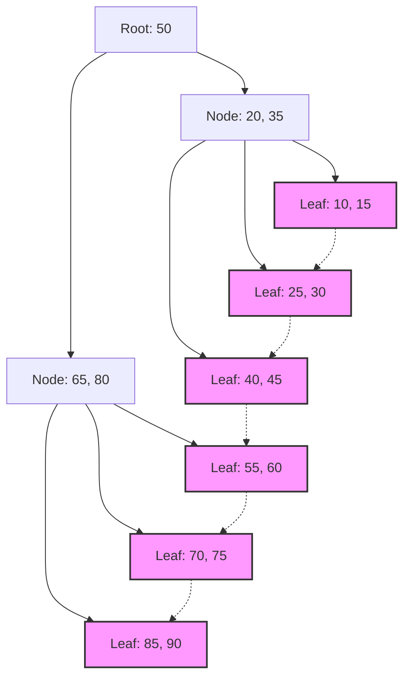

## 1. O Encontro dos Índices de Banco de Dados com a Árvore B

Nos sistemas modernos, os bancos de dados são a espinha dorsal dos aplicativos. A capacidade de pesquisar e retornar os dados desejados a partir de milhões ou bilhões de registros em milissegundos é uma das funções mais importantes de um Sistema de Gerenciamento de Banco de Dados (SGBD). A base dessa incrível velocidade de busca é o **índice**, e a estrutura de dados por trás dele é a **Árvore B** (B-Tree) e sua derivada, a **Árvore B+** (B+Tree).

Neste artigo, nos aprofundaremos nas razões pelas quais os bancos de dados relacionais escolhem a família da **Árvore B** em vez de árvores de busca binária ou tabelas hash, abordando a natureza de E/S de disco, a teoria das estruturas de dados, a análise matemática e a implementação de código na prática.

## 2. A Barreira da E/S de Disco e da Hierarquia de Memória

A solução ideal para lidar com estruturas de dados difere dependendo se estão sendo manipuladas na memória ou no disco. Os dados do banco de dados são armazenados no armazenamento (HDD ou SSD) para persistência.

### 2.1 A Unidade Chamada Bloco (Página)

O acesso ao armazenamento é esmagadoramente mais lento em comparação com o acesso à memória (RAM). Portanto, o SO (Sistema Operacional) e o hardware leem e escrevem dados não byte a byte, mas em unidades de comprimento fixo (por exemplo, 4 KB ou 8 KB) chamadas de **blocos** ou **páginas**.

Quando o banco de dados pesquisa um índice, minimizar o número de vezes que uma página é carregada do disco para a memória ( **número de E/S de disco** ) é o principal fator que determina o desempenho da pesquisa.

### 2.2 As Limitações da Árvore de Busca Binária (BST)

Para buscas na memória, árvores de busca binária balanceadas como a **Árvore de Busca Binária** (Binary Search Tree: BST) e a **Árvore Rubro-Negra** (Red-Black Tree) permitem buscas rápidas com uma complexidade de tempo de $ O(\log N) $. No entanto, se aplicarmos isso diretamente a um banco de dados em disco, um problema sério ocorrerá.

Uma árvore binária tem um nó com no máximo dois nós filhos. À medida que o número de elementos $ N $ aumenta, a altura da árvore $ h $ se aprofunda proporcionalmente a $ \log_2 N $. Por exemplo, quando $ N = 1.000.000 $, a altura da árvore será em torno de 20. Supondo que cada nó esteja alocado em uma página de disco diferente, ocorrerão até 20 E/S de disco aleatórias no pior dos casos. Este é um atraso fatal para um banco de dados.

Portanto, ao tornar a "altura" da árvore extremamente baixa e fazer com que um nó tenha muitas chaves, é possível recuperar uma grande quantidade de informações em uma única E/S de disco, resultando na **Árvore B**.

## 3. Estrutura de Dados da Árvore B e Análise Matemática

A **Árvore B** (B-Tree) é um tipo de árvore n-ária em que todos os nós folha estão na mesma profundidade, e cada nó pode ter várias chaves e vários nós filhos.

### 3.1 Definição e Propriedades da Árvore B

A Árvore B é caracterizada por um parâmetro chamado **grau mínimo** $ t $ ( $ t \ge 2 $ ).

1. Todos os nós têm no máximo $ 2t - 1 $ chaves.
2. Todos os nós, exceto o nó raiz, têm pelo menos $ t - 1 $ chaves.
3. Se um nó tiver $ k $ chaves, ele terá $ k + 1 $ nós filhos.
4. Todos os nós folha existem na mesma profundidade (altura $ h $ ).
5. As chaves dentro do nó são ordenadas em ordem crescente.

Com isso, ao alinhar o tamanho do nó com o tamanho da página de disco do SO (ex: 4 KB ou 8 KB), um grande número de chaves pode ser trazido para a memória com uma única busca em disco.

### 3.2 Análise Matemática da Altura e da Complexidade

O número de E/S de disco para busca, inserção e exclusão em uma Árvore B depende da altura da árvore $ h $.
Assumindo que o número total de chaves é $ n $ e o grau mínimo é $ t $, o limite superior da altura $ h $ da Árvore B é expresso da seguinte forma:

$$
h \le \log_t \frac{n+1}{2}
$$

Como a base deste logaritmo $ t $ é muito grande (geralmente de centenas a milhares), a altura $ h $ se torna muito pequena. Por exemplo, se $ t = 100 $, haverá pelo menos 1 chave no nó raiz, pelo menos 2 nós no nível 1, pelo menos $ 2t = 200 $ nós no nível 2, expandindo exponencialmente até os nós folha.
Mesmo com 1 bilhão de registros, a altura da árvore ficará em torno de 3 a 4, necessitando de apenas 3 a 4 E/S de disco.

Vamos também analisar o tempo de processamento em blocos.

$$
\begin{align*}
T_{search}(N) &= O(h) \\\\
&\le O(\log_t N)
\end{align*}
$$

Isso fundamenta matematicamente que a **Árvore B** é extremamente eficiente para pesquisar em dados de grande escala.

## 4. O Padrão de Banco de Dados: Evolução para a Árvore B+

Nos [RDBMS](https://kenji.blog/pt/p/rdbms-transaction-acid-isolation-level-lock/) reais (como o InnoDB do MySQL e o PostgreSQL), a **Árvore B+** (B+Tree), uma versão melhorada da Árvore B, é utilizada.

### 4.1 Diferenças entre a Árvore B e a Árvore B+

Na Árvore B, os dados reais (ou ponteiros para os dados) são armazenados tanto nos nós internos quanto nos nós folha. Por outro lado, a **Árvore B+** tem as seguintes características:

1. **Todos os dados são armazenados apenas nos nós folha** . Os nós internos mantêm apenas chaves (índices) para roteamento.
2. **Os nós folha estão conectados uns aos outros através de uma lista encadeada (ponteiros)** . Isso torna o acesso sequencial e as buscas em faixa (Range Query) extremamente rápidos.

### 4.2 Razões para Adotar a Árvore B+

Ao remover os ponteiros para os dados reais dos nós internos, tornou-se possível empacotar mais chaves em um único nó interno (página). Isso aumenta ainda mais o número de ramificações (Fan-out), mantendo a altura da árvore $ h $ mais baixa e reduzindo o número de E/S de disco.

Além disso, em buscas em faixa, que são frequentemente usadas em SQL, como `WHERE id BETWEEN 10 AND 100`, a Árvore B requer a travessia da árvore várias vezes. Na **Árvore B+**, no entanto, uma vez que o nó folha inicial é encontrado, os dados podem ser lidos continuamente apenas seguindo as conexões (links) entre os nós folha.


*(Figura: Estrutura de uma Árvore B+. Os nós folha são vinculados em formato de cadeia)*

## 5. Exemplo de Implementação da Árvore B (Simulação em Python)

Aqui, implementaremos a estrutura básica de um nó da Árvore B e os algoritmos de busca e inserção em Python para aprofundar nossa compreensão.

```python
class BTreeNode:
    def __init__(self, t, leaf=False):
        self.t = t          # Grau mínimo
        self.leaf = leaf    # Indica se é um nó folha
        self.keys = []      # Lista de chaves
        self.children = []  # Lista de nós filhos

class BTree:
    def __init__(self, t):
        self.root = BTreeNode(t, True)
        self.t = t

    def search(self, k, node=None):
        """Pesquisa a chave k na Árvore B"""
        if node is None:
            node = self.root

        i = 0
        while i < len(node.keys) and k > node.keys[i]:
            i += 1

        if i < len(node.keys) and node.keys[i] == k:
            return (node, i)
        
        if node.leaf:
            return None
        
        return self.search(k, node.children[i])

    def insert(self, k):
        """Insere a chave k na Árvore B"""
        root = self.root
        if len(root.keys) == (2 * self.t) - 1:
            # Se o nó raiz estiver cheio, crie uma nova raiz e divida
            temp = BTreeNode(self.t, False)
            self.root = temp
            temp.children.append(root)
            self.split_child(temp, 0)
            self.insert_non_full(temp, k)
        else:
            self.insert_non_full(root, k)

    def split_child(self, x, i):
        """Divide um nó filho que está cheio"""
        t = self.t
        y = x.children[i]
        z = BTreeNode(t, y.leaf)
        
        x.children.insert(i + 1, z)
        x.keys.insert(i, y.keys[t - 1])
        
        z.keys = y.keys[t: (2 * t) - 1]
        y.keys = y.keys[0: t - 1]
        
        if not y.leaf:
            z.children = y.children[t: 2 * t]
            y.children = y.children[0: t]

    def insert_non_full(self, x, k):
        """Inserção em um nó que não está cheio"""
        i = len(x.keys) - 1
        if x.leaf:
            x.keys.append(0)
            while i >= 0 and k < x.keys[i]:
                x.keys[i + 1] = x.keys[i]
                i -= 1
            x.keys[i + 1] = k
        else:
            while i >= 0 and k < x.keys[i]:
                i -= 1
            i += 1
            if len(x.children[i].keys) == (2 * self.t) - 1:
                self.split_child(x, i)
                if k > x.keys[i]:
                    i += 1
            self.insert_non_full(x.children[i], k)

# Exemplo de uso da Árvore B
btree = BTree(3) # Grau mínimo t=3
keys_to_insert = [10, 20, 5, 6, 12, 30, 7, 17]
for key in keys_to_insert:
    btree.insert(key)

result = btree.search(12)
if result:
    print(f"Chave 12 encontrada: chaves do nó {result[0].keys}")
else:
    print("Chave não encontrada")
```

Como pode ser visto a partir desta implementação, a inserção na Árvore B divide (Split) os nós de baixo para cima, conforme necessário, mantendo a árvore perfeitamente balanceada (Balanced). Isso garante que o desempenho da pesquisa não se degrade, independentemente da ordem em que os dados são inseridos.

## 6. Conclusão e Desenvolvimentos

A **Árvore B** e a **Árvore B+** são estruturas de dados que podem ser descritas como obras-primas, projetadas para minimizar os custos de E/S em sistemas baseados em disco. Elas mesclam perfeitamente características de dispositivos físicos com algoritmos matemáticos, como a estrutura de árvore rasa devido ao alto número de ramificações, e a otimização do acesso sequencial.

Nos últimos anos, com a disseminação dos SSDs, surgiram novas estruturas de dados como a **Árvore LSM** (Log-Structured Merge-Tree) para mitigar a amplificação de gravação (Write Amplification). No entanto, considerando o equilíbrio entre desempenho de leitura e buscas em faixa, bem como a estabilidade no processamento de transações, a **Árvore B+** continua reinando como a soberana absoluta em bancos de dados relacionais.

Compreender o que acontece internamente em um banco de dados está diretamente ligado à otimização de consultas e ao design adequado de índices. Recomendamos que você observe o comportamento dos índices em suas operações diárias de banco de dados, usando a teoria explicada neste artigo como base.
