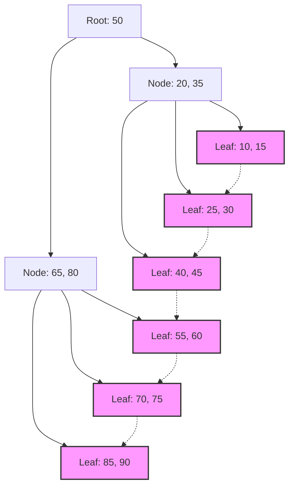

## 1. Встреча индексов баз данных и B-дерева

В современных системах базы данных составляют основу приложений. Способность искать и выводить нужные данные среди миллионов и сотен миллионов записей за миллисекунды — одна из важнейших функций систем управления базами данных (СУБД). Эту невероятную скорость поиска поддерживают **индексы** , а скрытая за ними структура данных — это **B-дерево** (B-[Tree](https://kenji.blog/ru/p/tree-graph-data-structures-search-dfs-bfs-dijkstra/)) и его производная **B+дерево** (B+Tree).

В этой статье мы подробно рассмотрим, почему реляционные базы данных выбирают семейство **B-деревьев** , а не бинарные деревья поиска или хеш-таблицы, учитывая свойства дискового ввода-вывода (I/O), теорию структур данных, математический анализ и примеры реального кода.

## 2. Дисковый ввод-вывод и барьер иерархии памяти

Оптимальные решения для работы со структурами данных в оперативной памяти и на диске различаются. Данные базы данных сохраняются в хранилище (HDD или SSD) для обеспечения их персистентности.

### 2.1 Блоки (страницы) как единица измерения

Доступ к хранилищу происходит значительно медленнее по сравнению с доступом к оперативной памяти (RAM). Поэтому ОС и оборудование читают и записывают данные не по одному байту, а фиксированными единицами, называемыми **блоками** или **страницами** (например, 4 КБ или 8 КБ).

Когда база данных ищет по индексу, минимизация количества загрузок страниц с диска в память ( **количество дисковых операций ввода-вывода** ) становится главным фактором, определяющим производительность поиска.

### 2.2 Ограничения бинарных деревьев поиска (BST)

При поиске в оперативной памяти сбалансированные бинарные деревья поиска, такие как **бинарное дерево поиска** ([Binary Search](https://kenji.blog/ru/p/search-algorithms-linear-binary-hash-table-principles/) Tree: BST) или **красно-черное дерево** (Red-Black Tree), обеспечивают высокоскоростной поиск с вычислительной сложностью $ O(\log N) $. Однако прямое применение этого подхода к базам данных на диске вызывает серьезные проблемы.

В бинарном дереве один узел имеет максимум два дочерних узла. С увеличением количества элементов $ N $, высота дерева $ h $ увеличивается пропорционально $ \log_2 N $. Например, при $ N = 1,000,000 $ высота дерева составит около 20. Если предположить, что каждый узел расположен на отдельной дисковой странице, в худшем случае произойдет 20 случайных операций дискового ввода-вывода. Для базы данных это фатальная задержка.

Поэтому, экстремально уменьшив «высоту» дерева и позволив одному узлу содержать множество ключей, чтобы за одну операцию дискового ввода-вывода можно было получить большой объем информации, было создано **B-дерево** .

## 3. Структура данных B-дерева и математический анализ

**B-дерево** (B-Tree) — это разновидность N-арного дерева (N-ary tree), в котором все листовые узлы находятся на одной глубине, а каждый узел может иметь несколько ключей и несколько дочерних узлов.

### 3.1 Определение и свойства B-дерева

B-дерево характеризуется параметром — **минимальной степенью** $ t $ ($ t \ge 2 $).

1. Все узлы содержат не более $ 2t - 1 $ ключей.
2. Все узлы, кроме корневого, содержат как минимум $ t - 1 $ ключей.
3. Если узел содержит $ k $ ключей, то у него есть $ k + 1 $ дочерних узлов.
4. Все листовые узлы находятся на одной глубине (высоте $ h $).
5. Ключи внутри узла отсортированы по возрастанию.

Благодаря этому, сопоставив размер узла с размером дисковой страницы ОС (например, 4 КБ или 8 КБ), можно за одну операцию извлечения с диска загрузить в память множество ключей.

### 3.2 Математический анализ высоты и вычислительной сложности

Количество дисковых операций ввода-вывода при поиске, вставке и удалении в B-дереве зависит от высоты дерева $ h $.
Если общее количество ключей равно $ n $, а минимальная степень — $ t $, то верхняя граница высоты $ h $ B-дерева выражается следующим образом:

$$
h \le \log_t \frac{n+1}{2}
$$

Поскольку основание логарифма $ t $ очень велико (обычно от сотен до тысяч), высота $ h $ становится очень маленькой. Например, при $ t = 100 $ корневой узел содержит как минимум 1 ключ, на уровне 1 находится как минимум 2 узла, на уровне 2 — как минимум $ 2t = 200 $ узлов, и так они экспоненциально расширяются до листовых узлов.
Даже для миллиарда записей высота дерева будет в пределах 3-4, что потребует всего лишь 3-4 операций дискового ввода-вывода.

Давайте также проанализируем время обработки в блоках.

$$
\begin{align*}
T_{search}(N) &= O(h) \\\\
&\le O(\log_t N)
\end{align*}
$$

Это математически подтверждает, что **B-дерево** чрезвычайно эффективно при поиске в больших объемах данных.

## 4. Стандарт баз данных: Эволюция к B+дереву

В реальных [RDBMS](https://kenji.blog/ru/p/rdbms-transaction-acid-isolation-level-lock/) (например, InnoDB в MySQL или PostgreSQL) используется улучшенная версия B-дерева — **B+дерево** (B+[Tree](https://kenji.blog/ru/p/tree-graph-data-structures-search-dfs-bfs-dijkstra/)).

### 4.1 Различия между B-деревом и B+деревом

В B-дереве как во внутренних, так и в листовых узлах хранятся фактические данные (или указатели на данные). С другой стороны, **B+дерево** имеет следующие особенности:

1. **Все данные хранятся только в листовых узлах** . Внутренние узлы содержат только ключи (индексы) для маршрутизации.
2. **Листовые узлы связаны между собой связным списком (указателями)** . Это делает последовательный доступ и запросы диапазонов (Range Query) невероятно быстрыми.

### 4.2 Причины использования B+дерева

Исключение указателей на реальные данные из внутренних узлов позволило упаковать больше ключей в один внутренний узел (страницу). Это еще больше увеличивает коэффициент ветвления (Fan-out), что позволяет сохранить меньшую высоту дерева $ h $ и сократить количество операций дискового ввода-вывода.

Более того, в часто используемых в SQL запросах диапазонов вроде `WHERE id BETWEEN 10 AND 100`, если в B-дереве необходимо многократно обходить дерево, то в **B+дереве** достаточно один раз найти начальный листовой узел, а затем просто последовательно считывать данные, следуя по связям листовых узлов.


*(Рис: Структура B+дерева. Листовые узлы связаны в цепочку)*

## 5. Пример реализации B-дерева (Симуляция на Python)

Здесь мы реализуем на Python базовую структуру узла B-дерева, а также алгоритмы поиска и вставки для более глубокого понимания.

```python
class BTreeNode:
    def __init__(self, t, leaf=False):
        self.t = t          # Минимальная степень
        self.leaf = leaf    # Является ли узел листовым
        self.keys = []      # Список ключей
        self.children = []  # Список дочерних узлов

class BTree:
    def __init__(self, t):
        self.root = BTreeNode(t, True)
        self.t = t

    def search(self, k, node=None):
        """Поиск ключа k в B-дереве"""
        if node is None:
            node = self.root

        i = 0
        while i < len(node.keys) and k > node.keys[i]:
            i += 1

        if i < len(node.keys) and node.keys[i] == k:
            return (node, i)
        
        if node.leaf:
            return None
        
        return self.search(k, node.children[i])

    def insert(self, k):
        """Вставка ключа k в B-дерево"""
        root = self.root
        if len(root.keys) == (2 * self.t) - 1:
            # Если корневой узел заполнен, создаем новый корень и разделяем его
            temp = BTreeNode(self.t, False)
            self.root = temp
            temp.children.append(root)
            self.split_child(temp, 0)
            self.insert_non_full(temp, k)
        else:
            self.insert_non_full(root, k)

    def split_child(self, x, i):
        """Разделение заполненного дочернего узла"""
        t = self.t
        y = x.children[i]
        z = BTreeNode(t, y.leaf)
        
        x.children.insert(i + 1, z)
        x.keys.insert(i, y.keys[t - 1])
        
        z.keys = y.keys[t: (2 * t) - 1]
        y.keys = y.keys[0: t - 1]
        
        if not y.leaf:
            z.children = y.children[t: 2 * t]
            y.children = y.children[0: t]

    def insert_non_full(self, x, k):
        """Вставка в незаполненный узел"""
        i = len(x.keys) - 1
        if x.leaf:
            x.keys.append(0)
            while i >= 0 and k < x.keys[i]:
                x.keys[i + 1] = x.keys[i]
                i -= 1
            x.keys[i + 1] = k
        else:
            while i >= 0 and k < x.keys[i]:
                i -= 1
            i += 1
            if len(x.children[i].keys) == (2 * self.t) - 1:
                self.split_child(x, i)
                if k > x.keys[i]:
                    i += 1
            self.insert_non_full(x.children[i], k)

# Пример использования B-дерева
btree = BTree(3) # Минимальная степень t=3
keys_to_insert = [10, 20, 5, 6, 12, 30, 7, 17]
for key in keys_to_insert:
    btree.insert(key)

result = btree.search(12)
if result:
    print(f"Ключ 12 найден: ключи узла {result[0].keys}")
else:
    print("Ключ не найден")
```

Как видно из этой реализации, при вставке в B-дерево узлы при необходимости разделяются (Split) снизу вверх, что позволяет дереву оставаться идеально сбалансированным (Balanced). Благодаря этому производительность поиска не ухудшается, независимо от порядка вставки данных.

## 6. Заключение и развитие

Можно сказать, что **B-дерево** и **B+дерево** являются шедеврами среди структур данных, разработанными с целью минимизации затрат на ввод-вывод в дисковых системах. Мелкая структура дерева с высоким коэффициентом ветвления и оптимизация для последовательного доступа идеально сочетают характеристики физических устройств и математические алгоритмы.

В последние годы, с распространением SSD, появились новые структуры данных, такие как **LSM-дерево** (Log-Structured Merge-[Tree](https://kenji.blog/ru/p/tree-graph-data-structures-search-dfs-bfs-dijkstra/)), для уменьшения усиления записи (Write Amplification). Однако **B+дерево** по-прежнему остается абсолютным королем в реляционных базах данных благодаря своему балансу между производительностью чтения и поиском по диапазону, а также стабильности в обработке транзакций.

Понимание того, что происходит внутри базы данных, напрямую связано с оптимизацией запросов и правильным проектированием индексов. Опираясь на теорию, описанную в этой статье, попробуйте понаблюдать за поведением индексов в вашей повседневной работе с базами данных.
