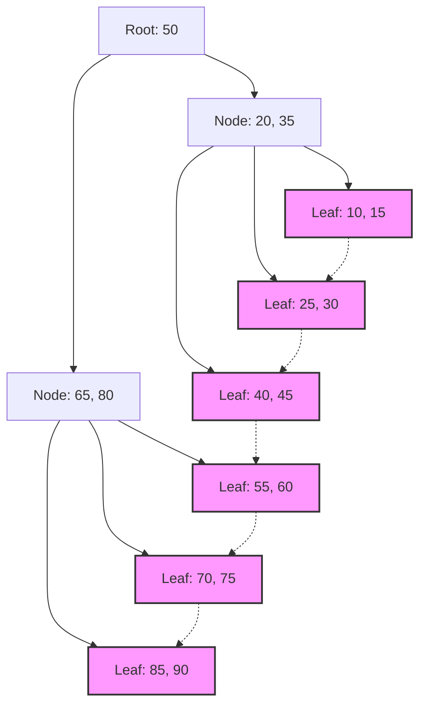

## 1. 数据库索引与B树的相遇

在现代系统中，数据库是应用程序的根基。从数百万、数亿条记录中，以毫秒级速度搜索并输出目标数据的能力，是数据库管理系统（DBMS）最重要的功能之一。支撑这种惊人搜索速度的是 **索引** （Index），而其背后的数据结构则是 **B树** （B-[Tree](https://kenji.blog/zh-cn/p/tree-graph-data-structures-search-dfs-bfs-dijkstra/)）及其衍生出来的 **B+树** （B+Tree）。

本文将结合磁盘I/O的性质、数据结构的理论、数学分析以及实际的代码实现，深入探讨为什么关系型数据库选择 **B树** 家族，而不是二叉搜索树或哈希表。

## 2. 磁盘I/O与内存层级的壁垒

在内存中处理数据结构与在磁盘上处理时，最优解是不同的。数据库的数据为了持久化，会保存在存储设备（HDD或SSD）中。

### 2.1 以块（页）为单位

与访问内存（RAM）相比，访问存储设备的速度压倒性地慢。因此，操作系统和硬件在读写数据时，不是按字节进行，而是以被称为 **块** （Block）或 **页** （Page）的固定长度单位（例如4KB或8KB）进行的。

当数据库搜索索引时，将从磁盘加载到内存的页面次数（ **磁盘I/O次数** ）降至最低，是决定搜索性能的最大因素。

### 2.2 二叉搜索树（BST）的局限性

在内存搜索中，诸如 **二叉搜索树** （[Binary Search](https://kenji.blog/zh-cn/p/search-algorithms-linear-binary-hash-table-principles/) Tree: BST）和 **红黑树** （Red-Black Tree）等平衡二叉搜索树能够以 $ O(\log N) $ 的时间复杂度进行高速搜索。然而，如果将其直接应用于磁盘上的数据库，将会产生严重的问题。

二叉树中一个节点最多有两个子节点。随着元素数量 $ N $ 的增加，树的高度 $ h $ 会与 $ \log_2 N $ 成正比变深。例如，当 $ N = 1,000,000 $ 时，树的高度约为20。假设每个节点被分配在不同的磁盘页上，最坏情况下会发生20次随机磁盘I/O。这对于数据库来说是致命的延迟。

因此，通过极大地降低树的“高度”，让一个节点包含许多键，从而能在1次磁盘I/O中获取大量信息的数据结构，就是 **B树** 。

## 3. B树的数据结构与数学分析

**B树** （B-Tree）是一种多叉树（N-ary tree），其所有叶子节点都在同一深度，并且每个节点可以包含多个键和多个子节点。

### 3.1 B树的定义与性质

B树由参数 **最小度数** $ t $ （ $ t \ge 2 $ ）来描述其特征。

1. 所有节点最多包含 $ 2t - 1 $ 个键。
2. 除根节点外的所有节点，至少包含 $ t - 1 $ 个键。
3. 如果一个节点包含 $ k $ 个键，则该节点拥有 $ k + 1 $ 个子节点。
4. 所有叶子节点都存在于同一深度（高度 $ h $ ）。
5. 节点内的键按升序排列。

由此，通过使节点的大小与操作系统的磁盘页大小（例如：4KB或8KB）相匹配，可以通过1次磁盘抓取将大量的键加载到内存中。

### 3.2 高度与时间复杂度的数学分析

B树的搜索、插入、删除的磁盘I/O次数，依赖于树的高度 $ h $ 。
假设键的总数为 $ n $ ，最小度数为 $ t $ ，B树高度 $ h $ 的上限如下所示。

$$
h \le \log_t \frac{n+1}{2}
$$

由于这个对数的底数 $ t $ 非常大（通常为几百到几千），高度 $ h $ 会非常小。例如，当 $ t = 100 $ 时，根节点至少有1个键，第1层至少有2个节点，第2层至少有 $ 2t = 200 $ 个节点，一直到叶子节点呈指数级扩展。
即使是10亿条记录，树的高度也会保持在3到4左右，磁盘I/O仅仅需要3到4次即可完成。

我们也来分析一下以块为单位的处理时间：

$$
\begin{align*}
T_{search}(N) &= O(h) \\\\
&\le O(\log_t N)
\end{align*}
$$

这从数学上证实了 **B树** 在大规模数据搜索中极为高效。

## 4. 数据库的标准：向B+树的进化

实际的[RDBMS](https://kenji.blog/zh-cn/p/rdbms-transaction-acid-isolation-level-lock/)（如MySQL的InnoDB或PostgreSQL等）使用的是B树的改进版，即 **B+树** （B+[Tree](https://kenji.blog/zh-cn/p/tree-graph-data-structures-search-dfs-bfs-dijkstra/)）。

### 4.1 B树与B+树的区别

在B树中，内部节点和叶子节点都会存储实际数据（或指向数据的指针）。另一方面， **B+树** 具有以下特征：

1. **数据全部仅存储在叶子节点中** 。内部节点只保留用于路由的键（索引）。
2. **叶子节点之间通过链表（指针）连接** 。这使得顺序访问和范围查询（Range Query）变得极快。

### 4.2 采用B+树的理由

由于排除了从内部节点指向实际数据的指针，1个内部节点（页）可以塞入更多的键。由此，分支因子（Fan-out）进一步增加，树的高度 $ h $ 被压得更低，从而减少了磁盘I/O次数。

此外，在SQL中频繁使用的类似于 `WHERE id BETWEEN 10 AND 100` 的范围查询中，如果是B树，则需要多次遍历树；但如果是 **B+树** ，在找到起点的叶子节点后，只需顺着叶子节点的链接就可以连续地读取数据。


*(图：B+树的结构。叶子节点以链状连接)*

## 5. B树的实现示例（通过Python进行模拟）

在这里，我们将使用Python实现B树的基本节点结构以及搜索和插入算法，以加深理解。

```python
class BTreeNode:
    def __init__(self, t, leaf=False):
        self.t = t          # 最小度数
        self.leaf = leaf    # 是否为叶子节点
        self.keys = []      # 键列表
        self.children = []  # 子节点列表

class BTree:
    def __init__(self, t):
        self.root = BTreeNode(t, True)
        self.t = t

    def search(self, k, node=None):
        """从B树中搜索键k"""
        if node is None:
            node = self.root

        i = 0
        while i < len(node.keys) and k > node.keys[i]:
            i += 1

        if i < len(node.keys) and node.keys[i] == k:
            return (node, i)
        
        if node.leaf:
            return None
        
        return self.search(k, node.children[i])

    def insert(self, k):
        """向B树中插入键k"""
        root = self.root
        if len(root.keys) == (2 * self.t) - 1:
            # 如果根节点已满，创建新根并分裂
            temp = BTreeNode(self.t, False)
            self.root = temp
            temp.children.append(root)
            self.split_child(temp, 0)
            self.insert_non_full(temp, k)
        else:
            self.insert_non_full(root, k)

    def split_child(self, x, i):
        """分裂已满的子节点"""
        t = self.t
        y = x.children[i]
        z = BTreeNode(t, y.leaf)
        
        x.children.insert(i + 1, z)
        x.keys.insert(i, y.keys[t - 1])
        
        z.keys = y.keys[t: (2 * t) - 1]
        y.keys = y.keys[0: t - 1]
        
        if not y.leaf:
            z.children = y.children[t: 2 * t]
            y.children = y.children[0: t]

    def insert_non_full(self, x, k):
        """向未满的节点插入"""
        i = len(x.keys) - 1
        if x.leaf:
            x.keys.append(0)
            while i >= 0 and k < x.keys[i]:
                x.keys[i + 1] = x.keys[i]
                i -= 1
            x.keys[i + 1] = k
        else:
            while i >= 0 and k < x.keys[i]:
                i -= 1
            i += 1
            if len(x.children[i].keys) == (2 * self.t) - 1:
                self.split_child(x, i)
                if k > x.keys[i]:
                    i += 1
            self.insert_non_full(x.children[i], k)

# B树的使用示例
btree = BTree(3) # 最小度数 t=3
keys_to_insert = [10, 20, 5, 6, 12, 30, 7, 17]
for key in keys_to_insert:
    btree.insert(key)

result = btree.search(12)
if result:
    print(f"找到了键12: 节点键 {result[0].keys}")
else:
    print("没有找到键")
```

从这个实现中也可以看出，B树的插入是在必要时从下向上分裂（Split）节点，从而保持树的完全平衡（Balanced）。由此，无论以何种顺序插入数据，搜索性能都不会退化。

## 6. 总结与发展

可以说， **B树** 和 **B+树** 是为了最小化基于磁盘系统中的I/O成本而设计的杰作般的数据结构。通过高分支因子实现的浅层树结构、顺序访问的优化等，完美地将物理设备的特性与数学算法融合在了一起。

近年来，随着SSD的普及，为了抑制写入放大（Write Amplification），出现了 **LSM树** （Log-Structured Merge-[Tree](https://kenji.blog/zh-cn/p/tree-graph-data-structures-search-dfs-bfs-dijkstra/)）等新的数据结构；但在读取性能和范围查询的平衡性、以及事务处理的稳定性方面， **B+树** 依然作为关系型数据库中绝对的王者而继续君临天下。

理解数据库内部正在发生什么，直接关系到查询优化和合适的索引设计。希望你能以本文讲解的理论为基础，在日常的数据库操作中观察索引的行为了。
