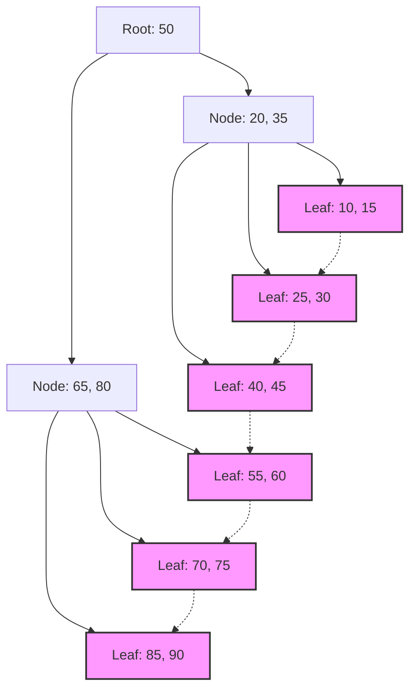

## 1. 資料庫索引與 B-[Tree](https://kenji.blog/zh-tw/p/tree-graph-data-structures-search-dfs-bfs-dijkstra/) 的相遇

在現代系統中，資料庫是應用程式的核心。從數百萬、數億筆記錄中，以毫秒為單位搜尋並輸出目標資料的能力，是資料庫管理系統（DBMS）最重要的功能之一。支撐這種驚人搜尋速度的是 **索引** ，而其背後的資料結構是 **B-Tree** （B木）及其衍生出來的 **B+Tree** （B+木）。

本篇文章將深入探討，為什麼關聯式資料庫不選擇二元搜尋樹或雜湊表，而是選擇 **B-Tree** 家族，並結合磁碟 I/O 的特性、資料結構的理論、數學分析，以及實際的程式碼實作來進行探討。

## 2. 磁碟 I/O 與記憶體階層的障壁

在記憶體上處理資料結構與在磁碟上處理時，最佳解是不同的。資料庫的資料為了持久化，會被儲存到儲存裝置（HDD 或 SSD）中。

### 2.1 區塊（Page）的單位

對儲存裝置的存取，與對記憶體（RAM）的存取相比是壓倒性地緩慢的。因此，作業系統和硬體在讀寫資料時，並不是逐位元組進行，而是以被稱為 **區塊** 或 **頁面** （Page）的固定長度單位（例如 4KB 或 8KB）來進行。

當資料庫搜尋索引時，將頁面從磁碟載入到記憶體的次數（ **磁碟 I/O 次數** ）能否降到最低，是決定搜尋效能的最大因素。

### 2.2 二元搜尋樹（BST）的極限

在記憶體上的搜尋中， **二元搜尋樹** （[Binary Search](https://kenji.blog/zh-tw/p/search-algorithms-linear-binary-hash-table-principles/) Tree: BST）或 **紅黑樹** （Red-Black Tree）等平衡二元搜尋樹，能夠以 $ O(\log N) $ 的時間複雜度進行高速搜尋。然而，如果將其直接應用於磁碟上的資料庫，將會發生嚴重的問題。

二元樹的每個節點最多有 2 個子節點。當元素數量 $ N $ 增加時，樹的高度 $ h $ 會與 $ \log_2 N $ 成正比而變深。例如當 $ N = 1,000,000 $ 時，樹的高度大約是 20。如果假設每個節點都被配置在不同的磁碟頁面上，最壞的情況下將會發生 20 次的隨機磁碟 I/O。這對資料庫來說是致命的延遲。

因此，透過極端地降低樹的「高度」，讓 1 個節點擁有許多鍵值，使得在 1 次磁碟 I/O 中能取得大量資訊的資料結構，就是 **B-Tree** 。

## 3. B-Tree 的資料結構與數學分析

**B-Tree** 是一種所有的葉節點都在相同深度，且每個節點可以擁有多個鍵值與多個子節點的多重樹（N-ary tree）。

### 3.1 B-Tree 的定義與性質

B-Tree 由作為參數的 **最小度數** $ t $ （ $ t \ge 2 $ ）來賦予特徵：

1. 所有的節點最多擁有 $ 2t - 1 $ 個鍵值。
2. 除了根節點以外的所有節點，至少擁有 $ t - 1 $ 個鍵值。
3. 若節點擁有 $ k $ 個鍵值，該節點將擁有 $ k + 1 $ 個子節點。
4. 所有的葉節點都存在於相同的深度（高度 $ h $ ）。
5. 節點內的鍵值以遞增順序排序。

藉由上述特性，只要讓節點的大小與作業系統的磁碟頁面大小（例如：4KB 或 8KB）相符，就可以在 1 次的磁碟提取中，將多個鍵值載入記憶體。

### 3.2 高度與時間複雜度的數學分析

B-Tree 的搜尋、插入、刪除的磁碟 I/O 次數，取決於樹的高度 $ h $ 。
假設鍵值的總數為 $ n $ ，最小度數為 $ t $ ，B-Tree 的高度 $ h $ 的上限可表示如下：

$$
h \le \log_t \frac{n+1}{2}
$$

因為這個對數的底數 $ t $ 非常大（通常為數百到數千），高度 $ h $ 會變得非常小。例如，當 $ t = 100 $ 時，根節點至少有 1 個鍵值，層級 1 至少有 2 個節點，層級 2 至少有 $ 2t = 200 $ 個節點，直到葉節點為止呈指數函數展開。
即使是 10 億筆記錄，樹的高度也能控制在 3 到 4 左右，磁碟 I/O 也只需要 3 到 4 次即可完成。

我們也來分析一下區塊層級的處理時間：

$$
\begin{align*}
T_{search}(N) &= O(h) \\\\
&\le O(\log_t N)
\end{align*}
$$

這在數學上證實了 **B-Tree** 在大規模資料搜尋中極為高效。

## 4. 資料庫的標準：向 B+Tree 的演進

實際在 [RDBMS](https://kenji.blog/zh-tw/p/rdbms-transaction-acid-isolation-level-lock/)（如 MySQL 的 InnoDB 或 PostgreSQL 等）中所使用的，是 B-[Tree](https://kenji.blog/zh-tw/p/tree-graph-data-structures-search-dfs-bfs-dijkstra/) 的改良版 **B+Tree** 。

### 4.1 B-Tree 與 B+Tree 的差異

在 B-Tree 中，內部節點與葉節點兩者都會儲存實際的資料（或指向資料的指標）。另一方面， **B+Tree** 具有以下特徵：

1. **資料全部只儲存在葉節點中** 。內部節點僅保留用於路由的鍵值（索引）。
2. **葉節點之間以連結串列（指標）相互連接** 。這使得循序存取或範圍搜尋（Range Query）變得極為高速。

### 4.2 採用 B+Tree 的原因

由於排除了從內部節點指向實際資料的指標，1 個內部節點（頁面）中可以塞入更多的鍵值。這使得分支數（Fan-out）進一步增加，樹的高度 $ h $ 被壓得更低，進而減少了磁碟 I/O 次數。

此外，在 SQL 中頻繁使用的範圍搜尋（如 `WHERE id BETWEEN 10 AND 100` ）中，B-[Tree](https://kenji.blog/zh-tw/p/tree-graph-data-structures-search-dfs-bfs-dijkstra/) 需要多次遍歷樹狀結構，但如果是 **B+Tree** ，只要找到一次起始點的葉節點後，只需順著葉節點的連結，就能連續讀出資料。


*(圖: B+[Tree](https://kenji.blog/zh-tw/p/tree-graph-data-structures-search-dfs-bfs-dijkstra/) 的結構。葉節點以鏈狀連結)*

## 5. B-Tree 的實作範例（使用 Python 模擬）

在這裡，我們將透過 Python 實作 B-Tree 的基本節點結構，以及搜尋與插入的演算法，來加深理解。

```python
class BTreeNode:
    def __init__(self, t, leaf=False):
        self.t = t          # 最小度數
        self.leaf = leaf    # 是否為葉節點
        self.keys = []      # 鍵值的列表
        self.children = []  # 子節點的列表

class BTree:
    def __init__(self, t):
        self.root = BTreeNode(t, True)
        self.t = t

    def search(self, k, node=None):
        """從 B-Tree 中搜尋鍵值 k"""
        if node is None:
            node = self.root

        i = 0
        while i < len(node.keys) and k > node.keys[i]:
            i += 1

        if i < len(node.keys) and node.keys[i] == k:
            return (node, i)
        
        if node.leaf:
            return None
        
        return self.search(k, node.children[i])

    def insert(self, k):
        """將鍵值 k 插入到 B-Tree"""
        root = self.root
        if len(root.keys) == (2 * self.t) - 1:
            # 當根節點已滿時，建立新的根並進行分割
            temp = BTreeNode(self.t, False)
            self.root = temp
            temp.children.append(root)
            self.split_child(temp, 0)
            self.insert_non_full(temp, k)
        else:
            self.insert_non_full(root, k)

    def split_child(self, x, i):
        """分割已滿的子節點"""
        t = self.t
        y = x.children[i]
        z = BTreeNode(t, y.leaf)
        
        x.children.insert(i + 1, z)
        x.keys.insert(i, y.keys[t - 1])
        
        z.keys = y.keys[t: (2 * t) - 1]
        y.keys = y.keys[0: t - 1]
        
        if not y.leaf:
            z.children = y.children[t: 2 * t]
            y.children = y.children[0: t]

    def insert_non_full(self, x, k):
        """插入到尚未滿的節點"""
        i = len(x.keys) - 1
        if x.leaf:
            x.keys.append(0)
            while i >= 0 and k < x.keys[i]:
                x.keys[i + 1] = x.keys[i]
                i -= 1
            x.keys[i + 1] = k
        else:
            while i >= 0 and k < x.keys[i]:
                i -= 1
            i += 1
            if len(x.children[i].keys) == (2 * self.t) - 1:
                self.split_child(x, i)
                if k > x.keys[i]:
                    i += 1
            self.insert_non_full(x.children[i], k)

# B-Tree 的使用範例
btree = BTree(3) # 最小度數 t=3
keys_to_insert = [10, 20, 5, 6, 12, 30, 7, 17]
for key in keys_to_insert:
    btree.insert(key)

result = btree.search(12)
if result:
    print(f"找到鍵值 12: 節點鍵值 {result[0].keys}")
else:
    print("找不到鍵值")
```

從這個實作中也可以看出，B-[Tree](https://kenji.blog/zh-tw/p/tree-graph-data-structures-search-dfs-bfs-dijkstra/) 的插入會根據需要從下到上地分割（Split）節點，藉此讓樹始終保持完全平衡（Balanced）。這確保了無論資料以何種順序插入，搜尋效能都不會劣化。

## 6. 總結與發展

**B-Tree** 與 **B+Tree** 可以說是為了將基於磁碟系統中的 I/O 成本降至最低而設計的傑作資料結構。透過高分支數帶來的淺層樹狀結構、循序存取的最佳化等，實體裝置的特性與數學演算法完美地結合在一起。

近年來，隨著 SSD 的普及，為了抑制寫入放大（Write Amplification），也出現了如 **LSM-Tree** （Log-Structured Merge-Tree）等新資料結構。然而，在讀取效能與範圍搜尋的平衡，以及交易處理的穩定性上， **B+Tree** 依然穩坐關聯式資料庫中絕對王者的寶座。

理解資料庫內部正在發生什麼事，與查詢的最佳化以及適當的索引設計有著直接的關係。請務必以本文所解說的理論為基礎，試著觀察日常資料庫操作中索引的行為吧。
