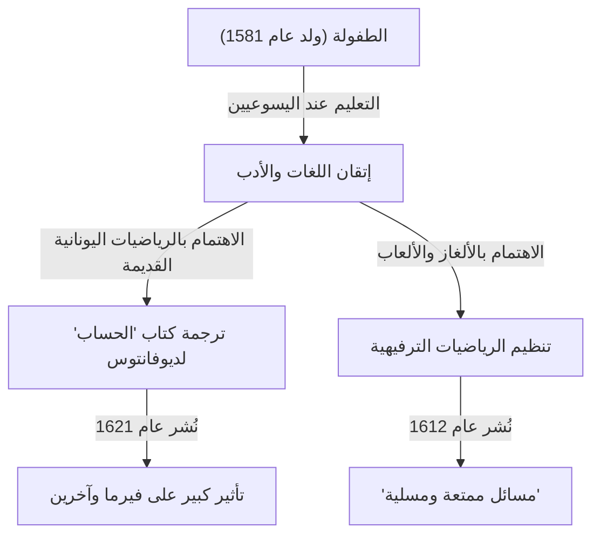

في تاريخ الرياضيات، هناك شخصيات لعبت أدوارًا بالغة الأهمية، رغم أنهم أحيانًا يقبعون في ظل اكتشافات عظيمة لاحقة. عالم الرياضيات الفرنسي في القرن السابع عشر **كلود جاسبار باشيه دي ميزيرياك ([Claude Gaspard Bachet](https://kenji.blog/ar/p/bachet/) de Méziriac, 1581–1638)** هو أحد هؤلاء. يشتهر بتأثيره على [بيير دي فيرما](https://kenji.blog/ar/p/fermat/)، لكن إنجازاته الخاصة كانت واسعة ومتنوعة للغاية.

في هذا المقال، سنتعمق في حياة باشيه وإنجازاته الرياضية الرئيسية.

## حياة باشيه: من نبيل إلى باحث

وُلد باشيه في 9 أكتوبر 1581 في بورغ-أون-بريس (Bourg-en-Bresse) في وسط شرق فرنسا. كانت عائلته من النبلاء الأثرياء، وكان محظوظًا بتلقي تعليم ممتاز منذ صغره.

بعد أن فقد والديه في سن مبكرة، تلقى تعليمه على يد اليسوعيين، ودرس في ليون وميلانو وغيرها. فكر لفترة وجيزة في الانضمام إلى الرهبنة اليسوعية، لكنه عاد لاحقًا إلى الحياة العلمانية وكرس نفسه للبحث الأكاديمي. لم يتفوق باشيه في الرياضيات فحسب، بل أيضًا في الأدب واللغويات والشعر، واكتسب شهرة كمترجم للكلاسيكيات اللاتينية واليونانية. في عام 1635، تم انتخابه أيضًا كأحد الأعضاء الأوائل في الأكاديمية الفرنسية (Académie Française) المرموقة.

## الترجمة اللاتينية لكتاب "الحساب" ل[ديوفانتوس](https://kenji.blog/ar/p/diophantus/)

واحدة من أشهر إنجازات باشيه هي ترجمته لكتاب "الحساب (Arithmetica)" لعالم الرياضيات اليوناني القديم [ديوفانتوس](https://kenji.blog/ar/p/diophantus/) ([Diophantus](https://kenji.blog/ar/p/diophantus/)) إلى اللاتينية، وإضافة تعليقات عليه، ونشره في عام 1621.

أصبح هذا الكتاب المترجم نصًا قياسيًا لعلماء الرياضيات الأوروبيين في ذلك الوقت لتعلم الجبر القديم ونظرية الأعداد. من أشهر الحكايات أن [بيير دي فيرما](https://kenji.blog/ar/p/fermat/) (Pierre de Fermat) كتب "[مبرهنة فيرما الأخيرة](https://kenji.blog/ar/p/fermats-last-theorem/)" الشهيرة في هامش نسخته من كتاب باشيه.

لم يكتفِ باشيه بالترجمة فحسب، بل أضاف تعليقاته العظيمة وتعميماته الخاصة على مسائل [ديوفانتوس](https://kenji.blog/ar/p/diophantus/). لولا بصيرته الرياضية، لكان تطور نظرية الأعداد في القرن السابع عشر أبطأ بكثير.

## معادلة باشيه ([Bachet](https://kenji.blog/ar/p/bachet/)'s Equation)

في نظرية الأعداد، درس باشيه شكلًا محددًا من المعادلات الديوفانتية يُعرف الآن باسم **معادلة باشيه**. تمثل هذه المعادلة منحنى تكعيبي (نوع من المنحنيات الإهليلجية) بالشكل التالي:

$$
y^2 = x^3 - c
$$

(أو تُكتب أحيانًا $y^2 = x^3 + k$، حيث $c$ أو $k$ هي ثوابت.)

فكر باشيه في طرق هندسية وجبرية (تُعادل ما نطلق عليه اليوم جمع النقاط على المنحنيات الإهليلجية، وتحديدًا طريقة المماس للمضاعفة) لاشتقاق حلول نسبية جديدة عند إعطاء حل نسبي معين. أظهر هذا طريقة لتوليد عدد لا نهائي من الحلول للمعادلة الديوفانتية، وأصبح أحد أسس نظرية المنحنيات الإهليلجية اللاحقة.

## أبو الرياضيات الترفيهية: "مسائل ممتعة ومسلية"

في عام 1612، نشر باشيه كتابًا بعنوان "مسائل ممتعة ومسلية تُصنع بالأعداد (Problèmes plaisans et délectables, qui se font par les nombres)". يُعتبر هذا أول كتاب متخصص في "الرياضيات الترفيهية (Recreational Mathematics)" يُنشر في أوروبا.

احتوى هذا الكتاب على العديد من الألغاز الرياضية التي لا تزال شائعة اليوم، مثل مسألة عبور النهر، مسألة يوسيفوس، طرق بناء المربعات السحرية، و "مسألة أوزان باشيه" الشهيرة.

### مسألة أوزان باشيه

من بين المسائل الأكثر شهرة في كتابه هي التالية:

> **المسألة:** ما هو الحد الأدنى لعدد الأوزان اللازمة لوزن أي عدد صحيح من الأرطال من 1 إلى 40 رطلاً باستخدام ميزان؟ وما هو وزن كل منها؟ (بافتراض أنه يمكن وضع الأوزان في أي من كفتي الميزان.)

يتم تحسين حل هذه المسألة باستخدام قوى العدد 3. على وجه التحديد، إذا كان لديك 4 أوزان تزن $1, 3, 9, 27$ رطلاً، يمكنك قياس جميع الأوزان من $1$ إلى $40$.

هذا يعادل رياضيًا تمثيل الأعداد في "نظام العد الثلاثي المتوازن (Balanced Ternary)". أي عدد صحيح $N$ يمكن التعبير عنه باستخدام المعاملات $-1, 0, 1$ كما يلي:

$$
N = a_0 3^0 + a_1 3^1 + a_2 3^2 + a_3 3^3 \quad (a_i \in \{-1, 0, 1\})
$$

هنا، $a_i = 1$ تعني وضع الوزن في الكفة المعاكسة للجسم المراد وزنه، $a_i = -1$ تعني وضعه في نفس الكفة، و $a_i = 0$ تعني عدم استخدام هذا الوزن. عبرت هذه المسألة لباشيه بشكل رائع عن النظرية الأساسية لأنظمة العد من خلال اللعب.

## متطابقة باشيه (متطابقة بيزو)

علاوة على ذلك، أثبت باشيه النظرية المعروفة في الرياضيات الحديثة باسم "متطابقة بيزو (Bézout's identity)" للأعداد الصحيحة قبل أكثر من 150 عامًا من إتيان بيزو.

أثبت باشيه أنه بالنسبة لأي عددين صحيحين أوليين فيما بينهما $a$ و $b$، فإنه توجد دائمًا أعداد صحيحة $x, y$ تحقق ما يلي:

$$
ax + by = 1
$$

يمكن حساب $x, y$ تحديدًا عن طريق توسيع [خوارزمية إقليدس](https://kenji.blog/ar/p/euclidean-algorithm/) (خوارزمية إقليدس الموسعة)، وقد أصبحت نظرية أساسية لا غنى عنها في التشفير الحديث (مثل تشفير [RSA](https://kenji.blog/ar/p/modern-cryptography-public-key-hash-signature/)). في السياقات التي تقدر الدقة التاريخية، يطلق عليها أحيانًا **مبرهنة باشيه**.

## الخلاصة

لم يكن كلود جاسبار باشيه مجرد "شخصية خلف الكواليس" ل[مبرهنة فيرما الأخيرة](https://kenji.blog/ar/p/fermats-last-theorem/). كان رائدًا عظيمًا فتح أبواب الرياضيات الحديثة من خلال إحياء الحكمة القديمة أثناء دراسة معادلاته الخاصة وتنظيم الرياضيات الترفيهية. تستمر تعليقاته على كتاب "الحساب" وألغازه الرياضية في إلهام محبي الرياضيات حتى اليوم، بعد قرون من وفاته.
