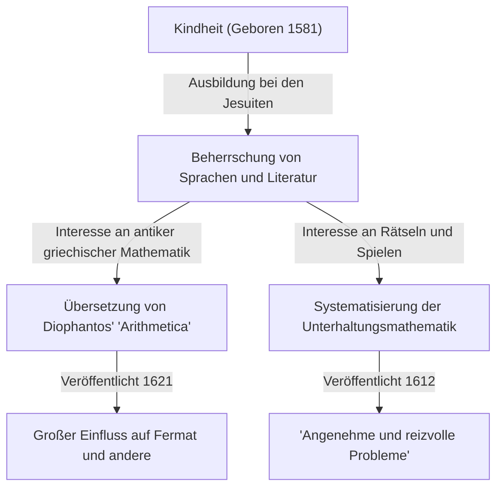

In der Geschichte der Mathematik gibt es Persönlichkeiten, die eine entscheidende Rolle gespielt haben, auch wenn sie manchmal im Schatten späterer großer Entdeckungen stehen. Der französische Mathematiker des 17. Jahrhunderts, **[Claude Gaspard Bachet](https://kenji.blog/de/p/bachet/) de Méziriac (1581–1638)**, ist einer von ihnen. Er ist berühmt für seinen Einfluss auf [Pierre de Fermat](https://kenji.blog/de/p/fermat/), aber auch seine eigenen Errungenschaften waren äußerst vielfältig und bedeutend.

In diesem Artikel werden wir das Leben von [Bachet](https://kenji.blog/de/p/bachet/) und seine wichtigsten mathematischen Errungenschaften näher betrachten.

## [Bachet](https://kenji.blog/de/p/bachet/)s Leben: Vom Adligen zum Gelehrten

[Bachet](https://kenji.blog/de/p/bachet/) wurde am 9. Oktober 1581 in Bourg-en-Bresse im mittleren Osten Frankreichs geboren. Seine Familie gehörte dem wohlhabenden Adel an, und er hatte das Glück, von klein auf eine hervorragende Ausbildung zu erhalten.

Nachdem er seine Eltern früh verloren hatte, wurde er von den Jesuiten ausgebildet und studierte unter anderem in Lyon und Mailand. Er erwog kurzzeitig, dem Jesuitenorden beizutreten, um ein Leben als Mönch zu führen, kehrte aber später in das säkulare Leben zurück und widmete sich der akademischen Forschung. [Bachet](https://kenji.blog/de/p/bachet/) zeichnete sich nicht nur in der Mathematik aus, sondern auch in Literatur, Linguistik und Poesie und erlangte als Übersetzer von lateinischen und griechischen Klassikern Berühmtheit. Im Jahr 1635 wurde er zudem als eines der ersten Mitglieder in die prestigeträchtige Académie Française gewählt.

## Die lateinische Übersetzung von Diophantos' "Arithmetica"

Eine der bekanntesten Errungenschaften von [Bachet](https://kenji.blog/de/p/bachet/) ist seine Übersetzung der "Arithmetica" des antiken griechischen Mathematikers Diophantos ins Lateinische, die er mit Kommentaren versah und 1621 veröffentlichte.

Dieses übersetzte Buch wurde für die europäischen Mathematiker jener Zeit zum Standardwerk, um antike Algebra und Zahlentheorie zu studieren. Eine der berühmtesten Anekdoten besagt, dass [Pierre de Fermat](https://kenji.blog/de/p/fermat/) seinen berühmten "Großen [Fermat](https://kenji.blog/de/p/fermat/)schen Satz" an den Rand seiner Ausgabe dieses [Bachet](https://kenji.blog/de/p/bachet/)-Buches schrieb.

[Bachet](https://kenji.blog/de/p/bachet/) begnügte sich nicht mit einer bloßen Übersetzung, sondern fügte den Problemen von Diophantos seine eigenen hervorragenden Kommentare und Verallgemeinerungen hinzu. Ohne seine mathematischen Einsichten wäre die Entwicklung der Zahlentheorie im 17. Jahrhundert vielleicht viel langsamer vorangegangen.

## [Bachet](https://kenji.blog/de/p/bachet/)-Gleichung

In der Zahlentheorie untersuchte [Bachet](https://kenji.blog/de/p/bachet/) eine bestimmte Form der diophantischen Gleichung, die heute als **[Bachet](https://kenji.blog/de/p/bachet/)-Gleichung** bekannt ist. Diese Gleichung stellt eine kubische Kurve (eine Art elliptische Kurve) in der folgenden Form dar:

$$
y^2 = x^3 - c
$$

(Manchmal wird sie auch als $y^2 = x^3 + k$ geschrieben, wobei $c$ oder $k$ Konstanten sind.)

[Bachet](https://kenji.blog/de/p/bachet/) betrachtete geometrische und algebraische Methoden (die der heutigen Addition von Punkten auf elliptischen Kurven, insbesondere der Tangentenmethode zur Verdopplung, entsprechen), um aus einer gegebenen rationalen Lösung neue rationale Lösungen abzuleiten. Dies zeigte einen Weg auf, unendlich viele Lösungen für diophantische Gleichungen zu generieren, und wurde zu einer der Grundlagen der späteren Theorie der elliptischen Kurven.

## Vater der Unterhaltungsmathematik: "Angenehme und reizvolle Probleme"

Im Jahr 1612 veröffentlichte [Bachet](https://kenji.blog/de/p/bachet/) ein Buch mit dem Titel "Problèmes plaisans et délectables, qui se font par les nombres" (Angenehme und reizvolle Probleme, die mit Zahlen gemacht werden). Dies gilt als das erste in Europa veröffentlichte Fachbuch über "Unterhaltungsmathematik" (Recreational Mathematics).

Dieses Buch enthielt viele mathematische Rätsel, die bis heute populär sind, wie das Flussüberquerungsrätsel, das Josephus-Problem, Methoden zur Erstellung magischer Quadrate und das berühmte "[Bachet](https://kenji.blog/de/p/bachet/)sche Gewichtsproblem".

### Das [Bachet](https://kenji.blog/de/p/bachet/)sche Gewichtsproblem

Eines der berühmtesten Probleme in seinem Buch ist das folgende:

> **Problem:** Was ist die Mindestanzahl von Gewichten, die benötigt wird, um jede ganzzahlige Pfundzahl von 1 bis 40 auf einer Balkenwaage abzuwiegen? Und was ist das Gewicht jedes Einzelnen? (Vorausgesetzt, die Gewichte dürfen in jede der beiden Waagschalen gelegt werden.)

Die Lösung dieses Problems wird durch die Verwendung von Potenzen von 3 optimiert. Genauer gesagt, wenn man 4 Gewichte zu $1, 3, 9, 27$ Pfund hat, kann man jedes Gewicht von $1$ bis $40$ abwiegen.

Dies ist mathematisch äquivalent zur Darstellung von Zahlen im balancierten Ternärsystem (Balanced Ternary). Jede ganze Zahl $N$ kann mit den Koeffizienten $-1, 0, 1$ wie folgt ausgedrückt werden:

$$
N = a_0 3^0 + a_1 3^1 + a_2 3^2 + a_3 3^3 \quad (a_i \in \{-1, 0, 1\})
$$

Hier bedeutet $a_i = 1$, dass das Gewicht in die dem Wiegegut gegenüberliegende Schale gelegt wird, $a_i = -1$ bedeutet, dass es in dieselbe Schale gelegt wird, und $a_i = 0$ bedeutet, dass dieses Gewicht nicht verwendet wird. [Bachet](https://kenji.blog/de/p/bachet/)s Problem war ein brillanter Ausdruck der grundlegenden Theorie der Zahlensysteme durch ein Spiel.

## [Bachet](https://kenji.blog/de/p/bachet/)s Identität (Bézouts Lemma)

Darüber hinaus bewies [Bachet](https://kenji.blog/de/p/bachet/) das Theorem, das in der modernen Mathematik als "Bézouts Lemma" (oder Identität) bekannt ist, für ganze Zahlen mehr als 150 Jahre vor Étienne Bézout.

[Bachet](https://kenji.blog/de/p/bachet/) zeigte, dass für zwei beliebige teilerfremde ganze Zahlen $a$ und $b$ immer ganze Zahlen $x, y$ existieren, die Folgendes erfüllen:

$$
ax + by = 1
$$

$x$ und $y$ können durch den erweiterten euklidischen Algorithmus konkret berechnet werden, der zu einem unverzichtbaren Grundlagen-Theorem in der modernen Kryptographie (wie RSA) geworden ist. In Kontexten, die Wert auf historische Genauigkeit legen, wird dies manchmal als **Satz von [Bachet](https://kenji.blog/de/p/bachet/)** bezeichnet.

## Fazit

[Claude Gaspard Bachet](https://kenji.blog/de/p/bachet/) war nicht nur eine "Hintergrundfigur" für [Fermat](https://kenji.blog/de/p/fermat/)s Letzten Satz. Er war ein großer Pionier, der durch die Wiederbelebung antiker Weisheiten, während er seine eigenen Gleichungen untersuchte und die Unterhaltungsmathematik systematisierte, die Türen zur modernen Mathematik öffnete. Seine Kommentare zur "Arithmetica" und seine mathematischen Rätsel inspirieren Mathematiker auch heute noch, Jahrhunderte nach seinem Tod.
