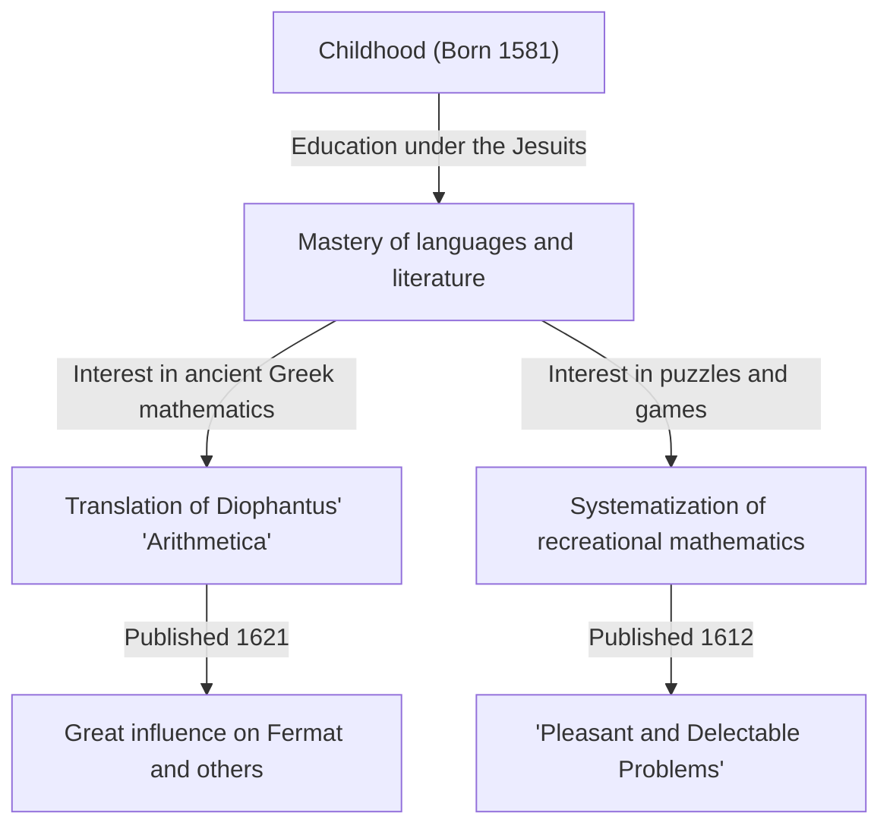

In the history of mathematics, there are figures who played crucial roles, even if they sometimes remain hidden in the shadow of later great discoveries. The 17th-century French mathematician **[Claude Gaspard Bachet](https://kenji.blog/en/p/bachet/) de Méziriac (1581–1638)** is one of them. He is famous for his influence on [Pierre de Fermat](https://kenji.blog/en/p/fermat/), but his own achievements were also vast and diverse.

In this article, we will delve into the life of [Bachet](https://kenji.blog/en/p/bachet/) and his major mathematical accomplishments.

## [Bachet](https://kenji.blog/en/p/bachet/)'s Life: From Nobleman to Scholar

[Bachet](https://kenji.blog/en/p/bachet/) was born on October 9, 1581, in Bourg-en-Bresse in central-eastern France. His family belonged to the wealthy nobility, and he was fortunate to receive an excellent education from an early age.

After losing his parents early on, he was educated by the Jesuits, studying in Lyon, Milan, and elsewhere. He briefly considered joining the Jesuit order to live as a monk, but later returned to secular life and devoted himself to academic research. [Bachet](https://kenji.blog/en/p/bachet/) excelled not only in mathematics but also in literature, linguistics, and poetry, gaining fame as a translator of Latin and Greek classics. In 1635, he was also elected as one of the early members of the prestigious Académie Française.

## The Latin Translation of [Diophantus](https://kenji.blog/en/p/diophantus/)' "Arithmetica"

One of [Bachet](https://kenji.blog/en/p/bachet/)'s most well-known achievements is his translation of the "Arithmetica" by the ancient Greek mathematician [Diophantus](https://kenji.blog/en/p/diophantus/) into Latin, adding commentary, and publishing it in 1621.

This translated book became the standard text for European mathematicians of the time to study ancient algebra and number theory. One of the most famous anecdotes is that [Pierre de Fermat](https://kenji.blog/en/p/fermat/) wrote his famous "Fermat's Last Theorem" in the margin of his copy of this [Bachet](https://kenji.blog/en/p/bachet/) edition.

[Bachet](https://kenji.blog/en/p/bachet/) did not stop at mere translation; he added his own excellent commentary and generalizations to [Diophantus](https://kenji.blog/en/p/diophantus/)' problems. Without his mathematical insights, the development of number theory in the 17th century might have been much slower.

## [Bachet](https://kenji.blog/en/p/bachet/)'s Equation

In number theory, [Bachet](https://kenji.blog/en/p/bachet/) studied a specific form of Diophantine equation now known as **[Bachet](https://kenji.blog/en/p/bachet/)'s equation**. This represents a cubic curve (a type of elliptic curve) in the following form:

$$
y^2 = x^3 - c
$$

(Or it is sometimes written as $y^2 = x^3 + k$, where $c$ or $k$ are constants.)

[Bachet](https://kenji.blog/en/p/bachet/) considered geometric and algebraic methods (equivalent to what is now called point addition on elliptic curves, specifically the tangent method for doubling) to derive new rational solutions when a specific rational solution is given. This showed a way to generate infinitely many solutions to the Diophantine equation and became one of the foundations for the later theory of elliptic curves.

## Father of Recreational Mathematics: "Pleasant and Delectable Problems"

In 1612, [Bachet](https://kenji.blog/en/p/bachet/) published a book titled "Problèmes plaisans et délectables, qui se font par les nombres" (Pleasant and delectable problems, which are done by numbers). This is considered the first specialized book on "Recreational Mathematics" published in Europe.

This book contained many mathematical puzzles that remain popular today, such as the river crossing puzzle, the Josephus problem, methods for making magic squares, and the famous "[Bachet](https://kenji.blog/en/p/bachet/)'s weights problem."

### [Bachet](https://kenji.blog/en/p/bachet/)'s Weights Problem

One of the most famous problems in his book is the following:

> **Problem:** What is the minimum number of weights required to weigh any integer number of pounds from 1 to 40 on a balance scale? And what is the weight of each? (Assuming the weights can be placed on either of the two pans of the scale.)

The solution to this problem is optimized by using powers of 3. Specifically, if you have 4 weights weighing $1, 3, 9, 27$ pounds, you can measure every weight from $1$ to $40$.

This is mathematically equivalent to expressing numbers in "Balanced Ternary." Any integer $N$ can be expressed using the coefficients $-1, 0, 1$ as follows:

$$
N = a_0 3^0 + a_1 3^1 + a_2 3^2 + a_3 3^3 \quad (a_i \in \{-1, 0, 1\})
$$

Here, $a_i = 1$ means placing the weight on the pan opposite to the object being weighed, $a_i = -1$ means placing it on the same pan, and $a_i = 0$ means not using that weight. [Bachet](https://kenji.blog/en/p/bachet/)'s problem was a brilliant expression of the fundamental theory of numeral systems through play.

## [Bachet](https://kenji.blog/en/p/bachet/)'s Identity (Bézout's Identity)

Furthermore, [Bachet](https://kenji.blog/en/p/bachet/) proved the theorem known in modern mathematics as "Bézout's identity" for integers more than 150 years before Étienne Bézout.

[Bachet](https://kenji.blog/en/p/bachet/) showed that for any two coprime integers $a$ and $b$, there always exist integers $x, y$ that satisfy the following:

$$
ax + by = 1
$$

$x$ and $y$ can be concretely calculated by expanding the [Euclide](https://kenji.blog/en/p/euclid/)an algorithm (the extended Euclidean algorithm), which has become an indispensable fundamental theorem in modern cryptography (such as RSA). In contexts that value historical accuracy, this is sometimes called **[Bachet](https://kenji.blog/en/p/bachet/)'s theorem**.

## Conclusion

[Claude Gaspard Bachet](https://kenji.blog/en/p/bachet/) was not just a "behind-the-scenes figure" for [Fermat's Last Theorem](https://kenji.blog/en/p/fermats-last-theorem/). He was a great pioneer who opened the doors to modern mathematics by reviving ancient wisdom while exploring his own equations and systematizing recreational mathematics. His commentary on the "Arithmetica" and mathematical puzzles continue to inspire math lovers today, centuries after his passing.
