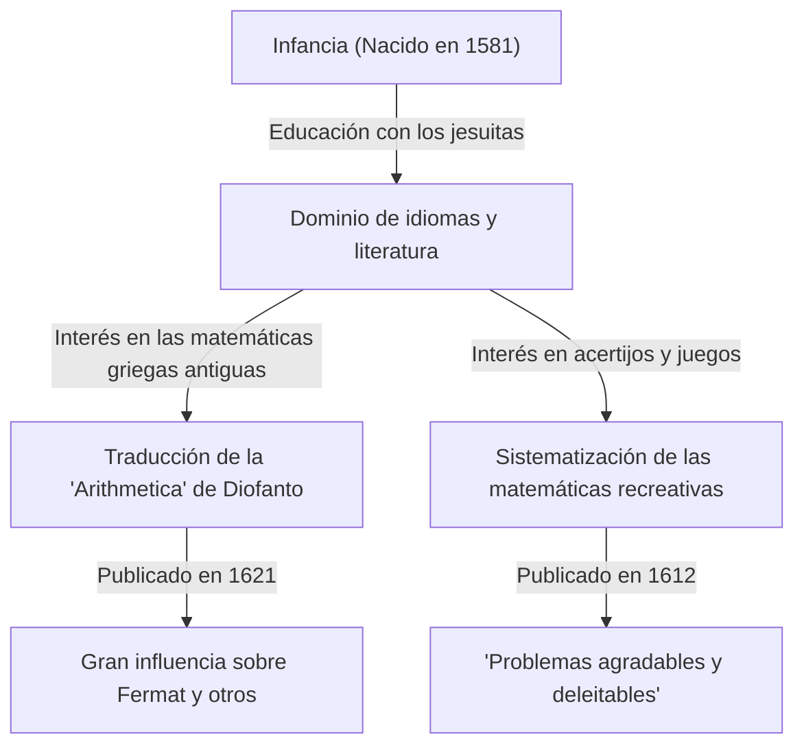

En la historia de las matemáticas, hay figuras que desempeñaron papeles cruciales, aunque a veces permanezcan ocultas a la sombra de grandes descubrimientos posteriores. El matemático francés del siglo XVII **[Claude Gaspard Bachet](https://kenji.blog/es/p/bachet/) de Méziriac (1581–1638)** es uno de ellos. Es famoso por su influencia sobre [Pierre de Fermat](https://kenji.blog/es/p/fermat/), pero sus propios logros también fueron vastos y diversos.

En este artículo, profundizaremos en la vida de [Bachet](https://kenji.blog/es/p/bachet/) y sus principales logros matemáticos.

## La vida de [Bachet](https://kenji.blog/es/p/bachet/): De noble a erudito

[Bachet](https://kenji.blog/es/p/bachet/) nació el 9 de octubre de 1581 en Bourg-en-Bresse, en el centro-este de Francia. Su familia pertenecía a la nobleza adinerada y tuvo la suerte de recibir una excelente educación desde muy joven.

Tras perder a sus padres a una edad temprana, fue educado por los jesuitas, estudiando en Lyon, Milán y otros lugares. Consideró brevemente unirse a la orden jesuita para vivir como monje, pero más tarde regresó a la vida secular y se dedicó a la investigación académica. [Bachet](https://kenji.blog/es/p/bachet/) no solo se destacó en matemáticas, sino también en literatura, lingüística y poesía, ganando fama como traductor de clásicos latinos y griegos. En 1635, también fue elegido como uno de los primeros miembros de la prestigiosa Académie Française.

## La traducción latina de la "Arithmetica" de [Diofanto](https://kenji.blog/es/p/diophantus/)

Uno de los logros más conocidos de [Bachet](https://kenji.blog/es/p/bachet/) es su traducción de la "Arithmetica" del antiguo matemático griego [Diofanto](https://kenji.blog/es/p/diophantus/) al latín, agregando comentarios y publicándola en 1621.

Este libro traducido se convirtió en el texto estándar para que los matemáticos europeos de la época estudiaran el álgebra antigua y la teoría de números. Una de las anécdotas más famosas es que [Pierre de Fermat](https://kenji.blog/es/p/fermat/) escribió su famoso "Último Teorema de [Fermat](https://kenji.blog/es/p/fermat/)" en el margen de su copia de esta edición de [Bachet](https://kenji.blog/es/p/bachet/).

[Bachet](https://kenji.blog/es/p/bachet/) no se limitó a una mera traducción; añadió sus propios y excelentes comentarios y generalizaciones a los problemas de [Diofanto](https://kenji.blog/es/p/diophantus/). Sin sus conocimientos matemáticos, el desarrollo de la teoría de números en el siglo XVII podría haber sido mucho más lento.

## La ecuación de [Bachet](https://kenji.blog/es/p/bachet/)

En la teoría de números, [Bachet](https://kenji.blog/es/p/bachet/) estudió una forma específica de ecuación diofántica que ahora se conoce como la **ecuación de [Bachet](https://kenji.blog/es/p/bachet/)**. Esto representa una curva cúbica (un tipo de curva elíptica) de la siguiente forma:

$$
y^2 = x^3 - c
$$

(O a veces se escribe como $y^2 = x^3 + k$, donde $c$ o $k$ son constantes).

[Bachet](https://kenji.blog/es/p/bachet/) consideró métodos geométricos y algebraicos (equivalentes a lo que hoy se llama adición de puntos en curvas elípticas, específicamente el método de la tangente para la duplicación) para derivar nuevas soluciones racionales cuando se da una solución racional específica. Esto mostró una manera de generar infinitas soluciones a la ecuación diofántica y se convirtió en una de las bases de la teoría posterior de las curvas elípticas.

## Padre de las Matemáticas Recreativas: "Problemas agradables y deleitables"

En 1612, [Bachet](https://kenji.blog/es/p/bachet/) publicó un libro titulado "Problèmes plaisans et délectables, qui se font par les nombres" (Problemas agradables y deleitables que se hacen con números). Este se considera el primer libro especializado en "Matemáticas Recreativas" publicado en Europa.

Este libro contenía muchos acertijos matemáticos que siguen siendo populares hoy en día, como el acertijo de cruzar el río, el problema de Josefo, métodos para hacer cuadrados mágicos y el famoso "problema de las pesas de [Bachet](https://kenji.blog/es/p/bachet/)".

### El problema de las pesas de [Bachet](https://kenji.blog/es/p/bachet/)

Uno de los problemas más famosos de su libro es el siguiente:

> **Problema:** ¿Cuál es el número mínimo de pesas requerido para pesar cualquier número entero de libras del 1 al 40 en una balanza? ¿Y cuál es el peso de cada una? (Suponiendo que las pesas se pueden colocar en cualquiera de los dos platillos de la balanza).

La solución a este problema se optimiza usando potencias de 3. Específicamente, si tiene 4 pesas de $1, 3, 9, 27$ libras, puede medir todos los pesos de $1$ a $40$.

Esto es matemáticamente equivalente a expresar números en el "Sistema ternario equilibrado" (Balanced Ternary). Cualquier número entero $N$ se puede expresar usando los coeficientes $-1, 0, 1$ de la siguiente manera:

$$
N = a_0 3^0 + a_1 3^1 + a_2 3^2 + a_3 3^3 \quad (a_i \in \{-1, 0, 1\})
$$

Aquí, $a_i = 1$ significa colocar la pesa en el platillo opuesto al objeto que se está pesando, $a_i = -1$ significa colocarla en el mismo platillo, y $a_i = 0$ significa no usar esa pesa. El problema de [Bachet](https://kenji.blog/es/p/bachet/) fue una expresión brillante de la teoría fundamental de los sistemas de numeración a través del juego.

## La identidad de [Bachet](https://kenji.blog/es/p/bachet/) (Identidad de Bézout)

Además, [Bachet](https://kenji.blog/es/p/bachet/) demostró el teorema conocido en las matemáticas modernas como "identidad de Bézout" para números enteros más de 150 años antes que Étienne Bézout.

[Bachet](https://kenji.blog/es/p/bachet/) demostró que para cualquier par de números enteros coprimos $a$ y $b$, siempre existen números enteros $x, y$ que satisfacen lo siguiente:

$$
ax + by = 1
$$

$x$ y $y$ se pueden calcular de manera concreta expandiendo el algoritmo de [Euclides](https://kenji.blog/es/p/euclid/) (el algoritmo de [Euclides](https://kenji.blog/es/p/euclid/) extendido), que se ha convertido en un teorema fundamental indispensable en la criptografía moderna (como [RSA](https://kenji.blog/es/p/modern-cryptography-public-key-hash-signature/)). En contextos que valoran la precisión histórica, esto a veces se llama el **teorema de [Bachet](https://kenji.blog/es/p/bachet/)**.

## Conclusión

[Claude Gaspard Bachet](https://kenji.blog/es/p/bachet/) no fue solo una "figura entre bastidores" para el Último Teorema de [Fermat](https://kenji.blog/es/p/fermat/). Fue un gran pionero que abrió las puertas a las matemáticas modernas al revivir la sabiduría antigua mientras exploraba sus propias ecuaciones y sistematizaba las matemáticas recreativas. Sus comentarios sobre la "Arithmetica" y sus acertijos matemáticos continúan inspirando a los amantes de las matemáticas de hoy, siglos después de su fallecimiento.
