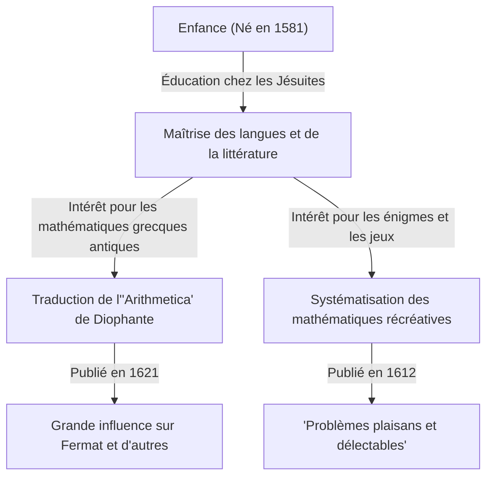

Dans l'histoire des mathématiques, certaines figures ont joué des rôles cruciaux, même si elles restent parfois dans l'ombre de grandes découvertes ultérieures. Le mathématicien français du XVIIe siècle **[Claude Gaspard Bachet](https://kenji.blog/p/bachet/) de Méziriac (1581–1638)** est l'une d'entre elles. Il est célèbre pour son influence sur [Pierre de Fermat](https://kenji.blog/p/fermat/), mais ses propres réalisations furent également vastes et diverses.

Dans cet article, nous allons plonger dans la vie de Bachet et ses accomplissements mathématiques majeurs.

## La vie de Bachet : De noble à érudit

Bachet est né le 9 octobre 1581 à Bourg-en-Bresse, dans le centre-est de la France. Sa famille appartenait à la riche noblesse et il eut la chance de recevoir une excellente éducation dès son plus jeune âge.

Ayant perdu ses parents très tôt, il fut éduqué par les Jésuites, étudiant à Lyon, Milan et ailleurs. Il envisagea brièvement de rejoindre l'ordre des Jésuites pour vivre comme moine, mais retourna plus tard à la vie laïque et se consacra à la recherche académique. Bachet excellait non seulement en mathématiques, mais aussi en littérature, linguistique et poésie, acquérant une renommée en tant que traducteur de classiques latins et grecs. En 1635, il fut également élu parmi les premiers membres de la prestigieuse Académie Française.

## La traduction latine de l'"Arithmetica" de [Diophante](https://kenji.blog/p/diophantus/)

L'une des réalisations les plus connues de Bachet est sa traduction de l'"Arithmetica" du mathématicien grec antique [Diophante](https://kenji.blog/p/diophantus/) en latin, en y ajoutant des commentaires, et sa publication en 1621.

Ce livre traduit devint le texte de référence pour les mathématiciens européens de l'époque souhaitant étudier l'algèbre antique et la théorie des nombres. L'une des anecdotes les plus célèbres est que [Pierre de Fermat](https://kenji.blog/p/fermat/) a écrit son fameux "Dernier Théorème de Fermat" dans la marge de son exemplaire de cette édition de Bachet.

Bachet ne s'est pas arrêté à une simple traduction ; il a ajouté ses propres et excellents commentaires et généralisations aux problèmes de [Diophante](https://kenji.blog/p/diophantus/). Sans ses intuitions mathématiques, le développement de la théorie des nombres au XVIIe siècle aurait peut-être été beaucoup plus lent.

## L'équation de Bachet

En théorie des nombres, Bachet a étudié une forme spécifique d'équation diophantienne aujourd'hui connue sous le nom d'**équation de Bachet**. Cela représente une courbe cubique (un type de courbe elliptique) sous la forme suivante :

$$
y^2 = x^3 - c
$$

(Ou parfois écrite $y^2 = x^3 + k$, où $c$ ou $k$ sont des constantes.)

Bachet a considéré des méthodes géométriques et algébriques (équivalentes à ce qu'on appelle aujourd'hui l'addition de points sur les courbes elliptiques, en particulier la méthode de la tangente pour la duplication) pour dériver de nouvelles solutions rationnelles lorsqu'une solution rationnelle spécifique est donnée. Cela a montré un moyen de générer une infinité de solutions à l'équation diophantienne et est devenu l'un des fondements de la théorie ultérieure des courbes elliptiques.

## Père des mathématiques récréatives : "Problèmes plaisans et délectables"

En 1612, Bachet a publié un livre intitulé "Problèmes plaisans et délectables, qui se font par les nombres". Il est considéré comme le premier livre spécialisé sur les "Mathématiques Récréatives" publié en Europe.

Ce livre contenait de nombreuses énigmes mathématiques qui restent populaires aujourd'hui, telles que l'énigme de la traversée de la rivière, le problème de Josèphe, les méthodes de création de carrés magiques et le célèbre "problème des poids de Bachet".

### Le problème des poids de Bachet

L'un des problèmes les plus célèbres de son livre est le suivant :

> **Problème :** Quel est le nombre minimum de poids requis pour peser n'importe quel nombre entier de livres de 1 à 40 sur une balance à fléau ? Et quel est le poids de chacun ? (En supposant que les poids peuvent être placés sur l'un ou l'autre des deux plateaux de la balance.)

La solution à ce problème est optimisée en utilisant les puissances de 3. Plus précisément, si vous avez 4 poids de $1, 3, 9, 27$ livres, vous pouvez mesurer tous les poids de $1$ à $40$.

Ceci est mathématiquement équivalent à l'expression des nombres en "Base 3 balancée" (Balanced Ternary). Tout entier $N$ peut être exprimé en utilisant les coefficients $-1, 0, 1$ comme suit :

$$
N = a_0 3^0 + a_1 3^1 + a_2 3^2 + a_3 3^3 \quad (a_i \in \{-1, 0, 1\})
$$

Ici, $a_i = 1$ signifie placer le poids sur le plateau opposé à l'objet pesé, $a_i = -1$ signifie le placer sur le même plateau, et $a_i = 0$ signifie ne pas utiliser ce poids. Le problème de Bachet était une brillante expression de la théorie fondamentale des systèmes de numération à travers le jeu.

## L'identité de Bachet (Identité de Bézout)

De plus, Bachet a prouvé le théorème connu dans les mathématiques modernes sous le nom d'"identité de Bézout" pour les entiers plus de 150 ans avant Étienne Bézout.

Bachet a montré que pour deux entiers premiers entre eux $a$ et $b$, il existe toujours des entiers $x, y$ qui satisfont ce qui suit :

$$
ax + by = 1
$$

$x$ et $y$ peuvent être concrètement calculés en développant l'algorithme d'[Euclide](https://kenji.blog/p/euclid/) (l'algorithme d'[Euclide](https://kenji.blog/p/euclid/) étendu), qui est devenu un théorème fondamental indispensable dans la cryptographie moderne (comme RSA). Dans les contextes qui valorisent l'exactitude historique, cela est parfois appelé le **théorème de Bachet**.

## Conclusion

[Claude Gaspard Bachet](https://kenji.blog/p/bachet/) n'était pas seulement un "personnage de l'ombre" pour le Dernier Théorème de Fermat. Il fut un grand pionnier qui a ouvert les portes des mathématiques modernes en ravivant la sagesse antique tout en explorant ses propres équations et en systématisant les mathématiques récréatives. Ses commentaires sur l'"Arithmetica" et ses énigmes mathématiques continuent d'inspirer les amoureux des mathématiques aujourd'hui, des siècles après sa disparition.
