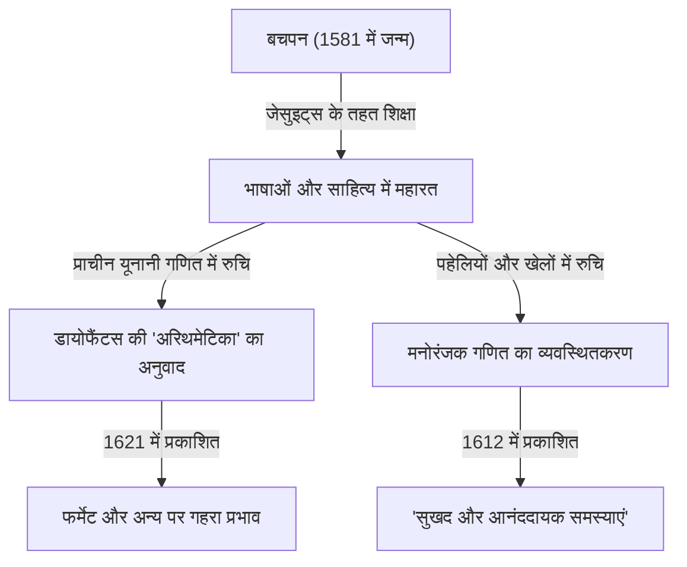

गणित के इतिहास में, ऐसे व्यक्ति हैं जिन्होंने महत्वपूर्ण भूमिकाएँ निभाईं, भले ही वे कभी-कभी बाद की महान खोजों की छाया में छिपे रहे हों। 17वीं सदी के फ्रांसीसी गणितज्ञ **क्लाउड गैस्पर्ड बैशे डी मेज़िरियाक ([Claude Gaspard Bachet](https://kenji.blog/hi/p/bachet/) de Méziriac, 1581–1638)** उनमें से एक हैं। वह पियरे डी फर्मेट पर अपने प्रभाव के लिए प्रसिद्ध हैं, लेकिन उनकी अपनी उपलब्धियां भी विशाल और विविध थीं।

इस लेख में, हम बैशे के जीवन और उनकी प्रमुख गणितीय उपलब्धियों के बारे में विस्तार से जानेंगे।

## बैशे का जीवन: रईस से विद्वान तक

बैशे का जन्म 9 अक्टूबर, 1581 को मध्य-पूर्वी फ्रांस के बूर्ग-एन-ब्रेस (Bourg-en-Bresse) में हुआ था। उनका परिवार धनी कुलीन वर्ग का था, और वह भाग्यशाली थे कि उन्हें कम उम्र से ही उत्कृष्ट शिक्षा प्राप्त हुई।

कम उम्र में ही अपने माता-पिता को खोने के बाद, उन्होंने जेसुइट्स (Jesuits) से शिक्षा प्राप्त की, और ल्योन, मिलान तथा अन्य स्थानों पर अध्ययन किया। उन्होंने संक्षेप में एक भिक्षु के रूप में जीने के लिए जेसुइट आदेश में शामिल होने पर विचार किया, लेकिन बाद में धर्मनिरपेक्ष जीवन में लौट आए और खुद को शैक्षणिक अनुसंधान के लिए समर्पित कर दिया। बैशे ने न केवल गणित में बल्कि साहित्य, भाषाविज्ञान और कविता में भी उत्कृष्ट प्रदर्शन किया, और लैटिन तथा ग्रीक क्लासिक्स के अनुवादक के रूप में प्रसिद्धि प्राप्त की। 1635 में, उन्हें प्रतिष्ठित अकादेमी फ़्रैन्सेज़ (Académie Française) के प्रारंभिक सदस्यों में से एक के रूप में भी चुना गया था।

## [डायोफैंटस](https://kenji.blog/hi/p/diophantus/) की "अरिथमेटिका" का लैटिन अनुवाद

बैशे की सबसे प्रसिद्ध उपलब्धियों में से एक प्राचीन यूनानी गणितज्ञ [डायोफैंटस](https://kenji.blog/hi/p/diophantus/) ([Diophantus](https://kenji.blog/hi/p/diophantus/)) की पुस्तक "अरिथमेटिका (Arithmetica)" का लैटिन में अनुवाद करना, टिप्पणियां जोड़ना और इसे 1621 में प्रकाशित करना है।

अनुवादित यह पुस्तक उस समय के यूरोपीय गणितज्ञों के लिए प्राचीन बीजगणित और संख्या सिद्धांत का अध्ययन करने के लिए मानक पाठ बन गई। सबसे प्रसिद्ध किस्सों में से एक यह है कि पियरे डी फर्मेट ([Pierre de Fermat](https://kenji.blog/hi/p/fermat/)) ने इस बैशे संस्करण की अपनी प्रति के हाशिये में अपना प्रसिद्ध "फर्मेट का अंतिम प्रमेय ([Fermat's Last Theorem](https://kenji.blog/hi/p/fermats-last-theorem/))" लिखा था।

बैशे केवल अनुवाद पर ही नहीं रुके; उन्होंने [डायोफैंटस](https://kenji.blog/hi/p/diophantus/) की समस्याओं में अपनी स्वयं की उत्कृष्ट टिप्पणियां और सामान्यीकरण जोड़े। उनकी गणितीय अंतर्दृष्टि के बिना, 17वीं शताब्दी में संख्या सिद्धांत का विकास बहुत धीमा हो सकता था।

## बैशे का समीकरण ([Bachet](https://kenji.blog/hi/p/bachet/)'s Equation)

संख्या सिद्धांत में, बैशे ने डायोफैंटाइन समीकरण के एक विशिष्ट रूप का अध्ययन किया जिसे अब **बैशे के समीकरण** के रूप में जाना जाता है। यह निम्नलिखित रूप में एक क्यूबिक वक्र (दीर्घवृत्तीय वक्र का एक प्रकार) का प्रतिनिधित्व करता है:

$$
y^2 = x^3 - c
$$

(या इसे कभी-कभी $y^2 = x^3 + k$ के रूप में लिखा जाता है, जहाँ $c$ या $k$ स्थिरांक हैं।)

बैशे ने एक विशिष्ट तर्कसंगत समाधान दिए जाने पर नए तर्कसंगत समाधान प्राप्त करने के लिए ज्यामितीय और बीजगणितीय विधियों (दीर्घवृत्तीय वक्रों पर बिंदु जोड़, विशेष रूप से दोहरीकरण के लिए स्पर्शरेखा विधि के समतुल्य) पर विचार किया। इसने डायोफैंटाइन समीकरण के असीम रूप से कई समाधान उत्पन्न करने का एक तरीका दिखाया और बाद के दीर्घवृत्तीय वक्रों (elliptic curves) के सिद्धांत की नींव में से एक बन गया।

## मनोरंजक गणित के पिता: "सुखद और आनंददायक समस्याएं"

1612 में, बैशे ने "सुखद और आनंददायक समस्याएं, जो संख्याओं द्वारा की जाती हैं (Problèmes plaisans et délectables, qui se font par les nombres)" नामक एक पुस्तक प्रकाशित की। इसे यूरोप में प्रकाशित "मनोरंजक गणित (Recreational Mathematics)" पर पहली विशेष पुस्तक माना जाता है।

इस पुस्तक में कई गणितीय पहेलियाँ शामिल थीं जो आज भी लोकप्रिय हैं, जैसे नदी पार करने की पहेली, जोसेफस समस्या, जादुई वर्ग बनाने के तरीके, और प्रसिद्ध "बैशे की वजन समस्या"।

### बैशे की वजन समस्या ([Bachet](https://kenji.blog/hi/p/bachet/)'s Weights Problem)

उनकी पुस्तक में सबसे प्रसिद्ध समस्याओं में से एक निम्नलिखित है:

> **समस्या:** तराजू पर 1 से 40 तक किसी भी पूर्णांक संख्या के पाउंड को तोलने के लिए आवश्यक बाटों की न्यूनतम संख्या क्या है? और प्रत्येक का वजन क्या है? (यह मानते हुए कि बाटों को तराजू के दोनों पलड़ों में से किसी पर भी रखा जा सकता है।)

इस समस्या के समाधान को 3 की घातों का उपयोग करके अनुकूलित किया जाता है। विशेष रूप से, यदि आपके पास $1, 3, 9, 27$ पाउंड वजन वाले 4 बाट हैं, तो आप $1$ से $40$ तक के प्रत्येक वजन को माप सकते हैं।

यह गणितीय रूप से "संतुलित टर्नरी (Balanced Ternary)" में संख्याओं को व्यक्त करने के बराबर है। किसी भी पूर्णांक $N$ को गुणांक $-1, 0, 1$ का उपयोग करके इस प्रकार व्यक्त किया जा सकता है:

$$
N = a_0 3^0 + a_1 3^1 + a_2 3^2 + a_3 3^3 \quad (a_i \in \{-1, 0, 1\})
$$

यहाँ, $a_i = 1$ का अर्थ है तोली जा रही वस्तु के विपरीत पलड़े पर बाट रखना, $a_i = -1$ का अर्थ है इसे उसी पलड़े पर रखना, और $a_i = 0$ का अर्थ है उस बाट का उपयोग न करना। बैशे की समस्या खेल के माध्यम से अंक प्रणालियों के मौलिक सिद्धांत की एक शानदार अभिव्यक्ति थी।

## बैशे की पहचान (बेज़ाउट की पहचान)

इसके अलावा, बैशे ने एटीन बेज़ाउट (Étienne Bézout) से 150 से अधिक वर्ष पहले पूर्णांकों के लिए आधुनिक गणित में "बेज़ाउट की पहचान (Bézout's identity)" के रूप में जाने जाने वाले प्रमेय को सिद्ध किया था।

बैशे ने दिखाया कि किन्हीं दो सह-अभाज्य (coprime) पूर्णांकों $a$ और $b$ के लिए, हमेशा पूर्णांक $x, y$ मौजूद होते हैं जो निम्नलिखित को संतुष्ट करते हैं:

$$
ax + by = 1
$$

$x$ और $y$ की गणना [यूक्लिडियन एल्गोरिथ्म](https://kenji.blog/hi/p/euclidean-algorithm/) (विस्तारित यूक्लिडियन एल्गोरिथ्म) का विस्तार करके विशेष रूप से की जा सकती है, जो आधुनिक क्रिप्टोग्राफी (जैसे [RSA](https://kenji.blog/hi/p/modern-cryptography-public-key-hash-signature/)) में एक अनिवार्य मौलिक प्रमेय बन गया है। ऐतिहासिक सटीकता को महत्व देने वाले संदर्भों में, इसे कभी-कभी **बैशे का प्रमेय** कहा जाता है।

## निष्कर्ष

क्लाउड गैस्पर्ड बैशे फर्मेट के अंतिम प्रमेय के लिए केवल "पर्दे के पीछे के व्यक्ति" नहीं थे। वह एक महान अन्वेषक थे जिन्होंने प्राचीन ज्ञान को पुनर्जीवित करते हुए अपने स्वयं के समीकरणों की खोज की और मनोरंजक गणित को व्यवस्थित करके आधुनिक गणित के द्वार खोले। "अरिथमेटिका" पर उनकी टिप्पणियां और गणितीय पहेलियाँ उनके निधन के सदियों बाद, आज भी गणित प्रेमियों को प्रेरित करती हैं।
