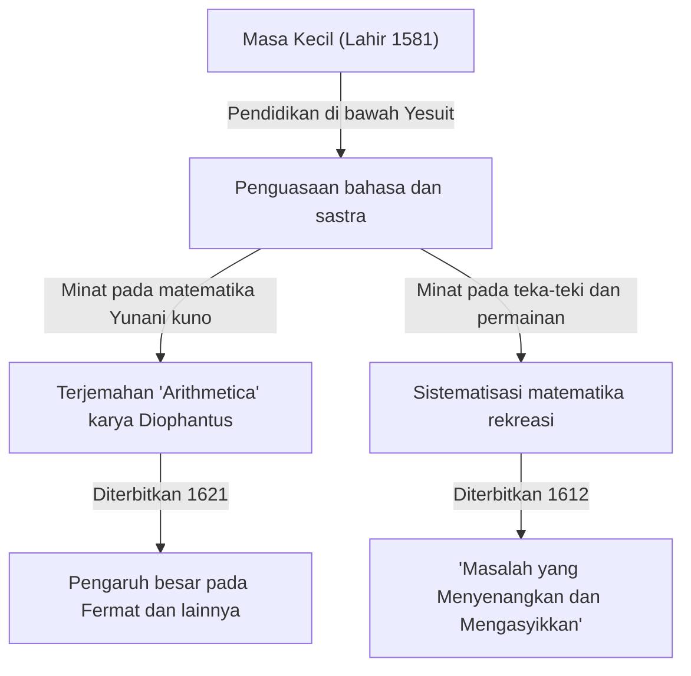

Dalam sejarah matematika, ada tokoh-tokoh yang memainkan peran penting, meskipun kadang-kadang mereka tetap tersembunyi di bawah bayang-bayang penemuan besar di kemudian hari. Matematikawan Prancis abad ke-17 **Claude Gaspard Bachet de Méziriac (1581–1638)** adalah salah satunya. Dia terkenal karena pengaruhnya terhadap Pierre de Fermat, tetapi pencapaiannya sendiri juga sangat luas dan beragam.

Dalam artikel ini, kita akan mendalami kehidupan Bachet dan pencapaian utamanya dalam matematika.

## Kehidupan Bachet: Dari Bangsawan Menjadi Sarjana

Bachet lahir pada tanggal 9 Oktober 1581 di Bourg-en-Bresse di bagian timur-tengah Prancis. Keluarganya termasuk bangsawan kaya, dan ia beruntung menerima pendidikan yang sangat baik sejak usia dini.

Setelah kehilangan orang tuanya di usia muda, ia dididik oleh ordo Yesuit, belajar di Lyon, Milan, dan tempat lainnya. Ia sempat mempertimbangkan untuk bergabung dengan ordo Yesuit untuk hidup sebagai biarawan, tetapi kemudian kembali ke kehidupan sekuler dan mengabdikan dirinya pada penelitian akademis. Bachet tidak hanya unggul dalam matematika tetapi juga dalam sastra, linguistik, dan puisi, mendapatkan ketenaran sebagai penerjemah klasik Latin dan Yunani. Pada tahun 1635, ia juga terpilih sebagai salah satu anggota awal dari Académie Française yang bergengsi.

## Terjemahan Latin dari "Arithmetica" karya Diophantus

Salah satu pencapaian Bachet yang paling terkenal adalah terjemahannya atas buku "Arithmetica" oleh matematikawan Yunani kuno Diophantus ke dalam bahasa Latin, menambahkan komentar, dan menerbitkannya pada tahun 1621.

Buku terjemahan ini menjadi teks standar bagi matematikawan Eropa pada saat itu untuk mempelajari aljabar kuno dan teori bilangan. Salah satu anekdot yang paling terkenal adalah bahwa Pierre de Fermat menulis "Teorema Terakhir Fermat" yang terkenal di margin salinan edisi Bachet miliknya.

Bachet tidak berhenti pada sekadar terjemahan; ia menambahkan komentar dan generalisasi yang sangat baik pada masalah-masalah Diophantus. Tanpa wawasan matematikanya, perkembangan teori bilangan pada abad ke-17 mungkin akan jauh lebih lambat.

## Persamaan Bachet (Bachet's Equation)

Dalam teori bilangan, Bachet mempelajari bentuk spesifik dari persamaan Diophantine yang sekarang dikenal sebagai **persamaan Bachet**. Persamaan ini mewakili kurva kubik (sejenis kurva eliptik) dalam bentuk berikut:

$$
y^2 = x^3 - c
$$

(Atau kadang ditulis sebagai $y^2 = x^3 + k$, di mana $c$ atau $k$ adalah konstanta.)

Bachet mempertimbangkan metode geometris dan aljabar (setara dengan apa yang sekarang disebut penambahan titik pada kurva eliptik, khususnya metode tangen untuk penggandaan) untuk menurunkan solusi rasional baru ketika solusi rasional spesifik diberikan. Hal ini menunjukkan cara untuk menghasilkan solusi tak terhingga untuk persamaan Diophantine dan menjadi salah satu dasar teori kurva eliptik di kemudian hari.

## Bapak Matematika Rekreasi: "Masalah yang Menyenangkan dan Mengasyikkan"

Pada tahun 1612, Bachet menerbitkan sebuah buku berjudul "Problèmes plaisans et délectables, qui se font par les nombres" (Masalah yang menyenangkan dan mengasyikkan, yang diselesaikan dengan angka). Ini dianggap sebagai buku khusus pertama tentang "Matematika Rekreasi" (Recreational Mathematics) yang diterbitkan di Eropa.

Buku ini berisi banyak teka-teki matematika yang tetap populer hingga saat ini, seperti teka-teki menyeberang sungai, masalah Josephus, metode membuat bujur sangkar ajaib, dan "masalah anak timbangan Bachet" yang terkenal.

### Masalah Anak Timbangan Bachet

Salah satu masalah paling terkenal dalam bukunya adalah sebagai berikut:

> **Masalah:** Berapa jumlah minimum anak timbangan yang diperlukan untuk menimbang berat bilangan bulat dalam pound dari 1 hingga 40 pada timbangan keseimbangan? Dan berapa berat masing-masing? (Diasumsikan anak timbangan dapat ditempatkan di salah satu dari kedua piringan timbangan.)

Solusi untuk masalah ini dioptimalkan dengan menggunakan pangkat 3. Secara spesifik, jika Anda memiliki 4 anak timbangan dengan berat $1, 3, 9, 27$ pound, Anda dapat mengukur setiap berat dari $1$ hingga $40$.

Ini secara matematis setara dengan mengekspresikan angka dalam sistem bilangan "Ternary Seimbang" (Balanced Ternary). Setiap bilangan bulat $N$ dapat diekspresikan menggunakan koefisien $-1, 0, 1$ sebagai berikut:

$$
N = a_0 3^0 + a_1 3^1 + a_2 3^2 + a_3 3^3 \quad (a_i \in \{-1, 0, 1\})
$$

Di sini, $a_i = 1$ berarti menempatkan anak timbangan di piringan yang berlawanan dengan benda yang ditimbang, $a_i = -1$ berarti menempatkannya di piringan yang sama, dan $a_i = 0$ berarti tidak menggunakan anak timbangan tersebut. Masalah Bachet adalah ekspresi brilian dari teori dasar sistem bilangan melalui permainan.

## Identitas Bachet (Identitas Bézout)

Selain itu, Bachet membuktikan teorema yang dikenal dalam matematika modern sebagai "Identitas Bézout" untuk bilangan bulat lebih dari 150 tahun sebelum Étienne Bézout.

Bachet menunjukkan bahwa untuk setiap dua bilangan bulat koprima $a$ dan $b$, selalu ada bilangan bulat $x, y$ yang memenuhi hal berikut:

$$
ax + by = 1
$$

$x$ dan $y$ dapat dihitung secara konkret dengan memperluas algoritma Euclidean (algoritma Euclidean yang diperluas), yang telah menjadi teorema fundamental yang sangat diperlukan dalam kriptografi modern (seperti RSA). Dalam konteks yang menghargai keakuratan sejarah, ini kadang-kadang disebut **Teorema Bachet**.

## Kesimpulan

Claude Gaspard Bachet bukan sekadar "tokoh di balik layar" untuk Teorema Terakhir Fermat. Ia adalah pelopor hebat yang membuka pintu bagi matematika modern dengan menghidupkan kembali kebijaksanaan kuno sembari mengeksplorasi persamaannya sendiri dan menyistematisasi matematika rekreasi. Komentarnya pada "Arithmetica" dan teka-teki matematikanya terus menginspirasi para pecinta matematika saat ini, berabad-abad setelah kematiannya.
