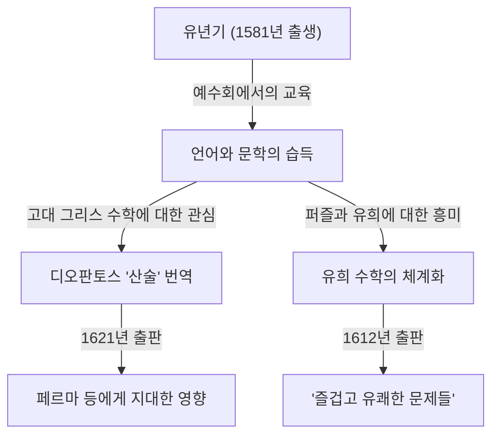

수학의 역사에서 때로는 후대의 위대한 발견의 그늘에 가려져 있으면서도 극히 중요한 역할을 했던 인물이 존재합니다. 17세기 프랑스의 수학자 **클로드 가스파르 바셰 드 메지리아크 (Claude Gaspard Bachet de Méziriac, 1581–1638)** 도 그중 한 명입니다. 그는 피에르 드 페르마에게 영향을 준 것으로 유명하지만, 그 자신의 업적 또한 매우 방대하고 다양합니다.

본 기사에서는 바셰의 생애와 그의 주요 수학적 업적에 대해 깊이 파헤쳐 보겠습니다.

## 바셰의 생애: 귀족에서 학자로의 길

바셰는 1581년 10월 9일, 프랑스 중동부의 부르캉브레스 (Bourg-en-Bresse) 에서 태어났습니다. 그의 가족은 부유한 귀족이었으며, 그는 어릴 적부터 뛰어난 교육을 받을 수 있는 환경을 누렸습니다.

부모를 일찍 여읜 후, 그는 예수회 산하에서 교육을 받았고 리옹과 밀라노 등에서 수학했습니다. 그는 잠시 예수회에 입회하여 수도사로서의 길을 걸을 것을 고려하기도 했으나, 후에 환속하여 학문 연구에 전념하게 됩니다. 바셰는 수학뿐만 아니라 문학, 언어학, 시학에도 뛰어났으며 라틴어와 그리스어 고전의 번역가로서 명성을 떨쳤습니다. 1635년에는 명예로운 아카데미 프랑세즈 (Académie Française) 의 초기 회원으로도 선출되었습니다.

## 디오판토스 '산술'의 라틴어 번역

바셰의 가장 잘 알려진 업적 중 하나는 고대 그리스의 수학자 디오판토스 (Diophantus) 의 저서 '산술 (Arithmetica)' 을 라틴어로 번역하고 주석을 달아 1621년에 출판한 것입니다.

이 번역본은 당시 유럽의 수학자들이 고대의 대수학과 정수론을 배우기 위한 표준적인 텍스트가 되었습니다. 그중 가장 유명한 일화는 피에르 드 페르마 (Pierre de Fermat) 가 이 바셰판 '산술'의 여백에 그 유명한 "페르마의 마지막 정리"를 적어 넣었다는 것입니다.

바셰 자신도 단순한 번역에 그치지 않고, 디오판토스의 문제에 대해 독자적이고 뛰어난 주석과 일반화를 덧붙였습니다. 그의 수학적 통찰력이 없었다면 17세기 정수론의 발전은 훨씬 더뎌졌을지도 모릅니다.

## 바셰 방정식 (Bachet's Equation)

정수론에서 바셰는 현재 **바셰 방정식** 이라고 불리는 특정 형태의 디오판토스 방정식을 연구했습니다. 이것은 다음 형태의 3차 곡선 (타원 곡선의 일종) 을 나타내는 방정식입니다.

$$
y^2 = x^3 - c
$$

(또는 $y^2 = x^3 + k$ 로 표현되기도 합니다. 여기서 $c$ 나 $k$ 는 상수입니다.)

바셰는 어떤 특정한 유리수 해가 주어졌을 때, 거기로부터 다른 새로운 유리수 해를 도출해내는 기하학적·대수학적 수법 (현재로 말하면 타원 곡선 상의 점의 덧셈, 특히 접선법을 이용한 2배 연산에 해당) 을 고찰했습니다. 이로 인해 디오판토스 방정식의 해를 무한히 생성하는 길이 열렸고, 후일 타원 곡선론의 기초 중 하나가 되었습니다.

## 유희 수학의 아버지: '즐겁고 유쾌한 문제들'

1612년, 바셰는 '수들로 만들어지는 즐겁고 유쾌한 문제들 (Problèmes plaisans et délectables, qui se font par les nombres)' 이라는 책을 출판했습니다. 이것은 유럽에서 최초로 출판된 "유희 수학 (Recreational Mathematics)" 전문서로 여겨집니다.

이 책에는 강 건너기 문제, 요세푸스 문제, 마방진을 만드는 법, 그리고 유명한 "바셰의 분동 문제" 등 현대에도 친숙한 많은 수학 퍼즐이 수록되어 있었습니다.

### 바셰의 분동 문제

그의 책 속에서 특히 유명한 것이 다음의 문제입니다.

> **문제:** 1파운드에서 40파운드까지의 임의의 정수 무게를 양팔 저울로 달기 위해서는 최소 몇 개의 분동 (추) 이 필요한가? 또한, 각각의 분동의 무게는 얼마인가? (단, 분동은 저울의 좌우 어느 접시에든 놓을 수 있다고 가정한다.)

이 문제의 해법은 3의 거듭제곱을 사용함으로써 최적화됩니다. 구체적으로는 $1, 3, 9, 27$ 파운드의 4개의 분동을 준비하면 $1$ 부터 $40$ 까지의 모든 무게를 달 수 있습니다.

이것은 수를 "평형 3진법 (Balanced Ternary)" 으로 표현하는 것과 수학적으로 동치입니다. 임의의 정수 $N$ 은 계수로서 $-1, 0, 1$ 을 사용하여 다음과 같이 나타낼 수 있습니다.

$$
N = a_0 3^0 + a_1 3^1 + a_2 3^2 + a_3 3^3 \quad (a_i \in \{-1, 0, 1\})
$$

여기서 $a_i = 1$ 은 잴 물체와 반대쪽 접시에 분동을 놓는 것, $a_i = -1$ 은 같은 쪽 접시에 놓는 것, $a_i = 0$ 은 그 분동을 사용하지 않는 것을 의미합니다. 바셰의 이 문제는 기수법의 기초 이론을 놀이 속에서 훌륭하게 표현한 것이었습니다.

## 바셰의 항등식 (베주 항등식)

게다가 바셰는 현대 수학에서는 "베주 항등식 (Bézout's identity)" 으로 알려진 정리를 에티엔 베주보다 150년 이상 앞서 정수에 대해 증명했습니다.

바셰는 서로소인 두 정수 $a$ 와 $b$ 에 대해, 다음을 만족하는 정수 $x, y$ 가 반드시 존재함을 보였습니다.

$$
ax + by = 1
$$

이것은 유클리드 호제법을 확장함으로써 구체적으로 $x, y$ 를 계산할 수 있으며 (확장 유클리드 호제법), 현대의 암호 이론 (예를 들어 RSA 암호 등) 에서도 필수불가결한 기초 정리가 되어 있습니다. 역사적 정확성을 중시하는 문맥에서는 이것을 **바셰의 정리** 라고 부르기도 합니다.

## 요약

클로드 가스파르 바셰는 페르마의 마지막 정리의 단순한 "무대 뒤의 인물"이 아닙니다. 그는 고대의 지혜를 부흥시킴과 동시에 독자적인 방정식 연구나 유희 수학의 체계화를 통해 근대 수학의 문을 연 위대한 선구자였습니다. 그가 남긴 '산술'의 주석이나 수학 퍼즐은 수세기를 거친 현대에도 여전히 수학을 사랑하는 사람들에게 영감을 계속 주고 있습니다.
