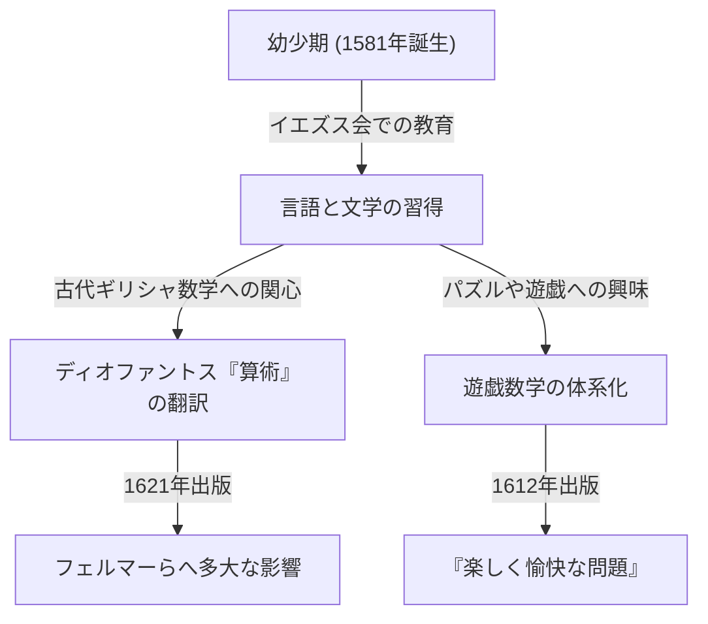

数学の歴史において、時には後世の偉大な発見の影に隠れながらも、極めて重要な役割を果たした人物が存在します。17世紀フランスの数学者、 **クロード＝ガスパール・バシェ・ド・メジリアック ([Claude Gaspard Bachet](https://kenji.blog/p/bachet/) de Méziriac, 1581–1638)** もその一人です。彼は[ピエール・ド・フェルマー](https://kenji.blog/p/fermat/)に影響を与えたことで有名ですが、彼自身の業績もまた非常に多岐にわたります。

本記事では、バシェの生涯とその主要な数学的業績について、詳しく掘り下げていきます。

## バシェの生涯：貴族から学者への道

バシェは1581年10月9日、フランス中東部のブール＝カン＝ブレス (Bourg-en-Bresse) に生まれました。彼の家族は裕福な貴族であり、彼は幼い頃から優れた教育を受ける環境に恵まれていました。

両親を早くに亡くした後、彼はイエズス会のもとで教育を受け、リヨンやミラノなどで学びました。彼は一時的にイエズス会に入会して修道士としての道を歩むことを考えましたが、後に還俗し、学問の研究に専念するようになります。バシェは数学だけでなく、文学、言語学、詩学にも秀でており、ラテン語やギリシャ語の古典の翻訳家としても名声を博しました。1635年には、名誉あるアカデミー・フランセーズ (Académie Française) の初期のメンバーにも選出されています。

## [ディオファントス](https://kenji.blog/p/diophantus/)『算術』のラテン語訳

バシェの最もよく知られた業績の一つは、古代ギリシャの数学者[ディオファントス](https://kenji.blog/p/diophantus/) ([Diophantus](https://kenji.blog/p/diophantus/)) の著書『算術 (Arithmetica)』をラテン語に翻訳し、注釈を加えて1621年に出版したことです。

この翻訳本は、当時のヨーロッパの数学者たちにとって、古代の代数学や整数論を学ぶための標準的なテキストとなりました。中でも最も有名なエピソードは、[ピエール・ド・フェルマー](https://kenji.blog/p/fermat/) ([Pierre de Fermat](https://kenji.blog/p/fermat/)) がこのバシェ版『算術』の余白に、あの有名な「[フェルマーの最終定理](https://kenji.blog/p/fermats-last-theorem/)」を書き込んだことです。

バシェ自身も単なる翻訳にとどまらず、[ディオファントス](https://kenji.blog/p/diophantus/)の問題に対して独自の優れた注釈や一般化を付け加えました。彼の数学的洞察力がなければ、17世紀の数論の発展はもっと遅れていたかもしれません。

## バシェ方程式 (Bachet's Equation)

バシェは数論において、現在 **バシェ方程式** と呼ばれる特定の形の[ディオファントス](https://kenji.blog/p/diophantus/)方程式を研究しました。これは以下の形の三次曲線（楕円曲線の一種）を表す方程式です。

$$
y^2 = x^3 - c
$$

（あるいは $y^2 = x^3 + k$ と表されることもあります。ここで $c$ や $k$ は定数です。）

バシェは、ある特定の有理数解が与えられたときに、そこから別の新しい有理数解を導き出す幾何学的・代数的な手法（現在でいうところの楕円曲線上の点の加法、特に接線法を用いた2倍算に相当する手法）を考察しました。これにより、[ディオファントス](https://kenji.blog/p/diophantus/)方程式の解を無限に生成する道筋が示され、後の楕円曲線論の基礎の一つとなりました。

## 遊戯数学の父：『楽しく愉快な問題』

1612年、バシェは『数によって作られる楽しく愉快な問題 (Problèmes plaisans et délectables, qui se font par les nombres)』という本を出版しました。これは、ヨーロッパで初めて出版された「遊戯数学 (Recreational Mathematics)」の専門書とされています。

この本には、川渡りの問題、継子立て（ヨセフスの問題）、魔方陣の作り方、そして有名な「バシェの分銅問題」など、現代でも親しまれている多くの数学パズルが収録されていました。

### バシェの分銅問題

彼の本の中で特に有名なのが以下の問題です。

> **問題：** 1ポンドから40ポンドまでの任意の整数の重さを天秤で量るためには、最低いくつの分銅が必要か？また、それぞれの分銅の重さはいくらか？（ただし、分銅は天秤の左右どちらの皿に置いてもよいものとする。）

この問題の解は、3の累乗を用いることで最適化されます。具体的には、$1, 3, 9, 27$ ポンドの4つの分銅を用意すれば、$1$ から $40$ までのすべての重さを量ることができます。

これは、数を「平衡三進法 (Balanced Ternary)」で表現することと数学的に等価です。任意の整数 $N$ は、係数として $-1, 0, 1$ を用いて次のように表せます。

$$
N = a_0 3^0 + a_1 3^1 + a_2 3^2 + a_3 3^3 \quad (a_i \in \{-1, 0, 1\})
$$

ここで、$a_i = 1$ は計る物体と反対の皿に分銅を置くこと、$a_i = -1$ は同じ皿に置くこと、$a_i = 0$ はその分銅を使わないことを意味します。バシェのこの問題は、記数法の基礎理論を遊びの中で見事に表現したものでした。

## バシェの恒等式（ベズーの等式）

さらにバシェは、現代の数学では「ベズーの等式 (Bézout's identity)」として知られる定理を、エティエンヌ・ベズーよりも150年以上前に整数に対して証明していました。

バシェは、互いに素な2つの整数 $a$ と $b$ に対して、以下を満たす整数 $x, y$ が必ず存在することを示しました。

$$
ax + by = 1
$$

これは[ユークリッドの互除法](https://kenji.blog/p/euclidean-algorithm/)を拡張することで具体的に $x, y$ を計算することができ（拡張[ユークリッドの互除法](https://kenji.blog/p/euclidean-algorithm/)）、現代の暗号理論（例えばRSA暗号など）においても不可欠な基礎定理となっています。歴史的な正確さを重んじる文脈では、これを **バシェの定理** と呼ぶこともあります。

## まとめ

クロード＝ガスパール・バシェは、[フェルマーの最終定理](https://kenji.blog/p/fermats-last-theorem/)の単なる「舞台裏の人物」ではありません。彼は古代の叡智を復興させると同時に、独自の方程式の研究や遊戯数学の体系化を通じて、近代数学の扉を開いた偉大な先駆者でした。彼の残した『算術』の注釈や数学パズルは、数世紀を経た現代でもなお、数学を愛する人々にインスピレーションを与え続けています。
