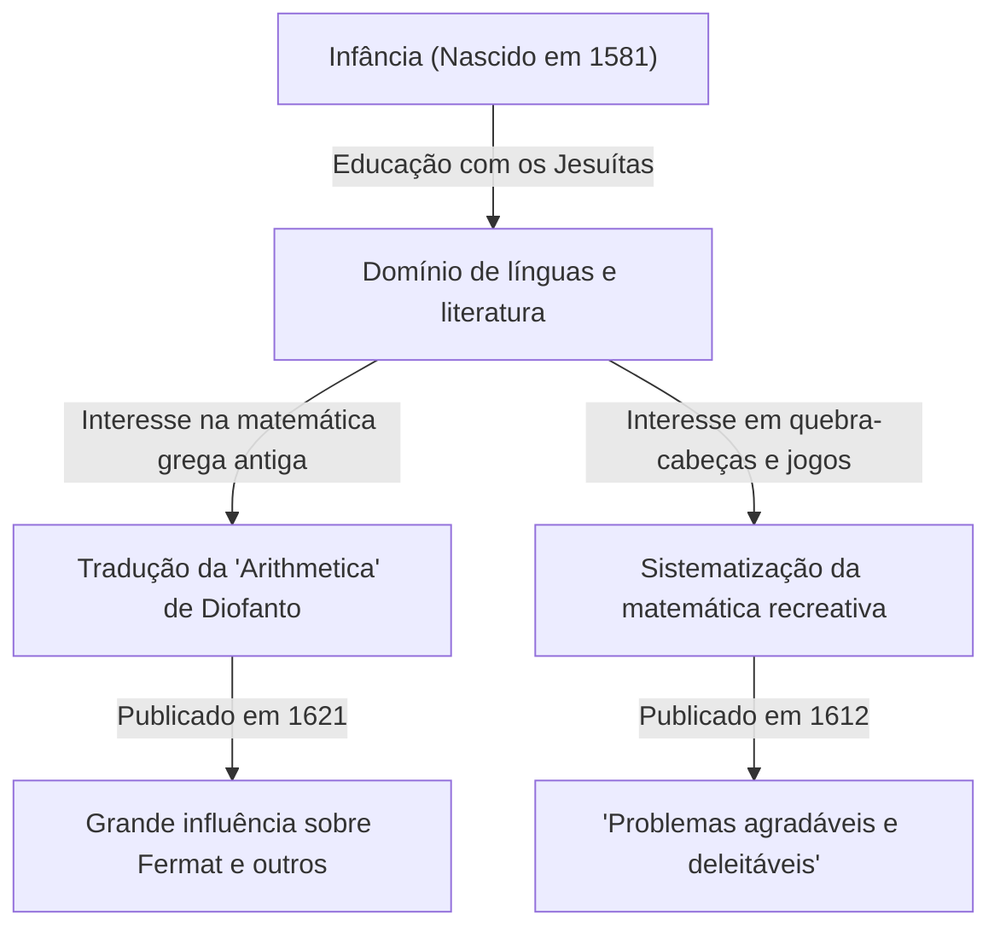

Na história da matemática, há figuras que desempenharam papéis cruciais, mesmo que às vezes permaneçam escondidas à sombra de grandes descobertas posteriores. O matemático francês do século XVII **Claude Gaspard Bachet de Méziriac (1581–1638)** é um deles. Ele é famoso por sua influência sobre Pierre de Fermat, mas suas próprias realizações também foram vastas e diversas.

Neste artigo, vamos nos aprofundar na vida de Bachet e em suas principais realizações matemáticas.

## A Vida de Bachet: De Nobre a Acadêmico

Bachet nasceu em 9 de outubro de 1581 em Bourg-en-Bresse, no centro-leste da França. Sua família pertencia à nobreza rica, e ele teve a sorte de receber uma excelente educação desde tenra idade.

Após perder os pais muito cedo, ele foi educado pelos jesuítas, estudando em Lyon, Milão e outros lugares. Ele considerou brevemente ingressar na ordem dos jesuítas para viver como monge, mas depois retornou à vida secular e dedicou-se à pesquisa acadêmica. Bachet se destacou não apenas em matemática, mas também em literatura, linguística e poesia, ganhando fama como tradutor de clássicos latinos e gregos. Em 1635, ele também foi eleito como um dos primeiros membros da prestigiosa Académie Française.

## A Tradução Latina da "Arithmetica" de Diofanto

Uma das realizações mais conhecidas de Bachet é a sua tradução da "Arithmetica" do antigo matemático grego Diofanto para o latim, adicionando comentários, e publicando-a em 1621.

Este livro traduzido tornou-se o texto padrão para os matemáticos europeus da época estudarem a álgebra antiga e a teoria dos números. Uma das anedotas mais famosas é que Pierre de Fermat escreveu o seu famoso "Último Teorema de Fermat" na margem da sua cópia desta edição de Bachet.

Bachet não parou na mera tradução; ele adicionou seus próprios excelentes comentários e generalizações aos problemas de Diofanto. Sem seus insights matemáticos, o desenvolvimento da teoria dos números no século XVII poderia ter sido muito mais lento.

## Equação de Bachet

Na teoria dos números, Bachet estudou uma forma específica de equação diofantina agora conhecida como **equação de Bachet**. Isso representa uma curva cúbica (um tipo de curva elíptica) na seguinte forma:

$$
y^2 = x^3 - c
$$

(Ou às vezes é escrito como $y^2 = x^3 + k$, onde $c$ ou $k$ são constantes.)

Bachet considerou métodos geométricos e algébricos (equivalentes ao que agora é chamado de adição de pontos em curvas elípticas, especificamente o método da tangente para duplicação) para derivar novas soluções racionais quando uma solução racional específica é dada. Isso mostrou uma maneira de gerar infinitas soluções para a equação diofantina e tornou-se um dos fundamentos para a teoria posterior das curvas elípticas.

## Pai da Matemática Recreativa: "Problemas Agradáveis e Deleitáveis"

Em 1612, Bachet publicou um livro intitulado "Problèmes plaisans et délectables, qui se font par les nombres" (Problemas agradáveis e deleitáveis, que são feitos por números). Este é considerado o primeiro livro especializado em "Matemática Recreativa" publicado na Europa.

Este livro continha muitos quebra-cabeças matemáticos que permanecem populares hoje, como o quebra-cabeça de atravessar o rio, o problema de Josefo, métodos para fazer quadrados mágicos e o famoso "problema dos pesos de Bachet".

### O Problema dos Pesos de Bachet

Um dos problemas mais famosos em seu livro é o seguinte:

> **Problema:** Qual é o número mínimo de pesos necessários para pesar qualquer número inteiro de libras de 1 a 40 em uma balança de pratos? E qual é o peso de cada um? (Supondo que os pesos possam ser colocados em qualquer um dos dois pratos da balança.)

A solução para este problema é otimizada usando potências de 3. Especificamente, se você tiver 4 pesos pesando $1, 3, 9, 27$ libras, você pode medir todos os pesos de $1$ a $40$.

Isso é matematicamente equivalente a expressar números em "Ternário Balanceado" (Balanced Ternary). Qualquer número inteiro $N$ pode ser expresso usando os coeficientes $-1, 0, 1$ da seguinte forma:

$$
N = a_0 3^0 + a_1 3^1 + a_2 3^2 + a_3 3^3 \quad (a_i \in \{-1, 0, 1\})
$$

Aqui, $a_i = 1$ significa colocar o peso no prato oposto ao objeto sendo pesado, $a_i = -1$ significa colocá-lo no mesmo prato, e $a_i = 0$ significa não usar esse peso. O problema de Bachet foi uma expressão brilhante da teoria fundamental dos sistemas numéricos através do jogo.

## Identidade de Bachet (Identidade de Bézout)

Além disso, Bachet provou o teorema conhecido na matemática moderna como "identidade de Bézout" para números inteiros mais de 150 anos antes de Étienne Bézout.

Bachet mostrou que, para quaisquer dois números inteiros coprimos $a$ e $b$, sempre existem números inteiros $x, y$ que satisfazem o seguinte:

$$
ax + by = 1
$$

$x$ e $y$ podem ser calculados concretamente expandindo o algoritmo euclidiano (o algoritmo euclidiano estendido), que se tornou um teorema fundamental indispensável na criptografia moderna (como RSA). Em contextos que valorizam a precisão histórica, isso às vezes é chamado de **teorema de Bachet**.

## Conclusão

Claude Gaspard Bachet não era apenas uma "figura de bastidores" para o Último Teorema de Fermat. Ele foi um grande pioneiro que abriu as portas para a matemática moderna ao reviver a sabedoria antiga enquanto explorava suas próprias equações e sistematizava a matemática recreativa. Seus comentários sobre a "Arithmetica" e seus quebra-cabeças matemáticos continuam a inspirar os amantes da matemática hoje, séculos após o seu falecimento.
