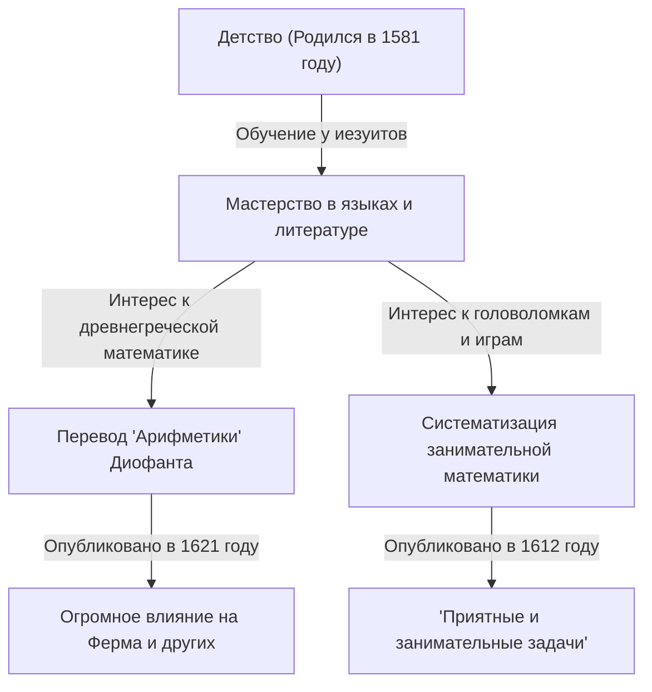

В истории математики есть деятели, сыгравшие важнейшую роль, даже если иногда они остаются в тени более поздних великих открытий. Французский математик 17-го века **Клод Гаспар Баше де Мезириак ([Claude Gaspard Bachet](https://kenji.blog/ru/p/bachet/) de Méziriac, 1581–1638)** — один из них. Он известен своим влиянием на Пьера де Ферма, но и его собственные достижения также были обширны и разнообразны.

В этой статье мы подробно остановимся на жизни Баше и его главных математических достижениях.

## Жизнь Баше: от дворянина к ученому

Баше родился 9 октября 1581 года в Бурк-ан-Бресе (Bourg-en-Bresse) в центрально-восточной Франции. Его семья принадлежала к богатому дворянству, и ему посчастливилось с ранних лет получить превосходное образование.

Рано потеряв родителей, он воспитывался у иезуитов, обучаясь в Лионе, Милане и других городах. Он недолгое время подумывал о том, чтобы вступить в орден иезуитов и жить как монах, но позже вернулся к светской жизни и посвятил себя академическим исследованиям. Баше преуспел не только в математике, но и в литературе, лингвистике и поэзии, прославившись как переводчик латинских и греческих классиков. В 1635 году он также был избран одним из первых членов престижной Французской академии (Académie Française).

## Латинский перевод "Арифметики" [Диофант](https://kenji.blog/ru/p/diophantus/)а

Одним из самых известных достижений Баше является его перевод «Арифметики» древнегреческого математика [Диофант](https://kenji.blog/ru/p/diophantus/)а на латынь, с добавлением комментариев, который был опубликован в 1621 году.

Эта переведенная книга стала стандартным текстом для европейских математиков того времени по изучению древней алгебры и теории чисел. Один из самых известных анекдотов гласит, что [Пьер де Ферма](https://kenji.blog/ru/p/fermat/) написал свою знаменитую «Великую теорему Ферма» на полях своего экземпляра этого издания Баше.

Баше не остановился на простом переводе; он добавил свои собственные превосходные комментарии и обобщения к задачам [Диофант](https://kenji.blog/ru/p/diophantus/)а. Без его математических идей развитие теории чисел в 17-м веке могло бы идти гораздо медленнее.

## Уравнение Баше

В теории чисел Баше изучал специфическую форму диофантова уравнения, ныне известную как **уравнение Баше**. Оно представляет собой кубическую кривую (разновидность эллиптической кривой) в следующем виде:

$$
y^2 = x^3 - c
$$

(Или иногда его пишут как $y^2 = x^3 + k$, где $c$ или $k$ — константы.)

Баше рассматривал геометрические и алгебраические методы (эквивалентные тому, что сейчас называется сложением точек на эллиптических кривых, а именно методу касательных для удвоения), чтобы вывести новые рациональные решения, когда дано конкретное рациональное решение. Это показало путь к генерации бесконечного множества решений диофантова уравнения и стало одной из основ для более поздней теории эллиптических кривых.

## Отец занимательной математики: "Приятные и занимательные задачи"

В 1612 году Баше опубликовал книгу под названием "Problèmes plaisans et délectables, qui se font par les nombres" (Приятные и занимательные задачи, которые решаются с помощью чисел). Это считается первой специализированной книгой по "Занимательной математике" (Recreational Mathematics), изданной в Европе.

Эта книга содержала много математических головоломок, которые остаются популярными и сегодня, такие как головоломка о переправе через реку, задача Иосифа Флавия, методы составления магических квадратов и знаменитая "задача о гирях Баше".

### Задача о гирях Баше

Одной из самых известных задач в его книге является следующая:

> **Задача:** Каково минимальное количество гирь, необходимое для взвешивания любого целого числа фунтов от 1 до 40 на чашечных весах? И каков вес каждой гири? (Предполагается, что гири можно класть на любую из двух чаш весов.)

Решение этой задачи оптимизируется с использованием степеней числа 3. В частности, если у вас есть 4 гири весом $1, 3, 9, 27$ фунтов, вы можете отмерить любой вес от $1$ до $40$.

Математически это эквивалентно выражению чисел в "сбалансированной троичной системе счисления" (Balanced Ternary). Любое целое число $N$ можно выразить с использованием коэффициентов $-1, 0, 1$ следующим образом:

$$
N = a_0 3^0 + a_1 3^1 + a_2 3^2 + a_3 3^3 \quad (a_i \in \{-1, 0, 1\})
$$

Здесь $a_i = 1$ означает помещение гири на чашу, противоположную взвешиваемому объекту, $a_i = -1$ означает помещение ее на ту же чашу, а $a_i = 0$ означает, что данная гиря не используется. Задача Баше была блестящим выражением фундаментальной теории систем счисления через игру.

## Тождество Баше (Тождество Безу)

Кроме того, Баше доказал теорему, известную в современной математике как "тождество Безу", для целых чисел более чем за 150 лет до Этьена Безу.

Баше показал, что для любых двух взаимно простых целых чисел $a$ и $b$ всегда существуют такие целые числа $x, y$, которые удовлетворяют следующему уравнению:

$$
ax + by = 1
$$

$x$ и $y$ можно конкретно вычислить, используя расширенный алгоритм [Евклид](https://kenji.blog/ru/p/euclid/)а, который стал незаменимой фундаментальной теоремой в современной криптографии (такой как RSA). В контекстах, где ценится историческая точность, это иногда называют **теоремой Баше**.

## Заключение

Клод Гаспар Баше не был просто "фигурой за кулисами" Великой теоремы Ферма. Он был великим пионером, который открыл двери в современную математику, возродив древнюю мудрость и одновременно исследуя собственные уравнения и систематизируя занимательную математику. Его комментарии к "Арифметике" и математические головоломки продолжают вдохновлять любителей математики и сегодня, спустя столетия после его смерти.
