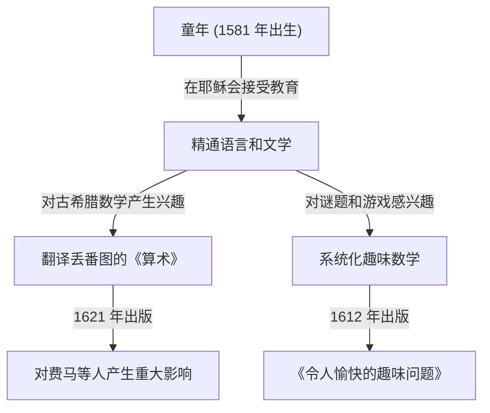

在数学史上，有些人扮演了至关重要的角色，即使他们有时被掩盖在后世伟大发现的光环之下。17 世纪的法国数学家 **克洛德·加斯帕尔·巴谢·德·梅济里亚克 ([Claude Gaspard Bachet](https://kenji.blog/zh-cn/p/bachet/) de Méziriac, 1581–1638)** 就是其中之一。他因对[皮埃尔·德·费马](https://kenji.blog/zh-cn/p/fermat/)产生影响而闻名，但他本人的成就同样非常广泛和多样化。

在本文中，我们将深入了解巴谢的生平及其主要的数学成就。

## 巴谢的生平：从贵族到学者

巴谢于 1581 年 10 月 9 日出生于法国中东部的布尔格昂布雷斯 (Bourg-en-Bresse)。他的家庭属于富裕的贵族阶层，他有幸从小就接受了良好的教育。

在早年失去双亲后，他接受了耶稣会的教育，曾在里昂、米兰等地学习。他曾短暂考虑加入耶稣会过修道士的生活，但后来回到了世俗生活并致力于学术研究。巴谢不仅在数学上才华横溢，在文学、语言学和诗歌方面也造诣颇深，并作为拉丁文和希腊文经典的翻译家而享有盛誉。1635 年，他还被选为享有盛誉的法兰西学术院 (Académie Française) 的首批院士之一。

## [丢番图](https://kenji.blog/zh-cn/p/diophantus/)《算术》的拉丁文译本

巴谢最著名的成就之一是将古希腊数学家[丢番图](https://kenji.blog/zh-cn/p/diophantus/) ([Diophantus](https://kenji.blog/zh-cn/p/diophantus/)) 的《算术 (Arithmetica)》翻译成拉丁文，并加上了注释，于 1621 年出版。

这本译著成为了当时欧洲数学家学习古代代数和数论的标准教科书。其中最著名的轶事之一是，[皮埃尔·德·费马](https://kenji.blog/zh-cn/p/fermat/) ([Pierre de Fermat](https://kenji.blog/zh-cn/p/fermat/)) 就是在他所拥有的这本巴谢版《算术》的空白边缘处写下了著名的“[费马大定理](https://kenji.blog/zh-cn/p/fermats-last-theorem/)”。

巴谢并没有止步于纯粹的翻译；他在[丢番图](https://kenji.blog/zh-cn/p/diophantus/)的问题中加入了自己精彩的注释和推广。如果没有他的数学洞察力，17 世纪数论的发展可能会缓慢得多。

## 巴谢方程 ([Bachet](https://kenji.blog/zh-cn/p/bachet/)'s Equation)

在数论中，巴谢研究了一种特定形式的[丢番图](https://kenji.blog/zh-cn/p/diophantus/)方程，现在被称为 **巴谢方程** 。它代表了以下形式的三次曲线（一种椭圆曲线）：

$$
y^2 = x^3 - c
$$

（或者有时写为 $y^2 = x^3 + k$，其中 $c$ 或 $k$ 是常数。）

巴谢考虑了在给定特定有理数解的情况下，推导新有理数解的几何和代数方法（相当于现在所谓的椭圆曲线上的点加法，特别是用于加倍的切线法）。这展示了一种生成[丢番图](https://kenji.blog/zh-cn/p/diophantus/)方程无限多解的方法，并成为了后来椭圆曲线理论的基础之一。

## 趣味数学之父：《令人愉快的趣味问题》

1612 年，巴谢出版了一本名为《借助数字解决的令人愉快的趣味问题 (Problèmes plaisans et délectables, qui se font par les nombres)》的书。这被认为是欧洲出版的第一本关于“趣味数学 (Recreational Mathematics)”的专著。

这本书包含了许多至今仍很流行的数学谜题，如过河问题、约瑟夫斯问题、构造幻方的方法，以及著名的“巴谢砝码问题”。

### 巴谢砝码问题

他的书中有一道非常著名的问题：

> **问题：** 如果要在天平上称出从 1 到 40 磅的任何整数磅的重量，最少需要多少个砝码？每个砝码的重量是多少？（假设砝码可以放在天平的任意一个托盘上。）

这个问题的最佳解决方案是使用 3 的幂。具体来说，如果你有重量分别为 $1, 3, 9, 27$ 磅的 4 个砝码，你就可以称量出从 $1$ 到 $40$ 之间的任何重量。

这在数学上等同于用“平衡三进制 (Balanced Ternary)”来表示数字。任何整数 $N$ 都可以使用系数 $-1, 0, 1$ 表示如下：

$$
N = a_0 3^0 + a_1 3^1 + a_2 3^2 + a_3 3^3 \quad (a_i \in \{-1, 0, 1\})
$$

在这里，$a_i = 1$ 表示将砝码放在与被称重物体相对的托盘上，$a_i = -1$ 表示放在同一个托盘上，而 $a_i = 0$ 表示不使用该砝码。巴谢的这个问题通过游戏精彩地表达了记数系统的基础理论。

## 巴谢恒等式（裴蜀定理）

此外，巴谢比埃蒂安·裴蜀早了 150 多年证明了在现代数学中被称为整数“裴蜀等式 (Bézout's identity)”的定理。

巴谢证明，对于任何两个互素的整数 $a$ 和 $b$，总是存在整数 $x, y$ 满足以下条件：

$$
ax + by = 1
$$

通过扩展[欧几里得算法](https://kenji.blog/zh-cn/p/euclidean-algorithm/)（扩展[欧几里得算法](https://kenji.blog/zh-cn/p/euclidean-algorithm/)）可以具体计算出 $x$ 和 $y$，这已成为现代密码学（如 [RSA](https://kenji.blog/zh-cn/p/modern-cryptography-public-key-hash-signature/)）中不可或缺的基础定理。在重视历史准确性的语境中，这有时被称为 **巴谢定理** 。

## 结论

克洛德·加斯帕尔·巴谢不仅仅是[费马大定理](https://kenji.blog/zh-cn/p/fermats-last-theorem/)的“幕后人物”。他是一位伟大的先驱，通过复兴古代智慧，同时探索自己的方程并系统化趣味数学，打开了现代数学的大门。他对《算术》的注释和数学谜题在他去世几个世纪后的今天，依然继续激发着数学爱好者的灵感。
