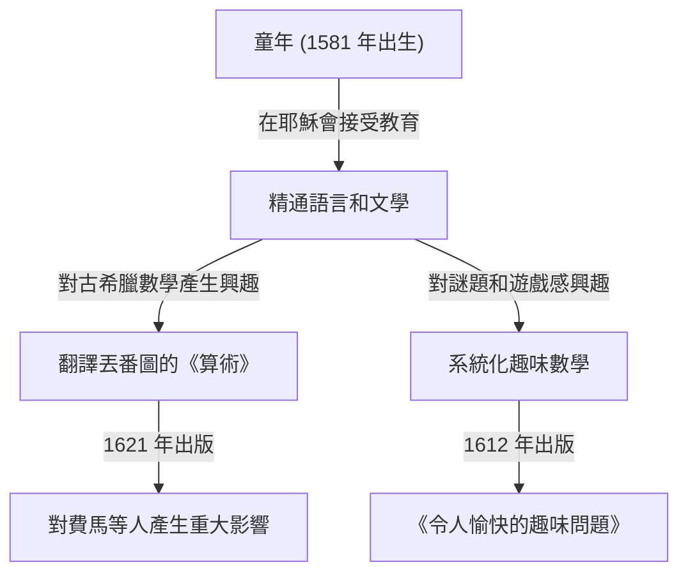

在數學史上，有些人扮演了至關重要的角色，即使他們有時被掩蓋在後世偉大發現的光環之下。17 世紀的法國數學家 **克洛德·加斯帕爾·巴謝·德·梅濟里亞克 ([Claude Gaspard Bachet](https://kenji.blog/zh-tw/p/bachet/) de Méziriac, 1581–1638)** 就是其中之一。他因對[皮埃爾·德·費馬](https://kenji.blog/zh-tw/p/fermat/)產生影響而聞名，但他本人的成就同樣非常廣泛和多樣化。

在本文中，我們將深入了解巴謝的生平及其主要的數學成就。

## 巴謝的生平：從貴族到學者

巴謝於 1581 年 10 月 9 日出生於法國中東部的布爾格昂布雷斯 (Bourg-en-Bresse)。他的家庭屬於富裕的貴族階層，他有幸從小就接受了良好的教育。

在早年失去雙親後，他接受了耶穌會的教育，曾在里昂、米蘭等地學習。他曾短暫考慮加入耶穌會過修道士的生活，但後來回到了世俗生活並致力於學術研究。巴謝不僅在數學上才華橫溢，在文學、語言學和詩歌方面也造詣頗深，並作為拉丁文和希臘文經典的翻譯家而享有盛譽。1635 年，他還被選為享有盛譽的法蘭西學術院 (Académie Française) 的首批院士之一。

## [丟番圖](https://kenji.blog/zh-tw/p/diophantus/)《算術》的拉丁文譯本

巴謝最著名的成就之一是將古希臘數學家[丟番圖](https://kenji.blog/zh-tw/p/diophantus/) ([Diophantus](https://kenji.blog/zh-tw/p/diophantus/)) 的《算術 (Arithmetica)》翻譯成拉丁文，並加上了註釋，於 1621 年出版。

這本譯著成為了當時歐洲數學家學習古代代數和數論的標準教科書。其中最著名的軼事之一是，[皮埃爾·德·費馬](https://kenji.blog/zh-tw/p/fermat/) ([Pierre de Fermat](https://kenji.blog/zh-tw/p/fermat/)) 就是在他所擁有的這本巴謝版《算術》的空白邊緣處寫下了著名的「費馬大定理」。

巴謝並沒有止步於純粹的翻譯；他在[丟番圖](https://kenji.blog/zh-tw/p/diophantus/)的問題中加入了自己精彩的註釋和推廣。如果沒有他的數學洞察力，17 世紀數論的發展可能會緩慢得多。

## 巴謝方程 (Bachet's Equation)

在數論中，巴謝研究了一種特定形式的[丟番圖](https://kenji.blog/zh-tw/p/diophantus/)方程，現在被稱為 **巴謝方程** 。它代表了以下形式的三次曲線（一種橢圓曲線）：

$$
y^2 = x^3 - c
$$

（或者有時寫為 $y^2 = x^3 + k$，其中 $c$ 或 $k$ 是常數。）

巴謝考慮了在給定特定有理數解的情況下，推導新有理數解的幾何和代數方法（相當於現在所謂的橢圓曲線上的點加法，特別是用於加倍的切線法）。這展示了一種生成[丟番圖](https://kenji.blog/zh-tw/p/diophantus/)方程無限多解的方法，並成為了後來橢圓曲線理論的基礎之一。

## 趣味數學之父：《令人愉快的趣味問題》

1612 年，巴謝出版了一本名為《藉助數字解決的令人愉快的趣味問題 (Problèmes plaisans et délectables, qui se font par les nombres)》的書。這被認為是歐洲出版的第一本關於「趣味數學 (Recreational Mathematics)」的專著。

這本書包含了許多至今仍很流行的數學謎題，如過河問題、約瑟夫斯問題、構造幻方的方法，以及著名的「巴謝砝碼問題」。

### 巴謝砝碼問題

他的書中有一道非常著名的問題：

> **問題：** 如果要在天平上秤出從 1 到 40 磅的任何整數磅的重量，最少需要多少個砝碼？每個砝碼的重量是多少？（假設砝碼可以放在天平的任意一個托盤上。）

這個問題的最佳解決方案是使用 3 的冪。具體來說，如果你有重量分別為 $1, 3, 9, 27$ 磅的 4 個砝碼，你就可以秤量出從 $1$ 到 $40$ 之間的任何重量。

這在數學上等同於用「平衡三進制 (Balanced Ternary)」來表示數字。任何整數 $N$ 都可以使用係數 $-1, 0, 1$ 表示如下：

$$
N = a_0 3^0 + a_1 3^1 + a_2 3^2 + a_3 3^3 \quad (a_i \in \{-1, 0, 1\})
$$

在這裡，$a_i = 1$ 表示將砝碼放在與被秤重物體相對的托盤上，$a_i = -1$ 表示放在同一個托盤上，而 $a_i = 0$ 表示不使用該砝碼。巴謝的這個問題透過遊戲精彩地表達了記數系統的基礎理論。

## 巴謝恆等式（裴蜀定理）

此外，巴謝比埃蒂安·裴蜀早了 150 多年證明了在現代數學中被稱為整數「裴蜀等式 (Bézout's identity)」的定理。

巴謝證明，對於任何兩個互素的整數 $a$ 和 $b$，總是存在整數 $x, y$ 滿足以下條件：

$$
ax + by = 1
$$

透過擴展[歐幾里得算法](https://kenji.blog/zh-tw/p/euclidean-algorithm/)（擴展[歐幾里得算法](https://kenji.blog/zh-tw/p/euclidean-algorithm/)）可以具體計算出 $x$ 和 $y$，這已成為現代密碼學（如 RSA）中不可或缺的基礎定理。在重視歷史準確性的語境中，這有時被稱為 **巴謝定理** 。

## 結論

克洛德·加斯帕爾·巴謝不僅僅是費馬大定理的「幕後人物」。他是一位偉大的先驅，透過復興古代智慧，同時探索自己的方程並系統化趣味數學，打開了現代數學的大門。他對《算術》的註釋和數學謎題在他去世幾個世紀後的今天，依然繼續激發著數學愛好者的靈感。
