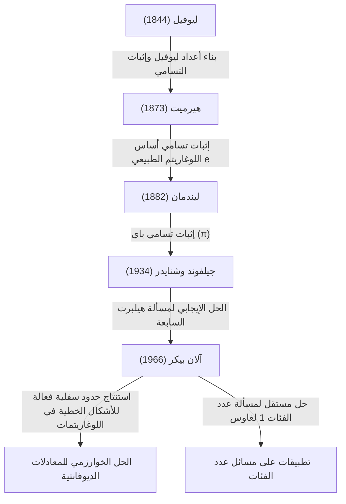

# [آلان بيكر: الحائز على وسام فيلدز الذي أحدث ثورة في نظرية الأعداد المتسامية](https://kenji.blog/ar/p/baker/)

## 1. مقدمة

في التاريخ الطويل للرياضيات، توجد أعداد لا تحصى من المسائل التي تبدو بسيطة بشكل مخادع لكنها حيرت أعظم العقول في العالم لقرون. من بين هذه المسائل، تُعرف دراسة "الأعداد المتسامية" كواحدة من أعمق المجالات في الرياضيات الحديثة، والتي تتطلب أطراً نظرية قوية بشكل استثنائي، حيث تعود جذورها إلى المسألة اليونانية القديمة المتمثلة في "تربيع الدائرة".

لقد أحدث عالم الرياضيات البريطاني **[آلان بيكر](https://kenji.blog/ar/p/baker/) (Alan Baker)** اختراقاً تاريخياً في هذا المجال الصعب للغاية من نظرية الأعداد المتسامية. أعظم إنجازاته، "مبرهنة الأشكال الخطية في اللوغاريتمات" (والتي غالباً ما تُسمى ببساطة [مبرهنة بيك](https://kenji.blog/ar/p/picks-theorem/)ر)، تجاوزت حدود نظرية الأعداد المتسامية البحتة. فقد لعبت دوراً حاسماً في حل مسائل مفتوحة طويلة الأمد، بما في ذلك طرق حل معادلات ديوفانتية محددة وحل مسألة عدد الفئات لغاوس. ولهذه المساهمات الرائدة، حصل على **وسام فيلدز (Fields Medal)** — أعلى وسام في الرياضيات — في المؤتمر الدولي لعلماء الرياضيات عام 1970 وهو في سن مبكرة تبلغ 31 عاماً.

في هذه المقالة، سوف نتعمق في حياة [آلان بيكر](https://kenji.blog/ar/p/baker/)، التحديات الرياضية التي واجهها، وكيف أثرت النظريات التي أسسها على الرياضيات الحديثة، مع استكشاف التفاصيل الرياضية.

## 2. حياته وتعليمه

### 2.1 نشأته والطريق إلى كامبريدج
وُلد [آلان بيكر](https://kenji.blog/ar/p/baker/) في 19 أغسطس 1939، في لندن، إنجلترا. أظهر موهبة غير عادية في الرياضيات منذ سن مبكرة، التحق بمدرسة قواعد محلية قبل أن ينتقل إلى كلية لندن الجامعية (UCL). هناك، درس أسس الرياضيات بصرامة وتخرج مع مرتبة الشرف الأولى.

سعياً للوصول إلى آفاق أعلى، انتقل بعد ذلك إلى كلية ترينيتي، كامبريدج. في ذلك الوقت، كانت جامعة كامبريدج واحدة من المراكز الرائدة في العالم في أبحاث نظرية الأعداد. هناك، درس بيكر تحت إشراف عالم الرياضيات الكبير **هارولد دافنبورت (Harold Davenport)**، الذي كان يقود مجتمع نظرية الأعداد البريطاني. كان دافنبورت مرجعاً في التقريب الديوفانتي ونظرية الأعداد التحليلية. تحت إشرافه، صقل بيكر حدسه الرياضي المتقدم وتقنيات إثباته الصارمة.

### 2.2 مسيرته الأكاديمية والتكريم
في عام 1964، حصل بيكر على درجة الدكتوراه من جامعة كامبريدج. وحتى في رسالة الدكتوراه الخاصة به، كانت بذور الأفكار البارزة التي ستترك اسمه في التاريخ واضحة بالفعل. بعد فترة وجيزة من حصوله على الدكتوراه، تم انتخابه زميلاً في كلية ترينيتي وبدأ أنشطته البحثية بشكل جدي.

في عام 1966، بدأ بنشر سلسلة من الأوراق البحثية الرائدة حول "الأشكال الخطية في اللوغاريتمات". أرسل هذا الإنجاز موجات صدمة عبر المجتمع الرياضي العالمي، مما أدى إلى حصوله على **وسام فيلدز** في المؤتمر الدولي لعلماء الرياضيات (ICM) عام 1970 الذي عقد في نيس، فرنسا.

بقي بيكر في كامبريدج لبقية حياته المهنية كأستاذ للرياضيات البحتة، وساهم بشكل كبير في أبحاث نظرية الأعداد وتوجيه الجيل القادم. سافر حول العالم لإلقاء محاضرات وعمل كأستاذ زائر في العديد من الجامعات في الهند، الولايات المتحدة، وأماكن أخرى. توفي [آلان بيكر](https://kenji.blog/ar/p/baker/) في 4 فبراير 2018، عن عمر يناهز 78 عاماً، لكن النظريات والأساليب التي تركها خلفه لا تزال متجذرة بعمق في نظرية الأعداد الحسابية الحديثة وعلم التشفير.

## 3. الإنجازات الرياضية: نظرية الأعداد المتسامية و[مبرهنة بيك](https://kenji.blog/ar/p/picks-theorem/)ر

### 3.1 أساسيات الأعداد الجبرية والمتسامية
لتقدير القيمة الحقيقية لعمل بيكر، يجب علينا أولاً مراجعة تصنيف الأعداد إلى أعداد "جبرية" و"متسامية".

- **العدد الجبري (Algebraic number)**: عدد مركب يمثل جذراً لمتعددة حدود غير صفرية ذات معاملات كسرية $\mathbb{Q}$. على سبيل المثال، $\sqrt{2}$، وهو جذر لـ $x^2 - 2 = 0$، وجذور $x^4 + 1 = 0$ تندرج تحت هذا التصنيف. جميع الأعداد الكسرية هي أيضاً أعداد جبرية لأنها جذور لمعادلات خطية $qx - p = 0$.
- **العدد المتسامي (Transcendental number)**: عدد مركب ليس جذراً لأي متعددة حدود غير صفرية ذات معاملات كسرية. من الأمثلة البارزة الثوابت الرياضية $\pi$ (باي) و $e$ (أساس اللوغاريتم الطبيعي).

في أواخر القرن التاسع عشر، أثبت [جورج كانتور](https://kenji.blog/ar/p/cantor/) من منظور نظرية المجموعات أنه في حين أن مجموعة الأعداد الجبرية قابلة للعد ولا نهائية، فإن مجموعة جميع الأعداد المركبة غير قابلة للعد ولا نهائية. هذا يعني أن "جميع الأعداد تقريباً هي أعداد متسامية". ومع ذلك، فإن إثبات أن عدداً معيناً هو عدد متسامٍ يُعد أمراً بالغ الصعوبة.

### 3.2 مسألة هيلبرت السابعة ومبرهنة جيلفوند-شنايدر
في عام 1900، قدم [ديفيد هيلبرت](https://kenji.blog/ar/p/hilbert/) 23 مسألة غير محلولة (مسائل هيلبرت) في المؤتمر الدولي لعلماء الرياضيات في باريس. كانت مسألته السابعة كالتالي:

> "إذا كان $\alpha$ عدداً جبرياً غير $0$ أو $1$، وكان $\beta$ عدداً جبرياً غير كسري، فهل $\alpha^\beta$ يمثل دائماً عدداً متسامياً؟"

على سبيل المثال، كان هذا يسأل عما إذا كانت أعداد مثل $2^{\sqrt{2}}$ أو $e^\pi$ (والذي يمكن تحويله إلى $i^{-2i}$ بما أن $e^{\pi i} = -1$) هي أعداد متسامية.
تم حل هذه المسألة بالإيجاب وبشكل مستقل في عام 1934 من قبل عالم الرياضيات الروسي ألكسندر جيلفوند وعالم الرياضيات الألماني تيودور شنايدر. يُعرف هذا باسم **مبرهنة جيلفوند-شنايدر (Gelfond-Schneider theorem)**.

يمكن صياغة هذه المبرهنة باستخدام الدوال اللوغاريتمية على النحو التالي:
"إذا كان $\log \alpha_1$ و $\log \alpha_2$ مستقلين خطياً على حقل الأعداد الكسرية، فإنهما مستقلان خطياً أيضاً على حقل الأعداد الجبرية."

### 3.3 [مبرهنة بيك](https://kenji.blog/ar/p/picks-theorem/)ر: الأشكال الخطية في اللوغاريتمات
حقق بيكر إنجازاً مذهلاً بتعميم النتيجة التي أثبتها جيلفوند وشنايدر للوغاريتمين اثنين إلى عدد عشوائي $n$ من اللوغاريتمات.

**[مبرهنة بيك](https://kenji.blog/ar/p/picks-theorem/)ر (1966)**:
لتكن $\alpha_1, \alpha_2, \ldots, \alpha_n$ أعداداً جبرية غير صفرية، ولنفترض أن $\log \alpha_1, \log \alpha_2, \ldots, \log \alpha_n$ مستقلة خطياً على حقل الأعداد الكسرية $\mathbb{Q}$. إذن، $1, \log \alpha_1, \log \alpha_2, \ldots, \log \alpha_n$ مستقلة خطياً على حقل الأعداد الجبرية $\overline{\mathbb{Q}}$.

بعبارة أخرى، لأي أعداد جبرية غير صفرية $\beta_0, \beta_1, \ldots, \beta_n$، أثبت أن الشكل الخطي التالي $\[Lambda](https://kenji.blog/ar/p/serverless-architecture-aws-lambda-cold-start/)$ لا يساوي $0$ أبداً.

$$ \Lambda = \beta_0 + \beta_1 \log \alpha_1 + \cdots + \beta_n \log \alpha_n \neq 0 $$

### 3.4 استنتاج حدود سفلية "فعالة"
الجانب الثوري حقاً في [مبرهنة بيك](https://kenji.blog/ar/p/picks-theorem/)ر لم يكن مجرد إثبات أن $\[Lambda](https://kenji.blog/ar/p/serverless-architecture-aws-lambda-cold-start/) \neq 0$، بل استنتاجه لـ **حد سفلي فعال (effective lower bound)** لـ $|\Lambda|$.
كانت العديد من المبرهنات السابقة في نظرية الأعداد (مثل مبرهنة روث) "غير فعالة"؛ كان بإمكانها إظهار أن "عدداً محدوداً فقط من الحلول موجود" لكنها لم تستطع الإشارة إلى "مدى كبر الحل الأكبر الممكن".

قدم بيكر حداً قابلاً للحساب لمدى اقتراب $|\Lambda|$ من $0$، باستخدام ثابت موجب محدد $C$ يعتمد على "ارتفاع" (مقياس متعلق بالمعامل الأقصى لأصغر متعددة حدود لها ذلك العدد كجذر) ودرجة الأعداد الجبرية $\alpha_i$ و $\beta_i$.

$$ |\Lambda| > C > 0 $$

أصبحت هذه "الفعالية" هي المفتاح الرئيسي لحل العديد من المسائل المفتوحة في نظرية الأعداد بشكل خوارزمي.

## 4. التطبيقات على المعادلات الديوفانتية ومسألة عدد الفئات

جلبت [مبرهنة بيك](https://kenji.blog/ar/p/picks-theorem/)ر تطبيقات دراماتيكية أبعد من نظرية الأعداد المتسامية إلى مجالات أخرى من نظرية الأعداد الصحيحة.

### 4.1 طرق فعالة للمعادلات الديوفانتية
المعادلة الديوفانتية هي معادلة متعددة الحدود ذات معاملات صحيحة يُطلب فيها إيجاد حلول صحيحة.
لننظر، على سبيل المثال، في **معادلة ثوي (Thue equation)** بالشكل التالي:

$$ f(x, y) = m $$

هنا، $f(x, y)$ هي متعددة حدود متجانسة غير قابلة للاختزال من الدرجة 3 على الأقل، و $m$ هو عدد صحيح غير صفري.
في عام 1909، أثبت أكسل ثوي أن هناك عدداً محدوداً فقط من الحلول الصحيحة $(x, y)$ لهذه المعادلة. ومع ذلك، كان إثباته غير فعال، لذلك لم تكن هناك طريقة معروفة للعثور على جميع الحلول.

من خلال استخدام حدوده السفلية للأشكال الخطية في اللوغاريتمات، نجح بيكر في حساب حدود عليا صريحة للقيم المطلقة للمتغيرات $x$ و $y$. ونتيجة لذلك، تم إنشاء خوارزمية لتحديد جميع حلول معادلات ثوي بالكامل عن طريق إجراء بحث محدود باستخدام الحاسوب. طُبقت تقنيات مماثلة على معادلات ديوفانتية أكثر تعقيداً مثل **معادلة مورديل (Mordell equation)** $y^2 = x^3 + k$، مما حفز تطور مجال جديد يُعرف باسم نظرية الأعداد الحسابية.

```python
# مثال برمجي مفاهيمي لحل معادلة ثوي باستخدام SageMath
# البحث عن حلول صحيحة للمعادلة x^3 - 2y^3 = 1
x, y = var('x y')
eq = x^3 - 2*y^3 == 1
# بناءً على مبرهنة بيكر، يتم حساب حد علوي للقيمة المطلقة للحلول،
# مما يجعل من الممكن تحديد جميع الحلول البديهية (مثل (1, 0)) من خلال بحث محدود.
```

### 4.2 حل المسألة 1 لعدد فئات غاوس
افترض عالم الرياضيات الكبير في القرن التاسع عشر كارل فريدريش غاوس حدساً يتعلق بعدد الفئات (رتبة زمرة الفئات المثالية) للحقول التربيعية التخيلية $\mathbb{Q}(\sqrt{-d})$. لقد خمن أن القيم الوحيدة لـ $d > 0$ التي يكون فيها عدد الفئات هو 1 (مما يعني أن التحليل الفريد صالح) هي القيم التسعة $d = 3, 4, 7, 8, 11, 19, 43, 67, 163$. يُعرف هذا باسم **مسألة عدد الفئات 1 (Class number 1 problem)**.

تم حل هذه المسألة بشكل أساسي في عام 1952 من قبل كيرت هيجنر باستخدام الدوال التركيبية، ولكن اعتُبر أن ورقته البحثية تحتوي على نقاط غير واضحة ولم تكن مقبولة على نطاق واسع من قبل المجتمع الرياضي في ذلك الوقت.
في وقت لاحق، في عام 1967، صاغ هارولد ستارك إثبات هيجنر بدقة وأكمله بشكل مستقل. والمثير للدهشة، أنه في نفس الوقت تقريباً، أثبت [آلان بيكر](https://kenji.blog/ar/p/baker/) هذا الحدس باستخدام نهج مختلف تماماً يعتمد على طريقته في "الأشكال الخطية في اللوغاريتمات"، دون استخدام أي دوال تركيبية.
أثبتت طريقة بيكر أنها شديدة التنوع، وتم تطبيقها لاحقاً لحل مسائل أعم، مثل تحديد جميع الحقول التربيعية التخيلية التي لها عدد فئات 2.

## 5. سلسلة نسب نظرية الأعداد المتسامية

يمكن تلخيص الموقف التاريخي لإنجازات بيكر في نظرية الأعداد المتسامية في المخطط التالي. قام بدمج نظريات أسلافه وبنى إطاراً نظرياً جديداً تماماً وقابلاً للحساب.



## 6. خاتمة

مع ظهور [آلان بيكر](https://kenji.blog/ar/p/baker/)، دخلت نظرية الأعداد — خاصة دراسة نظرية الأعداد المتسامية والمعادلات الديوفانتية — عصراً جديداً بالكامل. "طرق الحساب الفعالة" التي قدمها جلبت مناهج خوارزمية للرياضيات البحتة المجردة، وهي تعمل الآن كجزء من الأساس الرياضي الذي يدعم علوم الحاسوب الحديثة وعلم التشفير.

كما شكلت أبحاثه حول تقييد حدود الحلول للمعادلات الديوفانتية جسراً نحو نظريات أعمق، مثل **حدسية abc (abc conjecture)**، والتي لا تزال تمثل واحدة من أكبر المسائل غير المحلولة في نظرية الأعداد اليوم.
كعالم رياضيات عظيم جمع بين الحدس اللامع والقوة المنطقية الساحقة لإكمال براهين معقدة وتقنية للغاية، ترك [آلان بيكر](https://kenji.blog/ar/p/baker/) إرثاً من المبرهنات وشغفاً بنظرية الأعداد التي ستستمر بلا شك في التألق في تاريخ الرياضيات دون أن تتلاشى أبداً.
