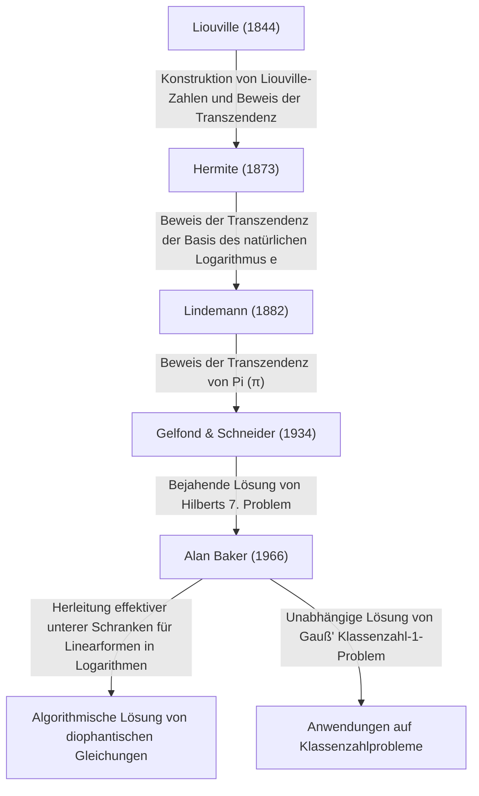

# [Alan Baker: Der Fields-Medaillengewinner, der die Theorie der transzendenten Zahlen revolutionierte](https://kenji.blog/de/p/baker/)

## 1. Einleitung

In der langen Geschichte der Mathematik gibt es unzählige Probleme, die täuschend einfach erscheinen und doch die klügsten Köpfe der Welt jahrhundertelang vor Rätsel gestellt haben. Unter diesen gilt das Studium der „transzendenten Zahlen“ als eines der tiefsten Gebiete der modernen Mathematik, das außergewöhnlich leistungsfähige theoretische Rahmenwerke erfordert und dessen Wurzeln auf das altgriechische Problem der „Quadratur des Kreises“ zurückgehen.

Der britische Mathematiker **[Alan Baker](https://kenji.blog/de/p/baker/)** brachte einen historischen Durchbruch in dieses ungemein anspruchsvolle Gebiet der Theorie der transzendenten Zahlen. Seine größte Errungenschaft, der „Satz über Linearformen in Logarithmen“ (oft einfach Bakers Satz genannt), überschritt die Grenzen der reinen Theorie der transzendenten Zahlen. Er spielte eine entscheidende Rolle bei der Lösung langjähriger offener Probleme, einschließlich Methoden zur Lösung spezifischer diophantischer Gleichungen und der Lösung des Gaußschen Klassenzahlproblems. Für diese bahnbrechenden Beiträge wurde ihm auf dem Internationalen Mathematikerkongress 1970 im jungen Alter von 31 Jahren die **Fields-Medaille** – die höchste Auszeichnung in der Mathematik – verliehen.

In diesem Artikel werden wir tief in das Leben von [Alan Baker](https://kenji.blog/de/p/baker/), die mathematischen Herausforderungen, denen er sich gegenübersah, und die Art und Weise, wie die von ihm etablierten Theorien die moderne Mathematik beeinflusst haben, eintauchen und dabei die mathematischen Details untersuchen.

## 2. Leben und Bildung

### 2.1 Frühes Leben und der Weg nach Cambridge
[Alan Baker](https://kenji.blog/de/p/baker/) wurde am 19. August 1939 in London, England, geboren. Er zeigte schon in jungen Jahren außergewöhnliches Talent für Mathematik, besuchte eine örtliche Grammar School und wechselte dann zum University College London (UCL). Dort studierte er rigoros die Grundlagen der Mathematik und schloss mit höchsten Auszeichnungen ab.

Auf der Suche nach größeren Höhen wechselte er anschließend an das Trinity College in Cambridge. Zu dieser Zeit war die Universität Cambridge eines der weltweit führenden Zentren für die Forschung in der Zahlentheorie. Dort studierte Baker unter dem großen Mathematiker **Harold Davenport**, der die britische Zahlentheorie-Gemeinschaft leitete. Davenport war eine Autorität auf dem Gebiet der diophantischen Approximation und der analytischen Zahlentheorie. Unter seiner Mentorenschaft verfeinerte Baker seine fortgeschrittene mathematische Intuition und rigorosen Beweistechniken.

### 2.2 Akademische Karriere und Ehrungen
Im Jahr 1964 promovierte Baker an der Universität Cambridge. Schon in seiner Doktorarbeit zeigten sich die Ansätze der herausragenden Ideen, die seinen Namen in die Geschichte eingehen lassen würden. Kurz nach seiner Promotion wurde er zum Fellow des Trinity College gewählt und begann ernsthaft mit seinen Forschungsaktivitäten.

1966 begann er, eine Reihe bahnbrechender Arbeiten über „Linearformen in Logarithmen“ zu veröffentlichen. Dieser Erfolg löste Schockwellen in der globalen mathematischen Gemeinschaft aus und führte zur Verleihung der **Fields-Medaille** auf dem Internationalen Mathematikerkongress (ICM) 1970 in Nizza, Frankreich.

Baker blieb für den Rest seiner Karriere als Professor für Reine Mathematik in Cambridge und trug immens zur Zahlentheorieforschung und zur Betreuung der nächsten Generation bei. Er reiste um die Welt, hielt Vorträge und war Gastprofessor an vielen Universitäten in Indien, den Vereinigten Staaten und anderswo. [Alan Baker](https://kenji.blog/de/p/baker/) verstarb am 4. Februar 2018 im Alter von 78 Jahren, aber die Sätze und Methoden, die er hinterließ, bleiben tief in der modernen computergestützten Zahlentheorie und Kryptographie verwurzelt.

## 3. Mathematische Errungenschaften: Theorie der transzendenten Zahlen und Bakers Satz

### 3.1 Grundlagen von algebraischen und transzendenten Zahlen
Um den wahren Wert von Bakers Arbeit zu würdigen, müssen wir zunächst die Einteilung von Zahlen in „algebraische“ und „transzendente“ Zahlen überprüfen.

- **Algebraische Zahl**: Eine komplexe Zahl, die Wurzel eines Nicht-Null-Polynoms mit rationalen Koeffizienten $\mathbb{Q}$ ist. Zum Beispiel fallen $\sqrt{2}$, die eine Wurzel von $x^2 - 2 = 0$ ist, und die Wurzeln von $x^4 + 1 = 0$ in diese Kategorie. Alle rationalen Zahlen sind ebenfalls algebraische Zahlen, da sie Wurzeln von linearen Gleichungen $qx - p = 0$ sind.
- **Transzendente Zahl**: Eine komplexe Zahl, die keine Wurzel eines Nicht-Null-Polynoms mit rationalen Koeffizienten ist. Prominente Beispiele sind die mathematischen Konstanten $\pi$ (Pi) und $e$ (die Basis des natürlichen Logarithmus).

Im späten 19. Jahrhundert bewies [Georg Cantor](https://kenji.blog/de/p/cantor/) aus einer mengentheoretischen Perspektive, dass die Menge der algebraischen Zahlen abzählbar unendlich ist, die Menge aller komplexen Zahlen jedoch überabzählbar unendlich ist. Das bedeutet, dass „fast alle Zahlen transzendent sind“. Zu beweisen, dass eine bestimmte gegebene Zahl transzendent ist, ist jedoch äußerst schwierig.

### 3.2 [Hilbert](https://kenji.blog/de/p/hilbert/)s 7. Problem und der Satz von Gelfond-Schneider
Im Jahr 1900 präsentierte [David Hilbert](https://kenji.blog/de/p/hilbert/) auf dem Internationalen Mathematikerkongress in Paris 23 ungelöste Probleme ([Hilbert](https://kenji.blog/de/p/hilbert/)s 23 Probleme). Sein 7. Problem war folgendes:

> „Wenn $\alpha$ eine algebraische Zahl ungleich $0$ oder $1$ ist und $\beta$ eine irrationale algebraische Zahl ist, ist dann $\alpha^\beta$ immer eine transzendente Zahl?“

Zum Beispiel wurde gefragt, ob Zahlen wie $2^{\sqrt{2}}$ oder $e^\pi$ (was umgeformt werden kann zu $i^{-2i}$, da $e^{\pi i} = -1$) transzendent sind.
Dieses Problem wurde 1934 von dem russischen Mathematiker Aleksandr Gelfond und dem deutschen Mathematiker Theodor Schneider unabhängig voneinander positiv gelöst. Dies ist als **Satz von Gelfond-Schneider** bekannt.

Dieser Satz kann mithilfe von logarithmischen Funktionen wie folgt umformuliert werden:
„Wenn $\log \alpha_1$ und $\log \alpha_2$ über dem Körper der rationalen Zahlen linear unabhängig sind, dann sind sie auch über dem Körper der algebraischen Zahlen linear unabhängig.“

### 3.3 Bakers Satz: Linearformen in Logarithmen
Baker vollbrachte die erstaunliche Leistung, das von Gelfond und Schneider für zwei Logarithmen bewiesene Ergebnis auf eine beliebige Anzahl von $n$ Logarithmen zu verallgemeinern.

**Bakers Satz (1966)**:
Seien $\alpha_1, \alpha_2, \ldots, \alpha_n$ algebraische Zahlen ungleich Null, und nehmen wir an, dass $\log \alpha_1, \log \alpha_2, \ldots, \log \alpha_n$ über dem Körper der rationalen Zahlen $\mathbb{Q}$ linear unabhängig sind. Dann sind $1, \log \alpha_1, \log \alpha_2, \ldots, \log \alpha_n$ über dem Körper der algebraischen Zahlen $\overline{\mathbb{Q}}$ linear unabhängig.

Mit anderen Worten bewies er für beliebige von Null verschiedene algebraische Zahlen $\beta_0, \beta_1, \ldots, \beta_n$, dass die folgende Linearform $\[Lambda](https://kenji.blog/de/p/serverless-architecture-aws-lambda-cold-start/)$ niemals gleich $0$ ist.

$$ \Lambda = \beta_0 + \beta_1 \log \alpha_1 + \cdots + \beta_n \log \alpha_n \neq 0 $$

### 3.4 Herleitung „effektiver“ unterer Schranken
Der wirklich revolutionäre Aspekt von Bakers Satz bestand nicht nur im Beweis, dass $\Lambda \neq 0$, sondern darin, dass er eine **effektive untere Schranke** für $|\Lambda|$ herleitete.
Viele frühere Sätze in der Zahlentheorie (wie der Satz von Roth) waren „ineffektiv“; sie konnten zeigen, dass „nur eine endliche Anzahl von Lösungen existiert“, aber nicht angeben, „wie groß die größte Lösung sein könnte“.

Baker lieferte eine berechenbare Grenze dafür, wie nah $|\Lambda|$ an $0$ herankommen kann, indem er eine spezifische positive Konstante $C$ verwendete, die von der „Höhe“ (einer Metrik bezüglich des maximalen Koeffizienten des Minimalpolynoms, das diese Zahl als Wurzel hat) und dem Grad der algebraischen Zahlen $\alpha_i$ und $\beta_i$ abhängt.

$$ |\Lambda| > C > 0 $$

Diese „Effektivität“ wurde zum Hauptschlüssel zur algorithmischen Lösung zahlreicher offener Probleme in der Zahlentheorie.

## 4. Anwendungen auf diophantische Gleichungen und das Klassenzahlproblem

Bakers Satz brachte dramatische Anwendungen jenseits der Theorie der transzendenten Zahlen in andere Bereiche der Theorie der ganzen Zahlen.

### 4.1 Effektive Methoden für diophantische Gleichungen
Eine diophantische Gleichung ist eine Polynomgleichung mit ganzzahligen Koeffizienten, für die ganzzahlige Lösungen gesucht werden.
Betrachten wir zum Beispiel die **Thue-Gleichung** der folgenden Form:

$$ f(x, y) = m $$

Hier ist $f(x, y)$ ein irreduzibles homogenes Polynom vom Grad mindestens 3, und $m$ ist eine ganze Zahl ungleich Null.
Im Jahr 1909 bewies Axel Thue, dass es für diese Gleichung nur endlich viele ganzzahlige Lösungen $(x, y)$ gibt. Sein Beweis war jedoch ineffektiv, sodass keine Methode bekannt war, um alle Lösungen zu finden.

Durch die Verwendung seiner unteren Schranken für Linearformen in Logarithmen berechnete Baker erfolgreich explizite obere Schranken für die Absolutwerte der Variablen $x$ und $y$. Infolgedessen wurde ein Algorithmus etabliert, um alle Lösungen von Thue-Gleichungen durch eine endliche Suche mit einem Computer vollständig zu bestimmen. Ähnliche Techniken wurden auf komplexere diophantische Gleichungen wie die **Mordell-Gleichung** $y^2 = x^3 + k$ angewendet, was die Entwicklung eines neuen Feldes vorantrieb, das als computergestützte Zahlentheorie bekannt ist.

```python
# Konzeptuelles Codebeispiel zur Lösung einer Thue-Gleichung mit SageMath
# Suche nach ganzzahligen Lösungen für die Gleichung x^3 - 2y^3 = 1
x, y = var('x y')
eq = x^3 - 2*y^3 == 1
# Basierend auf Bakers Satz wird eine obere Schranke für den Absolutwert der Lösungen berechnet,
# was es ermöglicht, alle trivialen Lösungen (wie (1, 0)) durch eine endliche Suche zu identifizieren.
```

### 4.2 Lösung von Gauß' Klassenzahl-1-Problem
Der große Mathematiker des 19. Jahrhunderts, [Carl Friedrich Gauß](https://kenji.blog/de/p/gauss/), stellte eine Vermutung bezüglich der Klassenzahl (der Ordnung der Idealklassengruppe) von imaginär-quadratischen Körpern $\mathbb{Q}(\sqrt{-d})$ auf. Er vermutete, dass die einzigen Werte von $d > 0$, für die die Klassenzahl 1 ist (was bedeutet, dass die eindeutige Primfaktorzerlegung gilt), die neun Werte $d = 3, 4, 7, 8, 11, 19, 43, 67, 163$ sind. Dies ist als das **Klassenzahl-1-Problem** bekannt.

Dieses Problem wurde im Wesentlichen 1952 von Kurt Heegner unter Verwendung von Modulfunktionen gelöst, aber seine Arbeit wurde als unklar erachtet und von der damaligen mathematischen Gemeinschaft nicht weithin akzeptiert.
Später, im Jahr 1967, formalisierte Harold Stark Heegners Beweis rigoros und vollendete ihn unabhängig. Erstaunlicherweise bewies [Alan Baker](https://kenji.blog/de/p/baker/) fast zur gleichen Zeit diese Vermutung mit einem völlig anderen Ansatz, der auf seiner Methode der „Linearformen in Logarithmen“ basierte, ohne Modulfunktionen zu verwenden.
Bakers Methode erwies sich als äußerst vielseitig und wurde in der Folge zur Lösung weiterer verallgemeinerter Probleme angewendet, beispielsweise zur Bestimmung aller imaginär-quadratischen Körper mit der Klassenzahl 2.

## 5. Genealogie der Theorie der transzendenten Zahlen

Die historische Positionierung von Bakers Errungenschaften in der Theorie der transzendenten Zahlen kann in dem folgenden Diagramm zusammengefasst werden. Er integrierte die Theorien seiner Vorgänger und konstruierte ein völlig neues, berechenbares theoretisches Rahmenwerk.



## 6. Fazit

Mit dem Aufkommen von [Alan Baker](https://kenji.blog/de/p/baker/) trat die Zahlentheorie – insbesondere das Studium der Theorie der transzendenten Zahlen und der diophantischen Gleichungen – in eine völlig neue Ära ein. Die von ihm präsentierten „effektiven Berechnungsmethoden“ brachten algorithmische Ansätze in die abstrakte reine Mathematik und dienen nun als Teil des mathematischen Fundaments, das die moderne Informatik und Kryptographie untermauert.

Seine Forschung zur Begrenzung der Lösungen von diophantischen Gleichungen schlug auch eine Brücke zu tieferen Theorien wie der **abc-Vermutung**, die heute noch eines der größten ungelösten Probleme der Zahlentheorie ist.
Als großer Mathematiker, der brillante Intuition mit überwältigender logischer Kraft verband, um hochkomplexe und technische Beweise zu vervollständigen, hinterließ [Alan Baker](https://kenji.blog/de/p/baker/) ein Vermächtnis von Sätzen und eine Leidenschaft für die Zahlentheorie, die in der Geschichte der Mathematik zweifellos weiterhin hell leuchten wird, ohne jemals zu verblassen.
