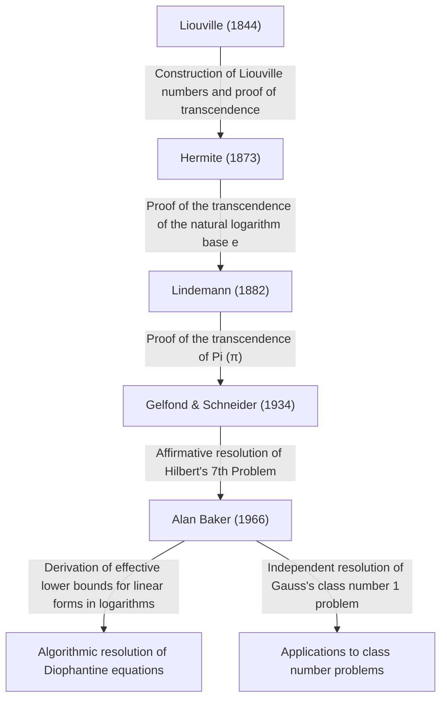

# [Alan Baker: The Fields Medalist Who Revolutionized Transcendental Number Theory](https://kenji.blog/en/p/baker/)

## 1. Introduction

In the long history of mathematics, there are countless problems that seem deceptively simple yet have puzzled the world's greatest minds for centuries. Among these, the study of "Transcendental numbers" is known as one of the deepest fields in modern mathematics, demanding exceptionally powerful theoretical frameworks, with roots tracing back to the ancient Greek problem of "squaring the circle."

The British mathematician **[Alan Baker](https://kenji.blog/en/p/baker/)** brought a historic breakthrough to this immensely challenging field of transcendental number theory. His greatest achievement, the "Theorem on Linear Forms in Logarithms" (often simply called Baker's Theorem), transcended the boundaries of pure transcendental number theory. It played a decisive role in solving long-standing open problems, including methods for solving specific Diophantine equations and resolving Gauss's class number problem. For these groundbreaking contributions, he was awarded the **Fields Medal**—the highest honor in mathematics—at the 1970 International Congress of Mathematicians at the young age of 31.

In this article, we will delve deeply into [Alan Baker](https://kenji.blog/en/p/baker/)'s life, the mathematical challenges he faced, and how the theories he established have influenced modern mathematics, all while exploring the mathematical details.

## 2. Life and Education

### 2.1 Early Life and the Path to Cambridge
[Alan Baker](https://kenji.blog/en/p/baker/) was born on August 19, 1939, in London, England. Showing extraordinary talent in mathematics from an early age, he attended a local grammar school before proceeding to University College London (UCL). There, he rigorously studied the foundations of mathematics and graduated with top honors.

Seeking greater heights, he then moved to Trinity College, Cambridge. At the time, the University of Cambridge was one of the world's leading centers for number theory research. There, Baker studied under the great mathematician **Harold Davenport**, who was leading the British number theory community. Davenport was an authority on Diophantine approximation and analytic number theory. Under his mentorship, Baker honed his advanced mathematical intuition and rigorous proof techniques.

### 2.2 Academic Career and Honors
In 1964, Baker obtained his Ph.D. from the University of Cambridge. Even in his doctoral thesis, the seeds of the outstanding ideas that would leave his name in history were already apparent. Shortly after earning his doctorate, he was elected a Fellow of Trinity College and began his research activities in earnest.

In 1966, he began publishing a series of groundbreaking papers on "Linear forms in logarithms." This achievement sent shockwaves through the global mathematical community, leading to his award of the **Fields Medal** at the 1970 International Congress of Mathematicians (ICM) held in Nice, France.

Baker remained at Cambridge for the rest of his career as a Professor of Pure Mathematics, contributing immensely to number theory research and the mentoring of the next generation. He traveled the world giving lectures and served as a visiting professor at many universities in India, the United States, and elsewhere. [Alan Baker](https://kenji.blog/en/p/baker/) passed away on February 4, 2018, at the age of 78, but the theorems and methods he left behind remain deeply ingrained in modern computational number theory and cryptography.

## 3. Mathematical Achievements: Transcendental Number Theory and Baker's Theorem

### 3.1 Basics of Algebraic and Transcendental Numbers
To appreciate the true value of Baker's work, we must first review the classification of numbers into "algebraic" and "transcendental" numbers.

- **Algebraic number**: A complex number that is a root of a non-zero polynomial with rational coefficients $\mathbb{Q}$. For example, $\sqrt{2}$, which is a root of $x^2 - 2 = 0$, and the roots of $x^4 + 1 = 0$ fall into this category. All rational numbers are also algebraic numbers since they are roots of linear equations $qx - p = 0$.
- **Transcendental number**: A complex number that is not a root of any non-zero polynomial with rational coefficients. Prime examples include the mathematical constants $\pi$ (pi) and $e$ (the base of the natural logarithm).

In the late 19th century, [Georg Cantor](https://kenji.blog/en/p/cantor/) proved from a set-theoretic perspective that while the set of algebraic numbers is countably infinite, the set of all complex numbers is uncountably infinite. This means that "almost all numbers are transcendental." However, proving that a specific given number is transcendental is exceedingly difficult.

### 3.2 Hilbert's 7th Problem and the Gelfond-Schneider Theorem
In 1900, [David Hilbert](https://kenji.blog/en/p/hilbert/) presented 23 unsolved problems (Hilbert's 23 Problems) at the International Congress of Mathematicians in Paris. His 7th problem was as follows:

> "If $\alpha$ is an algebraic number other than $0$ or $1$, and $\beta$ is an irrational algebraic number, is $\alpha^\beta$ always a transcendental number?"

For instance, this asked whether numbers like $2^{\sqrt{2}}$ or $e^\pi$ (which can be transformed to $i^{-2i}$ since $e^{\pi i} = -1$) are transcendental.
This problem was solved affirmatively and independently in 1934 by the Russian mathematician Aleksandr Gelfond and the German mathematician Theodor Schneider. This is known as the **Gelfond–Schneider theorem**.

This theorem can be rephrased using logarithmic functions as follows:
"If $\log \alpha_1$ and $\log \alpha_2$ are linearly independent over the field of rational numbers, then they are also linearly independent over the field of algebraic numbers."

### 3.3 Baker's Theorem: Linear Forms in Logarithms
Baker achieved the astonishing feat of generalizing the result proved by Gelfond and Schneider for two logarithms to an arbitrary number of $n$ logarithms.

**Baker's Theorem (1966)**:
Let $\alpha_1, \alpha_2, \ldots, \alpha_n$ be non-zero algebraic numbers, and assume that $\log \alpha_1, \log \alpha_2, \ldots, \log \alpha_n$ are linearly independent over the rational field $\mathbb{Q}$. Then, $1, \log \alpha_1, \log \alpha_2, \ldots, \log \alpha_n$ are linearly independent over the algebraic number field $\overline{\mathbb{Q}}$.

In other words, for any non-zero algebraic numbers $\beta_0, \beta_1, \ldots, \beta_n$, he proved that the following linear form $\Lambda$ is never equal to $0$.

$$ \Lambda = \beta_0 + \beta_1 \log \alpha_1 + \cdots + \beta_n \log \alpha_n \neq 0 $$

### 3.4 Derivation of "Effective" Lower Bounds
The truly revolutionary aspect of Baker's theorem was not merely proving that $\Lambda \neq 0$, but that he derived an **effective lower bound** for $|\Lambda|$.
Many prior theorems in number theory (such as Roth's theorem) were "ineffective"; they could show that "only a finite number of solutions exist" but could not indicate "how large the largest solution could be."

Baker provided a computable limit on how close $|\Lambda|$ could get to $0$, using a specific positive constant $C$ that depends on the "height" (a metric related to the maximum coefficient of the minimal polynomial having that number as a root) and degree of the algebraic numbers $\alpha_i$ and $\beta_i$.

$$ |\Lambda| > C > 0 $$

This "effectiveness" became the master key for solving numerous open problems in number theory algorithmically.

## 4. Applications to Diophantine Equations and the Class Number Problem

Baker's theorem brought dramatic applications beyond transcendental number theory into other areas of integer number theory.

### 4.1 Effective Methods for Diophantine Equations
A Diophantine equation is a polynomial equation with integer coefficients for which integer solutions are sought.
Consider, for example, the **Thue equation** of the following form:

$$ f(x, y) = m $$

Here, $f(x, y)$ is an irreducible homogeneous polynomial of degree at least 3, and $m$ is a non-zero integer.
In 1909, Axel Thue proved that there are only finitely many integer solutions $(x, y)$ for this equation. However, his proof was ineffective, so no method was known to find all the solutions.

By utilizing his lower bounds for linear forms in logarithms, Baker successfully calculated explicit upper bounds for the absolute values of the variables $x$ and $y$. As a result, an algorithm was established to completely determine all solutions of Thue equations by performing a finite search using a computer. Similar techniques were applied to more complex Diophantine equations such as the **Mordell equation** $y^2 = x^3 + k$, spurring the development of a new field known as computational number theory.

```python
# Conceptual code example solving a Thue equation using SageMath
# Searching for integer solutions to the equation x^3 - 2y^3 = 1
x, y = var('x y')
eq = x^3 - 2*y^3 == 1
# Based on Baker's theorem, an upper bound for the absolute value of the solutions is calculated,
# making it possible to identify all trivial solutions (like (1, 0)) through a finite search.
```

### 4.2 Solving Gauss's Class Number 1 Problem
The great 19th-century mathematician [Carl Friedrich Gauss](https://kenji.blog/en/p/gauss/) posited a conjecture regarding the class number (the order of the ideal class group) of imaginary quadratic fields $\mathbb{Q}(\sqrt{-d})$. He conjectured that the only values of $d > 0$ for which the class number is 1 (meaning unique factorization holds) are the nine values $d = 3, 4, 7, 8, 11, 19, 43, 67, 163$. This is known as the **Class number 1 problem**.

This problem was essentially solved in 1952 by Kurt Heegner using modular functions, but his paper was deemed to have unclear points and was not widely accepted by the mathematical community at the time.
Later, in 1967, Harold Stark rigorously formalized Heegner's proof, independently completing it. Astonishingly, around the exact same time, [Alan Baker](https://kenji.blog/en/p/baker/) proved this conjecture using a completely different approach based on his "linear forms in logarithms" method, without using any modular functions.
Baker's method proved to be highly versatile, and it was subsequently applied to solve further generalized problems, such as determining all imaginary quadratic fields with class number 2.

## 5. Genealogy of Transcendental Number Theory

The historical positioning of Baker's achievements in transcendental number theory can be summarized in the following diagram. He integrated the theories of his predecessors and constructed a completely new, computable theoretical framework.



## 6. Conclusion

With the emergence of [Alan Baker](https://kenji.blog/en/p/baker/), number theory—especially the study of transcendental number theory and Diophantine equations—entered a completely new era. The "effective computation methods" he presented brought algorithmic approaches to abstract pure mathematics, and they now serve as part of the mathematical foundation underpinning modern computer science and cryptography.

His research on bounding the solutions to Diophantine equations also provided a bridge to deeper theories, such as the **abc conjecture**, which remains one of the greatest unsolved problems in number theory today.
A great mathematician who combined brilliant intuition with the overwhelming logical power to complete highly complex and technical proofs, [Alan Baker](https://kenji.blog/en/p/baker/) left a legacy of theorems and a passion for number theory that will undoubtedly continue to shine brightly in the history of mathematics without ever fading.
