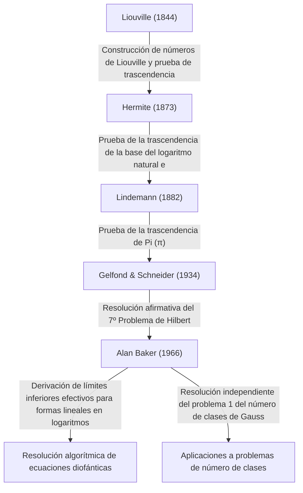

# [Alan Baker: El medallista Fields que revolucionó la teoría de números trascendentes](https://kenji.blog/es/p/baker/)

## 1. Introducción

En la larga historia de las matemáticas, hay innumerables problemas que parecen engañosamente simples y que, sin embargo, han desconcertado a las mentes más brillantes del mundo durante siglos. Entre ellos, el estudio de los "números trascendentes" es conocido como uno de los campos más profundos de las matemáticas modernas, exigiendo marcos teóricos excepcionalmente poderosos, con raíces que se remontan al antiguo problema griego de la "cuadratura del círculo".

El matemático británico **[Alan Baker](https://kenji.blog/es/p/baker/)** logró un avance histórico en este campo inmensamente desafiante de la teoría de números trascendentes. Su mayor logro, el "Teorema sobre formas lineales en logaritmos" (a menudo llamado simplemente Teorema de Baker), trascendió los límites de la teoría pura de números trascendentes. Jugó un papel decisivo en la resolución de problemas abiertos de larga data, incluyendo métodos para resolver ecuaciones diofánticas específicas y la resolución del problema del número de clases de Gauss. Por estas contribuciones revolucionarias, fue galardonado con la **Medalla Fields** —el más alto honor en matemáticas— en el Congreso Internacional de Matemáticos de 1970 a la temprana edad de 31 años.

En este artículo, profundizaremos en la vida de [Alan Baker](https://kenji.blog/es/p/baker/), los desafíos matemáticos que enfrentó y cómo las teorías que estableció han influido en las matemáticas modernas, todo ello explorando los detalles matemáticos.

## 2. Vida y Educación

### 2.1 Primeros años y el camino hacia Cambridge
[Alan Baker](https://kenji.blog/es/p/baker/) nació el 19 de agosto de 1939 en Londres, Inglaterra. Mostrando un talento extraordinario para las matemáticas desde temprana edad, asistió a una escuela primaria local antes de pasar al University College de Londres (UCL). Allí, estudió rigurosamente los fundamentos de las matemáticas y se graduó con los más altos honores.

Buscando alcanzar mayores alturas, luego se trasladó al Trinity College, Cambridge. En ese momento, la Universidad de Cambridge era uno de los principales centros mundiales de investigación en teoría de números. Allí, Baker estudió con el gran matemático **Harold Davenport**, quien lideraba la comunidad británica de teoría de números. Davenport era una autoridad en aproximación diofántica y teoría analítica de números. Bajo su mentoría, Baker perfeccionó su avanzada intuición matemática y sus rigurosas técnicas de demostración.

### 2.2 Carrera académica y honores
En 1964, Baker obtuvo su doctorado de la Universidad de Cambridge. Incluso en su tesis doctoral, las semillas de las ideas sobresalientes que dejarían su nombre en la historia ya eran evidentes. Poco después de obtener su doctorado, fue elegido Fellow del Trinity College y comenzó sus actividades de investigación con seriedad.

En 1966, comenzó a publicar una serie de artículos innovadores sobre "formas lineales en logaritmos". Este logro envió ondas de choque a través de la comunidad matemática global, lo que lo llevó a recibir la **Medalla Fields** en el Congreso Internacional de Matemáticos (ICM) de 1970 celebrado en Niza, Francia.

Baker permaneció en Cambridge por el resto de su carrera como Profesor de Matemáticas Puras, contribuyendo inmensamente a la investigación en teoría de números y a la tutoría de la siguiente generación. Viajó por el mundo dando conferencias y se desempeñó como profesor visitante en muchas universidades de India, Estados Unidos y otros lugares. [Alan Baker](https://kenji.blog/es/p/baker/) falleció el 4 de febrero de 2018 a la edad de 78 años, pero los teoremas y métodos que dejó atrás siguen profundamente arraigados en la criptografía y la teoría de números computacional modernas.

## 3. Logros matemáticos: Teoría de números trascendentes y el Teorema de Baker

### 3.1 Conceptos básicos de números algebraicos y trascendentes
Para apreciar el verdadero valor del trabajo de Baker, primero debemos revisar la clasificación de los números en "algebraicos" y "trascendentes".

- **Número algebraico**: Un número complejo que es raíz de un polinomio no nulo con coeficientes racionales $\mathbb{Q}$. Por ejemplo, $\sqrt{2}$, que es una raíz de $x^2 - 2 = 0$, y las raíces de $x^4 + 1 = 0$ caen en esta categoría. Todos los números racionales también son números algebraicos ya que son raíces de ecuaciones lineales $qx - p = 0$.
- **Número trascendente**: Un número complejo que no es raíz de ningún polinomio no nulo con coeficientes racionales. Ejemplos destacados incluyen las constantes matemáticas $\pi$ (pi) y $e$ (la base del logaritmo natural).

A finales del siglo XIX, [Georg Cantor](https://kenji.blog/es/p/cantor/) demostró desde una perspectiva de la teoría de conjuntos que mientras el conjunto de números algebraicos es infinito numerable, el conjunto de todos los números complejos es infinito no numerable. Esto significa que "casi todos los números son trascendentes". Sin embargo, demostrar que un número específico dado es trascendente es extremadamente difícil.

### 3.2 El Séptimo Problema de [Hilbert](https://kenji.blog/es/p/hilbert/) y el Teorema de Gelfond-Schneider
En 1900, [David Hilbert](https://kenji.blog/es/p/hilbert/) presentó 23 problemas sin resolver (los 23 problemas de [Hilbert](https://kenji.blog/es/p/hilbert/)) en el Congreso Internacional de Matemáticos en París. Su séptimo problema fue el siguiente:

> "Si $\alpha$ es un número algebraico distinto de $0$ o $1$, y $\beta$ es un número algebraico irracional, ¿es $\alpha^\beta$ siempre un número trascendente?"

Por ejemplo, esto preguntaba si números como $2^{\sqrt{2}}$ o $e^\pi$ (que se puede transformar a $i^{-2i}$ ya que $e^{\pi i} = -1$) son trascendentes.
Este problema fue resuelto afirmativamente e independientemente en 1934 por el matemático ruso Aleksandr Gelfond y el matemático alemán Theodor Schneider. Esto se conoce como el **teorema de Gelfond-Schneider**.

Este teorema se puede reformular utilizando funciones logarítmicas de la siguiente manera:
"Si $\log \alpha_1$ y $\log \alpha_2$ son linealmente independientes sobre el cuerpo de los números racionales, entonces también son linealmente independientes sobre el cuerpo de los números algebraicos."

### 3.3 El Teorema de Baker: Formas lineales en logaritmos
Baker logró la asombrosa hazaña de generalizar el resultado demostrado por Gelfond y Schneider para dos logaritmos a un número arbitrario de $n$ logaritmos.

**Teorema de Baker (1966)**:
Sean $\alpha_1, \alpha_2, \ldots, \alpha_n$ números algebraicos no nulos, y supongamos que $\log \alpha_1, \log \alpha_2, \ldots, \log \alpha_n$ son linealmente independientes sobre el cuerpo de los racionales $\mathbb{Q}$. Entonces, $1, \log \alpha_1, \log \alpha_2, \ldots, \log \alpha_n$ son linealmente independientes sobre el cuerpo de los números algebraicos $\overline{\mathbb{Q}}$.

En otras palabras, para cualesquiera números algebraicos no nulos $\beta_0, \beta_1, \ldots, \beta_n$, demostró que la siguiente forma lineal $\Lambda$ nunca es igual a $0$.

$$ \Lambda = \beta_0 + \beta_1 \log \alpha_1 + \cdots + \beta_n \log \alpha_n \neq 0 $$

### 3.4 Derivación de límites inferiores "efectivos"
El aspecto verdaderamente revolucionario del teorema de Baker no fue simplemente demostrar que $\Lambda \neq 0$, sino que derivó un **límite inferior efectivo** para $|\Lambda|$.
Muchos teoremas anteriores en teoría de números (como el teorema de Roth) eran "inefectivos"; podían mostrar que "sólo existe un número finito de soluciones", pero no podían indicar "cuán grande podría ser la solución más grande".

Baker proporcionó un límite calculable sobre cuán cerca de $0$ podría estar $|\Lambda|$, utilizando una constante positiva específica $C$ que depende de la "altura" (una métrica relacionada con el coeficiente máximo del polinomio mínimo que tiene a ese número como raíz) y el grado de los números algebraicos $\alpha_i$ y $\beta_i$.

$$ |\Lambda| > C > 0 $$

Esta "efectividad" se convirtió en la llave maestra para resolver algorítmicamente numerosos problemas abiertos en la teoría de números.

## 4. Aplicaciones a Ecuaciones Diofánticas y el Problema del Número de Clases

El teorema de Baker trajo aplicaciones dramáticas más allá de la teoría de números trascendentes a otras áreas de la teoría de números enteros.

### 4.1 Métodos efectivos para Ecuaciones Diofánticas
Una ecuación diofántica es una ecuación polinómica con coeficientes enteros para la cual se buscan soluciones enteras.
Consideremos, por ejemplo, la **ecuación de Thue** de la siguiente forma:

$$ f(x, y) = m $$

Aquí, $f(x, y)$ es un polinomio homogéneo irreducible de grado al menos 3, y $m$ es un entero no nulo.
En 1909, Axel Thue demostró que solo hay un número finito de soluciones enteras $(x, y)$ para esta ecuación. Sin embargo, su prueba fue inefectiva, por lo que no se conocía ningún método para encontrar todas las soluciones.

Al utilizar sus límites inferiores para formas lineales en logaritmos, Baker calculó con éxito límites superiores explícitos para los valores absolutos de las variables $x$ e $y$. Como resultado, se estableció un algoritmo para determinar completamente todas las soluciones de las ecuaciones de Thue realizando una búsqueda finita mediante un ordenador. Técnicas similares se aplicaron a ecuaciones diofánticas más complejas como la **ecuación de Mordell** $y^2 = x^3 + k$, estimulando el desarrollo de un nuevo campo conocido como teoría de números computacional.

```python
# Ejemplo conceptual de código para resolver una ecuación de Thue usando SageMath
# Búsqueda de soluciones enteras para la ecuación x^3 - 2y^3 = 1
x, y = var('x y')
eq = x^3 - 2*y^3 == 1
# Basado en el teorema de Baker, se calcula un límite superior para el valor absoluto de las soluciones,
# lo que hace posible identificar todas las soluciones triviales (como (1, 0)) a través de una búsqueda finita.
```

### 4.2 Resolución del Problema 1 del Número de Clases de Gauss
El gran matemático del siglo XIX [Carl Friedrich Gauss](https://kenji.blog/es/p/gauss/) planteó una conjetura sobre el número de clases (el orden del grupo de clases de ideales) de los cuerpos cuadráticos imaginarios $\mathbb{Q}(\sqrt{-d})$. Conjeturó que los únicos valores de $d > 0$ para los cuales el número de clases es 1 (lo que significa que la factorización única se cumple) son los nueve valores $d = 3, 4, 7, 8, 11, 19, 43, 67, 163$. Esto se conoce como el **Problema del número de clases 1**.

Este problema fue resuelto esencialmente en 1952 por Kurt Heegner usando funciones modulares, pero su artículo fue considerado oscuro y no fue ampliamente aceptado por la comunidad matemática de la época.
Más tarde, en 1967, Harold Stark formalizó rigurosamente la prueba de Heegner, completándola de forma independiente. Sorprendentemente, casi al mismo tiempo, [Alan Baker](https://kenji.blog/es/p/baker/) demostró esta conjetura utilizando un enfoque completamente diferente basado en su método de "formas lineales en logaritmos", sin usar ninguna función modular.
El método de Baker demostró ser muy versátil y posteriormente se aplicó para resolver problemas más generalizados, como la determinación de todos los cuerpos cuadráticos imaginarios con número de clases 2.

## 5. Genealogía de la Teoría de Números Trascendentes

El posicionamiento histórico de los logros de Baker en la teoría de números trascendentes se puede resumir en el siguiente diagrama. Integró las teorías de sus predecesores y construyó un marco teórico completamente nuevo y calculable.



## 6. Conclusión

Con la aparición de [Alan Baker](https://kenji.blog/es/p/baker/), la teoría de números —especialmente el estudio de la teoría de números trascendentes y las ecuaciones diofánticas— entró en una era completamente nueva. Los "métodos de computación efectivos" que presentó llevaron enfoques algorítmicos a las matemáticas puras abstractas y ahora sirven como parte del fundamento matemático que sustenta la informática y la criptografía modernas.

Su investigación sobre la delimitación de las soluciones a las ecuaciones diofánticas también proporcionó un puente hacia teorías más profundas, como la **conjetura abc**, que sigue siendo hoy uno de los mayores problemas sin resolver en la teoría de números.
Un gran matemático que combinó una intuición brillante con un abrumador poder lógico para completar pruebas altamente complejas y técnicas, [Alan Baker](https://kenji.blog/es/p/baker/) dejó un legado de teoremas y una pasión por la teoría de números que, sin duda, seguirá brillando en la historia de las matemáticas sin desvanecerse jamás.
