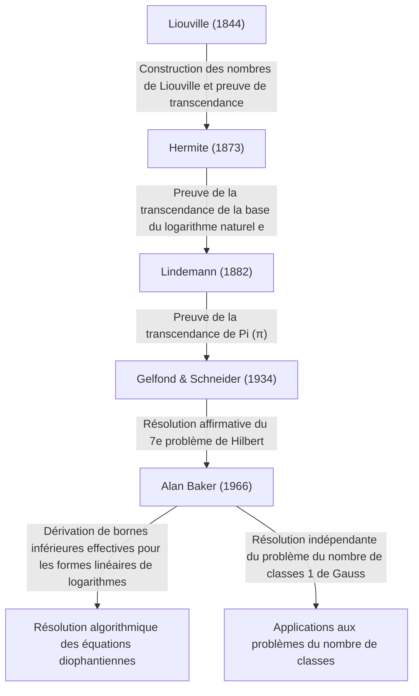

# Alan Baker : Le médaillé Fields qui a révolutionné la théorie des nombres transcendants

## 1. Introduction

Dans la longue histoire des mathématiques, il existe d'innombrables problèmes qui semblent trompeusement simples et qui ont pourtant déconcerté les plus grands esprits du monde pendant des siècles. Parmi ceux-ci, l'étude des « nombres transcendants » est connue comme l'un des domaines les plus profonds des mathématiques modernes, exigeant des cadres théoriques exceptionnellement puissants, avec des racines remontant au problème de la Grèce antique de la « quadrature du cercle ».

Le mathématicien britannique **Alan Baker** a apporté une percée historique dans ce domaine extrêmement difficile qu'est la théorie des nombres transcendants. Sa plus grande réalisation, le « Théorème sur les formes linéaires de logarithmes » (souvent appelé simplement Théorème de Baker), a transcendé les frontières de la théorie pure des nombres transcendants. Il a joué un rôle décisif dans la résolution de problèmes ouverts de longue date, notamment des méthodes de résolution d'équations diophantiennes spécifiques et la résolution du problème du nombre de classes de Gauss. Pour ces contributions révolutionnaires, il a reçu la **Médaille Fields** — la plus haute distinction en mathématiques — lors du Congrès international des mathématiciens de 1970, à l'âge précoce de 31 ans.

Dans cet article, nous plongerons profondément dans la vie d'Alan Baker, les défis mathématiques auxquels il a été confronté, et comment les théories qu'il a établies ont influencé les mathématiques modernes, tout en explorant les détails mathématiques.

## 2. Vie et Éducation

### 2.1 Jeunesse et chemin vers Cambridge
Alan Baker est né le 19 août 1939 à Londres, en Angleterre. Montrant un talent extraordinaire en mathématiques dès son plus jeune âge, il a fréquenté un lycée local avant de poursuivre à l'University College London (UCL). Là, il a rigoureusement étudié les fondements des mathématiques et a obtenu son diplôme avec les plus grands honneurs.

Cherchant à atteindre de plus hauts sommets, il a ensuite rejoint le Trinity College de Cambridge. À l'époque, l'Université de Cambridge était l'un des principaux centres mondiaux de recherche en théorie des nombres. Là-bas, Baker a étudié sous la direction du grand mathématicien **Harold Davenport**, qui dirigeait la communauté britannique de la théorie des nombres. Davenport était une autorité en matière d'approximation diophantienne et de théorie analytique des nombres. Sous son mentorat, Baker a perfectionné son intuition mathématique avancée et ses techniques de preuve rigoureuses.

### 2.2 Carrière académique et distinctions
En 1964, Baker a obtenu son doctorat de l'Université de Cambridge. Même dans sa thèse de doctorat, les prémices des idées exceptionnelles qui allaient inscrire son nom dans l'histoire étaient déjà apparentes. Peu après l'obtention de son doctorat, il a été élu membre (Fellow) du Trinity College et a commencé sérieusement ses activités de recherche.

En 1966, il a commencé à publier une série d'articles révolutionnaires sur les « formes linéaires de logarithmes ». Cette réalisation a provoqué une onde de choc au sein de la communauté mathématique mondiale, menant à son obtention de la **Médaille Fields** lors du Congrès international des mathématiciens (CIM) de 1970, tenu à Nice, en France.

Baker est resté à Cambridge pour le reste de sa carrière en tant que professeur de mathématiques pures, contribuant immensément à la recherche en théorie des nombres et au mentorat de la génération suivante. Il a voyagé dans le monde entier pour donner des conférences et a été professeur invité dans de nombreuses universités en Inde, aux États-Unis, et ailleurs. Alan Baker est décédé le 4 février 2018 à l'âge de 78 ans, mais les théorèmes et méthodes qu'il a laissés derrière lui restent profondément ancrés dans la théorie informatique des nombres et la cryptographie modernes.

## 3. Réalisations mathématiques : Théorie des nombres transcendants et Théorème de Baker

### 3.1 Bases des nombres algébriques et transcendants
Pour apprécier la véritable valeur du travail de Baker, nous devons d'abord revoir la classification des nombres en nombres « algébriques » et « transcendants ».

- **Nombre algébrique** : Un nombre complexe qui est racine d'un polynôme non nul à coefficients rationnels $\mathbb{Q}$. Par exemple, $\sqrt{2}$, qui est une racine de $x^2 - 2 = 0$, et les racines de $x^4 + 1 = 0$ entrent dans cette catégorie. Tous les nombres rationnels sont également des nombres algébriques car ils sont racines d'équations linéaires $qx - p = 0$.
- **Nombre transcendant** : Un nombre complexe qui n'est racine d'aucun polynôme non nul à coefficients rationnels. Les exemples phares incluent les constantes mathématiques $\pi$ (pi) et $e$ (la base du logarithme naturel).

À la fin du XIXe siècle, Georg Cantor a prouvé d'un point de vue de la théorie des ensembles que, bien que l'ensemble des nombres algébriques soit infini dénombrable, l'ensemble de tous les nombres complexes est infini non dénombrable. Cela signifie que « presque tous les nombres sont transcendants ». Cependant, prouver qu'un nombre spécifique donné est transcendant est extrêmement difficile.

### 3.2 Le 7e problème de Hilbert et le théorème de Gelfond-Schneider
En 1900, David Hilbert a présenté 23 problèmes non résolus (les 23 problèmes de Hilbert) lors du Congrès international des mathématiciens à Paris. Son 7e problème était le suivant :

> « Si $\alpha$ est un nombre algébrique autre que $0$ ou $1$, et $\beta$ est un nombre algébrique irrationnel, $\alpha^\beta$ est-il toujours un nombre transcendant ? »

Par exemple, il demandait si des nombres comme $2^{\sqrt{2}}$ ou $e^\pi$ (qui peut être transformé en $i^{-2i}$ puisque $e^{\pi i} = -1$) sont transcendants.
Ce problème a été résolu par l'affirmative et indépendamment en 1934 par le mathématicien russe Aleksandr Gelfond et le mathématicien allemand Theodor Schneider. C'est ce que l'on appelle le **théorème de Gelfond-Schneider**.

Ce théorème peut être reformulé en utilisant des fonctions logarithmiques comme suit :
« Si $\log \alpha_1$ et $\log \alpha_2$ sont linéairement indépendants sur le corps des nombres rationnels, alors ils sont également linéairement indépendants sur le corps des nombres algébriques. »

### 3.3 Le théorème de Baker : Formes linéaires de logarithmes
Baker a accompli l'exploit étonnant de généraliser le résultat prouvé par Gelfond et Schneider pour deux logarithmes à un nombre arbitraire $n$ de logarithmes.

**Théorème de Baker (1966)** :
Soient $\alpha_1, \alpha_2, \ldots, \alpha_n$ des nombres algébriques non nuls, et supposons que $\log \alpha_1, \log \alpha_2, \ldots, \log \alpha_n$ sont linéairement indépendants sur le corps des rationnels $\mathbb{Q}$. Alors, $1, \log \alpha_1, \log \alpha_2, \ldots, \log \alpha_n$ sont linéairement indépendants sur le corps des nombres algébriques $\overline{\mathbb{Q}}$.

En d'autres termes, pour tous nombres algébriques non nuls $\beta_0, \beta_1, \ldots, \beta_n$, il a prouvé que la forme linéaire suivante $\Lambda$ n'est jamais égale à $0$.

$$ \Lambda = \beta_0 + \beta_1 \log \alpha_1 + \cdots + \beta_n \log \alpha_n \neq 0 $$

### 3.4 Dérivation de bornes inférieures « effectives »
L'aspect véritablement révolutionnaire du théorème de Baker n'était pas seulement de prouver que $\Lambda \neq 0$, mais qu'il a dérivé une **borne inférieure effective** pour $|\Lambda|$.
De nombreux théorèmes antérieurs en théorie des nombres (comme le théorème de Roth) étaient « ineffectifs » ; ils pouvaient montrer que « seul un nombre fini de solutions existe » mais ne pouvaient pas indiquer « quelle pourrait être la taille de la plus grande solution ».

Baker a fourni une limite calculable sur la proximité de $|\Lambda|$ par rapport à $0$, en utilisant une constante positive spécifique $C$ qui dépend de la « hauteur » (une métrique liée au coefficient maximal du polynôme minimal ayant ce nombre pour racine) et du degré des nombres algébriques $\alpha_i$ et $\beta_i$.

$$ |\Lambda| > C > 0 $$

Cette « effectivité » est devenue la clé maîtresse pour résoudre de nombreux problèmes ouverts en théorie des nombres de manière algorithmique.

## 4. Applications aux équations diophantiennes et au problème du nombre de classes

Le théorème de Baker a apporté des applications spectaculaires au-delà de la théorie des nombres transcendants dans d'autres domaines de la théorie des nombres entiers.

### 4.1 Méthodes effectives pour les équations diophantiennes
Une équation diophantienne est une équation polynomiale à coefficients entiers pour laquelle on cherche des solutions entières.
Considérons, par exemple, l'**équation de Thue** de la forme suivante :

$$ f(x, y) = m $$

Ici, $f(x, y)$ est un polynôme homogène irréductible de degré au moins 3, et $m$ est un entier non nul.
En 1909, Axel Thue a prouvé qu'il n'y a qu'un nombre fini de solutions entières $(x, y)$ pour cette équation. Cependant, sa preuve était inefficace, aucune méthode n'était donc connue pour trouver toutes les solutions.

En utilisant ses bornes inférieures pour les formes linéaires de logarithmes, Baker a réussi à calculer des bornes supérieures explicites pour les valeurs absolues des variables $x$ et $y$. En conséquence, un algorithme a été établi pour déterminer complètement toutes les solutions des équations de Thue en effectuant une recherche finie à l'aide d'un ordinateur. Des techniques similaires ont été appliquées à des équations diophantiennes plus complexes telles que l'**équation de Mordell** $y^2 = x^3 + k$, stimulant le développement d'un nouveau domaine connu sous le nom de théorie informatique des nombres.

```python
# Exemple de code conceptuel résolvant une équation de Thue avec SageMath
# Recherche de solutions entières à l'équation x^3 - 2y^3 = 1
x, y = var('x y')
eq = x^3 - 2*y^3 == 1
# D'après le théorème de Baker, une borne supérieure pour la valeur absolue des solutions est calculée,
# ce qui permet d'identifier toutes les solutions triviales (comme (1, 0)) par une recherche finie.
```

### 4.2 Résolution du problème 1 du nombre de classes de Gauss
Le grand mathématicien du XIXe siècle Carl Friedrich Gauss a posé une conjecture concernant le nombre de classes (l'ordre du groupe des classes d'idéaux) des corps quadratiques imaginaires $\mathbb{Q}(\sqrt{-d})$. Il a conjecturé que les seules valeurs de $d > 0$ pour lesquelles le nombre de classes est 1 (signifiant que la factorisation unique est vraie) sont les neuf valeurs $d = 3, 4, 7, 8, 11, 19, 43, 67, 163$. C'est ce que l'on appelle le **Problème du nombre de classes 1**.

Ce problème a été essentiellement résolu en 1952 par Kurt Heegner en utilisant des fonctions modulaires, mais son article a été jugé obscur et n'a pas été largement accepté par la communauté mathématique de l'époque.
Plus tard, en 1967, Harold Stark a formalisé rigoureusement la preuve de Heegner, l'achevant de manière indépendante. Étonnamment, presque à la même période, Alan Baker a prouvé cette conjecture en utilisant une approche complètement différente basée sur sa méthode des « formes linéaires de logarithmes », sans utiliser aucune fonction modulaire.
La méthode de Baker s'est avérée très polyvalente, et elle a ensuite été appliquée pour résoudre d'autres problèmes généralisés, tels que la détermination de tous les corps quadratiques imaginaires de nombre de classes 2.

## 5. Généalogie de la théorie des nombres transcendants

Le positionnement historique des réalisations de Baker dans la théorie des nombres transcendants peut être résumé dans le diagramme suivant. Il a intégré les théories de ses prédécesseurs et a construit un cadre théorique complètement nouveau et calculable.



## 6. Conclusion

Avec l'émergence d'Alan Baker, la théorie des nombres — en particulier l'étude de la théorie des nombres transcendants et des équations diophantiennes — est entrée dans une ère complètement nouvelle. Les « méthodes de calcul effectives » qu'il a présentées ont apporté des approches algorithmiques aux mathématiques pures abstraites, et elles servent maintenant de partie du fondement mathématique soutenant l'informatique et la cryptographie modernes.

Ses recherches sur la délimitation des solutions aux équations diophantiennes ont également fourni un pont vers des théories plus profondes, telles que la **conjecture abc**, qui reste aujourd'hui l'un des plus grands problèmes non résolus de la théorie des nombres.
Grand mathématicien qui a combiné une intuition brillante avec un pouvoir logique écrasant pour achever des preuves hautement complexes et techniques, Alan Baker a laissé un héritage de théorèmes et une passion pour la théorie des nombres qui continueront sans aucun doute à briller de mille feux dans l'histoire des mathématiques sans jamais s'effacer.
