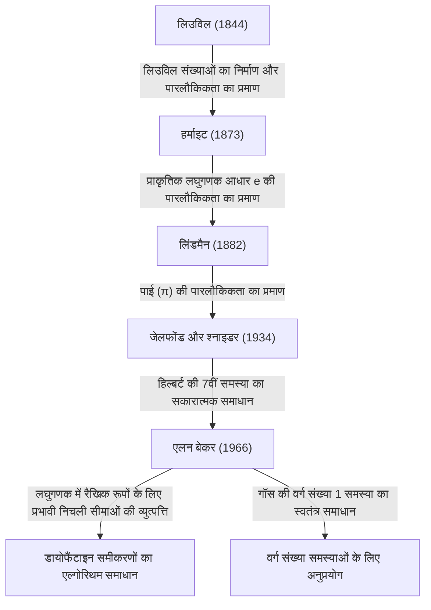

# एलन बेकर: फील्ड्स पदक विजेता जिन्होंने पारलौकिक संख्या सिद्धांत में क्रांति ला दी

## 1. परिचय

गणित के लंबे इतिहास में, अनगिनत ऐसी समस्याएं हैं जो भ्रामक रूप से सरल लगती हैं, लेकिन जिन्होंने सदियों से दुनिया के सबसे महान दिमागों को हैरान कर दिया है। इनमें से, "पारलौकिक संख्याओं" (Transcendental numbers) का अध्ययन आधुनिक गणित में सबसे गहरे क्षेत्रों में से एक के रूप में जाना जाता है, जिसमें असाधारण रूप से शक्तिशाली सैद्धांतिक ढांचे की आवश्यकता होती है, और जिसकी जड़ें "वृत्त का वर्ग करने" (squaring the circle) की प्राचीन ग्रीक समस्या से जुड़ी हैं।

ब्रिटिश गणितज्ञ **एलन बेकर (Alan Baker)** ने पारलौकिक संख्या सिद्धांत के इस बेहद चुनौतीपूर्ण क्षेत्र में एक ऐतिहासिक सफलता हासिल की। उनकी सबसे बड़ी उपलब्धि, "लघुगणक में रैखिक रूपों पर प्रमेय" (Theorem on Linear Forms in Logarithms), जिसे अक्सर बेकर का प्रमेय कहा जाता है, ने शुद्ध पारलौकिक संख्या सिद्धांत की सीमाओं को पार कर लिया। इसने लंबे समय से चली आ रही अनसुलझी समस्याओं को हल करने में निर्णायक भूमिका निभाई, जिसमें विशिष्ट डायोफैंटाइन समीकरणों को हल करने के तरीके और गॉस की वर्ग संख्या समस्या (class number problem) का समाधान शामिल है। इन अभूतपूर्व योगदानों के लिए, उन्हें 1970 में 31 वर्ष की कम उम्र में अंतर्राष्ट्रीय गणितज्ञ कांग्रेस में गणित के सर्वोच्च सम्मान — **फील्ड्स पदक (Fields Medal)** — से सम्मानित किया गया था।

इस लेख में, हम एलन बेकर के जीवन, उनके सामने आने वाली गणितीय चुनौतियों, और उनके द्वारा स्थापित सिद्धांतों ने आधुनिक गणित को कैसे प्रभावित किया है, इस पर गहराई से विचार करेंगे, साथ ही गणितीय विवरणों की भी खोज करेंगे।

## 2. जीवन और शिक्षा

### 2.1 प्रारंभिक जीवन और कैम्ब्रिज का रास्ता
एलन बेकर का जन्म 19 अगस्त 1939 को लंदन, इंग्लैंड में हुआ था। कम उम्र से ही गणित में असाधारण प्रतिभा दिखाते हुए, उन्होंने यूनिवर्सिटी कॉलेज लंदन (UCL) में जाने से पहले एक स्थानीय ग्रामर स्कूल में पढ़ाई की। वहां, उन्होंने गणित की नींव का कड़ाई से अध्ययन किया और सर्वोच्च सम्मान के साथ स्नातक की उपाधि प्राप्त की।

अधिक ऊंचाइयों तक पहुंचने की चाह में, वे फिर ट्रिनिटी कॉलेज, कैम्ब्रिज चले गए। उस समय, कैम्ब्रिज विश्वविद्यालय संख्या सिद्धांत अनुसंधान के लिए दुनिया के अग्रणी केंद्रों में से एक था। वहां, बेकर ने महान गणितज्ञ **हेरोल्ड डेवनपोर्ट (Harold Davenport)** के अधीन अध्ययन किया, जो ब्रिटिश संख्या सिद्धांत समुदाय का नेतृत्व कर रहे थे। डेवनपोर्ट डायोफैंटाइन सन्निकटन और विश्लेषणात्मक संख्या सिद्धांत के एक अधिकारी थे। उनके मार्गदर्शन में, बेकर ने अपने उन्नत गणितीय अंतर्ज्ञान और कठोर प्रमाण तकनीकों को निखारा।

### 2.2 शैक्षणिक करियर और सम्मान
1964 में, बेकर ने कैम्ब्रिज विश्वविद्यालय से अपनी पीएच.डी. प्राप्त की। यहां तक ​​कि उनकी डॉक्टरेट थीसिस में भी, उन उत्कृष्ट विचारों के बीज पहले से ही स्पष्ट थे जो इतिहास में उनका नाम छोड़ेंगे। डॉक्टरेट की उपाधि प्राप्त करने के तुरंत बाद, उन्हें ट्रिनिटी कॉलेज के फेलो के रूप में चुना गया और उन्होंने अपनी शोध गतिविधियों को गंभीरता से शुरू किया।

1966 में, उन्होंने "लघुगणक में रैखिक रूपों" पर महत्वपूर्ण शोध पत्रों की एक श्रृंखला प्रकाशित करना शुरू किया। इस उपलब्धि ने वैश्विक गणितीय समुदाय में तहलका मचा दिया, जिससे उन्हें नीस, फ्रांस में आयोजित 1970 के अंतर्राष्ट्रीय गणितज्ञ कांग्रेस (ICM) में **फील्ड्स पदक** से सम्मानित किया गया।

बेकर अपने शेष करियर के लिए कैम्ब्रिज में शुद्ध गणित के प्रोफेसर के रूप में बने रहे, और संख्या सिद्धांत अनुसंधान और अगली पीढ़ी के मार्गदर्शन में बहुत बड़ा योगदान दिया। उन्होंने दुनिया भर में यात्रा करके व्याख्यान दिए और भारत, संयुक्त राज्य अमेरिका और अन्य जगहों पर कई विश्वविद्यालयों में अतिथि प्रोफेसर के रूप में कार्य किया। 4 फरवरी 2018 को 78 वर्ष की आयु में एलन बेकर का निधन हो गया, लेकिन उनके द्वारा छोड़े गए प्रमेय और तरीके आधुनिक कम्प्यूटेशनल संख्या सिद्धांत और क्रिप्टोग्राफी में गहराई से निहित हैं।

## 3. गणितीय उपलब्धियां: पारलौकिक संख्या सिद्धांत और बेकर का प्रमेय

### 3.1 बीजीय और पारलौकिक संख्याओं की मूल बातें
बेकर के काम के वास्तविक मूल्य की सराहना करने के लिए, हमें पहले "बीजीय" और "पारलौकिक" संख्याओं में संख्याओं के वर्गीकरण की समीक्षा करनी चाहिए।

- **बीजीय संख्या (Algebraic number)**: एक जटिल संख्या जो परिमेय गुणांक $\mathbb{Q}$ वाले गैर-शून्य बहुपद का मूल है। उदाहरण के लिए, $\sqrt{2}$, जो $x^2 - 2 = 0$ का एक मूल है, और $x^4 + 1 = 0$ के मूल इस श्रेणी में आते हैं। सभी परिमेय संख्याएं भी बीजीय संख्याएं हैं क्योंकि वे रैखिक समीकरणों $qx - p = 0$ की मूल हैं।
- **पारलौकिक संख्या (Transcendental number)**: एक जटिल संख्या जो परिमेय गुणांक वाले किसी भी गैर-शून्य बहुपद का मूल नहीं है। प्रमुख उदाहरणों में गणितीय स्थिरांक $\pi$ (पाई) और $e$ (प्राकृतिक लघुगणक का आधार) शामिल हैं।

19वीं सदी के अंत में, जॉर्ज कैंटर ने सेट-थ्योरी के दृष्टिकोण से साबित किया कि जहां बीजीय संख्याओं का सेट गणनीय रूप से अनंत है, वहीं सभी जटिल संख्याओं का सेट अगणनीय रूप से अनंत है। इसका अर्थ है कि "लगभग सभी संख्याएँ पारलौकिक हैं।" हालांकि, यह साबित करना कि कोई विशिष्ट दी गई संख्या पारलौकिक है, अत्यंत कठिन है।

### 3.2 हिल्बर्ट की 7वीं समस्या और जेलफोंड-شناइडर प्रमेय
1900 में, डेविड हिल्बर्ट ने पेरिस में अंतर्राष्ट्रीय गणितज्ञ कांग्रेस में 23 अनसुलझी समस्याएं (हिल्बर्ट की 23 समस्याएं) प्रस्तुत कीं। उनकी 7वीं समस्या इस प्रकार थी:

> "यदि $\alpha$, $0$ या $1$ के अलावा एक बीजीय संख्या है, और $\beta$ एक अपरिमेय बीजीय संख्या है, तो क्या $\alpha^\beta$ हमेशा एक पारलौकिक संख्या होती है?"

उदाहरण के लिए, यह पूछा गया था कि क्या $2^{\sqrt{2}}$ या $e^\pi$ (जिसे $i^{-2i}$ में बदला जा सकता है क्योंकि $e^{\pi i} = -1$) जैसी संख्याएं पारलौकिक हैं।
इस समस्या को 1934 में रूसी गणितज्ञ अलेक्जेंडर जेलफोंड और जर्मन गणितज्ञ थियोडोर श्नाइडर ने स्वतंत्र रूप से सकारात्मक रूप से हल किया था। इसे **जेलफोंड-श्नाइडर प्रमेय (Gelfond–Schneider theorem)** के रूप में जाना जाता है।

इस प्रमेय को लघुगणकीय कार्यों का उपयोग करके इस प्रकार फिर से लिखा जा सकता है:
"यदि $\log \alpha_1$ और $\log \alpha_2$ परिमेय संख्याओं के क्षेत्र पर रैखिक रूप से स्वतंत्र हैं, तो वे बीजीय संख्याओं के क्षेत्र पर भी रैखिक रूप से स्वतंत्र हैं।"

### 3.3 बेकर का प्रमेय: लघुगणक में रैखिक रूप
बेकर ने जेलफोंड और श्नाइडर द्वारा दो लघुगणकों के लिए सिद्ध किए गए परिणाम को मनमानी संख्या $n$ लघुगणकों तक सामान्यीकृत करने का आश्चर्यजनक कारनामा हासिल किया।

**बेकर का प्रमेय (1966)**:
मान लीजिए $\alpha_1, \alpha_2, \ldots, \alpha_n$ गैर-शून्य बीजीय संख्याएं हैं, और मान लें कि $\log \alpha_1, \log \alpha_2, \ldots, \log \alpha_n$ परिमेय क्षेत्र $\mathbb{Q}$ पर रैखिक रूप से स्वतंत्र हैं। तब, $1, \log \alpha_1, \log \alpha_2, \ldots, \log \alpha_n$ बीजीय संख्या क्षेत्र $\overline{\mathbb{Q}}$ पर रैखिक रूप से स्वतंत्र हैं।

दूसरे शब्दों में, किसी भी गैर-शून्य बीजीय संख्याओं $\beta_0, \beta_1, \ldots, \beta_n$ के लिए, उन्होंने साबित कर दिया कि निम्नलिखित रैखिक रूप $\Lambda$ कभी भी $0$ के बराबर नहीं होता है।

$$ \Lambda = \beta_0 + \beta_1 \log \alpha_1 + \cdots + \beta_n \log \alpha_n \neq 0 $$

### 3.4 "प्रभावी" निचली सीमाओं की व्युत्पत्ति
बेकर के प्रमेय का वास्तव में क्रांतिकारी पहलू केवल यह साबित करना नहीं था कि $\Lambda \neq 0$, बल्कि यह था कि उन्होंने $|\Lambda|$ के लिए एक **प्रभावी निचली सीमा (effective lower bound)** प्राप्त की।
संख्या सिद्धांत में कई पूर्व प्रमेय (जैसे रोथ का प्रमेय) "अप्रभावी" थे; वे यह दिखा सकते थे कि "केवल सीमित संख्या में समाधान मौजूद हैं" लेकिन यह नहीं बता सकते थे कि "सबसे बड़ा समाधान कितना बड़ा हो सकता है।"

बेकर ने एक गणना योग्य सीमा प्रदान की कि $|\Lambda|$, $0$ के कितना करीब हो सकता है, एक विशिष्ट सकारात्मक स्थिरांक $C$ का उपयोग करते हुए जो बीजीय संख्याओं $\alpha_i$ और $\beta_i$ की "ऊंचाई" (उस संख्या को मूल के रूप में रखने वाले न्यूनतम बहुपद के अधिकतम गुणांक से संबंधित एक मीट्रिक) और डिग्री पर निर्भर करता है।

$$ |\Lambda| > C > 0 $$

यह "प्रभावशीलता" (effectiveness) एल्गोरिथम के रूप में संख्या सिद्धांत में कई खुली समस्याओं को हल करने की मास्टर कुंजी बन गई।

## 4. डायोफैंटाइन समीकरणों और वर्ग संख्या समस्या के लिए अनुप्रयोग

बेकर का प्रमेय पारलौकिक संख्या सिद्धांत से परे पूर्णांक संख्या सिद्धांत के अन्य क्षेत्रों में नाटकीय अनुप्रयोग लाया।

### 4.1 डायोफैंटाइन समीकरणों के लिए प्रभावी तरीके
डायोफैंटाइन समीकरण पूर्णांक गुणांकों वाला एक बहुपद समीकरण है जिसके लिए पूर्णांक समाधान मांगे जाते हैं।
उदाहरण के लिए, निम्नलिखित रूप के **थू समीकरण (Thue equation)** पर विचार करें:

$$ f(x, y) = m $$

यहाँ, $f(x, y)$ कम से कम 3 डिग्री का एक अप्रासंगिक सजातीय बहुपद है, और $m$ एक गैर-शून्य पूर्णांक है।
1909 में, एक्सेल थू ने साबित किया कि इस समीकरण के लिए केवल सीमित रूप से कई पूर्णांक समाधान $(x, y)$ हैं। हालांकि, उनका प्रमाण अप्रभावी था, इसलिए सभी समाधान खोजने की कोई विधि ज्ञात नहीं थी।

लघुगणक में रैखिक रूपों के लिए अपनी निचली सीमाओं का उपयोग करके, बेकर ने चर $x$ और $y$ के निरपेक्ष मूल्यों के लिए स्पष्ट ऊपरी सीमाओं की सफलतापूर्वक गणना की। परिणामस्वरूप, कंप्यूटर का उपयोग करके एक सीमित खोज करके थू समीकरणों के सभी समाधानों को पूरी तरह से निर्धारित करने के लिए एक एल्गोरिथ्म स्थापित किया गया था। इसी तरह की तकनीकों को **मॉर्डेल समीकरण (Mordell equation)** $y^2 = x^3 + k$ जैसे अधिक जटिल डायोफैंटाइन समीकरणों पर लागू किया गया, जिससे कम्प्यूटेशनल संख्या सिद्धांत के रूप में ज्ञात एक नए क्षेत्र के विकास को बढ़ावा मिला।

```python
# SageMath का उपयोग करके थू समीकरण को हल करने वाला वैचारिक कोड उदाहरण
# समीकरण x^3 - 2y^3 = 1 के लिए पूर्णांक समाधान की खोज
x, y = var('x y')
eq = x^3 - 2*y^3 == 1
# बेकर के प्रमेय के आधार पर, समाधानों के पूर्ण मूल्य के लिए एक ऊपरी सीमा की गणना की जाती है,
# जिससे एक सीमित खोज के माध्यम से सभी तुच्छ समाधानों (जैसे (1, 0)) की पहचान करना संभव हो जाता है।
```

### 4.2 गॉस की वर्ग संख्या 1 समस्या का समाधान
19वीं सदी के महान गणितज्ञ कार्ल फ्रेडरिक गॉस ने काल्पनिक द्विघात क्षेत्रों $\mathbb{Q}(\sqrt{-d})$ की वर्ग संख्या (आदर्श वर्ग समूह का क्रम) के संबंध में एक अनुमान लगाया था। उन्होंने अनुमान लगाया कि $d > 0$ के एकमात्र मान जिनके लिए वर्ग संख्या 1 है (अर्थात अद्वितीय गुणनखण्ड मान्य है) वे नौ मान $d = 3, 4, 7, 8, 11, 19, 43, 67, 163$ हैं। इसे **वर्ग संख्या 1 समस्या (Class number 1 problem)** के रूप में जाना जाता है।

इस समस्या को 1952 में कर्ट हीगनर द्वारा मॉड्यूलर कार्यों का उपयोग करके अनिवार्य रूप से हल किया गया था, लेकिन उनके पेपर में अस्पष्ट बिंदु माने गए थे और उस समय गणितीय समुदाय द्वारा इसे व्यापक रूप से स्वीकार नहीं किया गया था।
बाद में, 1967 में, हेरोल्ड स्टार्क ने हीगनर के प्रमाण को कड़ाई से औपचारिक रूप दिया, इसे स्वतंत्र रूप से पूरा किया। आश्चर्यजनक रूप से, लगभग उसी समय, एलन बेकर ने बिना किसी मॉड्यूलर फ़ंक्शन का उपयोग किए, "लघुगणक में रैखिक रूप" की अपनी विधि पर आधारित एक पूरी तरह से अलग दृष्टिकोण का उपयोग करके इस अनुमान को साबित कर दिया।
बेकर की विधि अत्यधिक बहुमुखी साबित हुई, और बाद में इसे अधिक सामान्यीकृत समस्याओं को हल करने के लिए लागू किया गया, जैसे वर्ग संख्या 2 वाले सभी काल्पनिक द्विघात क्षेत्रों का निर्धारण करना।

## 5. पारलौकिक संख्या सिद्धांत की वंशावली

पारलौकिक संख्या सिद्धांत में बेकर की उपलब्धियों की ऐतिहासिक स्थिति को निम्नलिखित आरेख में संक्षेपित किया जा सकता है। उन्होंने अपने पूर्ववर्तियों के सिद्धांतों को एकीकृत किया और एक पूरी तरह से नया, गणना योग्य सैद्धांतिक ढांचा तैयार किया।



## 6. निष्कर्ष

एलन बेकर के आगमन के साथ, संख्या सिद्धांत — विशेष रूप से पारलौकिक संख्या सिद्धांत और डायोफैंटाइन समीकरणों का अध्ययन — एक पूरी तरह से नए युग में प्रवेश कर गया। उन्होंने जो "प्रभावी गणना विधियाँ" प्रस्तुत कीं, वे अमूर्त शुद्ध गणित में एल्गोरिथम दृष्टिकोण लेकर आईं, और अब वे गणितीय नींव के हिस्से के रूप में कार्य करती हैं जो आधुनिक कंप्यूटर विज्ञान और क्रिप्टोग्राफी को रेखांकित करती हैं।

डायोफैंटाइन समीकरणों के समाधानों को सीमित करने पर उनके शोध ने गहन सिद्धांतों के लिए एक पुल भी प्रदान किया, जैसे **एबीसी अनुमान (abc conjecture)**, जो आज भी संख्या सिद्धांत में सबसे बड़ी अनसुलझी समस्याओं में से एक बना हुआ है।
एक महान गणितज्ञ जिन्होंने अत्यधिक जटिल और तकनीकी प्रमाणों को पूरा करने के लिए भारी तार्किक शक्ति के साथ शानदार अंतर्ज्ञान को जोड़ा, एलन बेकर ने प्रमेयों की विरासत और संख्या सिद्धांत के लिए एक जुनून छोड़ा जो निस्संदेह गणित के इतिहास में कभी फीका पड़े बिना चमकता रहेगा।
