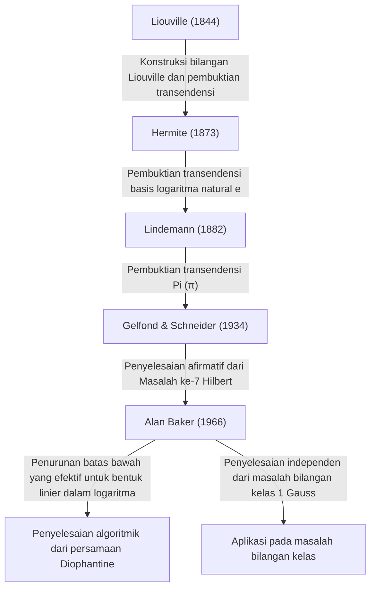

# [Alan Baker: Peraih Medali Fields yang Merevolusi Teori Bilangan Transenden](https://kenji.blog/id/p/baker/)

## 1. Pendahuluan

Dalam sejarah panjang matematika, ada banyak sekali masalah yang tampaknya sederhana namun telah membingungkan para pemikir terhebat di dunia selama berabad-abad. Di antaranya, studi tentang "bilangan transenden" dikenal sebagai salah satu bidang paling mendalam dalam matematika modern, menuntut kerangka teoretis yang luar biasa kuat, dengan akar yang merujuk kembali ke masalah Yunani kuno "mengkuadratkan lingkaran".

Matematikawan Inggris **[Alan Baker](https://kenji.blog/id/p/baker/)** membawa terobosan bersejarah di bidang teori bilangan transenden yang sangat menantang ini. Pencapaian terbesarnya, "Teorema tentang Bentuk Linier dalam Logaritma" (sering disebut sebagai Teorema Baker), melampaui batas-batas teori bilangan transenden murni. Teorema ini memainkan peran yang sangat penting dalam menyelesaikan masalah terbuka yang telah lama ada, termasuk metode untuk memecahkan persamaan Diophantine tertentu dan menyelesaikan masalah bilangan kelas Gauss. Atas kontribusi perintis ini, ia dianugerahi **Medali Fields** — penghargaan tertinggi dalam matematika — pada Kongres Matematikawan Internasional 1970 di usia muda 31 tahun.

Dalam artikel ini, kita akan menyelami lebih dalam tentang kehidupan [Alan Baker](https://kenji.blog/id/p/baker/), tantangan matematika yang dihadapinya, dan bagaimana teori yang ia bangun telah memengaruhi matematika modern, sambil menjelajahi detail matematisnya.

## 2. Kehidupan dan Pendidikan

### 2.1 Kehidupan Awal dan Jalan Menuju Cambridge
[Alan Baker](https://kenji.blog/id/p/baker/) lahir pada tanggal 19 Agustus 1939, di London, Inggris. Menunjukkan bakat luar biasa dalam matematika sejak usia dini, ia bersekolah di sekolah tata bahasa setempat sebelum melanjutkan ke University College London (UCL). Di sana, ia mempelajari dasar-dasar matematika dengan tekun dan lulus dengan nilai tertinggi.

Berusaha mencapai tingkat yang lebih tinggi, ia kemudian pindah ke Trinity College, Cambridge. Pada saat itu, Universitas Cambridge adalah salah satu pusat penelitian teori bilangan terkemuka di dunia. Di sana, Baker belajar di bawah bimbingan matematikawan besar **Harold Davenport**, yang memimpin komunitas teori bilangan Inggris. Davenport adalah seorang otoritas dalam pendekatan Diophantine dan teori bilangan analitik. Di bawah bimbingannya, Baker mengasah intuisi matematika tingkat lanjut dan teknik pembuktiannya yang ketat.

### 2.2 Karier Akademik dan Penghargaan
Pada tahun 1964, Baker memperoleh gelar Ph.D. dari Universitas Cambridge. Bahkan dalam tesis doktoralnya, benih-benih ide luar biasa yang akan meninggalkan namanya dalam sejarah sudah terlihat jelas. Tak lama setelah mendapatkan gelar doktornya, ia terpilih sebagai Fellow di Trinity College dan memulai kegiatan penelitiannya dengan sungguh-sungguh.

Pada tahun 1966, ia mulai menerbitkan serangkaian makalah inovatif tentang "bentuk linier dalam logaritma". Pencapaian ini mengirimkan gelombang kejutan ke seluruh komunitas matematika global, yang membawanya meraih **Medali Fields** pada Kongres Matematikawan Internasional (ICM) 1970 yang diadakan di Nice, Prancis.

Baker tetap berada di Cambridge selama sisa kariernya sebagai Profesor Matematika Murni, memberikan kontribusi yang sangat besar pada penelitian teori bilangan dan pembimbingan generasi berikutnya. Ia bepergian ke seluruh dunia memberikan kuliah dan menjabat sebagai profesor tamu di banyak universitas di India, Amerika Serikat, dan tempat-tempat lainnya. [Alan Baker](https://kenji.blog/id/p/baker/) meninggal dunia pada tanggal 4 Februari 2018, pada usia 78 tahun, tetapi teorema dan metode yang ia tinggalkan tetap mengakar kuat dalam teori bilangan komputasional modern dan kriptografi.

## 3. Pencapaian Matematika: Teori Bilangan Transenden dan Teorema Baker

### 3.1 Dasar-dasar Bilangan Aljabar dan Transenden
Untuk menghargai nilai sebenarnya dari karya Baker, pertama-tama kita harus meninjau kembali klasifikasi bilangan ke dalam bilangan "aljabar" dan "transenden".

- **Bilangan aljabar**: Bilangan kompleks yang merupakan akar dari polinomial tak nol dengan koefisien rasional $\mathbb{Q}$. Misalnya, $\sqrt{2}$, yang merupakan akar dari $x^2 - 2 = 0$, dan akar dari $x^4 + 1 = 0$ termasuk dalam kategori ini. Semua bilangan rasional juga merupakan bilangan aljabar karena mereka adalah akar dari persamaan linier $qx - p = 0$.
- **Bilangan transenden**: Bilangan kompleks yang bukan merupakan akar dari polinomial tak nol apa pun dengan koefisien rasional. Contoh utamanya termasuk konstanta matematika $\pi$ (pi) dan $e$ (basis logaritma natural).

Pada akhir abad ke-19, [Georg Cantor](https://kenji.blog/id/p/cantor/) membuktikan dari perspektif teori himpunan bahwa sementara himpunan bilangan aljabar adalah tak terhingga yang dapat dihitung, himpunan semua bilangan kompleks adalah tak terhingga yang tidak dapat dihitung. Ini berarti bahwa "hampir semua bilangan adalah transenden". Namun, membuktikan bahwa suatu bilangan tertentu adalah transenden sangatlah sulit.

### 3.2 Masalah Ke-7 Hilbert dan Teorema Gelfond-Schneider
Pada tahun 1900, [David Hilbert](https://kenji.blog/id/p/hilbert/) menyajikan 23 masalah yang belum terpecahkan (Masalah Hilbert) di Kongres Matematikawan Internasional di Paris. Masalah ke-7-nya adalah sebagai berikut:

> "Jika $\alpha$ adalah bilangan aljabar selain $0$ atau $1$, dan $\beta$ adalah bilangan aljabar irasional, apakah $\alpha^\beta$ selalu merupakan bilangan transenden?"

Misalnya, ini mempertanyakan apakah bilangan seperti $2^{\sqrt{2}}$ atau $e^\pi$ (yang dapat diubah menjadi $i^{-2i}$ karena $e^{\pi i} = -1$) adalah transenden.
Masalah ini dipecahkan secara afirmatif dan independen pada tahun 1934 oleh matematikawan Rusia Aleksandr Gelfond dan matematikawan Jerman Theodor Schneider. Hal ini dikenal sebagai **teorema Gelfond-Schneider**.

Teorema ini dapat diungkapkan kembali menggunakan fungsi logaritma sebagai berikut:
"Jika $\log \alpha_1$ dan $\log \alpha_2$ independen secara linier di atas lapangan bilangan rasional, maka mereka juga independen secara linier di atas lapangan bilangan aljabar."

### 3.3 Teorema Baker: Bentuk Linier dalam Logaritma
Baker mencapai prestasi yang menakjubkan dengan menggeneralisasi hasil yang dibuktikan oleh Gelfond dan Schneider untuk dua logaritma ke jumlah $n$ logaritma yang sembarang.

**Teorema Baker (1966)**:
Misalkan $\alpha_1, \alpha_2, \ldots, \alpha_n$ adalah bilangan aljabar tak nol, dan asumsikan bahwa $\log \alpha_1, \log \alpha_2, \ldots, \log \alpha_n$ independen secara linier di atas lapangan rasional $\mathbb{Q}$. Maka, $1, \log \alpha_1, \log \alpha_2, \ldots, \log \alpha_n$ independen secara linier di atas lapangan bilangan aljabar $\overline{\mathbb{Q}}$.

Dengan kata lain, untuk sebarang bilangan aljabar tak nol $\beta_0, \beta_1, \ldots, \beta_n$, ia membuktikan bahwa bentuk linier berikut $\Lambda$ tidak pernah sama dengan $0$.

$$ \Lambda = \beta_0 + \beta_1 \log \alpha_1 + \cdots + \beta_n \log \alpha_n \neq 0 $$

### 3.4 Turunan Batas Bawah yang "Efektif"
Aspek yang benar-benar revolusioner dari teorema Baker bukan hanya membuktikan bahwa $\Lambda \neq 0$, tetapi bahwa ia menurunkan **batas bawah yang efektif** untuk $|\Lambda|$.
Banyak teorema sebelumnya dalam teori bilangan (seperti teorema Roth) adalah "tidak efektif"; teorema-teorema tersebut dapat menunjukkan bahwa "hanya ada sejumlah solusi yang terbatas" tetapi tidak dapat menunjukkan "seberapa besar ukuran solusi terbesarnya".

Baker memberikan batasan yang dapat dihitung tentang seberapa dekat $|\Lambda|$ bisa mendekati $0$, menggunakan konstanta positif tertentu $C$ yang bergantung pada "ketinggian" (metrik yang terkait dengan koefisien maksimum dari polinomial minimal yang memiliki bilangan tersebut sebagai akar) dan derajat bilangan aljabar $\alpha_i$ dan $\beta_i$.

$$ |\Lambda| > C > 0 $$

"Efektivitas" ini menjadi kunci utama untuk memecahkan banyak masalah terbuka dalam teori bilangan secara algoritmik.

## 4. Aplikasi ke Persamaan Diophantine dan Masalah Bilangan Kelas

Teorema Baker membawa aplikasi yang dramatis di luar teori bilangan transenden ke bidang-bidang lain dari teori bilangan bulat.

### 4.1 Metode Efektif untuk Persamaan Diophantine
Persamaan Diophantine adalah persamaan polinomial dengan koefisien bilangan bulat yang dicari solusi bilangan bulatnya.
Pertimbangkan, misalnya, **persamaan Thue** dengan bentuk berikut:

$$ f(x, y) = m $$

Di sini, $f(x, y)$ adalah polinomial homogen yang tidak dapat direduksi dengan derajat sekurang-kurangnya 3, dan $m$ adalah bilangan bulat tak nol.
Pada tahun 1909, Axel Thue membuktikan bahwa hanya ada sejumlah bilangan bulat terbatas $(x, y)$ sebagai solusi untuk persamaan ini. Namun, pembuktiannya tidak efektif, sehingga tidak ada metode yang diketahui untuk menemukan semua solusinya.

Dengan memanfaatkan batas bawahnya untuk bentuk linier dalam logaritma, Baker berhasil menghitung batas atas eksplisit untuk nilai absolut dari variabel $x$ dan $y$. Akibatnya, sebuah algoritma ditetapkan untuk menentukan secara lengkap semua solusi persamaan Thue dengan melakukan pencarian terbatas menggunakan komputer. Teknik serupa diterapkan pada persamaan Diophantine yang lebih kompleks seperti **persamaan Mordell** $y^2 = x^3 + k$, yang memacu perkembangan bidang baru yang dikenal sebagai teori bilangan komputasional.

```python
# Contoh kode konseptual memecahkan persamaan Thue menggunakan SageMath
# Mencari solusi bilangan bulat untuk persamaan x^3 - 2y^3 = 1
x, y = var('x y')
eq = x^3 - 2*y^3 == 1
# Berdasarkan teorema Baker, batas atas untuk nilai absolut dari solusi dihitung,
# memungkinkan untuk mengidentifikasi semua solusi sepele (seperti (1, 0)) melalui pencarian terbatas.
```

### 4.2 Pemecahan Masalah Bilangan Kelas 1 Gauss
Matematikawan besar abad ke-19 [Carl Friedrich Gauss](https://kenji.blog/id/p/gauss/) mengajukan konjektur mengenai bilangan kelas (orde dari kelompok kelas ideal) dari lapangan kuadratik imajiner $\mathbb{Q}(\sqrt{-d})$. Ia menduga bahwa satu-satunya nilai $d > 0$ di mana bilangan kelasnya adalah 1 (berarti faktorisasi unik berlaku) adalah sembilan nilai $d = 3, 4, 7, 8, 11, 19, 43, 67, 163$. Hal ini dikenal sebagai **Masalah bilangan kelas 1**.

Masalah ini pada dasarnya dipecahkan pada tahun 1952 oleh Kurt Heegner menggunakan fungsi modular, tetapi makalahnya dianggap memiliki poin-poin yang tidak jelas dan tidak diterima secara luas oleh komunitas matematika pada saat itu.
Kemudian, pada tahun 1967, Harold Stark memformalkan bukti Heegner secara ketat, menyelesaikannya secara independen. Secara mengejutkan, pada waktu yang hampir bersamaan, [Alan Baker](https://kenji.blog/id/p/baker/) membuktikan konjektur ini menggunakan pendekatan yang sama sekali berbeda berdasarkan metodenya tentang "bentuk linier dalam logaritma", tanpa menggunakan fungsi modular apa pun.
Metode Baker terbukti sangat serbaguna, dan selanjutnya diterapkan untuk menyelesaikan masalah yang lebih umum, seperti menentukan semua lapangan kuadratik imajiner dengan bilangan kelas 2.

## 5. Silsilah Teori Bilangan Transenden

Pemosisian historis pencapaian Baker dalam teori bilangan transenden dapat diringkas dalam diagram berikut. Ia memadukan teori para pendahulunya dan membangun kerangka teoretis yang sama sekali baru dan dapat dihitung.



## 6. Kesimpulan

Dengan kemunculan [Alan Baker](https://kenji.blog/id/p/baker/), teori bilangan — terutama studi tentang teori bilangan transenden dan persamaan Diophantine — memasuki era yang sama sekali baru. "Metode komputasi yang efektif" yang ia sajikan membawa pendekatan algoritmik pada matematika murni yang abstrak, dan metode tersebut kini berfungsi sebagai bagian dari landasan matematika yang menopang ilmu komputer dan kriptografi modern.

Penelitiannya tentang pembatasan solusi pada persamaan Diophantine juga menyediakan jembatan menuju teori-teori yang lebih mendalam, seperti **konjektur abc**, yang tetap menjadi salah satu masalah tak terpecahkan terbesar dalam teori bilangan saat ini.
Sebagai seorang matematikawan hebat yang memadukan intuisi cemerlang dengan kekuatan logika yang luar biasa untuk menyelesaikan bukti yang sangat kompleks dan teknis, [Alan Baker](https://kenji.blog/id/p/baker/) meninggalkan warisan teorema dan hasrat akan teori bilangan yang niscaya akan terus bersinar cemerlang dalam sejarah matematika tanpa pernah memudar.
