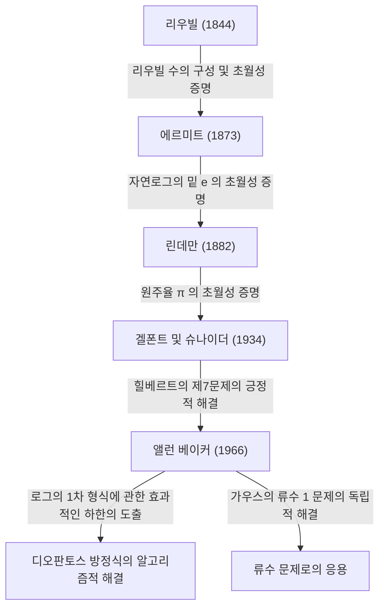

# [앨런 베이커: 초월수론에 혁명을 일으킨 필즈상 수상 수학자](https://kenji.blog/p/baker/)

## 1. 서론

수학의 오랜 역사 속에는, 언뜻 보기에는 매우 단순해 보이지만 수 세기 동안 세계의 천재들을 괴롭혀 온 수많은 문제들이 존재합니다. 그중에서도 "초월수(Transcendental number)"에 관한 연구는 고대 그리스의 "원적문제"에 그 뿌리를 두고 있으며, 매우 강력한 이론적 틀을 요구하는 현대 수학에서 가장 심오한 분야 중 하나로 알려져 있습니다.

영국의 수학자 **[앨런 베이커](https://kenji.blog/p/baker/)([Alan Baker](https://kenji.blog/p/baker/))** 는 이 극도로 난해한 초월수론 분야에 역사적인 돌파구를 가져왔습니다. 그의 최대 업적인 "로그의 1차 형식에 관한 정리(베이커의 정리)"는 순수 초월수론의 경계를 넘어섰습니다. 특정한 [디오판토스](https://kenji.blog/p/diophantus/) 방정식의 해법이나 가우스의 류수 문제 해결 등 오랫동안 미해결 상태였던 문제들을 푸는 데 결정적인 역할을 했습니다. 이러한 획기적인 공헌으로 인해 그는 1970년 31세의 젊은 나이에 수학계 최고의 영예인 **필즈상(Fields Medal)** 을 수상했습니다.

본 기사에서는 [앨런 베이커](https://kenji.blog/p/baker/)의 생애, 그가 직면했던 수학적 과제, 그리고 그가 확립한 이론이 현대 수학에 어떠한 영향을 미쳤는지를 수학적 세부 사항과 함께 깊이 있게 탐구해 보겠습니다.

## 2. 생애와 교육

### 2.1 어린 시절과 케임브리지로의 길
[앨런 베이커](https://kenji.blog/p/baker/)는 1939년 8월 19일 영국 런던에서 태어났습니다. 어린 시절부터 수학에 비범한 재능을 보였던 그는 지역 그래머 스쿨을 거쳐 유니버시티 칼리지 런던(UCL)에 진학했습니다. 그곳에서 수학의 기초를 철저하게 공부하고 수석으로 졸업했습니다.

이후 더 높은 곳을 향해 케임브리지 대학교 트리니티 칼리지로 진학했습니다. 당시 케임브리지 대학교는 세계 정수론 연구를 선도하는 중심지 중 하나였으며, 그곳에서 베이커는 영국 정수론 학계를 이끌던 위대한 수학자 **해럴드 대븐포트(Harold Davenport)** 의 지도를 받게 됩니다. 대븐포트는 [디오판토스](https://kenji.blog/p/diophantus/) 근사와 해석적 정수론의 권위자였으며, 그의 지도 아래 베이커는 고도의 수학적 직관과 엄밀한 증명 기술을 연마했습니다.

### 2.2 학문적 경력과 영예
1964년, 베이커는 케임브리지 대학교에서 박사 학위를 취득했습니다. 그의 박사 학위 논문에서부터 이미 후세에 이름을 남길 뛰어난 아이디어의 싹이 보이고 있었습니다. 박사 학위 취득 직후, 그는 트리니티 칼리지의 펠로우로 선출되어 본격적으로 연구 활동을 시작했습니다.

1966년, 그는 "로그의 1차 형식(Linear forms in logarithms)"에 관한 일련의 획기적인 논문을 발표하기 시작했습니다. 이 업적은 전 세계 수학계에 큰 충격을 주었고, 1970년 프랑스 니스에서 열린 세계 수학자 대회(ICM)에서 **필즈상** 을 수상하는 결과로 이어졌습니다.

베이커는 평생 케임브리지 대학교 순수 수학 교수로 재직하며 정수론 연구와 후학 양성에 크게 기여했습니다. 그는 전 세계를 여행하며 강연을 했고, 인도와 미국 등 많은 대학에서 객원 교수로 활동했습니다. [앨런 베이커](https://kenji.blog/p/baker/)는 2018년 2월 4일 78세의 나이로 세상을 떠났지만, 그가 남긴 정리와 방법론은 현재의 계산 정수론과 암호 이론에 여전히 깊이 살아 숨 쉬고 있습니다.

## 3. 수학적 업적: 초월수론과 베이커의 정리

### 3.1 대수적 수와 초월수의 기초
베이커 업적의 진가를 이해하기 위해서는 먼저 수를 "대수적 수"와 "초월수"로 분류하는 개념을 복습해야 합니다.

- **대수적 수(Algebraic number)** : 유리수 $\mathbb{Q}$ 를 계수로 하는 0이 아닌 다항식의 근이 되는 복소수입니다. 예를 들어, $x^2 - 2 = 0$ 의 근인 $\sqrt{2}$ 나 $x^4 + 1 = 0$ 의 근 등이 이에 해당합니다. 모든 유리수 역시 1차 방정식 $qx - p = 0$ 의 근이므로 대수적 수입니다.
- **초월수(Transcendental number)** : 유리수 계수를 가진 그 어떤 0이 아닌 다항식의 근도 되지 않는 복소수입니다. 대표적인 예로 원주율 $\pi$ 와 자연로그의 밑 $e$ 가 있습니다.

19세기 후반, [게오르크 칸토어](https://kenji.blog/p/cantor/)는 집합론의 관점에서 대수적 수의 집합은 가산 무한인 반면, 복소수 전체의 집합은 비가산 무한임을 증명했습니다. 이는 "거의 모든 수는 초월수이다"라는 것을 의미합니다. 하지만 특정 숫자가 초월수임을 증명하는 것은 매우 어렵습니다.

### 3.2 힐베르트의 7번 문제와 겔폰트-슈나이더 정리
1900년, [다비트 힐베르트](https://kenji.blog/p/hilbert/)는 파리에서 열린 세계 수학자 대회에서 23개의 미해결 문제(힐베르트의 23가지 문제)를 제시했습니다. 그중 7번 문제는 다음과 같았습니다.

> " $\alpha$ 가 $0, 1$ 이 아닌 대수적 수이고, $\beta$ 가 무리수인 대수적 수일 때, $\alpha^\beta$ 는 항상 초월수인가?"

예를 들어, $2^{\sqrt{2}}$ 나 $e^\pi$ (이것은 $e^{\pi i} = -1$ 이므로 $i^{-2i}$ 로 변형할 수 있음)와 같은 수가 초월수인지 묻는 것이었습니다.
이 문제는 1934년 러시아의 알렉산드르 겔폰트와 독일의 테오도어 슈나이더에 의해 독립적으로 긍정적으로 해결되었습니다. 이를 **겔폰트-슈나이더 정리(Gelfond–Schneider theorem)** 라고 부릅니다.

이 정리는 로그 함수를 사용하여 다음과 같이 바꾸어 말할 수 있습니다.
" $\log \alpha_1$ 과 $\log \alpha_2$ 가 유리수체 위에서 일차독립이라면, 이들은 대수적 수체 위에서도 일차독립이다."

### 3.3 베이커의 정리: 로그의 1차 형식
베이커는 겔폰트와 슈나이더가 2개의 로그에 대해 증명한 결과를 임의의 $n$ 개의 로그로 일반화하는 놀라운 위업을 달성했습니다.

**베이커의 정리(Baker's Theorem, 1966)** :
$\alpha_1, \alpha_2, \ldots, \alpha_n$ 을 0이 아닌 대수적 수라 하고, $\log \alpha_1, \log \alpha_2, \ldots, \log \alpha_n$ 이 유리수체 $\mathbb{Q}$ 위에서 일차독립이라고 가정하자. 이때, $1, \log \alpha_1, \log \alpha_2, \ldots, \log \alpha_n$ 은 대수적 수체 $\overline{\mathbb{Q}}$ 위에서 일차독립이다.

즉, 임의의 0이 아닌 대수적 수 $\beta_0, \beta_1, \ldots, \beta_n$ 에 대해 다음의 1차 형식 $\Lambda$ 는 결코 0이 되지 않음을 증명했습니다.

$$ \Lambda = \beta_0 + \beta_1 \log \alpha_1 + \cdots + \beta_n \log \alpha_n \neq 0 $$

### 3.4 "효과적인(Effective)" 하한의 도출
베이커 정리의 진정으로 혁신적인 점은 $\Lambda \neq 0$ 임을 증명했을 뿐만 아니라, $|\Lambda|$ 의 **효과적인(effective) 하한** 을 도출했다는 데 있습니다.
그 이전 정수론의 많은 정리들(예를 들어 로스의 정리)은 "해는 유한개만 존재한다"는 것은 보여줄 수 있었지만, "가장 큰 해가 어느 정도 크기인가"는 나타낼 수 없는 "비효과적인(ineffective)" 것이었습니다.

베이커는 대수적 수 $\alpha_i$ 나 $\beta_i$ 의 "높이(height)"(그 수를 근으로 가지는 최소 다항식의 최대 계수와 관련된 지표)와 차수에 의존하는 특정한 양의 상수 $C$ 를 사용하여, $|\Lambda|$ 가 얼마나 0에 가까워질 수 있는지의 한계를 계산 가능한 형태로 제시했습니다.

$$ |\Lambda| > C > 0 $$

이러한 "효과성"이야말로 정수론의 수많은 미해결 문제들을 알고리즘적으로 풀기 위한 마스터키가 되었습니다.

## 4. [디오판토스](https://kenji.blog/p/diophantus/) 방정식과 류수 문제로의 응용

베이커의 정리는 초월수론에 머물지 않고 정수론의 다른 영역에 극적인 응용을 가져왔습니다.

### 4.1 [디오판토스](https://kenji.blog/p/diophantus/) 방정식의 효과적인 해법
[디오판토스](https://kenji.blog/p/diophantus/) 방정식은 정수 계수의 다항식 방정식으로, 그 정수해를 구하는 문제입니다.
예를 들어, 다음과 같은 형태의 **투에 방정식(Thue equation)** 을 생각해 봅시다.

$$ f(x, y) = m $$

여기서 $f(x, y)$ 는 차수가 3 이상인 기약 동차 다항식이고, $m$ 은 0이 아닌 정수입니다.
1909년 악셀 투에는 이 방정식의 정수해 $(x, y)$ 가 유한개만 존재함을 증명했습니다. 하지만 그의 증명은 비효과적이었기 때문에 모든 해를 찾아내는 방법은 알려지지 않았습니다.

베이커는 로그의 1차 형식에 관한 하한을 이용함으로써, 변수 $x, y$ 의 절대값의 상한을 구체적으로 계산하는 데 성공했습니다. 이에 따라 컴퓨터를 이용해 유한 번의 탐색을 수행함으로써 투에 방정식의 모든 해를 완전히 결정하는 알고리즘이 확립되었습니다. 비슷한 기법이 **모델 방정식(Mordell equation)** $y^2 = x^3 + k$ 과 같은 더 복잡한 [디오판토스](https://kenji.blog/p/diophantus/) 방정식에도 적용되어, 계산 정수론이라는 새로운 분야의 발전을 촉진했습니다.

```python
# SageMath를 이용한 투에 방정식 해법의 개념적 코드 예시
# 방정식 x^3 - 2y^3 = 1 의 정수해를 탐색한다
x, y = var('x y')
eq = x^3 - 2*y^3 == 1
# 베이커의 정리에 근거하여 해의 절대값 상한이 계산되므로,
# 유한 번의 탐색으로 자명한 해 (1, 0) 등을 모두 식별하는 것이 가능하다.
```

### 4.2 가우스의 류수 1 문제의 해결
19세기의 위대한 수학자 [카를 프리드리히 가우스](https://kenji.blog/p/gauss/)는 허이차체 $\mathbb{Q}(\sqrt{-d})$ 의 류수(이데알 류군의 위수)에 관한 추측을 세웠습니다. 그는 류수가 1이 되는(즉 소인수분해의 유일성이 성립하는) $d > 0$ 은 $d = 3, 4, 7, 8, 11, 19, 43, 67, 163$ 의 9개뿐일 것이라고 추측했습니다. 이를 **류수 1 문제(Class number 1 problem)** 라고 부릅니다.

이 문제는 1952년 쿠르트 헤그너에 의해 모듈러 함수를 사용하여 본질적으로 해결되었으나, 그의 논문은 불분명한 점이 있다고 여겨져 당시 수학계에서 널리 받아들여지지 않았습니다.
이후 1967년 해럴드 스타크가 헤그너의 증명을 엄밀하게 다듬어 독립적으로 완성했습니다. 놀랍게도 거의 같은 시기에 [앨런 베이커](https://kenji.blog/p/baker/)는 모듈러 함수를 일절 사용하지 않고, 자신의 "로그의 1차 형식" 방법론에 기초한 완전히 다른 접근법으로 이 추측을 증명했습니다.
베이커의 기법은 매우 범용성이 높아, 이후 류수가 2가 되는 허이차체의 결정 등 더 일반화된 문제의 해결에도 응용되었습니다.

## 5. 초월수론의 계보

초월수론의 역사에서 베이커의 업적 위치는 다음 다이어그램으로 요약할 수 있습니다. 그는 선학들의 이론을 통합하고 완전히 새롭고 계산 가능한 이론적 틀을 구축했습니다.



## 6. 결론

[앨런 베이커](https://kenji.blog/p/baker/)의 등장으로 정수론, 특히 초월수론과 [디오판토스](https://kenji.blog/p/diophantus/) 방정식 연구는 완전히 새로운 시대를 맞이했습니다. 그가 제시한 "효과적인(effective) 계산 기법"은 추상적이었던 순수 수학에 알고리즘적인 접근 방식을 가져왔으며, 오늘날 현대 컴퓨터 과학과 암호 이론을 뒷받침하는 수학적 기반의 일부로 기능하고 있습니다.

[디오판토스](https://kenji.blog/p/diophantus/) 방정식 해의 한계에 관한 그의 연구는 또한 현재 정수론의 가장 큰 미해결 문제 중 하나인 **[ABC 추측](https://kenji.blog/p/abc-conjecture/)(abc conjecture)** 과 같은 더 깊은 이론으로 향하는 가교 역할을 했습니다.
빛나는 직관과 고도로 복잡하고 기술적인 증명을 완성해 내는 압도적인 논리력을 겸비했던 위대한 수학자 [앨런 베이커](https://kenji.blog/p/baker/), 그가 남긴 정리와 정수론에 대한 열정은 의심할 여지 없이 결코 퇴색하지 않고 수학사에 계속해서 찬란하게 빛날 것입니다.
