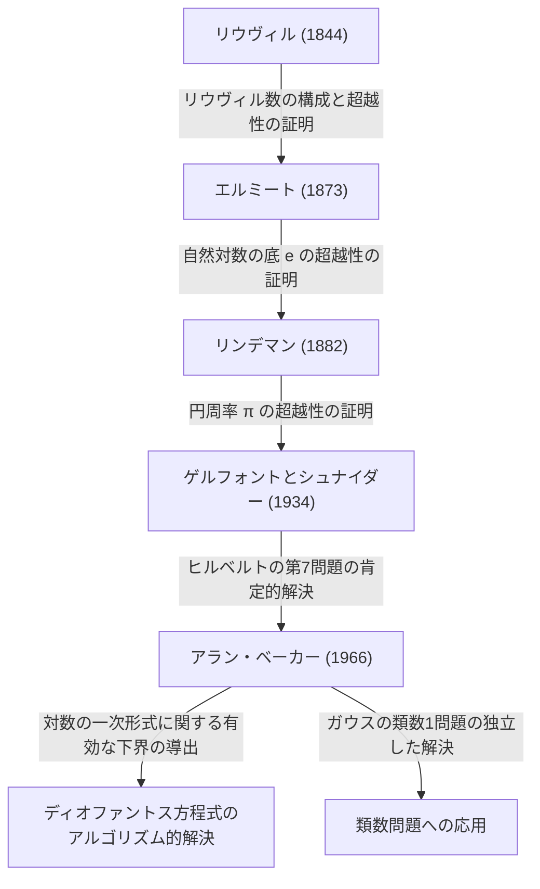

# [アラン・ベーカー](https://kenji.blog/p/baker/)：超越数論に革命をもたらしたフィールズ賞数学者

## 1. はじめに

数学の長い歴史において、一見すると非常にシンプルでありながら、何世紀にもわたって世界中の天才たちを悩ませてきた問題が無数に存在します。その中でも、「超越数（Transcendental number）」に関する研究は、古代ギリシャの「円積問題」に端を発し、近代数学において最も奥深く、かつ強力な理論を必要とする分野の一つとして知られています。

イギリスの数学者 **[アラン・ベーカー](https://kenji.blog/p/baker/)（Alan Baker）** は、この超越数論という極めて難解な分野において、歴史的なブレイクスルーをもたらしました。彼の最大の業績である「対数の一次形式に関する定理（ベーカーの定理）」は、純粋な超越数論の枠を超えて、長年の未解決問題であった特定のディオファントス方程式の解法や、[ガウス](https://kenji.blog/p/gauss/)の類数問題の解決に決定的な役割を果たしました。この画期的な成果により、彼は1970年に31歳の若さで数学界の最高栄誉である **フィールズ賞（Fields Medal）** を受賞しました。

本記事では、[アラン・ベーカー](https://kenji.blog/p/baker/)の生涯、彼が直面した数学的課題、そして彼が確立した理論が現代数学にどのような影響を与えたのかを、数学的な詳細を交えながら深く掘り下げていきます。

## 2. 生涯と教育

### 2.1 若き日の[ベーカー](https://kenji.blog/p/baker/)とケンブリッジへの道
[アラン・ベーカー](https://kenji.blog/p/baker/)は1939年8月19日、イギリスの首都ロンドンで生まれました。幼少期から数学に対して並外れた才能を示していた彼は、地元のグラマースクールを経て、ユニバーシティ・カレッジ・ロンドン（UCL）に進学しました。そこで彼は数学の基礎を徹底的に学び、優秀な成績で卒業を果たします。

その後、彼はさらなる高みを目指してケンブリッジ大学のトリニティ・カレッジに進学しました。当時のケンブリッジ大学は、数論の研究において世界をリードする拠点の一つであり、[ベーカー](https://kenji.blog/p/baker/)はそこでイギリスの数論界を牽引していた偉大な数学者 **ハロルド・ダヴェンポート（Harold Davenport）** の指導を受けることになります。ダヴェンポートはディオファントス近似や解析的整数論の権威であり、彼のもとで[ベーカー](https://kenji.blog/p/baker/)は高度な数学的直感と厳密な証明の技術を磨き上げました。

### 2.2 学問的キャリアと栄誉
1964年、[ベーカー](https://kenji.blog/p/baker/)はケンブリッジ大学で博士号を取得しました。彼の博士論文の時点で既に、後世に名を残すことになる卓越したアイデアの萌芽が見られていました。博士号取得後、彼はすぐにトリニティ・カレッジのフェローに選出され、研究活動を本格化させます。

1966年、彼は「対数の一次形式（Linear forms in logarithms）」に関する一連の画期的な論文を発表し始めました。この業績は世界中の数学者に衝撃を与え、1970年にフランスのニースで開催された国際数学者会議（ICM）において、彼は **フィールズ賞** を授与されました。

その後も[ベーカー](https://kenji.blog/p/baker/)はケンブリッジ大学にとどまり、純粋数学の教授として数論の研究と後進の育成に多大な貢献をしました。彼は世界中を旅して講演を行い、インドやアメリカなどの多くの大学で客員教授を務めました。2018年2月4日、[アラン・ベーカー](https://kenji.blog/p/baker/)は78歳でこの世を去りましたが、彼の遺した定理と手法は、現在の計算機数論や暗号理論にも深く息づいています。

## 3. 数学的業績：超越数論と[ベーカー](https://kenji.blog/p/baker/)の定理

### 3.1 代数的数と超越数の基礎
[ベーカー](https://kenji.blog/p/baker/)の業績の真価を理解するためには、まず数の分類である「代数的数」と「超越数」の概念を整理する必要があります。

- **代数的数（Algebraic number）** : 有理数 $\mathbb{Q}$ を係数とする $0$ でない多項式の根となる複素数のことです。例えば、$x^2 - 2 = 0$ の根である $\sqrt{2}$ や、$x^4 + 1 = 0$ の根などがこれに該当します。すべての有理数も、一次方程式 $qx - p = 0$ の根であるため代数的数です。
- **超越数（Transcendental number）** : どのような有理数係数の非零多項式の根にもならない複素数のことです。代表的な例として、円周率 $\pi$ や自然対数の底 $e$ が挙げられます。

19世紀後半、[ゲオルク・カントール](https://kenji.blog/p/cantor/)は集合論の観点から、代数的数の集合が可算無限であるのに対し、複素数全体の集合は非可算無限であることを証明しました。これは、「ほとんどすべての数は超越数である」ことを意味します。しかし、ある特定の数が超越数であることを証明するのは極めて困難です。

### 3.2 [ヒルベルト](https://kenji.blog/p/hilbert/)の第7問題とゲルフォント＝シュナイダーの定理
1900年、[ダフィット・ヒルベルト](https://kenji.blog/p/hilbert/)はパリで開催された国際数学者会議において、23の未解決問題（[ヒルベルト](https://kenji.blog/p/hilbert/)の23の問題）を提示しました。そのうちの第7問題は次のようなものでした。

> 「 $\alpha$ を $0, 1$ 以外の代数的数、$\beta$ を有理数でない代数的数としたとき、$\alpha^\beta$ は常に超越数であるか？」

例えば、$2^{\sqrt{2}}$ や $e^\pi$ （これは $e^{\pi i} = -1$ より $i^{-2i}$ と変形できる）が超越数かという問題です。
この問題は1934年に、ロシアのアレクサンドル・ゲルフォントとドイツのテオドール・シュナイダーによって独立に肯定的に解決されました。これを **ゲルフォント＝シュナイダーの定理（Gelfond–Schneider theorem）** と呼びます。

この定理は、対数関数を用いて次のように言い換えることができます。
「 $\log \alpha_1$ と $\log \alpha_2$ が有理数体上で一次独立であるならば、それらは代数的数体上でも一次独立である。」

### 3.3 [ベーカー](https://kenji.blog/p/baker/)の定理：対数の一次形式
[ベーカー](https://kenji.blog/p/baker/)は、ゲルフォントとシュナイダーが2つの対数について証明した結果を、任意の $n$ 個の対数に一般化するという驚異的な偉業を成し遂げました。

**[ベーカー](https://kenji.blog/p/baker/)の定理（Baker's Theorem, 1966）** :
$\alpha_1, \alpha_2, \ldots, \alpha_n$ を $0$ 以外の代数的数とし、$\log \alpha_1, \log \alpha_2, \ldots, \log \alpha_n$ が有理数体 $\mathbb{Q}$ 上で一次独立であると仮定する。このとき、$1, \log \alpha_1, \log \alpha_2, \ldots, \log \alpha_n$ は代数的数体 $\overline{\mathbb{Q}}$ 上で一次独立である。

すなわち、任意の $0$ でない代数的数 $\beta_0, \beta_1, \ldots, \beta_n$ に対して、次の一次形式 $\[Lambda](https://kenji.blog/p/serverless-architecture-aws-lambda-cold-start/)$ は決して $0$ にならないことを証明しました。

$$ \Lambda = \beta_0 + \beta_1 \log \alpha_1 + \cdots + \beta_n \log \alpha_n \neq 0 $$

### 3.4 「有効な（Effective）」下界の導出
[ベーカー](https://kenji.blog/p/baker/)の定理の真に革新的な点は、$\[Lambda](https://kenji.blog/p/serverless-architecture-aws-lambda-cold-start/) \neq 0$ を証明しただけでなく、$|\Lambda|$ の **有効な（effective）下界** を導き出したことにあります。
それまでの数論における多くの定理（例えばロスの定理）は、「解は有限個しか存在しない」ことを示せても、「最大の解がどのくらいの大きさか」を示すことができない「非有効的（ineffective）」なものでした。

[ベーカー](https://kenji.blog/p/baker/)は、代数的数 $\alpha_i$ や $\beta_i$ の「高さ（height）」（その数を根に持つ最小多項式の係数の最大値に関連する指標）や次数に依存する具体的な正の定数 $C$ を用いて、$|\[Lambda](https://kenji.blog/p/serverless-architecture-aws-lambda-cold-start/)|$ がどれだけ $0$ に近づき得るかの限界を計算可能な形で提示しました。

$$ |\Lambda| > C > 0 $$

この「有効性」こそが、数論における数々の未解決問題をアルゴリズム的に解くためのマスターキーとなったのです。

## 4. [ディオファントス](https://kenji.blog/p/diophantus/)方程式と類数問題への応用

[ベーカー](https://kenji.blog/p/baker/)の定理は、超越数論にとどまらず、整数論の他の領域に劇的な応用をもたらしました。

### 4.1 [ディオファントス](https://kenji.blog/p/diophantus/)方程式の有効な解法
[ディオファントス](https://kenji.blog/p/diophantus/)方程式とは、整数係数の多項式方程式であり、その整数解を求める問題です。
例えば、次のような形式の **トゥエ方程式（Thue equation）** を考えます。

$$ f(x, y) = m $$

ここで、$f(x, y)$ は既約な斉次多項式で次数が 3 以上、$m$ は非零の整数です。
1909年にアクセル・トゥエは、この方程式の整数解 $(x, y)$ が有限個しか存在しないことを証明しました。しかし、彼の証明は非有効的であったため、解をすべて見つけ出す方法は分かりませんでした。

[ベーカー](https://kenji.blog/p/baker/)は、自身の対数の一次形式に関する下界を用いることで、変数 $x, y$ の絶対値の上限を具体的に計算することに成功しました。これにより、計算機を用いて有限回の探索を行うことで、トゥエ方程式のすべての解を完全に決定するアルゴリズムが確立されました。同様の手法は **モーデル方程式（Mordell equation）** $y^2 = x^3 + k$ などのより複雑な[ディオファントス](https://kenji.blog/p/diophantus/)方程式にも適用され、計算機数論という新しい分野の発展を促しました。

```python
# SageMathを用いたトゥエ方程式の解法の概念的コード例
# 方程式 x^3 - 2y^3 = 1 の整数解を探索する
x, y = var('x y')
eq = x^3 - 2*y^3 == 1
# ベーカーの定理に基づき、解の絶対値の上限が計算されるため、
# 有限回の探索で自明な解 (1, 0) などをすべて特定することが可能である。
```

### 4.2 [ガウス](https://kenji.blog/p/gauss/)の類数1問題の解決
19世紀の偉大な数学者カール・フリードリヒ・[ガウス](https://kenji.blog/p/gauss/)は、虚二次体 $\mathbb{Q}(\sqrt{-d})$ の類数（イデアル類群の位数）に関する予想を立てました。彼は、類数が 1 となる（すなわち素因数分解の一意性が成り立つ）ような $d > 0$ は、$d = 3, 4, 7, 8, 11, 19, 43, 67, 163$ の 9 つのみであろうと予想しました。これを **類数1問題（Class number 1 problem）** と呼びます。

この問題は、1952年にクルト・ヘーグナーによってモジュラー関数を用いて本質的に解決されていましたが、彼の論文には不明瞭な点があるとされ、当時は数学界に受け入れられませんでした。
その後、1967年にハロルド・スタークがヘーグナーの証明を厳密化して独立に証明を完成させました。そして驚くべきことに、ほぼ同時期に[アラン・ベーカー](https://kenji.blog/p/baker/)は、自らの「対数の一次形式」の手法を用いて、モジュラー関数を一切使わない全く異なるアプローチでこの予想を証明したのです。
[ベーカー](https://kenji.blog/p/baker/)の手法は極めて汎用性が高く、その後、類数が 2 になる虚二次体の決定など、さらなる一般化問題の解決にも応用されました。

## 5. 超越数論の系譜

超越数論の歴史における[ベーカー](https://kenji.blog/p/baker/)の業績の位置づけは、以下の図のように整理することができます。彼は先人たちの理論を統合し、全く新しい計算可能な理論体系を構築しました。



## 6. おわりに

[アラン・ベーカー](https://kenji.blog/p/baker/)の登場により、数論、特に超越数論と[ディオファントス](https://kenji.blog/p/diophantus/)方程式の研究は全く新しい時代を迎えました。彼が提示した「有効な（effective）計算手法」は、抽象的だった純粋数学にアルゴリズム的なアプローチを持ち込み、現代の計算機科学や暗号理論を支える数学的基盤の一部としても機能しています。

彼が探求した[ディオファントス](https://kenji.blog/p/diophantus/)方程式の解の限界に関する研究は、現在も数論の最大の未解決問題の一つである **[ABC予想](https://kenji.blog/p/abc-conjecture/)（abc conjecture）** などのより深い理論への橋渡しともなりました。
天才的な直感と、非常に複雑で技術的な証明を完遂する圧倒的な論理力を併せ持った偉大な数学者、[アラン・ベーカー](https://kenji.blog/p/baker/)。彼の残した定理と数論への情熱は、これからも色褪せることなく数学史に燦然と輝き続けるでしょう。
