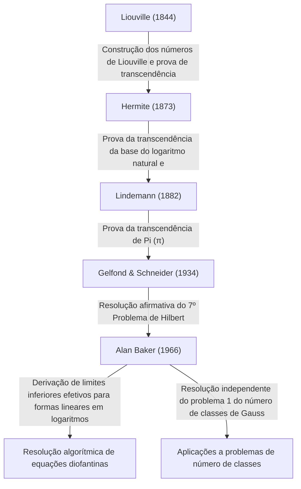

# [Alan Baker: O medalhista Fields que revolucionou a teoria dos números transcendentes](https://kenji.blog/pt/p/baker/)

## 1. Introdução

Na longa história da matemática, existem inúmeros problemas que parecem enganosamente simples, mas que têm intrigado as mentes mais brilhantes do mundo durante séculos. Entre eles, o estudo dos "números transcendentes" é conhecido como um dos campos mais profundos da matemática moderna, exigindo referenciais teóricos excepcionalmente poderosos, com raízes que remontam ao antigo problema grego da "quadratura do círculo".

O matemático britânico **[Alan Baker](https://kenji.blog/pt/p/baker/)** trouxe um avanço histórico para este campo imensamente desafiador da teoria dos números transcendentes. Sua maior conquista, o "Teorema sobre formas lineares em logaritmos" (frequentemente chamado simplesmente de Teorema de Baker), transcendeu as fronteiras da teoria pura dos números transcendentes. Desempenhou um papel decisivo na resolução de problemas abertos de longa data, incluindo métodos para resolver equações diofantinas específicas e a resolução do problema do número de classes de Gauss. Por essas contribuições inovadoras, ele foi premiado com a **Medalha Fields** — a maior honra da matemática — no Congresso Internacional de Matemáticos de 1970, na tenra idade de 31 anos.

Neste artigo, aprofundaremos a vida de [Alan Baker](https://kenji.blog/pt/p/baker/), os desafios matemáticos que ele enfrentou e como as teorias que ele estabeleceu influenciaram a matemática moderna, tudo isso enquanto exploramos os detalhes matemáticos.

## 2. Vida e Educação

### 2.1 Primeiros anos e o caminho para Cambridge
[Alan Baker](https://kenji.blog/pt/p/baker/) nasceu em 19 de agosto de 1939, em Londres, Inglaterra. Demonstrando um talento extraordinário em matemática desde cedo, frequentou uma escola primária local antes de prosseguir para o University College London (UCL). Lá, estudou rigorosamente os fundamentos da matemática e graduou-se com as mais altas honras.

Buscando alcançar voos maiores, transferiu-se em seguida para o Trinity College, Cambridge. Na época, a Universidade de Cambridge era um dos principais centros mundiais de pesquisa em teoria dos números. Lá, Baker estudou sob a orientação do grande matemático **Harold Davenport**, que liderava a comunidade britânica de teoria dos números. Davenport era uma autoridade em aproximação diofantina e teoria analítica dos números. Sob sua mentoria, Baker aprimorou sua intuição matemática avançada e suas rigorosas técnicas de demonstração.

### 2.2 Carreira Acadêmica e Honrarias
Em 1964, Baker obteve seu doutorado pela Universidade de Cambridge. Mesmo em sua tese de doutorado, as sementes das ideias notáveis que deixariam seu nome na história já eram aparentes. Logo após obter seu doutorado, foi eleito Fellow do Trinity College e começou suas atividades de pesquisa a sério.

Em 1966, ele começou a publicar uma série de artigos inovadores sobre "formas lineares em logaritmos". Essa conquista enviou ondas de choque através da comunidade matemática global, levando-o a receber a **Medalha Fields** no Congresso Internacional de Matemáticos (ICM) de 1970 realizado em Nice, França.

Baker permaneceu em Cambridge pelo resto de sua carreira como Professor de Matemática Pura, contribuindo imensamente para a pesquisa em teoria dos números e a orientação da próxima geração. Viajou pelo mundo dando palestras e atuou como professor visitante em muitas universidades na Índia, Estados Unidos e outros lugares. [Alan Baker](https://kenji.blog/pt/p/baker/) faleceu em 4 de fevereiro de 2018, aos 78 anos, mas os teoremas e métodos que ele deixou para trás permanecem profundamente enraizados na moderna teoria computacional dos números e criptografia.

## 3. Conquistas Matemáticas: Teoria dos Números Transcendentes e o Teorema de Baker

### 3.1 Fundamentos dos Números Algébricos e Transcendentes
Para apreciar o verdadeiro valor do trabalho de Baker, devemos primeiro revisar a classificação dos números em "algébricos" e "transcendentes".

- **Número algébrico**: Um número complexo que é raiz de um polinômio não nulo com coeficientes racionais $\mathbb{Q}$. Por exemplo, $\sqrt{2}$, que é uma raiz de $x^2 - 2 = 0$, e as raízes de $x^4 + 1 = 0$ enquadram-se nesta categoria. Todos os números racionais também são números algébricos, pois são raízes de equações lineares $qx - p = 0$.
- **Número transcendente**: Um número complexo que não é raiz de nenhum polinômio não nulo com coeficientes racionais. Exemplos proeminentes incluem as constantes matemáticas $\pi$ (pi) e $e$ (a base do logaritmo natural).

No final do século XIX, [Georg Cantor](https://kenji.blog/pt/p/cantor/) provou a partir de uma perspectiva da teoria dos conjuntos que, embora o conjunto dos números algébricos seja infinito enumerável, o conjunto de todos os números complexos é infinito não enumerável. Isso significa que "quase todos os números são transcendentes". No entanto, provar que um determinado número específico é transcendente é extremamente difícil.

### 3.2 O 7º Problema de Hilbert e o Teorema de Gelfond-Schneider
Em 1900, [David Hilbert](https://kenji.blog/pt/p/hilbert/) apresentou 23 problemas não resolvidos (Problemas de Hilbert) no Congresso Internacional de Matemáticos em Paris. Seu 7º problema era o seguinte:

> "Se $\alpha$ for um número algébrico diferente de $0$ ou $1$, e $\beta$ for um número algébrico irracional, então $\alpha^\beta$ será sempre um número transcendente?"

Por exemplo, isso perguntava se números como $2^{\sqrt{2}}$ ou $e^\pi$ (que pode ser transformado em $i^{-2i}$ uma vez que $e^{\pi i} = -1$) são transcendentes.
Este problema foi resolvido afirmativa e independentemente em 1934 pelo matemático russo Aleksandr Gelfond e pelo matemático alemão Theodor Schneider. Isso é conhecido como o **teorema de Gelfond-Schneider**.

Este teorema pode ser reformulado usando funções logarítmicas da seguinte forma:
"Se $\log \alpha_1$ e $\log \alpha_2$ são linearmente independentes sobre o corpo dos números racionais, então eles também são linearmente independentes sobre o corpo dos números algébricos."

### 3.3 O Teorema de Baker: Formas Lineares em Logaritmos
Baker alcançou a surpreendente proeza de generalizar o resultado provado por Gelfond e Schneider para dois logaritmos para um número arbitrário $n$ de logaritmos.

**Teorema de Baker (1966)**:
Sejam $\alpha_1, \alpha_2, \ldots, \alpha_n$ números algébricos não nulos, e suponhamos que $\log \alpha_1, \log \alpha_2, \ldots, \log \alpha_n$ sejam linearmente independentes sobre o corpo dos racionais $\mathbb{Q}$. Então, $1, \log \alpha_1, \log \alpha_2, \ldots, \log \alpha_n$ são linearmente independentes sobre o corpo dos números algébricos $\overline{\mathbb{Q}}$.

Em outras palavras, para quaisquer números algébricos não nulos $\beta_0, \beta_1, \ldots, \beta_n$, ele provou que a seguinte forma linear $\Lambda$ nunca é igual a $0$.

$$ \Lambda = \beta_0 + \beta_1 \log \alpha_1 + \cdots + \beta_n \log \alpha_n \neq 0 $$

### 3.4 Derivação de Limites Inferiores "Efetivos"
O aspecto verdadeiramente revolucionário do teorema de Baker não foi apenas provar que $\Lambda \neq 0$, mas que ele derivou um **limite inferior efetivo** para $|\Lambda|$.
Muitos teoremas anteriores na teoria dos números (como o teorema de Roth) eram "inefetivos"; eles podiam mostrar que "apenas um número finito de soluções existe", mas não podiam indicar "quão grande poderia ser a maior solução".

Baker forneceu um limite calculável sobre quão perto $|\Lambda|$ poderia chegar de $0$, usando uma constante positiva específica $C$ que depende da "altura" (uma métrica relacionada ao coeficiente máximo do polinômio mínimo que tem aquele número como raiz) e do grau dos números algébricos $\alpha_i$ e $\beta_i$.

$$ |\Lambda| > C > 0 $$

Esta "efetividade" tornou-se a chave mestra para resolver algoritmicamente numerosos problemas abertos na teoria dos números.

## 4. Aplicações em Equações Diofantinas e o Problema do Número de Classes

O teorema de Baker trouxe aplicações dramáticas além da teoria dos números transcendentes para outras áreas da teoria dos números inteiros.

### 4.1 Métodos Efetivos para Equações Diofantinas
Uma equação diofantina é uma equação polinomial com coeficientes inteiros para a qual se buscam soluções inteiras.
Considere, por exemplo, a **equação de Thue** da seguinte forma:

$$ f(x, y) = m $$

Aqui, $f(x, y)$ é um polinômio homogêneo irredutível de grau pelo menos 3, e $m$ é um número inteiro não nulo.
Em 1909, Axel Thue provou que há apenas um número finito de soluções inteiras $(x, y)$ para esta equação. No entanto, sua prova foi inefetiva, então não se conhecia nenhum método para encontrar todas as soluções.

Ao utilizar seus limites inferiores para formas lineares em logaritmos, Baker calculou com sucesso limites superiores explícitos para os valores absolutos das variáveis $x$ e $y$. Como resultado, estabeleceu-se um algoritmo para determinar completamente todas as soluções das equações de Thue realizando uma busca finita usando um computador. Técnicas semelhantes foram aplicadas a equações diofantinas mais complexas, como a **equação de Mordell** $y^2 = x^3 + k$, estimulando o desenvolvimento de um novo campo conhecido como teoria computacional dos números.

```python
# Exemplo conceitual de código resolvendo uma equação de Thue usando SageMath
# Busca por soluções inteiras para a equação x^3 - 2y^3 = 1
x, y = var('x y')
eq = x^3 - 2*y^3 == 1
# Com base no teorema de Baker, é calculado um limite superior para o valor absoluto das soluções,
# possibilitando identificar todas as soluções triviais (como (1, 0)) através de uma busca finita.
```

### 4.2 Resolução do Problema 1 do Número de Classes de Gauss
O grande matemático do século XIX, [Carl Friedrich Gauss](https://kenji.blog/pt/p/gauss/), postulou uma conjectura a respeito do número de classes (a ordem do grupo de classes de ideais) de corpos quadráticos imaginários $\mathbb{Q}(\sqrt{-d})$. Ele conjecturou que os únicos valores de $d > 0$ para os quais o número de classes é 1 (o que significa que a fatoração única é válida) são os nove valores $d = 3, 4, 7, 8, 11, 19, 43, 67, 163$. Isso é conhecido como o **Problema do número de classes 1**.

Este problema foi essencialmente resolvido em 1952 por Kurt Heegner usando funções modulares, mas seu artigo foi considerado como tendo pontos obscuros e não foi amplamente aceito pela comunidade matemática da época.
Mais tarde, em 1967, Harold Stark formalizou rigorosamente a prova de Heegner, completando-a de forma independente. Surpreendentemente, quase ao mesmo tempo, [Alan Baker](https://kenji.blog/pt/p/baker/) provou essa conjectura usando uma abordagem completamente diferente, baseada em seu método das "formas lineares em logaritmos", sem usar nenhuma função modular.
O método de Baker provou ser altamente versátil, e foi subsequentemente aplicado para resolver problemas mais generalizados, como determinar todos os corpos quadráticos imaginários com número de classes 2.

## 5. Genealogia da Teoria dos Números Transcendentes

O posicionamento histórico das conquistas de Baker na teoria dos números transcendentes pode ser resumido no diagrama a seguir. Ele integrou as teorias de seus predecessores e construiu um quadro teórico completamente novo e calculável.



## 6. Conclusão

Com o surgimento de [Alan Baker](https://kenji.blog/pt/p/baker/), a teoria dos números — especialmente o estudo da teoria dos números transcendentes e das equações diofantinas — entrou em uma era completamente nova. Os "métodos de computação efetivos" que ele apresentou trouxeram abordagens algorítmicas à matemática pura e abstrata, e agora servem como parte da fundação matemática que sustenta a ciência da computação e a criptografia modernas.

Suas pesquisas sobre a limitação das soluções para equações diofantinas também forneceram uma ponte para teorias mais profundas, como a **conjectura abc**, que continua sendo hoje um dos maiores problemas não resolvidos da teoria dos números.
Um grande matemático que combinou intuição brilhante com uma força lógica esmagadora para concluir provas altamente complexas e técnicas, [Alan Baker](https://kenji.blog/pt/p/baker/) deixou um legado de teoremas e uma paixão pela teoria dos números que, sem dúvida, continuará a brilhar na história da matemática sem nunca se apagar.
