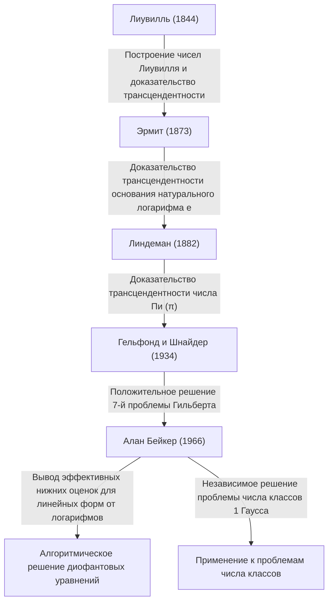

# [Алан Бейкер: филдсовский лауреат, совершивший революцию в теории трансцендентных чисел](https://kenji.blog/ru/p/baker/)

## 1. Введение

В долгой истории математики существует бесчисленное множество проблем, которые кажутся обманчиво простыми, но при этом веками ставили в тупик величайшие умы человечества. Среди них изучение «трансцендентных чисел» известно как одна из самых глубоких областей современной математики, требующая исключительно мощных теоретических концепций, корни которых восходят к древнегреческой задаче «квадратуры круга».

Британский математик **[Алан Бейкер](https://kenji.blog/ru/p/baker/)** совершил исторический прорыв в этой невероятно сложной области теории трансцендентных чисел. Его величайшее достижение, «Теорема о линейных формах от логарифмов» (часто называемая просто теоремой Бейкера), вышло за рамки чистой теории трансцендентных чисел. Оно сыграло решающую роль в решении давних открытых проблем, включая методы решения конкретных диофантовых уравнений и разрешение проблемы числа классов Гаусса. За эти новаторские труды он был удостоен **Филдсовской премии** — высшей награды в математике — на Международном конгрессе математиков 1970 года в молодом возрасте 31 года.

В этой статье мы подробно рассмотрим жизнь Алана Бейкера, математические задачи, с которыми он столкнулся, и то, как созданные им теории повлияли на современную математику, попутно изучая математические детали.

## 2. Жизнь и образование

### 2.1 Ранние годы и путь в Кембридж
[Алан Бейкер](https://kenji.blog/ru/p/baker/) родился 19 августа 1939 года в Лондоне, Англия. С ранних лет демонстрируя выдающиеся способности к математике, он учился в местной средней школе, а затем поступил в Университетский колледж Лондона (UCL). Там он тщательно изучил основы математики и окончил учебу с отличием.

Стремясь к большим высотам, он затем перевелся в Тринити-колледж в Кембридже. В то время Кембриджский университет был одним из ведущих мировых центров исследований в области теории чисел. Там Бейкер учился у великого математика **Гарольда Дэвенпорта**, который был лидером британского сообщества теории чисел. Дэвенпорт был признанным авторитетом в области диофантовых приближений и аналитической теории чисел. Под его руководством Бейкер оттачивал свою передовую математическую интуицию и строгие методы доказательства.

### 2.2 Академическая карьера и награды
В 1964 году Бейкер получил степень доктора философии в Кембриджском университете. Уже в его докторской диссертации были очевидны ростки выдающихся идей, которые впишут его имя в историю. Вскоре после получения докторской степени он был избран научным сотрудником (Fellow) Тринити-колледжа и всерьез начал свою исследовательскую деятельность.

В 1966 году он начал публиковать серию новаторских статей о «линейных формах от логарифмов». Это достижение произвело фурор в мировом математическом сообществе, что привело к вручению ему **Филдсовской премии** на Международном конгрессе математиков (ICM) 1970 года, проходившем в Ницце, Франция.

Бейкер оставался в Кембридже до конца своей карьеры в качестве профессора чистой математики, внеся огромный вклад в исследования по теории чисел и наставничество следующего поколения. Он путешествовал по всему миру с лекциями и работал приглашенным профессором во многих университетах Индии, США и других стран. [Алан Бейкер](https://kenji.blog/ru/p/baker/) скончался 4 февраля 2018 года в возрасте 78 лет, но теоремы и методы, которые он оставил после себя, остаются глубоко укоренившимися в современной вычислительной теории чисел и криптографии.

## 3. Математические достижения: теория трансцендентных чисел и теорема Бейкера

### 3.1 Основы алгебраических и трансцендентных чисел
Чтобы оценить истинную ценность работы Бейкера, мы должны сначала вспомнить классификацию чисел на «алгебраические» и «трансцендентные».

- **Алгебраическое число**: комплексное число, являющееся корнем ненулевого многочлена с рациональными коэффициентами $\mathbb{Q}$. Например, $\sqrt{2}$, являющийся корнем $x^2 - 2 = 0$, и корни $x^4 + 1 = 0$ попадают в эту категорию. Все рациональные числа также являются алгебраическими числами, поскольку они являются корнями линейных уравнений $qx - p = 0$.
- **Трансцендентное число**: комплексное число, которое не является корнем ни одного ненулевого многочлена с рациональными коэффициентами. Яркими примерами являются математические константы $\pi$ (пи) и $e$ (основание натурального логарифма).

В конце XIX века [Георг Кантор](https://kenji.blog/ru/p/cantor/) с теоретико-множественной точки зрения доказал, что хотя множество алгебраических чисел счетно-бесконечно, множество всех комплексных чисел несчетно-бесконечно. Это означает, что «почти все числа трансцендентны». Однако доказать, что конкретное заданное число является трансцендентным, чрезвычайно сложно.

### 3.2 Седьмая проблема Гильберта и теорема Гельфонда-Шнайдера
В 1900 году [Давид Гильберт](https://kenji.blog/ru/p/hilbert/) представил 23 нерешенные проблемы (Проблемы Гильберта) на Международном конгрессе математиков в Париже. Его 7-я проблема звучала следующим образом:

> «Если $\alpha$ — алгебраическое число, отличное от $0$ или $1$, а $\beta$ — иррациональное алгебраическое число, всегда ли $\alpha^\beta$ является трансцендентным числом?»

Например, это означало вопрос о том, являются ли такие числа, как $2^{\sqrt{2}}$ или $e^\pi$ (что можно преобразовать в $i^{-2i}$, так как $e^{\pi i} = -1$), трансцендентными.
Эта проблема была решена положительно и независимо в 1934 году русским математиком Александром Гельфондом и немецким математиком Теодором Шнайдером. Это известно как **теорема Гельфонда-Шнайдера**.

Эту теорему можно перефразировать с помощью логарифмических функций следующим образом:
«Если $\log \alpha_1$ и $\log \alpha_2$ линейно независимы над полем рациональных чисел, то они также линейно независимы над полем алгебраических чисел».

### 3.3 Теорема Бейкера: линейные формы от логарифмов
Бейкер совершил поразительный подвиг, обобщив результат, доказанный Гельфондом и Шнайдером для двух логарифммов, на произвольное число $n$ логарифмов.

**Теорема Бейкера (1966)**:
Пусть $\alpha_1, \alpha_2, \ldots, \alpha_n$ — ненулевые алгебраические числа, и предположим, что $\log \alpha_1, \log \alpha_2, \ldots, \log \alpha_n$ линейно независимы над полем рациональных чисел $\mathbb{Q}$. Тогда $1, \log \alpha_1, \log \alpha_2, \ldots, \log \alpha_n$ линейно независимы над полем алгебраических чисел $\overline{\mathbb{Q}}$.

Другими словами, для любых ненулевых алгебраических чисел $\beta_0, \beta_1, \ldots, \beta_n$ он доказал, что следующая линейная форма $\Lambda$ никогда не равна $0$.

$$ \Lambda = \beta_0 + \beta_1 \log \alpha_1 + \cdots + \beta_n \log \alpha_n \neq 0 $$

### 3.4 Вывод «эффективных» нижних оценок
По-настоящему революционным аспектом теоремы Бейкера было не просто доказательство того, что $\Lambda \neq 0$, но и то, что он вывел **эффективную нижнюю оценку** для $|\Lambda|$.
Многие предшествующие теоремы в теории чисел (такие как теорема Рота) были «неэффективными»; они могли показать, что «существует только конечное число решений», но не могли указать, «насколько большим может быть самое большое решение».

Бейкер предоставил вычислимый предел того, насколько близко $|\Lambda|$ может приблизиться к $0$, используя определенную положительную константу $C$, которая зависит от «высоты» (метрика, связанная с максимальным коэффициентом минимального многочлена, имеющего это число в качестве корня) и степени алгебраических чисел $\alpha_i$ и $\beta_i$.

$$ |\Lambda| > C > 0 $$

Эта «эффективность» стала главным ключом к алгоритмическому решению множества открытых проблем в теории чисел.

## 4. Применение к диофантовым уравнениям и проблеме числа классов

Теорема Бейкера нашла впечатляющее применение за пределами теории трансцендентных чисел, в других областях теории целых чисел.

### 4.1 Эффективные методы для диофантовых уравнений
[Диофант](https://kenji.blog/ru/p/diophantus/)ово уравнение — это полиномиальное уравнение с целыми коэффициентами, для которого ищутся целые решения.
Рассмотрим, например, **уравнение Туэ** следующего вида:

$$ f(x, y) = m $$

Здесь $f(x, y)$ — неприводимый однородный многочлен степени не менее 3, а $m$ — ненулевое целое число.
В 1909 году Аксель Туэ доказал, что существует лишь конечное число целых решений $(x, y)$ для этого уравнения. Однако его доказательство было неэффективным, поэтому не было известно ни одного метода для нахождения всех решений.

Используя свои нижние оценки для линейных форм от логарифмов, Бейкер успешно вычислил явные верхние оценки для абсолютных значений переменных $x$ и $y$. В результате был создан алгоритм для полного определения всех решений уравнений Туэ путем выполнения конечного перебора с помощью компьютера. Подобные методы применялись к более сложным диофантовым уравнениям, таким как **уравнение Морделла** $y^2 = x^3 + k$, что стимулировало развитие новой области, известной как вычислительная теория чисел.

```python
# Концептуальный пример кода решения уравнения Туэ с использованием SageMath
# Поиск целых решений уравнения x^3 - 2y^3 = 1
x, y = var('x y')
eq = x^3 - 2*y^3 == 1
# Основываясь на теореме Бейкера, вычисляется верхняя оценка абсолютного значения решений,
# что позволяет выявить все тривиальные решения (например, (1, 0)) посредством конечного перебора.
```

### 4.2 Решение проблемы числа классов 1 Гаусса
Великий математик XIX века [Карл Фридрих Гаусс](https://kenji.blog/ru/p/gauss/) выдвинул гипотезу относительно числа классов (порядка группы классов идеалов) мнимых квадратичных полей $\mathbb{Q}(\sqrt{-d})$. Он предположил, что единственными значениями $d > 0$, для которых число классов равно 1 (что означает, что выполняется уникальное разложение на множители), являются девять значений $d = 3, 4, 7, 8, 11, 19, 43, 67, 163$. Это известно как **проблема числа классов 1**.

Эта проблема была по существу решена в 1952 году Куртом Хегнером с использованием модулярных функций, но его статья была сочтена неясной и не получила широкого признания в математическом сообществе того времени.
Позже, в 1967 году, Гарольд Старк строго формализовал доказательство Хегнера, независимо завершив его. Удивительно, но почти в то же время [Алан Бейкер](https://kenji.blog/ru/p/baker/) доказал эту гипотезу, используя совершенно другой подход, основанный на его методе «линейных форм от логарифмов», без использования каких-либо модулярных функций.
Метод Бейкера оказался весьма универсальным, и впоследствии он применялся для решения более обобщенных проблем, таких как определение всех мнимых квадратичных полей с числом классов 2.

## 5. Генеалогия теории трансцендентных чисел

Историческое положение достижений Бейкера в теории трансцендентных чисел можно обобщить в следующей диаграмме. Он интегрировал теории своих предшественников и построил совершенно новую, вычислимую теоретическую базу.



## 6. Заключение

С появлением Алана Бейкера теория чисел — особенно изучение теории трансцендентных чисел и диофантовых уравнений — вступила в совершенно новую эру. Представленные им «эффективные методы вычислений» привнесли алгоритмические подходы в абстрактную чистую математику, и теперь они служат частью математического фундамента, лежащего в основе современной информатики и криптографии.

Его исследования по ограничению решений диофантовых уравнений также послужили мостом к более глубоким теориям, таким как **abc-гипотеза**, которая и по сей день остается одной из величайших нерешенных проблем теории чисел.
Великий математик, сочетавший блестящую интуицию с подавляющей логической силой для завершения сложнейших и технических доказательств, [Алан Бейкер](https://kenji.blog/ru/p/baker/) оставил после себя наследие теорем и страсть к теории чисел, которые несомненно продолжат ярко сиять в истории математики, никогда не угасая.
