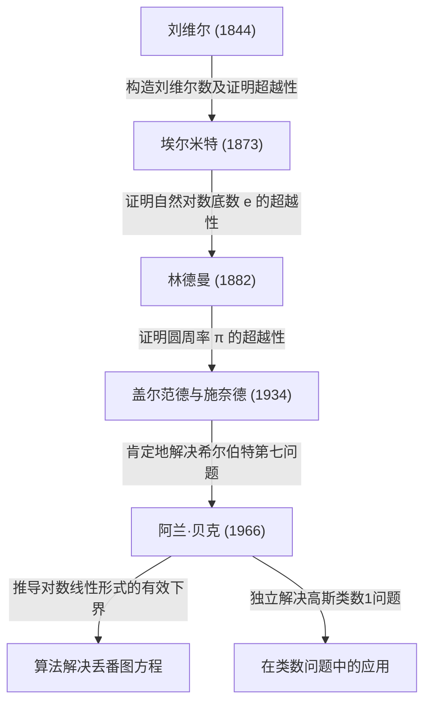

# [阿兰·贝克：彻底改变超越数论的菲尔兹奖得主数学家](https://kenji.blog/zh-cn/p/baker/)

## 1. 引言

在漫长的数学历史中，存在着无数看似简单却让数个世纪里世界上最聪明的大脑感到困惑的问题。其中，“超越数（Transcendental number）”的研究被认为是现代数学中最深奥的领域之一，它需要极其强大的理论框架，其根源可以追溯到古希腊的“化圆为方”问题。

英国数学家 **[阿兰·贝克](https://kenji.blog/zh-cn/p/baker/)（Alan Baker）** 在超越数论这个极具挑战性的领域带来了历史性的突破。他最伟大的成就——“对数线性形式定理”（通常简称为贝克定理），超越了纯粹超越数论的界限。它在解决长期悬而未决的公开问题中发挥了决定性作用，包括特定[丢番图](https://kenji.blog/zh-cn/p/diophantus/)方程的求解方法和解决高斯类数问题。凭借这些突破性的贡献，他在1970年的国际数学家大会上，以31岁的年纪荣获了数学界的最高荣誉—— **菲尔兹奖（Fields Medal）** 。

在本文中，我们将深入探讨[阿兰·贝克](https://kenji.blog/zh-cn/p/baker/)的一生、他所面临的数学挑战，以及他建立的理论如何影响现代数学，并同时探索其中的数学细节。

## 2. 生平与教育

### 2.1 青年时期与通往剑桥之路
[阿兰·贝克](https://kenji.blog/zh-cn/p/baker/)于1939年8月19日出生在英国伦敦。他从小就在数学方面展现出非凡的天赋，就读于当地的一所文法学校后，进入了伦敦大学学院（UCL）。在那里，他严格学习了数学的基础，并以最高荣誉毕业。

为了追求更高的目标，他随后转入剑桥大学三一学院。当时的剑桥大学是世界领先的数论研究中心之一。在那里，贝克师从于带领英国数论界的前辈、伟大的数学家 **哈罗德·达文波特（Harold Davenport）** 。达文波特是[丢番图](https://kenji.blog/zh-cn/p/diophantus/)逼近和解析数论领域的权威。在他的指导下，贝克磨练了他高阶的数学直觉和严密的证明技巧。

### 2.2 学术生涯与荣誉
1964年，贝克获得了剑桥大学的博士学位。甚至在他的博士论文中，那些足以让他名垂青史的卓越思想的种子就已经显现出来。获得博士学位后不久，他被选为三一学院的研究员，并正式开始了他的研究活动。

1966年，他开始发表一系列关于“对数线性形式”的突破性论文。这一成就震惊了全球数学界，并使他能够在1970年于法国尼斯举行的国际数学家大会（ICM）上荣获 **菲尔兹奖** 。

贝克在随后的职业生涯中一直留在剑桥，担任纯粹数学教授，为数论研究和下一代的培养做出了巨大贡献。他环游世界进行演讲，并在印度、美国等许多大学担任客座教授。[阿兰·贝克](https://kenji.blog/zh-cn/p/baker/)于2018年2月4日去世，享年78岁，但他留下的定理和方法至今深深扎根于现代计算数论和密码学中。

## 3. 数学成就：超越数论与贝克定理

### 3.1 代数数与超越数的基础
要欣赏贝克工作的真正价值，我们首先必须复习一下将数分类为“代数数”和“超越数”的概念。

- **代数数（Algebraic number）** ：作为一个具有有理系数 $\mathbb{Q}$ 的非零多项式方程的根的复数。例如，作为 $x^2 - 2 = 0$ 的根的 $\sqrt{2}$ ，以及 $x^4 + 1 = 0$ 的根都属于这一类。所有有理数也是代数数，因为它们是一次方程 $qx - p = 0$ 的根。
- **超越数（Transcendental number）** ：不作为任何具有有理系数的非零多项式方程的根的复数。著名的例子包括数学常数圆周率 $\pi$ 和自然对数的底数 $e$ 。

在19世纪后期，[格奥尔格·康托尔](https://kenji.blog/zh-cn/p/cantor/)从集合论的角度证明了，虽然代数数的集合是可数无限的，但所有复数的集合是不可数无限的。这意味着“几乎所有的数都是超越数”。然而，证明一个给定的特定数字是超越数却是极其困难的。

### 3.2 希尔伯特第七问题与盖尔范德-施奈德定理
1900年，[大卫·希尔伯特](https://kenji.blog/zh-cn/p/hilbert/)在巴黎举行的国际数学家大会上提出了23个未解决的问题（希尔伯特23问）。他的第七个问题如下：

> “如果 $\alpha$ 是除 $0$ 和 $1$ 之外的代数数， $\beta$ 是无理代数数，那么 $\alpha^\beta$ 总是超越数吗？”

例如，这等于询问像 $2^{\sqrt{2}}$ 或 $e^\pi$ （由于 $e^{\pi i} = -1$ 它可以变形为 $i^{-2i}$ ）这样的数是否是超越数。
这个问题在1934年由俄罗斯数学家亚历山大·盖尔范德和德国数学家西奥多·施奈德独立且肯定地解决了。这就是著名的 **盖尔范德-施奈德定理（Gelfond–Schneider theorem）** 。

这个定理可以使用对数函数重述如下：
“如果 $\log \alpha_1$ 和 $\log \alpha_2$ 在有理数域上是线性无关的，那么它们在代数数域上也是线性无关的。”

### 3.3 贝克定理：对数的线性形式
贝克完成了一项惊人的壮举，将盖尔范德和施奈德证明的两个对数的结果推广到了任意数量的 $n$ 个对数。

**贝克定理（Baker's Theorem, 1966）** ：
设 $\alpha_1, \alpha_2, \ldots, \alpha_n$ 为非零代数数，并假设 $\log \alpha_1, \log \alpha_2, \ldots, \log \alpha_n$ 在有理数域 $\mathbb{Q}$ 上是线性无关的。那么，$1, \log \alpha_1, \log \alpha_2, \ldots, \log \alpha_n$ 在代数数域 $\overline{\mathbb{Q}}$ 上是线性无关的。

换句话说，对于任何非零代数数 $\beta_0, \beta_1, \ldots, \beta_n$ ，他证明了以下线性形式 $\[Lambda](https://kenji.blog/zh-cn/p/serverless-architecture-aws-lambda-cold-start/)$ 永远不等于 $0$ 。

$$ \Lambda = \beta_0 + \beta_1 \log \alpha_1 + \cdots + \beta_n \log \alpha_n \neq 0 $$

### 3.4 “有效（Effective）”下界的推导
贝克定理真正革命性的方面不仅仅在于证明 $\Lambda \neq 0$ ，而在于他推导出了 $|\Lambda|$ 的一个 **有效下界（effective lower bound）** 。
在此之前数论中的许多定理（如罗斯定理）都是“无效的（ineffective）”；它们只能表明“只存在有限个解”，但无法指出“最大的解可能会有多大”。

贝克提供了一个关于 $|\Lambda|$ 能够多接近 $0$ 的可计算的极限，使用了一个特定的正数常数 $C$ ，该常数取决于代数数 $\alpha_i$ 和 $\beta_i$ 的“高度（height）”（一种与以该数为根的最小多项式的最大系数相关的度量）和次数。

$$ |\Lambda| > C > 0 $$

这种“有效性”成为了通过算法解决数论中众多公开问题的关键钥匙。

## 4. 在[丢番图](https://kenji.blog/zh-cn/p/diophantus/)方程与类数问题中的应用

贝克定理带来了超越数论以外的其他整数论领域的戏剧性应用。

### 4.1 [丢番图](https://kenji.blog/zh-cn/p/diophantus/)方程的有效解法
[丢番图](https://kenji.blog/zh-cn/p/diophantus/)方程是一个带有整数系数的多项式方程，人们试图寻找它的整数解。
例如，考虑以下形式的 **图厄方程（Thue equation）** ：

$$ f(x, y) = m $$

这里， $f(x, y)$ 是一个次数至少为3的不可约齐次多项式， $m$ 是一个非零整数。
1909年，阿克塞尔·图厄证明了该方程只有有限个整数解 $(x, y)$ 。然而，他的证明是无效的，因此当时没有已知的方法可以找到所有的解。

通过利用他对数线性形式的下界，贝克成功计算出了变量 $x$ 和 $y$ 绝对值的明确上限。因此，建立了一种算法，通过使用计算机进行有限次搜索来完全确定图厄方程的所有解。类似的技术被应用于更复杂的[丢番图](https://kenji.blog/zh-cn/p/diophantus/)方程，如 **莫德尔方程（Mordell equation）** $y^2 = x^3 + k$ ，从而刺激了一个被称为计算数论的新领域的发展。

```python
# 使用SageMath求解图厄方程的概念代码示例
# 搜索方程 x^3 - 2y^3 = 1 的整数解
x, y = var('x y')
eq = x^3 - 2*y^3 == 1
# 基于贝克定理，计算了求解绝对值的上限，
# 使得可以通过有限的搜索找出所有的平凡解（如 (1, 0)）。
```

### 4.2 解决高斯类数1问题
19世纪的伟大数学家[卡尔·弗里德里希·高斯](https://kenji.blog/zh-cn/p/gauss/)提出了一个关于虚二次域 $\mathbb{Q}(\sqrt{-d})$ 的类数（理想类群的阶）的猜想。他猜想，类数为1（意味着唯一分解定理成立）的 $d > 0$ 的值只有九个： $d = 3, 4, 7, 8, 11, 19, 43, 67, 163$ 。这就是著名的 **类数1问题（Class number 1 problem）** 。

这个问题在1952年由库尔特·黑格纳（Kurt Heegner）使用模函数基本上解决了，但他的论文被认为有不清楚的地方，在当时没有被数学界广泛接受。
后来，在1967年，哈罗德·斯塔克（Harold Stark）严格地形式化了黑格纳的证明，独立地完成了它。令人惊讶的是，几乎在同一时间，[阿兰·贝克](https://kenji.blog/zh-cn/p/baker/)在完全不使用任何模函数的情况下，使用基于他的“对数线性形式”方法的完全不同的方法证明了这个猜想。
贝克的方法被证明具有极高的通用性，随后被应用于解决更普遍的问题，例如确定所有类数为2的虚二次域。

## 5. 超越数论的谱系

贝克在超越数论史上的成就定位可以通过以下图表来总结。他整合了前人的理论，构建了一个全新的、可计算的理论框架。



## 6. 结语

随着[阿兰·贝克](https://kenji.blog/zh-cn/p/baker/)的出现，数论——特别是对超越数论和[丢番图](https://kenji.blog/zh-cn/p/diophantus/)方程的研究——进入了一个全新的时代。他提出的“有效计算方法”将算法方法引入了抽象的纯数学中，现在已经成为支撑现代计算机科学和密码学的数学基础的一部分。

他在限制[丢番图](https://kenji.blog/zh-cn/p/diophantus/)方程解的范围方面的研究，也为通往更深层次理论的桥梁提供了基础，例如 **[ABC猜想](https://kenji.blog/zh-cn/p/abc-conjecture/)（abc conjecture）** ，这在今天仍然是数论中最大的未解问题之一。
作为一位将辉煌的直觉与压倒性的逻辑力量结合在一起，以完成高度复杂和技术性证明的伟大数学家，[阿兰·贝克](https://kenji.blog/zh-cn/p/baker/)留下的定理遗产和对数论的热情，无疑将在数学史上继续熠熠生辉，永不褪色。
