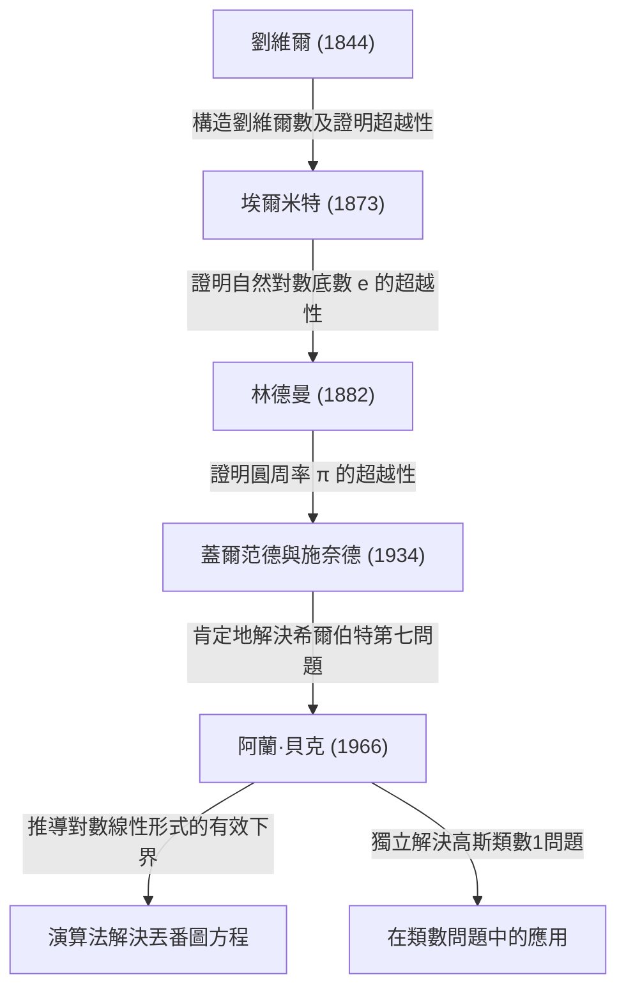

# [阿蘭·貝克：徹底改變超越數論的菲爾茲獎得主數學家](https://kenji.blog/zh-tw/p/baker/)

## 1. 引言

在漫長的數學歷史中，存在著無數看似簡單卻讓數個世紀裡世界上最聰明的大腦感到困惑的問題。其中，“超越數（Transcendental number）”的研究被認為是現代數學中最深奧的領域之一，它需要極其強大的理論框架，其根源可以追溯到古希臘的“化圓為方”問題。

英國數學家 **[阿蘭·貝克](https://kenji.blog/zh-tw/p/baker/)（[Alan Baker](https://kenji.blog/zh-tw/p/baker/)）** 在超越數論這個極具挑戰性的領域帶來了歷史性的突破。他最偉大的成就——“對數線性形式定理”（通常簡稱為貝克定理），超越了純粹超越數論的界線。它在解決長期懸而未決的公開問題中發揮了決定性作用，包括特定[丟番圖](https://kenji.blog/zh-tw/p/diophantus/)方程的求解方法和解決高斯類數問題。憑藉這些突破性的貢獻，他在1970年的國際數學家大會上，以31歲的年紀榮獲了數學界的最高榮譽—— **菲爾茲獎（Fields Medal）** 。

在本文中，我們將深入探討[阿蘭·貝克](https://kenji.blog/zh-tw/p/baker/)的一生、他所面臨的數學挑戰，以及他建立的理論如何影響現代數學，並同時探索其中的數學細節。

## 2. 生平與教育

### 2.1 青年時期與通往劍橋之路
[阿蘭·貝克](https://kenji.blog/zh-tw/p/baker/)於1939年8月19日出生在英國倫敦。他從小就在數學方面展現出非凡的天賦，就讀於當地的一所文法學校後，進入了倫敦大學學院（UCL）。在那裡，他嚴格學習了數學的基礎，並以最高榮譽畢業。

為了追求更高的目標，他隨後轉入劍橋大學三一學院。當時的劍橋大學是世界領先的數論研究中心之一。在那裡，貝克師從於帶領英國數論界的前輩、偉大的數學家 **哈羅德·達文波特（Harold Davenport）** 。達文波特是[丟番圖](https://kenji.blog/zh-tw/p/diophantus/)逼近和解析數論領域的權威。在他的指導下，貝克磨練了他高階的數學直覺和嚴密的證明技巧。

### 2.2 學術生涯與榮譽
1964年，貝克獲得了劍橋大學的博士學位。甚至在他的博士論文中，那些足以讓他名垂青史的卓越思想的種子就已經顯現出來。獲得博士學位後不久，他被選為三一學院的研究員，並正式開始了他的研究活動。

1966年，他開始發表一系列關於“對數線性形式”的突破性論文。這一成就震驚了全球數學界，並使他能夠在1970年於法國尼斯舉行的國際數學家大會（ICM）上榮獲 **菲爾茲獎** 。

貝克在隨後的職業生涯中一直留在劍橋，擔任純粹數學教授，為數論研究和下一代的培養做出了巨大貢獻。他環遊世界進行演講，並在印度、美國等許多大學擔任客座教授。[阿蘭·貝克](https://kenji.blog/zh-tw/p/baker/)於2018年2月4日去世，享年78歲，但他留下的定理和方法至今深深紮根於現代計算數論和密碼學中。

## 3. 數學成就：超越數論與貝克定理

### 3.1 代數數與超越數的基礎
要欣賞貝克工作的真正價值，我們首先必須複習一下將數分類為“代數數”和“超越數”的概念。

- **代數數（Algebraic number）** ：作為一個具有有理係數 $\mathbb{Q}$ 的非零多項式方程的根的複數。例如，作為 $x^2 - 2 = 0$ 的根的 $\sqrt{2}$ ，以及 $x^4 + 1 = 0$ 的根都屬於這一類。所有有理數也是代數數，因為它們是一次方程 $qx - p = 0$ 的根。
- **超越數（Transcendental number）** ：不作為任何具有有理係數的非零多項式方程的根的複數。著名的例子包括數學常數圓周率 $\pi$ 和自然對數的底數 $e$ 。

在19世紀後期，[格奧爾格·康托爾](https://kenji.blog/zh-tw/p/cantor/)從集合論的角度證明了，雖然代數數的集合是可數無限的，但所有複數的集合是不可數無限的。這意味著“幾乎所有的數都是超越數”。然而，證明一個給定的特定數字是超越數卻是極其困難的。

### 3.2 希爾伯特第七問題與蓋爾范德-施奈德定理
1900年，[大衛·希爾伯特](https://kenji.blog/zh-tw/p/hilbert/)在巴黎舉行的國際數學家大會上提出了23個未解決的問題（希爾伯特23問）。他的第七個問題如下：

> “如果 $\alpha$ 是除 $0$ 和 $1$ 之外的代數數， $\beta$ 是無理代數數，那麼 $\alpha^\beta$ 總是超越數嗎？”

例如，這等於詢問像 $2^{\sqrt{2}}$ 或 $e^\pi$ （由於 $e^{\pi i} = -1$ 它可以變形為 $i^{-2i}$ ）這樣的數是否是超越數。
這個問題在1934年由俄羅斯數學家亞歷山大·蓋爾范德和德國數學家西奧多·施奈德獨立且肯定地解決了。這就是著名的 **蓋爾范德-施奈德定理（Gelfond–Schneider theorem）** 。

這個定理可以使用對數函數重述如下：
“如果 $\log \alpha_1$ 和 $\log \alpha_2$ 在有理數域上是線性無關的，那麼它們在代數數域上也是線性無關的。”

### 3.3 貝克定理：對數的線性形式
貝克完成了一項驚人的壯舉，將蓋爾范德和施奈德證明的兩個對數的結果推廣到了任意數量的 $n$ 個對數。

**貝克定理（Baker's Theorem, 1966）** ：
設 $\alpha_1, \alpha_2, \ldots, \alpha_n$ 為非零代數數，並假設 $\log \alpha_1, \log \alpha_2, \ldots, \log \alpha_n$ 在有理數域 $\mathbb{Q}$ 上是線性無關的。那麼，$1, \log \alpha_1, \log \alpha_2, \ldots, \log \alpha_n$ 在代數數域 $\overline{\mathbb{Q}}$ 上是線性無關的。

換句話說，對於任何非零代數數 $\beta_0, \beta_1, \ldots, \beta_n$ ，他證明了以下線性形式 $\Lambda$ 永遠不等於 $0$ 。

$$ \Lambda = \beta_0 + \beta_1 \log \alpha_1 + \cdots + \beta_n \log \alpha_n \neq 0 $$

### 3.4 “有效（Effective）”下界的推導
貝克定理真正革命性的方面不僅僅在於證明 $\Lambda \neq 0$ ，而在於他推導出了 $|\Lambda|$ 的一個 **有效下界（effective lower bound）** 。
在此之前數論中的許多定理（如羅斯定理）都是“無效的（ineffective）”；它們只能表明“只存在有限個解”，但無法指出“最大的解可能會有多大”。

貝克提供了一個關於 $|\Lambda|$ 能夠多接近 $0$ 的可計算的極限，使用了一個特定的正數常數 $C$ ，該常數取決於代數數 $\alpha_i$ 和 $\beta_i$ 的“高度（height）”（一種與以該數為根的最小多項式的最大係數相關的度量）和次數。

$$ |\Lambda| > C > 0 $$

這種“有效性”成為了透過演算法解決數論中眾多公開問題的關鍵鑰匙。

## 4. 在[丟番圖](https://kenji.blog/zh-tw/p/diophantus/)方程與類數問題中的應用

貝克定理帶來了超越數論以外的其他整數論領域的戲劇性應用。

### 4.1 [丟番圖](https://kenji.blog/zh-tw/p/diophantus/)方程的有效解法
[丟番圖](https://kenji.blog/zh-tw/p/diophantus/)方程是一個帶有整數係數的多項式方程，人們試圖尋找它的整數解。
例如，考慮以下形式的 **圖厄方程（Thue equation）** ：

$$ f(x, y) = m $$

這裡， $f(x, y)$ 是一個次數至少為3的不可約齊次多項式， $m$ 是一個非零整數。
1909年，阿克塞爾·圖厄證明了該方程只有有限個整數解 $(x, y)$ 。然而，他的證明是無效的，因此當時沒有已知的方法可以找到所有的解。

透過利用他對數線性形式的下界，貝克成功計算出了變量 $x$ 和 $y$ 絕對值的明確上限。因此，建立了一種演算法，透過使用電腦進行有限次搜尋來完全確定圖厄方程的所有解。類似的技術被應用於更複雜的[丟番圖](https://kenji.blog/zh-tw/p/diophantus/)方程，如 **莫德爾方程（Mordell equation）** $y^2 = x^3 + k$ ，從而刺激了一個被稱為計算數論的新領域的發展。

```python
# 使用SageMath求解圖厄方程的概念程式碼範例
# 搜尋方程 x^3 - 2y^3 = 1 的整數解
x, y = var('x y')
eq = x^3 - 2*y^3 == 1
# 基於貝克定理，計算了求解絕對值的上限，
# 使得可以透過有限的搜尋找出所有的平凡解（如 (1, 0)）。
```

### 4.2 解決高斯類數1問題
19世紀的偉大數學家[卡爾·弗里德里希·高斯](https://kenji.blog/zh-tw/p/gauss/)提出了一個關於虛二次域 $\mathbb{Q}(\sqrt{-d})$ 的類數（理想類群的階）的猜想。他猜想，類數為1（意味著唯一分解定理成立）的 $d > 0$ 的值只有九個： $d = 3, 4, 7, 8, 11, 19, 43, 67, 163$ 。這就是著名的 **類數1問題（Class number 1 problem）** 。

這個問題在1952年由庫爾特·黑格納（Kurt Heegner）使用模函數基本上解決了，但他的論文被認為有不清楚的地方，在當時沒有被數學界廣泛接受。
後來，在1967年，哈羅德·斯塔克（Harold Stark）嚴格地形式化了黑格納的證明，獨立地完成了它。令人驚訝的是，幾乎在同一時間，[阿蘭·貝克](https://kenji.blog/zh-tw/p/baker/)在完全不使用任何模函數的情況下，使用基於他的“對數線性形式”方法的完全不同的方法證明了這個猜想。
貝克的方法被證明具有極高的通用性，隨後被應用於解決更普遍的問題，例如確定所有類數為2的虛二次域。

## 5. 超越數論的譜系

貝克在超越數論史上的成就定位可以透過以下圖表來總結。他整合了前人的理論，構建了一個全新的、可計算的理論框架。



## 6. 結語

隨著[阿蘭·貝克](https://kenji.blog/zh-tw/p/baker/)的出現，數論——特別是對超越數論和[丟番圖](https://kenji.blog/zh-tw/p/diophantus/)方程的研究——進入了一個全新的時代。他提出的“有效計算方法”將演算法方法引入了抽象的純數學中，現在已經成為支撐現代電腦科學和密碼學的數學基礎的一部分。

他在限制[丟番圖](https://kenji.blog/zh-tw/p/diophantus/)方程解的範圍方面的研究，也為通往更深層次理論的橋樑提供了基礎，例如 **[ABC猜想](https://kenji.blog/zh-tw/p/abc-conjecture/)（abc conjecture）** ，這在今天仍然是數論中最大的未解問題之一。
作為一位將輝煌的直覺與壓倒性的邏輯力量結合在一起，以完成高度複雜和技術性證明的偉大數學家，[阿蘭·貝克](https://kenji.blog/zh-tw/p/baker/)留下的定理遺產和對數論的熱情，無疑將在數學史上繼續熠熠生輝，永不褪色。
