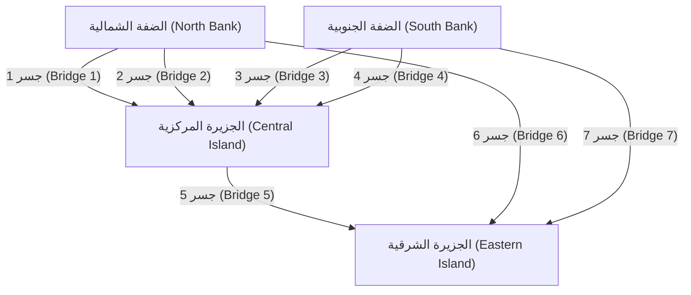
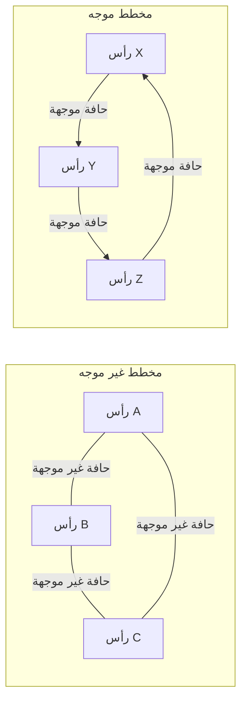

## 1. مقدمة: العالم يتكون من شبكات

في المجتمع الحديث، نحن دائماً متصلون بشيء ما. سواء كان ذلك التواصل بين أجهزة الكمبيوتر عبر الإنترنت، العلاقات الإنسانية المعقدة على خدمات الشبكات الاجتماعية (SNS)، شبكات الطرق والسكك الحديدية الشاسعة التي تربط المدن، سلاسل التوريد العالمية للخدمات اللوجستية، أو الروابط العصبية التي لا حصر لها داخل أدمغتنا - ليس من قبيل المبالغة القول إن العالم يتكون من شبكات لا حصر لها.

لتوفير إطار قوي لتمثيل وتحليل هذه الشبكات، التي تبدو للوهلة الأولى معقدة للغاية بل وفوضوية، ببساطة وبصرامة رياضية، هناك **نظرية المخططات** ([Graph Theory](https://kenji.blog/ar/p/graph-theory-dijkstra-a-star/)). باستخدام نظرية المخططات، يمكننا كشف الهياكل والخصائص المخفية داخل الأنظمة المعقدة، إيجاد طرق الاتصال المثلى، وتقييم نقاط الضعف في شبكات بأكملها.

سيشرح هذا المقال بشكل شامل ومنهجي نظرية المخططات، بدءاً من أصولها التاريخية، وتغطية التعريفات الرياضية الأساسية وهياكل البيانات لبرمجة الكمبيوتر، وتقديم الخوارزميات التمثيلية التي تدعم أساس التكنولوجيا الحديثة.

## 2. ولادة نظرية المخططات: [جسور كونيغسبرغ السبعة](https://kenji.blog/ar/p/seven-bridges-of-konigsberg/)

يعود تاريخ نظرية المخططات إلى القرن الثامن عشر. في عام 1736، قام عالم الرياضيات السويسري العبقري ليونهارت أويلر بحل لغز رياضي شهير بأناقة، مما يمثل بداية هذا المجال. يُعرف هذا اللغز باسم "[جسور كونيغسبرغ السبعة](https://kenji.blog/ar/p/seven-bridges-of-konigsberg/)".

في مدينة كونيغسبرغ الجميلة في مملكة بروسيا (كالينينغراد حالياً، روسيا)، كان يتدفق نهر بريغيل، حيث توجد جزيرتان في المنتصف وإجمالي سبعة جسور تربط بينهما وبين ضفاف النهر. أصبحت لعبة شائعة بين المواطنين: "هل من الممكن عبور كل جسر مرة واحدة بالضبط والعودة إلى نقطة البداية الأصلية؟" حاول الكثير من الناس، لكن لم ينجح أحد.

لحل هذه المشكلة، اتخذ أويلر نهجاً ثورياً يتمثل في تجريد الخريطة الفعلية للمدينة إلى أقصى حد لها. لقد مثل الكتل الأرضية (الجزر والضفاف) على أنها "نقاط" والجسور التي تربطها كـ "خطوط"، مما يقضي على جميع العناصر غير ذات الصلة بجوهر المشكلة، مثل المسافة والاتجاه.



أدرك أويلر أنه من أجل "المرور عبر" نقطة ما، يجب أن يكون هناك دائماً زوج من "جسر الدخول" و"جسر الخروج". وهذا يعني أنه أثبت رياضياً أنه بالنسبة لجميع النقاط باستثناء نقطة البداية والنهاية، يجب أن يكون عدد الجسور المتصلة "زوجياً".

في المخطط المجرد لجسور كونيغسبرغ، كان عدد الجسور المتصلة في جميع الكتل الأرضية (النقاط) الأربع "فردياً" (إما 3 أو 5). ولذلك، استُنتج أنه من المستحيل رسم خط مستمر يعبر جميع الجسور مرة واحدة بالضبط.

كان اكتشاف أويلر هذا هو اللحظة الدقيقة التي ولدت فيها **نظرية المخططات**. من خلال التخلص من التضاريس المادية المعقدة والتركيز فقط على علاقات الاتصال (الطوبولوجيا) للنقاط والخطوط، فتح مجالاً جديداً تماماً في الرياضيات.

## 3. المفاهيم الأساسية والتعريفات الرياضية لنظرية المخططات

في نظرية المخططات، لا يشير "المخطط" (Graph) إلى طرق تصور البيانات الإحصائية مثل المخططات الخطية أو المخططات الدائرية. إنه يشير إلى بنية رياضية تمثل مجموعة من الكائنات والعلاقات بينها.

### 3.1. البنية الأساسية للمخطط: الرؤوس والحواف

يُعرّف المخطط $G$ عموماً بأنه زوج من مجموعة من الرؤوس (Vertices) $V$ ومجموعة من الحواف (Edges) $E$، ويُشار إليه رياضياً بـ $G = (V, E)$.

*   **الرأس / العقدة (Vertex / Node)**: يمثل مكونات الشبكة. يُرسم بصرياً كنقطة. يُشار إلى عدد العناصر في المجموعة $V$ (عدد الرؤوس) بـ $|V|$.
*   **الحافة / الرابط (Edge / Link)**: يمثل العلاقة أو الاتصال بين الرؤوس. يُرسم بصرياً كخط. يُشار إلى عدد العناصر في المجموعة $E$ (عدد الحواف) بـ $|E|$.

على سبيل المثال، يتم تمثيل الحافة التي تربط الرأس $u$ و $v$ بـ $e = (u, v)$.

### 3.2. المخططات الموجهة وغير الموجهة

تُصنف المخططات بشكل عام إلى نوعين اعتماداً على ما إذا كانت الحواف لها اتجاه.

*   **المخطط غير الموجه (Undirected Graph)**: مخطط لا يكون لحوافه اتجاه. يُستخدم عندما تكون العلاقة متبادلة وثنائية الاتجاه دائماً، مثل خطوط الاتصال، أو الطرق ذات الاتجاهين، أو علاقات "الأصدقاء" على فيسبوك.
*   **المخطط الموجه (Directed Graph)**: مخطط يكون لحوافه اتجاه. يُستخدم للتعبير عن العلاقات أحادية الاتجاه، مثل تدفق المياه، أو الشوارع ذات الاتجاه الواحد، أو علاقات "المتابعة" على تويتر (X). في المخططات الموجهة، تُرسم الحواف بوضوح كأسهم.



### 3.3. المخططات الموزونة

عند نمذجة مشاكل العالم الحقيقي، غالباً ما نريد أن نعبر ليس فقط عما "إذا كانوا متصلين" ولكن أيضاً عن "سهولة الاتصال" أو "التكلفة". في مثل هذه الحالات، يتم استخدام **مخطط موزن (Weighted Graph)**، حيث يتم تعيين قيمة عددية (وزن) لكل حافة. يمكن أن يمثل الوزن المسافة بين المدن، أو وقت تأخير الاتصال، أو تكلفة السفر.

### 3.4. المسارات والدورات

مفهوم التحرك داخل مخطط مهم جداً أيضاً.

*   **المسير (Walk)**: تسلسل يتناوب بين الرؤوس والحواف. يمكن اجتياز نفس الرؤوس أو الحواف عدة مرات.
*   **المسار (Path)**: مسير لا تتم فيه زيارة أي رأس أكثر من مرة واحدة.
*   **الدورة (Cycle)**: مسار تكون فيه نقطة البداية ونقطة النهاية متطابقتين.

هذه المفاهيم هي اللبنات الأساسية لتتبع تدفق البيانات على شبكة أو في خوارزميات توجيه حركة المرور.

### 3.5. الدرجة والاتصالية

يُسمى عدد الحواف المتصلة مباشرة برأس ما بـ **درجة (Degree)** ذلك الرأس. يُشار إلى درجة الرأس $v$ رياضياً بـ $\deg(v)$.

في المخطط الموجه، نميز بوضوح بين **درجة الدخول (In-degree)**، وهي عدد الأسهم القادمة إلى رأس، و **درجة الخروج (Out-degree)**، وهي عدد الأسهم الخارجة من رأس.

علاوة على ذلك، إذا كان هناك دائماً مسار بين أي رأسين تعسفيين في مخطط، فيقال إن هذا المخطط **متصل (Connected)**. في شبكات الاتصال مثل الإنترنت، يعد كون الشبكة بأكملها مخططاً متصلاً مطلباً أساسياً لضمان قدرة جميع أجهزة الكمبيوتر على التواصل مع بعضها البعض.

## 4. هياكل البيانات للتعامل مع المخططات في أجهزة الكمبيوتر

من أجل تنفيذ المفاهيم الرياضية لنظرية المخططات كبرامج وجعل أجهزة الكمبيوتر تحسبها بسرعة، من الضروري تمثيل المخططات في الذاكرة باستخدام هياكل البيانات المناسبة. في الممارسة العملية، يتم استخدام طريقتين رئيسيتين: "مصفوفة الجوار" و "قائمة الجوار".

### 4.1. مصفوفة الجوار (Adjacency Matrix)

مصفوفة الجوار هي طريقة لتمثيل مخطط باستخدام مصفوفة ثنائية الأبعاد (Matrix). يُمثل المخطط الذي يحتوي على $N$ من الرؤوس بمصفوفة $A$ بحجم $N \times N$. إذا كانت هناك حافة من الرأس $i$ إلى الرأس $j$، يتم تعيين عنصر المصفوفة $A_{i,j}$ على $1$؛ وإذا لم تكن موجودة، يتم تعيينه على $0$. بالنسبة للمخططات الموزونة، يتم وضع القيمة العددية لوزن الحافة بدلاً من $1$.

رياضياً، يتم تعريفها على النحو التالي:

$$
A_{i,j} = \begin{cases} 
1 & (\text{إذا كانت هناك حافة من الرأس } i \text{ إلى الرأس } j) \\
0 & (\text{بخلاف ذلك})
\end{cases}
$$

*   **الإيجابيات**: من الممكن التحديد فوراً ما إذا كانت هناك حافة بين أي رأسين في وقت $\mathcal{O}(1)$ (وقت ثابت). كما أنه يرتبط مباشرة بالتحليل الجبري للمخططات (مثل نظرية المخططات الطيفية) باستخدام ضرب المصفوفات.
*   **السلبيات**: استهلاك الذاكرة هو $\mathcal{O}(N^2)$ لعدد الرؤوس $N$، مما سيستنفد الذاكرة للمخططات العملاقة. خاصة بالنسبة لـ **المخططات المتناثرة (Sparse Graphs)**، حيث يكون عدد الحواف صغيراً جداً مقارنة بمربع عدد الرؤوس، يصبح معظم المصفوفة $0$، مما يجعلها غير فعالة للغاية.

### 4.2. قائمة الجوار (Adjacency List)

قائمة الجوار هي طريقة تحتفظ بـ "قائمة الرؤوس المتجاورة (مثل مصفوفة أو قائمة مرتبطة)" المتصلة مباشرة بحافة لكل رأس.

*   رأس A: `[B, C]`
*   رأس B: `[A, D, E]`
*   رأس C: `[A, F]`

*   **الإيجابيات**: يتناسب استهلاك الذاكرة مع مجموع عدد الرؤوس والحواف، مما يؤدي إلى $\mathcal{O}(|V| + |E|)$، مما يجعله فعالاً للغاية في الذاكرة للمخططات المتناثرة الشائعة في العالم الحقيقي.
*   **السلبيات**: للتحقق مما إذا كان رأس معين $i$ والرأس $j$ متصلين، من الضروري البحث بالتسلسل في القائمة، وهو ما يستغرق وقتاً $\mathcal{O}(|V|)$ في أسوأ الحالات.

## 5. خوارزميات تمثيلية حول المخططات

لحل المشاكل على المخططات بكفاءة، تم ابتكار العديد من الخوارزميات الممتازة عبر تاريخ علوم الكمبيوتر. نقدم هنا بعض الخوارزميات التمثيلية التي تعتبر أساسية في هندسة البرمجيات الحديثة.

### 5.1. بحث العرض أولاً (BFS) وبحث العمق أولاً (DFS)

أهم الخوارزميات الأساسية لزيارة جميع الرؤوس في الشبكة بشكل منهجي دون حذف هي **بحث العرض أولاً (Breadth-First Search, BFS)** و **بحث العمق أولاً (Depth-First Search, DFS)**.

*   **بحث العرض أولاً (BFS)**: يستكشف بشكل متحد المركز، مع إعطاء الأولوية للرؤوس الأقرب إلى نقطة البداية. يشبه الأمر تموجات تنتشر عندما يُلقى حجر في الماء. إنه مثالي للعثور على أقصر مسار (المسار الذي يحتوي على الحد الأدنى لعدد الحواف) في مخطط غير موزن. يتم تنفيذه باستخدام هيكل بيانات الطابور (Queue).
*   **بحث العمق أولاً (DFS)**: يستكشف بأعمق ما يمكن، وعندما يصل إلى طريق مسدود، يتراجع إلى نقطة التفرع السابقة لاستكشاف مسار آخر. إنه مثل حل متاهة عن طريق تتبع الجدران. يُستخدم لاكتشاف الدورات في مخطط أو للفرز الطوبولوجي. يتم تنفيذه باستخدام مكدس (Stack) أو استدعاءات دالة تكرارية (Recursive).

يوجد أدناه مثال بسيط لتنفيذ بحث العرض أولاً (BFS) باستخدام بايثون.

```python
from collections import deque

def bfs(graph, start_vertex):
    """
    دالة لتنفيذ بحث العرض أولاً (BFS) على مخطط
    :param graph: قاموس المخطط الممثل في تنسيق قائمة الجوار
    :param start_vertex: الرأس الأولي لبدء الاستكشاف
    """
    visited = set() # مجموعة لتسجيل الرؤوس التي تمت زيارتها
    queue = deque([start_vertex]) # طابور لإدارة الرؤوس التي سيتم استكشافها
    visited.add(start_vertex)
    
    while queue:
        # إخراج رأس من مقدمة الطابور
        vertex = queue.popleft()
        print(f"جاري زيارة الرأس حالياً: {vertex}")
        
        # إضافة جميع الرؤوس المتجاورة غير المزارة إلى الطابور
        for neighbor in graph[vertex]:
            if neighbor not in visited:
                visited.add(neighbor)
                queue.append(neighbor)

# تعريف المخطط (تنسيق قائمة الجوار)
graph_data = {
    'A': ['B', 'C'],
    'B': ['A', 'D', 'E'],
    'C': ['A', 'F'],
    'D': ['B'],
    'E': ['B', 'F'],
    'F': ['C', 'E']
}

print("سجل نتيجة تنفيذ BFS:")
bfs(graph_data, 'A')
```

### 5.2. مشكلة أقصر مسار: خوارزمية ديكسترا

عند البحث عن أسرع طريق إلى وجهة على تطبيق خريطة، فإن ما يعمل في قلب النظام هو **خوارزمية أقصر مسار**. يحتوي المسار على تكاليف (أوزان) مثل "المسافة" و "وقت السفر"، والهدف هو العثور على المسار الذي يقلل التكلفة التراكمية من نقطة البداية إلى الوجهة.

ابتكرها عالم الكمبيوتر الهولندي إدسغر و. ديكسترا في عام 1956، تعتبر **خوارزمية ديكسترا** خوارزمية شهيرة للغاية لحساب أقصر مسار بكفاءة من مصدر واحد إلى جميع الرؤوس الأخرى في شبكة، بشرط أن تكون جميع أوزان الحواف غير سالبة (0 أو أكبر).

يتمثل المنطق الأساسي لخوارزمية ديكسترا في تكرار عملية "تحديد الرأس صاحب أقصر مسافة غير مؤكدة من مجموعة الرؤوس التي تم تأكيد أقصر مسافة لها من البداية بالفعل، وتحديث معلومات أقصر مسافة للرؤوس المحيطة عبر طرق تمر عبر ذلك الرأس". باستخدام طابور الأولوية (Priority Queue)، يمكن تقليل وقت التنفيذ بشكل كبير.

```python
import heapq

def dijkstra(graph, start):
    """
    حساب تكاليف أقصر مسار باستخدام خوارزمية ديكسترا
    """
    # قاموس للاحتفاظ بأقصر مسافة من البداية. القيمة الأولية هي اللانهاية.
    distances = {vertex: float('infinity') for vertex in graph}
    distances[start] = 0
    
    # طابور أولوية لتخزين صفوف (المسافة التراكمية، الرأس)
    priority_queue = [(0, start)]
    
    while priority_queue:
        # استخراج الرأس صاحب أقصر مسافة حالياً
        current_distance, current_vertex = heapq.heappop(priority_queue)
        
        # تخطي المعالجة إذا كانت المسافة المستخرجة من الطابور أطول من المسافة المسجلة بالفعل
        if current_distance > distances[current_vertex]:
            continue
            
        # محاولة تحديث المسافات لجميع الرؤوس المتجاورة
        for neighbor, weight in graph[current_vertex].items():
            distance = current_distance + weight
            
            # إذا تم العثور على مسار أقصر من ذي قبل، فقم بتحديث المسافة وادفعها إلى الطابور
            if distance < distances[neighbor]:
                distances[neighbor] = distance
                heapq.heappush(priority_queue, (distance, neighbor))
                
    return distances

# تعريف مخطط موجه موزن
weighted_graph = {
    'A': {'B': 2, 'C': 5},
    'B': {'C': 2, 'D': 4},
    'C': {'D': 1},
    'D': {'C': 3} # توجد دورة
}

print("\nنتيجة تنفيذ خوارزمية ديكسترا (أقصر مسافة من الرأس A):")
print(dijkstra(weighted_graph, 'A'))
```

### 5.3. مشكلة الشجرة الممتدة الصغرى: خوارزمية كروسكال

تخيل الحاجة إلى ربط جميع القواعد مادياً في شبكة واسعة بأقل تكلفة إجمالية ممكنة. على سبيل المثال، عند بناء شبكة طاقة لتزويد منطقة سكنية جديدة بالكهرباء، أو وضع كابلات الألياف الضوئية بين عدة مدن، فإن الموقف يتطلب تقليل تكلفة بناء البنية التحتية.

بهذه الطريقة، يُطلق على الرسم البياني الفرعي الذي يتضمن جميع رؤوس المخطط، والذي لا يحتوي على أي دورات على الإطلاق (أي بنية شجرة)، ويقلل من مجموع أوزان الحواف المستخدمة، اسم **الشجرة الممتدة الصغرى (Minimum Spanning Tree, MST)**.

واحدة من الخوارزميات التمثيلية للعثور على هذه الشجرة الممتدة الصغرى هي **خوارزمية كروسكال**. تعد خوارزمية كروسكال مثالاً نموذجياً لـ "الخوارزمية الجشعة (Greedy Algorithm)" التي تجمع الحلول المثلى المحلية، متبعة خطوات بسيطة وبديهية للغاية.

1.  قم بفرز جميع الحواف الموجودة في المخطط بترتيب تصاعدي لأوزانها.
2.  استخرج الحواف واحدة تلو الأخرى بدءاً من الأصغر وزناً، واعتمدها رسمياً في الشجرة الممتدة فقط إذا كانت إضافة تلك الحافة لا تشكل "دورة (حلقة)".
3.  قم بإنهاء الخوارزمية عندما يصل عدد الحواف المعتمدة في الشجرة الممتدة إلى "العدد الإجمالي للرؤوس - 1".

تلعب بنية بيانات خاصة تسمى المجموعة المنفصلة (Union-Find Tree) دوراً نشطاً في التحديد السريع لما إذا كانت هناك دورة قد تشكلت.

### 5.4. تدفق الشبكة ومشكلة التدفق الأقصى

في شبكة أنابيب المياه في المدينة أو خطوط الاتصالات الأساسية للإنترنت، يُطلق على السؤال "ما هي الكمية القصوى (من الماء أو حزم البيانات) التي يمكن أن تتدفق في وقت واحد عبر النظام بأكمله من نقطة البداية (المصدر) إلى نقطة النهاية (المصب)؟" اسم **مشكلة التدفق الأقصى (Maximum Flow Problem)**.

كل حافة (أنبوب أو كابل) تشكل الشبكة لها "سعة (Capacity)" محددة بدقة تشير إلى الحد الأقصى للكمية التي يمكن أن تتدفق لكل وحدة زمنية، ومن المستحيل مادياً أن يتجاوز التدفق هذه السعة على أي مسار. يمكن حل هذه المشكلة المعقدة رياضياً بدقة باستخدام خوارزميات مثل خوارزمية فورد-فولكرسون لاستنتاج أقصى معدل تدفق. يتم تطبيق نظرية التدفق الأقصى في مجموعة واسعة بشكل مدهش من المجالات، بما في ذلك نمذجة الازدحام المروري وتخفيفه، وحل الاختناقات في الشبكات اللوجستية، وحتى استخراج الكائنات (اقتطاع المخططات) في معالجة الصور.

## 6. المخططات ثنائية التجزئة ومشاكل المطابقة

يحتل **المخطط ثنائي التجزئة (Bipartite Graph)** مكانة فريدة ضمن نظرية المخططات. المخطط ثنائي التجزئة هو مخطط حيث، عند تقسيم جميع الرؤوس إلى مجموعتين (على سبيل المثال، المجموعة $U$ والمجموعة $V$)، فإن كل حافة تربط دائماً رأساً في $U$ ورأساً في $V$، ولا توجد على الإطلاق أي حواف تربط الرؤوس داخل نفس المجموعة.

المخططات ثنائية التجزئة مثالية لنمذجة العلاقات بين مجموعتين بخصائص مختلفة، مثل "الباحثين عن عمل" و "شركات التوظيف"، "الطلاب" و "المختبرات"، أو "سيارات الأجرة" و "الركاب".

واحدة من أهم المشاكل في المخططات ثنائية التجزئة هي **مشكلة المطابقة (Matching Problem)**. هذه هي مشكلة اختيار مجموعة من الحواف (المطابقة) من المخطط والتي لا تشترك في نقاط النهاية مع بعضها البعض. وعلى وجه الخصوص، ترتبط "المطابقة ثنائية التجزئة القصوى"، التي تشكل أكبر عدد ممكن من الأزواج، ارتباطاً مباشراً بمشاكل التخصيص الأمثل للموارد. علاوة على ذلك، تم حل المشاكل التي تزيد من رضا أو ربح كل زوج إلى أقصى حد من خلال "خوارزمية غيل-شابلي"، والتي كانت موضوع جائزة نوبل في الاقتصاد، وهي مدمجة بعمق في تصميمات الأنظمة الاجتماعية في العالم الحقيقي، مثل تخصيص المستشفيات للأطباء المقيمين وأنظمة اختيار المدارس.

## 7. تطبيقات نظرية المخططات في المجتمع الحديث

لا تقتصر نظرية المخططات على الرياضيات المجردة على السبورة؛ بل يتم استخدامها في مجموعة متنوعة من المجالات كتقنية بنية تحتية تدعم حياتنا اليومية بشكل أساسي.

### 7.1. محركات البحث وخوارزمية PageRank

تُعد آلية محرك بحث جوجل، التي تقيّم على الفور عدداً لا يحصى من صفحات الويب المتناثرة حول العالم وترتبها حسب الفائدة، والمعروفة باسم خوارزمية **PageRank**، قصة نجاح قاطعة لنمذجة عالم الويب كمخطط موجه ضخم.

*   **الرأس**: صفحات ويب فردية على الإنترنت
*   **الحافة**: روابط تشعبية تنتقل من صفحة إلى أخرى

في جذور PageRank توجد فكرة التقييم التكراري التي مفادها أن "الصفحة المرتبطة بالعديد من صفحات الويب عالية الجودة من المحتمل جداً أن تكون صفحة عالية الجودة في حد ذاتها". من خلال تمثيل بنية الرابط كمصفوفة جوار ضخمة وحساب المتجه الذاتي الرئيسي لتلك المصفوفة (تطبيق لنظرية المخططات الطيفية)، نجحوا في حساب الأهمية النسبية لمعلومات الإنترنت رياضياً وموضوعياً، والتي تغطي مئات المليارات من الصفحات.

### 7.2. التحليل الهيكلي للشبكات الاجتماعية

تشكل منصات SNS مثل تويتر وفيسبوك ولينكد إن وإنستغرام **مخططات اجتماعية (Social Graphs)** ضخمة تعبر عن الروابط بين الأشخاص، أو الأشخاص والمحتوى. من خلال تطبيق نظرية المخططات، يمكن تحليل بنية المجتمعات الضخمة بدقة.

على سبيل المثال، للإجابة على السؤال "من هي الشخصية المركزية (المؤثر) التي تتمتع بأكبر قدر من التأثير في الشبكة بأكملها؟"، يتم استخدام مفهوم **المركزية (Centrality)**. من خلال حساب مقاييس مختلفة مثل "مركزية الدرجة" بناءً على العدد البسيط للحواف المتصلة بالرأس، و "مركزية البينية" التي تقيس مدى تكرار ظهور شخص ما على أقصر المسارات في الشبكة، و "مركزية التقارب" التي تقيم سهولة الوصول إلى جميع الرؤوس الأخرى، يتم تنفيذ أنشطة مثل تحديد المؤثرين، والتنبؤ بمسارات نشر المعلومات، واكتشاف ظواهر غرف الصدى.

### 7.3. التعلم الآلي والشبكات العصبية للمخططات (GNN)

في السنوات الأخيرة، وفي طليعة الذكاء الاصطناعي (AI) والتعلم الآلي، حظيت **الشبكات العصبية للمخططات (Graph Neural Networks, GNN)**، التي يمكنها تعلم البيانات بهياكل المخططات مباشرة، باهتمام هائل.

صُممت نماذج التعلم الآلي التقليدية، مثل الشبكات العصبية التلافيفية (CNNs) المستخدمة في التعرف على الصور أو المحولات (Transformers) المستخدمة في معالجة اللغة الطبيعية، للتعامل مع البيانات المنتظمة مثل مصفوفات البكسل الشبيهة بالشبكة أو تسلسلات الكلمات أحادية البعد. ومع ذلك، كان التعامل مع بيانات المخططات غير المنتظمة والمعقدة مثل اتصالات SNS المعقدة أو هياكل الروابط الذرية التي تشكل الجزيئات أمراً صعباً للغاية.

لقد كسرت شبكات GNN هذا الحاجز من خلال نشر وتعلم معلومات كمية الميزات لكل رأس على المخطط والطبولوجيا (علاقات الاتصال) للمخطط بأكمله في نفس الوقت. اليوم، تم وضع شبكات GNN قيد الاستخدام العملي كتقنيات أساسية لا غنى عنها في تطبيقات الذكاء الاصطناعي المتطورة، بما في ذلك مجال اكتشاف الأدوية (Drug Discovery) الذي يتنبأ بخصائص المركبات الجديدة، وأنظمة التوصية المتقدمة على أمازون ونتفليكس، والتنبؤ بوقت الوصول على خرائط جوجل.

## 8. الخاتمة والآفاق المستقبلية

في هذا المقال، أوضحنا كيف تطورت **نظرية المخططات**، التي ولدت من لغز بسيط في كونيغسبرغ في القرن الثامن عشر، لتصبح "الأداة النهائية" لكشف الشبكات المعقدة للغاية في المجتمع الحديث.

على الرغم من أن المخططات تتكون فقط من أبسط العناصر المجردة الممكنة: النقاط (الرؤوس) والخطوط (الحواف)، فإن عالم النظريات الرياضية والخوارزميات الحسابية المطبقة عليها عميق مثل الكون ويخفي قوة هائلة. بالنسبة لمهندسي البرمجيات، أو علماء البيانات، أو أي شخص مهتم بالأنظمة المعقدة، فإن المعرفة المنهجية بنظرية المخططات ستعمل على تحسين القدرة على التجريد عالي المستوى في مواجهة المشاكل الصعبة والتفكير المنطقي لاستخلاص الحلول المثلى بشكل تصاعدي.

إذا كنت تتعلم البرمجة، فيرجى استخدام هذا المقال كنقطة انطلاق ومحاولة كتابة كود فعلي وتشغيل خوارزميات مثل خوارزمية ديكسترا أو بحث العرض أولاً على جهاز الكمبيوتر الخاص بك. عندما تختبر العملية التي يتم من خلالها كشف الشبكات المعقدة غير المرئية بوضوح بواسطة الكود الذي تكتبه، ستدرك حقاً الجمال والجاذبية الحقيقية لنظرية المخططات. العالم مليء بالمخططات الجميلة والقابلة للحساب أكثر مما تعتقد.
