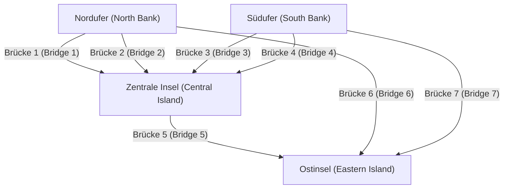
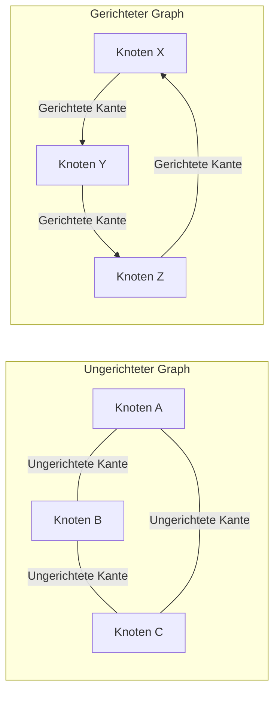

## 1. Einführung: Die Welt besteht aus Netzwerken

In der modernen Gesellschaft sind wir ständig mit irgendetwas verbunden. Sei es die Kommunikation zwischen Computern über das Internet, komplexe menschliche Beziehungen in sozialen Netzwerken (SNS), riesige Straßen- und Eisenbahnnetze, die Städte verbinden, globale Lieferketten für die Logistik oder die unzähligen neuronalen Verbindungen in unseren eigenen Gehirnen – es ist keine Übertreibung zu sagen, dass die Welt aus unzähligen Netzwerken besteht.

Einen leistungsstarken Rahmen zu bieten, um diese Netzwerke, die auf den ersten Blick hochkomplex und sogar chaotisch erscheinen, einfach und mathematisch streng darzustellen und zu analysieren, ist die Aufgabe der **Graphentheorie**. Durch die Anwendung der Graphentheorie können wir die verborgenen Strukturen und Eigenschaften in komplexen Systemen entschlüsseln, optimale Kommunikationswege finden und die Anfälligkeit ganzer Netzwerke bewerten.

Dieser Artikel erklärt die Graphentheorie umfassend und systematisch, beginnend bei ihren historischen Ursprüngen, über grundlegende mathematische Definitionen und Datenstrukturen für die Computerprogrammierung bis hin zur Vorstellung repräsentativer Algorithmen, die das Fundament der modernen Technologie bilden.

## 2. Die Geburt der Graphentheorie: [Die sieben Brücken von Königsberg](https://kenji.blog/de/p/seven-bridges-of-konigsberg/)

Die Geschichte der Graphentheorie reicht bis ins 18. Jahrhundert zurück. Im Jahr 1736 löste der brillante Schweizer Mathematiker [Leonhard Euler](https://kenji.blog/de/p/euler/) auf elegante Weise ein berühmtes mathematisches Rätsel und markierte damit den Beginn dieses Bereichs. Dieses Rätsel ist als die „Sieben Brücken von Königsberg“ bekannt.

In der schönen Stadt Königsberg im Königreich Preußen (heute Kaliningrad, Russland) floss der Fluss Pregel, in dessen Mitte sich zwei Inseln befanden, die durch insgesamt sieben Brücken mit den Flussufern verbunden waren. Unter den Bürgern wurde ein Spiel populär: „Ist es möglich, jede Brücke genau einmal zu überqueren und zum ursprünglichen Startpunkt zurückzukehren?“ Viele Menschen versuchten es, aber niemand war erfolgreich.

Um dieses Problem zu lösen, wählte Euler den revolutionären Ansatz, den tatsächlichen Stadtplan bis zum Äußersten zu abstrahieren. Er stellte die Landmassen (Inseln und Ufer) als „Punkte“ und die sie verbindenden Brücken als „Linien“ dar, wobei er alle für den Kern des Problems irrelevanten Elemente wie Entfernung und Richtung eliminierte.



Euler erkannte, dass es, um einen Punkt zu „durchqueren“, immer ein Paar aus einer „eingehenden Brücke“ und einer „ausgehenden Brücke“ geben muss. Das heißt, er bewies mathematisch, dass für alle Punkte, mit Ausnahme des Start- und Endpunktes, die Anzahl der angeschlossenen Brücken „gerade“ sein muss.

In dem abstrakten Graphen der Königsberger Brücken war die Anzahl der angeschlossenen Brücken an allen vier Landmassen (Punkten) „ungerade“ (entweder 3 oder 5). Daher kam man zu dem Schluss, dass es unmöglich ist, eine durchgehende Linie zu ziehen, die alle Brücken genau einmal überquert.

Diese Entdeckung Eulers war der genaue Moment, in dem die **Graphentheorie** geboren wurde. Indem er das komplexe physische Terrain verwarf und sich ausschließlich auf die Verbindungsbeziehungen (Topologie) von Punkten und Linien konzentrierte, eröffnete er ein völlig neues Teilgebiet der Mathematik.

## 3. Grundkonzepte und mathematische Definitionen der Graphentheorie

In der Graphentheorie bezieht sich ein „[Graph](https://kenji.blog/de/p/tree-graph-data-structures-search-dfs-bfs-dijkstra/)“ nicht auf Methoden zur Visualisierung statistischer Daten wie Liniendiagramme oder Kreisdiagramme. Es bezieht sich auf eine mathematische Struktur, die eine Menge von Objekten und die Beziehungen zwischen ihnen darstellt.

### 3.1. Grundstruktur eines Graphen: Knoten und Kanten

Ein Graph $G$ ist allgemein definiert als ein Paar aus einer Menge von Knoten (Vertices) $V$ und einer Menge von Kanten (Edges) $E$, mathematisch notiert als $G = (V, E)$.

*   **Knoten (Vertex / Node)**: Repräsentiert die Komponenten eines Netzwerks. Wird visuell als Punkt gezeichnet. Die Anzahl der Elemente in der Menge $V$ (Anzahl der Knoten) wird mit $|V|$ bezeichnet.
*   **Kante (Edge / Link)**: Repräsentiert die Beziehung oder Verbindung zwischen Knoten. Wird visuell als Linie gezeichnet. Die Anzahl der Elemente in der Menge $E$ (Anzahl der Kanten) wird mit $|E|$ bezeichnet.

Zum Beispiel wird eine Kante, die Knoten $u$ und $v$ verbindet, als $e = (u, v)$ dargestellt.

### 3.2. Gerichtete und ungerichtete Graphen

Graphen werden grob in zwei Typen eingeteilt, je nachdem, ob die Kanten eine Richtung haben.

*   **Ungerichteter Graph (Undirected Graph)**: Ein Graph, bei dem Kanten keine Richtung haben. Wird verwendet, wenn die Beziehung immer gegenseitig und in beide Richtungen verläuft, wie bei Kommunikationsleitungen, zweispurigen Straßen oder Facebook-„Freund“-Beziehungen.
*   **Gerichteter Graph (Directed Graph)**: Ein Graph, bei dem Kanten eine Richtung haben. Wird verwendet, um einseitige Beziehungen auszudrücken, wie Wasserfluss, Einbahnstraßen oder Twitter (X)-„Follow“-Beziehungen. In gerichteten Graphen werden Kanten deutlich als Pfeile gezeichnet.



### 3.3. Gewichtete Graphen

Bei der Modellierung realer Probleme möchten wir oft nicht nur ausdrücken, „ob sie verbunden sind“, sondern auch die „Leichtigkeit der Verbindung“ oder die „Kosten“. In solchen Fällen wird ein **Gewichteter [Graph](https://kenji.blog/de/p/tree-graph-data-structures-search-dfs-bfs-dijkstra/) (Weighted Graph)** verwendet, bei dem jeder Kante ein numerischer Wert (Gewicht) zugewiesen wird. Das Gewicht kann die Entfernung zwischen Städten, die Kommunikationsverzögerungszeit oder die Reisekosten darstellen.

### 3.4. Wege und Zyklen

Das Konzept der Bewegung innerhalb eines Graphen ist ebenfalls sehr wichtig.

*   **Kantenfolge (Walk)**: Eine abwechselnde Folge von Knoten und Kanten. Dieselben Knoten oder Kanten können mehrmals durchlaufen werden.
*   **Weg (Path)**: Eine Kantenfolge, bei der kein Knoten mehr als einmal besucht wird.
*   **Zyklus (Cycle)**: Ein Weg, bei dem Startpunkt und Endpunkt identisch sind.

Diese Konzepte sind grundlegende Bausteine für die Verfolgung des Datenflusses in einem Netzwerk oder in Verkehrslenkungsalgorithmen.

### 3.5. Grad und Konnektivität

Die Anzahl der direkt mit einem Knoten verbundenen Kanten wird als **Grad (Degree)** dieses Knotens bezeichnet. Der Grad des Knotens $v$ wird mathematisch als $\deg(v)$ bezeichnet.

In einem gerichteten Graphen unterscheiden wir klar zwischen dem **Eingangsgrad (In-degree)**, der Anzahl der Pfeile, die in einen Knoten hineinführen, und dem **Ausgangsgrad (Out-degree)**, der Anzahl der Pfeile, die aus einem Knoten herausführen.

Wenn außerdem zwischen zwei beliebigen Knoten in einem Graphen immer ein Weg existiert, spricht man von einem **Zusammenhängenden (Connected)** Graphen. In Kommunikationsnetzwerken wie dem Internet ist die Tatsache, dass das gesamte Netzwerk ein zusammenhängender Graph ist, eine absolute Voraussetzung, um sicherzustellen, dass alle Computer miteinander kommunizieren können.

## 4. Datenstrukturen zur Handhabung von Graphen in Computern

Um die mathematischen Konzepte der Graphentheorie als Programme zu implementieren und sie von Computern schnell berechnen zu lassen, ist es notwendig, Graphen mithilfe geeigneter Datenstrukturen im Speicher darzustellen. In der Praxis werden hauptsächlich zwei Methoden verwendet: „Adjazenzmatrix“ und „Adjazenzliste“.

### 4.1. Adjazenzmatrix (Adjacency Matrix)

Eine Adjazenzmatrix ist eine Methode zur Darstellung eines Graphen mithilfe eines zweidimensionalen Arrays (Matrix). Ein Graph mit $N$ Knoten wird durch eine $N \times N$ Matrix $A$ dargestellt. Wenn eine Kante von Knoten $i$ nach Knoten $j$ existiert, wird das Matrixelement $A_{i,j}$ auf $1$ gesetzt; existiert sie nicht, wird es auf $0$ gesetzt. Bei gewichteten Graphen wird anstelle der $1$ der numerische Wert des Kantengewichts platziert.

Mathematisch ist sie wie folgt definiert:

$$
A_{i,j} = \begin{cases} 
1 & (\text{wenn eine Kante von Knoten } i \text{ nach Knoten } j \text{ existiert}) \\
0 & (\text{andernfalls})
\end{cases}
$$

*   **Vorteile**: Es ist möglich, in $\mathcal{O}(1)$ (konstanter Zeit) sofort festzustellen, ob eine Kante zwischen zwei beliebigen Knoten existiert. Sie ist außerdem direkt mit der algebraischen Graphenanalyse (wie der spektralen Graphentheorie) verbunden, die Matrixmultiplikation verwendet.
*   **Nachteile**: Der Speicherverbrauch beträgt $\mathcal{O}(N^2)$ für die Anzahl der Knoten $N$, was den Speicher bei riesigen Graphen erschöpft. Insbesondere bei **Dünn besetzten Graphen (Sparse Graphs)**, bei denen die Anzahl der Kanten im Vergleich zum Quadrat der Anzahl der Knoten sehr klein ist, wird der größte Teil der Matrix $0$, was sie höchst ineffizient macht.

### 4.2. Adjazenzliste (Adjacency List)

Eine Adjazenzliste ist eine Methode, die für jeden Knoten eine „Liste benachbarter Knoten (wie ein Array oder eine verkettete Liste)“ pflegt, die direkt durch eine Kante verbunden sind.

*   Knoten A: `[B, C]`
*   Knoten B: `[A, D, E]`
*   Knoten C: `[A, F]`

*   **Vorteile**: Der Speicherverbrauch ist proportional zur Summe der Anzahl der Knoten und Kanten, was zu $\mathcal{O}(|V| + |E|)$ führt und sie extrem speichereffizient für dünn besetzte Graphen macht, die in der realen Welt häufig vorkommen.
*   **Nachteile**: Um zu überprüfen, ob ein bestimmter Knoten $i$ und Knoten $j$ verbunden sind, muss die Liste sequentiell durchsucht werden, was im schlimmsten Fall $\mathcal{O}(|V|)$ Zeit in Anspruch nimmt.

## 5. Repräsentative Algorithmen rund um Graphen

Um Probleme in Graphen effizient zu lösen, wurden im Laufe der Geschichte der Informatik viele hervorragende Algorithmen entwickelt. Hier stellen wir einige repräsentative Algorithmen vor, die in der modernen Softwareentwicklung als unerlässlich gelten.

### 5.1. Breitensuche ([BFS](https://kenji.blog/de/p/tree-graph-data-structures-search-dfs-bfs-dijkstra/)) und Tiefensuche ([DFS](https://kenji.blog/de/p/tree-graph-data-structures-search-dfs-bfs-dijkstra/))

Die grundlegendsten Algorithmen, um alle Knoten in einem Netzwerk systematisch und lückenlos zu besuchen, sind die **Breitensuche (Breadth-First Search, BFS)** und die **Tiefensuche (Depth-First Search, DFS)**.

*   **Breitensuche (BFS)**: Erkundet konzentrisch und priorisiert Knoten, die näher am Startpunkt liegen. Es ist wie Wellen, die sich ausbreiten, wenn ein Stein ins Wasser geworfen wird. Sie ist ideal, um in einem ungewichteten Graphen den kürzesten Weg (den Weg mit der minimalen Anzahl von Kanten) zu finden. Sie wird mithilfe einer Warteschlangen-Datenstruktur (Queue) implementiert.
*   **Tiefensuche (DFS)**: Erkundet so tief wie möglich, und wenn sie in eine Sackgasse gerät, kehrt sie zum vorherigen Verzweigungspunkt zurück, um einen anderen Weg zu erkunden. Es ist wie das Lösen eines Labyrinths, indem man den Wänden folgt. Wird zur Erkennung von Zyklen in einem Graphen oder für die topologische Sortierung verwendet. Sie wird mithilfe eines Stacks oder rekursiver Funktionsaufrufe implementiert.

Nachfolgend finden Sie ein einfaches Implementierungsbeispiel für die Breitensuche (BFS) in Python.

```python
from collections import deque

def bfs(graph, start_vertex):
    """
    Funktion zur Ausführung der Breitensuche (BFS) in einem Graphen
    :param graph: Graphen-Dictionary, dargestellt im Adjazenzlistenformat
    :param start_vertex: Startknoten für den Beginn der Erkundung
    """
    visited = set() # Menge zur Speicherung besuchter Knoten
    queue = deque([start_vertex]) # Warteschlange zur Verwaltung der zu erkundenden Knoten
    visited.add(start_vertex)
    
    while queue:
        # Einen Knoten vom Anfang der Warteschlange entfernen
        vertex = queue.popleft()
        print(f"Besuche aktuell Knoten: {vertex}")
        
        # Alle benachbarten unbesuchten Knoten zur Warteschlange hinzufügen
        for neighbor in graph[vertex]:
            if neighbor not in visited:
                visited.add(neighbor)
                queue.append(neighbor)

# Graphendefinition (Adjazenzlistenformat)
graph_data = {
    'A': ['B', 'C'],
    'B': ['A', 'D', 'E'],
    'C': ['A', 'F'],
    'D': ['B'],
    'E': ['B', 'F'],
    'F': ['C', 'E']
}

print("Protokoll des BFS-Ausführungsergebnisses:")
bfs(graph_data, 'A')
```

### 5.2. Problem des kürzesten Weges: [Dijkstra](https://kenji.blog/de/p/graph-theory-dijkstra-a-star/)-Algorithmus

Bei der Suche nach der schnellsten Route zu einem Ziel in einer Kartenanwendung ist das, was im Kern des Systems arbeitet, ein **Algorithmus für den kürzesten Weg**. Die Route hat Kosten (Gewichte) wie „Entfernung“ und „Reisezeit“, und das Ziel ist es, den Weg zu finden, der die kumulativen Kosten vom Startpunkt zum Ziel minimiert.

Der 1956 vom niederländischen Informatiker Edsger W. [Dijkstra](https://kenji.blog/de/p/tree-graph-data-structures-search-dfs-bfs-dijkstra/) erfundene **Dijkstra-Algorithmus** ist ein extrem berühmter Algorithmus zur effizienten Berechnung des kürzesten Weges von einer einzelnen Quelle zu allen anderen Knoten in einem Netzwerk, unter der Bedingung, dass alle Kantengewichte nicht-negativ (0 oder größer) sind.

Die Kernlogik des Dijkstra-Algorithmus besteht darin, den Prozess der „Auswahl des Knotens mit der kürzesten unbestätigten Entfernung aus der Menge der Knoten, deren kürzeste Entfernung vom Start bereits bestätigt ist, und der Aktualisierung der Kürzeste-Entfernung-Informationen der umliegenden Knoten über Routen, die durch diesen Knoten führen“ zu wiederholen. Durch die Verwendung einer Vorrangwarteschlange (Priority Queue) kann die Ausführungszeit erheblich verkürzt werden.

```python
import heapq

def dijkstra(graph, start):
    """
    Berechnung der Kosten für den kürzesten Weg mithilfe des Dijkstra-Algorithmus
    """
    # Dictionary zur Speicherung der kürzesten Entfernung vom Start. Anfangswert ist unendlich.
    distances = {vertex: float('infinity') for vertex in graph}
    distances[start] = 0
    
    # Vorrangwarteschlange zum Speichern von Tupeln (kumulative Entfernung, Knoten)
    priority_queue = [(0, start)]
    
    while priority_queue:
        # Den Knoten mit der aktuell kürzesten Entfernung extrahieren
        current_distance, current_vertex = heapq.heappop(priority_queue)
        
        # Verarbeitung überspringen, wenn die aus der Warteschlange extrahierte Entfernung größer als die bereits gespeicherte Entfernung ist
        if current_distance > distances[current_vertex]:
            continue
            
        # Versuchen, die Entfernungen für alle benachbarten Knoten zu aktualisieren
        for neighbor, weight in graph[current_vertex].items():
            distance = current_distance + weight
            
            # Wenn ein kürzerer Weg als zuvor gefunden wird, Entfernung aktualisieren und in die Warteschlange einfügen
            if distance < distances[neighbor]:
                distances[neighbor] = distance
                heapq.heappush(priority_queue, (distance, neighbor))
                
    return distances

# Definition eines gewichteten gerichteten Graphen
weighted_graph = {
    'A': {'B': 2, 'C': 5},
    'B': {'C': 2, 'D': 4},
    'C': {'D': 1},
    'D': {'C': 3} # Ein Zyklus existiert
}

print("\nErgebnis der Ausführung des Dijkstra-Algorithmus (kürzeste Entfernung von Knoten A):")
print(dijkstra(weighted_graph, 'A'))
```

### 5.3. Problem des minimalen Spannbaums: Kruskal-Algorithmus

Stellen Sie sich die Notwendigkeit vor, alle Stützpunkte in einem riesigen Netzwerk mit den geringstmöglichen Gesamtkosten physisch zu verbinden. Beispielsweise beim Aufbau eines Stromnetzes zur Versorgung eines neuen Wohngebietes mit Elektrizität oder beim Verlegen von Glasfaserkabeln zwischen mehreren Städten erfordert die Situation eine Minimierung der Infrastrukturkosten.

Auf diese Weise wird ein Teilgraph, der alle Knoten des Graphen umfasst, absolut keine Zyklen aufweist (d. h. eine Baumstruktur ist) und die Summe der Gewichte der verwendeten Kanten minimiert, als **Minimaler Spannbaum (Minimum Spanning [Tree](https://kenji.blog/de/p/tree-graph-data-structures-search-dfs-bfs-dijkstra/), MST)** bezeichnet.

Einer der repräsentativen Algorithmen, um diesen minimalen Spannbaum zu finden, ist der **Kruskal-Algorithmus**. Der Kruskal-Algorithmus ist ein typisches Beispiel für einen „Gierigen Algorithmus (Greedy Algorithm)“, der lokale optimale Lösungen akkumuliert und dabei äußerst einfachen und intuitiven Schritten folgt.

1.  [Sortieren](https://kenji.blog/de/p/sorting-algorithms/) Sie alle im Graphen vorhandenen Kanten in aufsteigender Reihenfolge ihrer Gewichte.
2.  Extrahieren Sie die Kanten nacheinander, beginnend mit der mit dem kleinsten Gewicht, und übernehmen Sie sie nur dann offiziell in den Spannbaum, wenn das Hinzufügen dieser Kante keinen „Zyklus (Schleife)“ bildet.
3.  Beenden Sie den Algorithmus, wenn die Anzahl der in den Spannbaum übernommenen Kanten „Gesamtzahl der Knoten - 1“ erreicht.

Eine spezielle Datenstruktur namens Disjunkte Mengen (Union-Find [Tree](https://kenji.blog/de/p/tree-graph-data-structures-search-dfs-bfs-dijkstra/)) spielt eine aktive Rolle bei der schnellen Bestimmung, ob ein Zyklus gebildet wird.

### 5.4. Netzwerkfluss und das Problem des maximalen Flusses

In einem städtischen Wasserleitungsnetz oder den Backbone-Kommunikationsleitungen des Internets wird die Frage „Was ist die maximale Menge (an Wasser oder Datenpaketen), die gleichzeitig durch das gesamte System vom Startpunkt (Quelle) zum Endpunkt (Senke) fließen kann?“ als **Problem des maximalen Flusses (Maximum Flow Problem)** bezeichnet.

Jede Kante (Rohr oder Kabel), aus der das Netzwerk besteht, hat eine streng definierte „Kapazität (Capacity)“, die die maximale Menge angibt, die pro Zeiteinheit fließen kann, und es ist physikalisch unmöglich, auf irgendeiner Route mehr als diese Kapazität fließen zu lassen. Dieses komplexe Problem kann mit Algorithmen wie dem Ford-Fulkerson-Algorithmus mathematisch genau gelöst werden, um die maximale Durchflussrate abzuleiten. Die Theorie des maximalen Flusses wird in erstaunlich vielen Bereichen angewendet, darunter bei der Modellierung und Linderung von Verkehrsstaus, der Beseitigung von Engpässen in Logistiknetzwerken und sogar bei der Objektextraktion ([Graph](https://kenji.blog/de/p/tree-graph-data-structures-search-dfs-bfs-dijkstra/) Cuts) in der Bildverarbeitung.

## 6. Bipartite Graphen und Matching-Probleme

Eine Sonderstellung innerhalb der Graphentheorie nimmt der **Bipartite Graph** ein. Ein bipartiter Graph ist ein Graph, bei dem, wenn alle Knoten in zwei Gruppen (z. B. Gruppe $U$ und Gruppe $V$) unterteilt werden, jede Kante immer einen Knoten in $U$ und einen Knoten in $V$ verbindet und es absolut keine Kanten gibt, die Knoten innerhalb derselben Gruppe verbinden.

Bipartite Graphen eignen sich ideal zur Modellierung von Beziehungen zwischen zwei Mengen mit unterschiedlichen Eigenschaften, wie „Arbeitssuchende“ und „Personalvermittler“, „Studenten“ und „Labore“ oder „Taxis“ und „Passagiere“.

Eines der wichtigsten Probleme in bipartiten Graphen ist das **Matching-Problem**. Dies ist das Problem der Auswahl einer Menge von Kanten (Matching) aus dem Graphen, die keine Endpunkte miteinander teilen. Insbesondere das „maximale bipartite Matching“, das so viele Paare wie möglich bildet, ist direkt mit Problemen der optimalen Ressourcenallokation verbunden. Darüber hinaus wurden Probleme zur Maximierung der Zufriedenheit oder des Gewinns jedes Paares durch den „Gale-Shapley-Algorithmus“ gelöst, der Gegenstand des Wirtschaftsnobelpreises war, und sind tief in Entwürfe realer sozialer Systeme integriert, wie z. B. die Krankenhauszuteilung für Assistenzärzte und Schulwahlsysteme.

## 7. Anwendungen der Graphentheorie in der modernen Gesellschaft

Die Graphentheorie ist nicht auf abstrakte Mathematik an einer Tafel beschränkt; sie wird in den unterschiedlichsten Bereichen als Infrastrukturtechnologie eingesetzt, die unser tägliches Leben grundlegend stützt.

### 7.1. Suchmaschinen und der PageRank-Algorithmus

Der Suchmaschinenmechanismus von Google, der unzählige über die ganze Welt verstreute Webseiten sofort bewertet und sie nach Nützlichkeit einordnet, bekannt als der **PageRank**-Algorithmus, ist eine definitive Erfolgsgeschichte der Modellierung der Web-Welt als massiver gerichteter Graph.

*   **Knoten**: Einzelne Webseiten im Internet
*   **Kante**: Hyperlinks, die von Seite zu Seite springen

Die Wurzel von PageRank ist die rekursive Bewertungsidee, dass „eine Seite, die von vielen qualitativ hochwertigen Webseiten verlinkt wird, mit hoher Wahrscheinlichkeit selbst eine qualitativ hochwertige Seite ist“. Indem sie die Linkstruktur als massive Adjazenzmatrix darstellten und den primären Eigenvektor dieser Matrix berechneten (eine Anwendung der spektralen Graphentheorie), gelang es ihnen, die relative Bedeutung von Internetinformationen aus Hunderten von Milliarden Seiten mathematisch und objektiv zu berechnen.

### 7.2. Strukturanalyse sozialer Netzwerke

SNS-Plattformen wie Twitter, Facebook, LinkedIn und Instagram bilden massive **Social Graphs**, die Verbindungen zwischen Menschen oder Menschen und Inhalten ausdrücken. Durch die Anwendung der Graphentheorie kann die Struktur massiver Gemeinschaften präzise analysiert werden.

Um beispielsweise die Frage „Wer ist die zentrale Figur (Influencer) mit dem größten Einfluss im gesamten Netzwerk?“ zu beantworten, wird das Konzept der **Zentralität (Centrality)** verwendet. Durch die Berechnung verschiedener Metriken wie der „Gradzentralität“ basierend auf der einfachen Anzahl von Kanten, die mit einem Knoten verbunden sind, der „Betweenness-Zentralität“, die misst, wie häufig jemand auf den kürzesten Wegen im Netzwerk erscheint, und der „Closeness-Zentralität“, die die Leichtigkeit des Zugangs zu allen anderen Knoten bewertet, werden Aktivitäten wie Influencer-Identifizierung, Vorhersage von Informationsverbreitungswegen und die Erkennung von Echokammer-Phänomenen durchgeführt.

### 7.3. Maschinelles Lernen und Graph Neural Networks (GNN)

In den letzten Jahren, an der Spitze der künstlichen Intelligenz (KI) und des maschinellen Lernens, haben **Graph Neural Networks (GNN)**, die Daten mit Graphenstrukturen direkt lernen können, explosive Aufmerksamkeit erregt.

Herkömmliche maschinelle Lernmodelle wie CNNs, die bei der Bilderkennung verwendet werden, oder Transformer, die in der Verarbeitung natürlicher Sprache verwendet werden, wurden entwickelt, um reguläre Daten wie gitterartige Pixelarrays oder eindimensionale Wortsequenzen zu verarbeiten. Es war jedoch äußerst schwierig, unregelmäßige und komplexe Graphendaten wie komplexe SNS-Verbindungen oder Atombindungsstrukturen, aus denen Moleküle bestehen, zu handhaben.

GNNs durchbrachen diese Barriere, indem sie gleichzeitig die Merkmalsgrößeninformationen jedes Knotens auf dem Graphen und die Topologie (Verbindungsbeziehungen) des gesamten Graphen verbreiteten und lernten. Heute werden GNNs als unverzichtbare Kerntechnologien in hochmodernen KI-Anwendungen in die Praxis umgesetzt, darunter im Bereich der Arzneimittelforschung (Drug Discovery) zur Vorhersage der Eigenschaften neuer Verbindungen, in fortschrittlichen Empfehlungssystemen bei Amazon und Netflix sowie bei der Vorhersage der Ankunftszeit auf Google Maps.

## 8. Fazit und Zukunftsaussichten

In diesem Artikel haben wir skizziert, wie sich die **Graphentheorie**, die aus einem einfachen Rätsel im Königsberg des 18. Jahrhunderts hervorgegangen ist, zum „ultimativen Werkzeug“ zur Entschlüsselung der extrem komplexen Netzwerke der modernen Gesellschaft entwickelt hat.

Obwohl Graphen nur aus den einfachsten und abstraktesten Elementen bestehen, die möglich sind: Punkten (Knoten) und Linien (Kanten), ist die Welt der mathematischen Theorien und Berechnungsalgorithmen, die auf sie angewendet werden, so tief wie das Universum und birgt eine überwältigende Macht. Für Softwareentwickler, Datenwissenschaftler oder jeden, der sich für komplexe Systeme interessiert, werden systematische Kenntnisse der Graphentheorie die Fähigkeit zur abstrakten Problemlösung und das logische Denken zur Ableitung optimaler Lösungen exponentiell verbessern.

Wenn Sie das Programmieren lernen, nutzen Sie diesen Artikel bitte als Sprungbrett und versuchen Sie, Algorithmen wie [Dijkstra](https://kenji.blog/de/p/graph-theory-dijkstra-a-star/) oder die Breitensuche tatsächlich auf Ihrem eigenen Computer zu programmieren und auszuführen. Wenn Sie erleben, wie unsichtbare, komplexe Netzwerke durch den von Ihnen geschriebenen Code anschaulich entwirrt werden, werden Sie die wahre Schönheit und Faszination der Graphentheorie wirklich erkennen. Die Welt ist voller schönerer und berechenbarerer Graphen, als Sie vielleicht denken.
