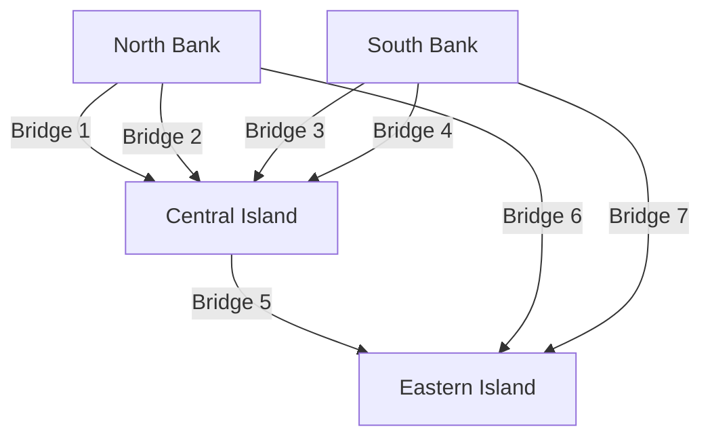
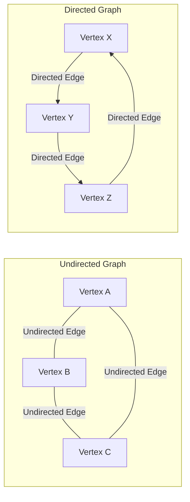

## 1. Introduction: The World is Made of Networks

In modern society, we are constantly connected to something. Whether it is communication between computers via the internet, complex human relationships on social networking services (SNS), vast road and railway networks connecting cities, global supply chains for logistics, or the countless neural connections within our own brains—it is no exaggeration to say that the world is composed of countless networks.

Providing a powerful framework to simply and mathematically represent and analyze these networks, which at first glance appear highly complex and even chaotic, is **Graph Theory**. By using graph theory, we can unravel the hidden structures and properties within complex systems, find optimal communication routes, and evaluate the vulnerability of entire networks.

This article will comprehensively and systematically explain graph theory, starting from its historical origins, covering basic mathematical definitions and data structures for computer programming, and introducing representative algorithms that support the foundation of modern technology.

## 2. The Birth of Graph Theory: The [Seven Bridges of Königsberg](https://kenji.blog/en/p/seven-bridges-of-konigsberg/)

The history of graph theory dates back to the 18th century. In 1736, the brilliant Swiss mathematician [Leonhard Euler](https://kenji.blog/en/p/euler/) elegantly solved a famous mathematical puzzle, marking the beginning of this field. This puzzle is known as the "[Seven Bridges of Königsberg](https://kenji.blog/en/p/seven-bridges-of-konigsberg/)".

In the beautiful city of Königsberg in the Kingdom of Prussia (now Kaliningrad, Russia), the Pregel River flowed, with two islands in the middle and a total of seven bridges connecting them to the riverbanks. A game became popular among the citizens: "Is it possible to cross every bridge exactly once and return to the original starting point?" Many people tried, but no one succeeded.

To solve this problem, Euler took a revolutionary approach of abstracting the actual map of the city to its ultimate limit. He represented the landmasses (islands and banks) as "points" and the bridges connecting them as "lines," eliminating all elements irrelevant to the essence of the problem, such as distance and direction.



Euler realized that in order to "pass through" a point, there must always be a pair of an "incoming bridge" and an "outgoing bridge". That is, he mathematically proved that for all points except the starting and ending points, the number of connected bridges must be "even".

In the abstract graph of the Königsberg bridges, the number of connected bridges at all four landmasses (points) was "odd" (either 3 or 5). Therefore, it was concluded that it is impossible to draw a continuous line crossing all bridges exactly once.

This discovery by Euler was the exact moment **Graph Theory** was born. By discarding complex physical terrain and focusing solely on the connection relationships (topology) of points and lines, he opened up an entirely new field of mathematics.

## 3. Basic Concepts and Mathematical Definitions of Graph Theory

In graph theory, a "graph" does not refer to statistical data visualization methods like line charts or pie charts. It refers to a mathematical structure that represents a set of objects and the relationships between them.

### 3.1. Basic Structure of a Graph: Vertices and Edges

A graph $G$ is generally defined as a pair of a set of vertices $V$ and a set of edges $E$, mathematically denoted as $G = (V, E)$.

*   **Vertex / Node**: Represents the components of a network. Visually drawn as a point. The number of elements in set $V$ (number of vertices) is denoted by $|V|$.
*   **Edge / Link**: Represents the relationship or connection between vertices. Visually drawn as a line. The number of elements in set $E$ (number of edges) is denoted by $|E|$.

For example, an edge connecting vertex $u$ and $v$ is represented as $e = (u, v)$.

### 3.2. Directed and Undirected Graphs

Graphs are broadly classified into two types depending on whether the edges have a direction.

*   **Undirected Graph**: A graph where edges have no direction. Used when the relationship is always mutual and two-way, such as communication lines, two-way roads, or Facebook "friend" relationships.
*   **Directed Graph**: A graph where edges have a direction. Used to express one-way relationships, such as water flow, one-way streets, or Twitter (X) "follow" relationships. In directed graphs, edges are clearly drawn as arrows.



### 3.3. Weighted Graphs

When modeling real-world problems, we often want to express not just "whether they are connected" but also the "ease of connection" or "cost". In such cases, a **Weighted Graph** is used, where a numerical value (weight) is assigned to each edge. The weight can represent the distance between cities, communication delay time, or travel cost.

### 3.4. Paths and Cycles

The concept of moving within a graph is also very important.

*   **Walk**: A sequence alternating between vertices and edges. The same vertices or edges can be traversed multiple times.
*   **Path**: A walk where no vertex is visited more than once.
*   **Cycle**: A path where the starting point and ending point are the same.

These concepts are fundamental building blocks for tracing data flow on a network or in traffic routing algorithms.

### 3.5. Degree and Connectivity

The number of edges directly connected to a vertex is called the **Degree** of that vertex. The degree of vertex $v$ is mathematically denoted as $\deg(v)$.

In a directed graph, we clearly distinguish between the **In-degree**, the number of arrows coming into a vertex, and the **Out-degree**, the number of arrows going out of a vertex.

Furthermore, if there is always a path between any two arbitrary vertices in a graph, that graph is said to be **Connected**. In communication networks like the Internet, the entire network being a connected graph is an absolute requirement to ensure that all computers can communicate with each other.

## 4. Data Structures for Handling Graphs in Computers

In order to implement the mathematical concepts of graph theory as programs and have computers calculate them quickly, it is necessary to represent graphs in memory using appropriate data structures. In practice, two main methods are used: "Adjacency Matrix" and "Adjacency List".

### 4.1. Adjacency Matrix

An adjacency matrix is a method of representing a graph using a 2-dimensional array (matrix). A graph with $N$ vertices is represented by an $N \times N$ matrix $A$. If an edge exists from vertex $i$ to vertex $j$, the matrix element $A_{i,j}$ is set to $1$; if it does not exist, it is set to $0$. For weighted graphs, the numerical value of the edge's weight is placed instead of $1$.

Mathematically, it is defined as follows:

$$
A_{i,j} = \begin{cases} 
1 & (\text{if an edge exists from vertex } i \text{ to vertex } j) \\
0 & (\text{otherwise})
\end{cases}
$$

*   **Pros**: It is possible to immediately determine whether an edge exists between any two vertices in $\mathcal{O}(1)$ (constant time). It also directly ties into algebraic graph analysis (like spectral graph theory) using matrix multiplication.
*   **Cons**: The memory consumption is $\mathcal{O}(N^2)$ for the number of vertices $N$, which will exhaust memory for giant graphs. Particularly for **Sparse Graphs**, where the number of edges is very small compared to the square of the number of vertices, most of the matrix becomes $0$, making it highly inefficient.

### 4.2. Adjacency List

An adjacency list is a method that maintains a "list of adjacent vertices (like an array or linked list)" directly connected by an edge for each vertex.

*   Vertex A: `[B, C]`
*   Vertex B: `[A, D, E]`
*   Vertex C: `[A, F]`

*   **Pros**: The memory consumption is proportional to the sum of the number of vertices and edges, resulting in $\mathcal{O}(|V| + |E|)$, making it extremely memory-efficient for sparse graphs common in the real world.
*   **Cons**: To check if a specific vertex $i$ and vertex $j$ are connected, it is necessary to sequentially search the list, which takes $\mathcal{O}(|V|)$ time in the worst case.

## 5. Representative Algorithms Surrounding Graphs

To efficiently solve problems on graphs, many excellent algorithms have been devised throughout the history of computer science. Here we introduce some representative algorithms that are considered essential in modern software engineering.

### 5.1. Breadth-First Search (BFS) and Depth-First Search (DFS)

The most fundamental algorithms for systematically visiting all vertices in a network without omission are **Breadth-First Search (BFS)** and **Depth-First Search (DFS)**.

*   **Breadth-First Search (BFS)**: Explores concentrically, prioritizing vertices closer to the starting point. It's like ripples spreading out when a stone is thrown into water. It is ideal for finding the shortest path (the path with the minimum number of edges) in an unweighted graph. It is implemented using a Queue data structure.
*   **Depth-First Search (DFS)**: Explores as deeply as possible, and when hitting a dead end, backtracks to the previous branching point to explore another path. It's like solving a maze by tracing the walls. Used for detecting cycles in a graph or for topological sorting. It is implemented using a Stack or recursive function calls.

Below is a simple implementation example of Breadth-First Search (BFS) using Python.

```python
from collections import deque

def bfs(graph, start_vertex):
    """
    Function to execute Breadth-First Search (BFS) on a graph
    :param graph: Graph dictionary represented in adjacency list format
    :param start_vertex: Initial vertex to start exploration
    """
    visited = set() # Set to record visited vertices
    queue = deque([start_vertex]) # Queue to manage vertices to be explored
    visited.add(start_vertex)
    
    while queue:
        # Dequeue a vertex from the front
        vertex = queue.popleft()
        print(f"Currently visiting vertex: {vertex}")
        
        # Add all adjacent unvisited vertices to the queue
        for neighbor in graph[vertex]:
            if neighbor not in visited:
                visited.add(neighbor)
                queue.append(neighbor)

# Graph definition (adjacency list format)
graph_data = {
    'A': ['B', 'C'],
    'B': ['A', 'D', 'E'],
    'C': ['A', 'F'],
    'D': ['B'],
    'E': ['B', 'F'],
    'F': ['C', 'E']
}

print("BFS execution result log:")
bfs(graph_data, 'A')
```

### 5.2. Shortest Path Problem: Dijkstra's Algorithm

When searching for the fastest route to a destination on a map application, what operates at the core of the system is a **Shortest Path Algorithm**. The route has costs (weights) such as "distance" and "travel time", and the objective is to find the path that minimizes the cumulative cost from the starting point to the destination.

Invented by Dutch computer scientist Edsger W. Dijkstra in 1956, **Dijkstra's Algorithm** is an extremely famous algorithm for efficiently computing the shortest path from a single source to all other vertices in a network, under the condition that all edge weights are non-negative (0 or greater).

The core logic of Dijkstra's algorithm is to repeat the process of "selecting the vertex with the shortest unconfirmed distance from the set of vertices whose shortest distance from the start is already confirmed, and updating the shortest distance information of surrounding vertices via routes through that vertex". By using a Priority Queue, execution time can be significantly reduced.

```python
import heapq

def dijkstra(graph, start):
    """
    Calculation of shortest path costs using Dijkstra's algorithm
    """
    # Dictionary to hold the shortest distance from the start. Initial value is infinity.
    distances = {vertex: float('infinity') for vertex in graph}
    distances[start] = 0
    
    # Priority queue to store tuples of (cumulative distance, vertex)
    priority_queue = [(0, start)]
    
    while priority_queue:
        # Extract the vertex with the shortest distance currently
        current_distance, current_vertex = heapq.heappop(priority_queue)
        
        # Skip processing if the distance extracted from the queue is longer than the already recorded distance
        if current_distance > distances[current_vertex]:
            continue
            
        # Try to update distances for all adjacent vertices
        for neighbor, weight in graph[current_vertex].items():
            distance = current_distance + weight
            
            # If a shorter path than before is found, update the distance and push it to the queue
            if distance < distances[neighbor]:
                distances[neighbor] = distance
                heapq.heappush(priority_queue, (distance, neighbor))
                
    return distances

# Definition of a weighted directed graph
weighted_graph = {
    'A': {'B': 2, 'C': 5},
    'B': {'C': 2, 'D': 4},
    'C': {'D': 1},
    'D': {'C': 3} # A cycle exists
}

print("\nDijkstra's algorithm execution result (shortest distance from vertex A):")
print(dijkstra(weighted_graph, 'A'))
```

### 5.3. Minimum Spanning Tree Problem: Kruskal's Algorithm

Imagine the need to physically connect all bases in a vast network with the lowest possible total cost. For example, when building a power grid to supply electricity to a new residential area, or laying fiber optic cables between multiple cities, the situation demands minimizing the infrastructure construction cost.

In this way, a subgraph that includes all vertices of the graph, has absolutely no cycles (i.e., a tree structure), and minimizes the sum of the weights of the edges used is called a **Minimum Spanning Tree (MST)**.

One of the representative algorithms to find this minimum spanning tree is **Kruskal's Algorithm**. Kruskal's algorithm is a typical example of a "Greedy Algorithm" that accumulates local optimal solutions, following extremely simple and intuitive steps.

1.  Sort all edges present in the graph in ascending order of their weights.
2.  Extract edges one by one starting from the one with the smallest weight, and officially adopt it into the spanning tree only if adding that edge does not form a "cycle (loop)".
3.  Terminate the algorithm when the number of edges adopted in the spanning tree reaches "total number of vertices - 1".

A special data structure called Disjoint Set Union (Union-Find Tree) plays an active role in quickly determining whether a cycle is formed.

### 5.4. Network Flow and Maximum Flow Problem

In a city's water pipe network or the Internet's backbone communication lines, the question "What is the maximum amount (of water or data packets) that can be simultaneously flowed through the entire system from the start point (source) to the end point (sink)?" is called the **Maximum Flow Problem**.

Each edge (pipe or cable) making up the network has a strictly defined "Capacity" indicating the maximum amount that can flow per unit of time, and it is physically impossible to flow exceeding this capacity on any route. This complex problem can be mathematically accurately solved using algorithms such as the Ford-Fulkerson Algorithm to derive the maximum flow rate. Maximum flow theory is applied to a surprisingly wide range of fields, including traffic congestion modeling and mitigation, logistics network bottleneck resolution, and even object extraction (graph cuts) in image processing.

## 6. Bipartite Graphs and Matching Problems

Occupying a unique position within graph theory is the **Bipartite Graph**. A bipartite graph is a graph where, when all vertices are divided into two groups (e.g., group $U$ and group $V$), every edge always connects a vertex in $U$ and a vertex in $V$, and there are absolutely no edges connecting vertices within the same group.

Bipartite graphs are ideal for modeling relationships between two sets with different properties, such as "job seekers" and "recruiting companies," "students" and "laboratories," or "taxis" and "passengers."

One of the most important problems in bipartite graphs is the **Matching Problem**. This is the problem of picking a set of edges (matching) from the graph that do not share endpoints with each other. In particular, "maximum bipartite matching," which forms as many pairs as possible, directly links to optimal resource allocation problems. Furthermore, problems maximizing the satisfaction or profit of each pair have been solved by the "Gale-Shapley Algorithm," which was the subject of the Nobel Prize in Economics, and are deeply integrated into real-world social system designs, such as medical resident hospital placements and school choice systems.

## 7. Applications of Graph Theory in Modern Society

Graph theory is not confined to abstract mathematics on a blackboard; it is utilized in a wide variety of domains as an infrastructure technology that fundamentally supports our daily lives.

### 7.1. Search Engines and the PageRank Algorithm

Google's search engine mechanism, which instantly evaluates countless web pages scattered around the world and ranks them in order of usefulness, known as the **PageRank** algorithm, is a definitive success story of modeling the web world as a massive directed graph.

*   **Vertex**: Individual web pages on the Internet
*   **Edge**: Hyperlinks jumping from page to page

At the root of PageRank is the recursive evaluation idea that "a page linked by many high-quality web pages is highly likely to be a high-quality page itself." By representing the link structure as a massive adjacency matrix and calculating the principal eigenvector of that matrix (an application of spectral graph theory), they succeeded in mathematically and objectively calculating the relative importance of Internet information spanning hundreds of billions of pages.

### 7.2. Structural Analysis of Social Networks

SNS platforms such as Twitter, Facebook, LinkedIn, and Instagram form massive **Social Graphs** expressing connections between people, or people and content. By applying graph theory, the structure of massive communities can be precisely analyzed.

For example, to answer the question "Who is the central figure (influencer) with the most influence in the entire network?", the concept of **Centrality** is used. By calculating various metrics such as "degree centrality" based on the simple number of edges connected to a vertex, "betweenness centrality" measuring how frequently one appears on the shortest paths in the network, and "closeness centrality" evaluating the ease of access to all other vertices, activities like influencer identification, information diffusion route prediction, and echo chamber phenomenon detection are performed.

### 7.3. Machine Learning and Graph Neural Networks (GNN)

In recent years, at the forefront of artificial intelligence (AI) and machine learning, **Graph Neural Networks (GNN)**, which can directly learn data with graph structures, have garnered explosive attention.

Traditional machine learning models, such as CNNs used in image recognition or Transformers used in natural language processing, were designed to handle regular data like grid-like pixel arrays or one-dimensional word sequences. However, it was extremely difficult to handle irregular and complex graph data like complex SNS connections or atomic bond structures making up molecules.

GNNs broke through this barrier by simultaneously propagating and learning the feature quantity information of each vertex on the graph and the topology (connection relationships) of the entire graph. Today, GNNs have been put into practical use as indispensable core technologies in cutting-edge AI applications, including the field of drug discovery predicting the properties of new compounds, advanced recommendation systems on Amazon and Netflix, and arrival time prediction on Google Maps.

## 8. Conclusion and Future Prospects

In this article, we have outlined how **Graph Theory**, which was born from a simple puzzle in Königsberg in the 18th century, has evolved into the "ultimate tool" for unraveling the extremely complex networks of modern society.

Although graphs are composed only of the simplest and most abstract elements possible: points (vertices) and lines (edges), the world of mathematical theories and computational algorithms applied to them is as deep as the universe and harbors overwhelming power. For software engineers, data scientists, or anyone interested in complex systems, systematic knowledge of graph theory will exponentially improve the ability for high-level abstraction against difficult problems and logical thinking to derive optimal solutions.

If you are learning programming, please use this article as a stepping stone and try actually coding and running algorithms like Dijkstra's or breadth-first search on your own computer. When you experience the process of invisible, complex networks being vividly unraveled by the code you write, you will truly realize the true beauty and fascination of graph theory. The world is filled with more beautiful, computable graphs than you might think.
