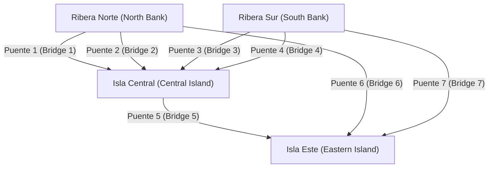
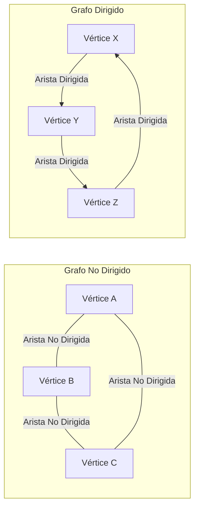

## 1. Introducción: El Mundo Está Hecho de Redes

En la sociedad moderna, estamos constantemente conectados a algo. Ya sea la comunicación entre computadoras a través de internet, las complejas relaciones humanas en los servicios de redes sociales (SNS), las vastas redes de carreteras y ferrocarriles que conectan ciudades, las cadenas de suministro globales para la logística, o las innumerables conexiones neuronales dentro de nuestros propios cerebros; no es exagerado decir que el mundo está compuesto por innumerables redes.

La **Teoría de Grafos** proporciona un marco poderoso para representar y analizar de manera simple y matemáticamente rigurosa estas redes, que a primera vista parecen altamente complejas e incluso caóticas. Al utilizar la teoría de grafos, podemos desentrañar las estructuras y propiedades ocultas dentro de sistemas complejos, encontrar rutas de comunicación óptimas y evaluar la vulnerabilidad de redes enteras.

Este artículo explicará de manera exhaustiva y sistemática la teoría de grafos, comenzando desde sus orígenes históricos, cubriendo definiciones matemáticas básicas y estructuras de datos para la programación informática, e introduciendo algoritmos representativos que sustentan la base de la tecnología moderna.

## 2. El Nacimiento de la Teoría de Grafos: [Los Siete Puentes de Königsberg](https://kenji.blog/es/p/seven-bridges-of-konigsberg/)

La historia de la teoría de grafos se remonta al siglo XVIII. En 1736, el brillante matemático suizo [Leonhard Euler](https://kenji.blog/es/p/euler/) resolvió elegantemente un famoso rompecabezas matemático, marcando el comienzo de este campo. Este rompecabezas se conoce como los "Siete Puentes de Königsberg".

En la hermosa ciudad de Königsberg en el Reino de Prusia (hoy Kaliningrado, Rusia), fluía el río Pregel, con dos islas en el medio y un total de siete puentes que las conectaban con las riberas. Se popularizó un juego entre los ciudadanos: "¿Es posible cruzar cada puente exactamente una vez y regresar al punto de partida original?" Muchas personas lo intentaron, pero nadie tuvo éxito.

Para resolver este problema, Euler adoptó un enfoque revolucionario al abstraer el mapa real de la ciudad hasta su límite. Representó las masas de tierra (islas y riberas) como "puntos" y los puentes que las conectaban como "líneas", eliminando todos los elementos irrelevantes para la esencia del problema, como la distancia y la dirección.



Euler se dio cuenta de que para "pasar a través" de un punto, siempre debe haber un par de un "puente de entrada" y un "puente de salida". Es decir, demostró matemáticamente que para todos los puntos excepto el punto de partida y el punto final, el número de puentes conectados debe ser "par".

En el grafo abstracto de los puentes de Königsberg, el número de puentes conectados en las cuatro masas de tierra (puntos) era "impar" (ya sea 3 o 5). Por lo tanto, se concluyó que es imposible trazar una línea continua cruzando todos los puentes exactamente una vez.

Este descubrimiento de Euler fue el momento exacto en que nació la **Teoría de Grafos**. Al descartar el terreno físico complejo y centrarse únicamente en las relaciones de conexión (topología) de puntos y líneas, abrió un campo de las matemáticas completamente nuevo.

## 3. Conceptos Básicos y Definiciones Matemáticas de la Teoría de Grafos

En la teoría de grafos, un "grafo" no se refiere a métodos de visualización de datos estadísticos como gráficos de líneas o gráficos circulares. Se refiere a una estructura matemática que representa un conjunto de objetos y las relaciones entre ellos.

### 3.1. Estructura Básica de un Grafo: Vértices y Aristas

Un grafo $G$ se define generalmente como un par de un conjunto de vértices $V$ y un conjunto de aristas $E$, denotado matemáticamente como $G = (V, E)$.

*   **Vértice / Nodo (Vertex / Node)**: Representa los componentes de una red. Se dibuja visualmente como un punto. El número de elementos en el conjunto $V$ (número de vértices) se denota por $|V|$.
*   **Arista / Enlace (Edge / Link)**: Representa la relación o conexión entre vértices. Se dibuja visualmente como una línea. El número de elementos en el conjunto $E$ (número de aristas) se denota por $|E|$.

Por ejemplo, una arista que conecta el vértice $u$ y $v$ se representa como $e = (u, v)$.

### 3.2. Grafos Dirigidos y No Dirigidos

Los grafos se clasifican ampliamente en dos tipos dependiendo de si las aristas tienen una dirección.

*   **Grafo No Dirigido (Undirected Graph)**: Un grafo donde las aristas no tienen dirección. Se usa cuando la relación es siempre mutua y bidireccional, como líneas de comunicación, carreteras de doble sentido o las relaciones de "amigos" en Facebook.
*   **Grafo Dirigido (Directed Graph)**: Un grafo donde las aristas tienen una dirección. Se usa para expresar relaciones unidireccionales, como el flujo de agua, calles de un solo sentido o las relaciones de "seguir" en Twitter (X). En los grafos dirigidos, las aristas se dibujan claramente como flechas.



### 3.3. Grafos Ponderados

Al modelar problemas del mundo real, a menudo queremos expresar no solo "si están conectados" sino también la "facilidad de conexión" o el "costo". En tales casos, se utiliza un **Grafo Ponderado (Weighted Graph)**, donde se asigna un valor numérico (peso) a cada arista. El peso puede representar la distancia entre ciudades, el tiempo de retraso en la comunicación o el costo de viaje.

### 3.4. Caminos y Ciclos

El concepto de moverse dentro de un grafo también es muy importante.

*   **Paseo (Walk)**: Una secuencia que alterna entre vértices y aristas. Los mismos vértices o aristas se pueden recorrer múltiples veces.
*   **Camino (Path)**: Un paseo donde ningún vértice es visitado más de una vez.
*   **Ciclo (Cycle)**: Un camino donde el punto de partida y el punto final son el mismo.

Estos conceptos son bloques de construcción fundamentales para rastrear el flujo de datos en una red o en algoritmos de enrutamiento de tráfico.

### 3.5. Grado y Conectividad

El número de aristas conectadas directamente a un vértice se llama el **Grado (Degree)** de ese vértice. El grado del vértice $v$ se denota matemáticamente como $\deg(v)$.

En un grafo dirigido, distinguimos claramente entre el **Grado de Entrada (In-degree)**, el número de flechas que entran a un vértice, y el **Grado de Salida (Out-degree)**, el número de flechas que salen de un vértice.

Además, si siempre existe un camino entre dos vértices arbitrarios cualesquiera en un grafo, se dice que ese grafo es **Conexo (Connected)**. En redes de comunicación como Internet, que toda la red sea un grafo conexo es un requisito absoluto para garantizar que todas las computadoras puedan comunicarse entre sí.

## 4. Estructuras de Datos para Manejar Grafos en Computadoras

Para implementar los conceptos matemáticos de la teoría de grafos como programas y hacer que las computadoras los calculen rápidamente, es necesario representar los grafos en la memoria utilizando estructuras de datos apropiadas. En la práctica, se utilizan principalmente dos métodos: la "Matriz de Adyacencia" y la "Lista de Adyacencia".

### 4.1. Matriz de Adyacencia (Adjacency Matrix)

Una matriz de adyacencia es un método para representar un grafo utilizando un arreglo bidimensional (matriz). Un grafo con $N$ vértices se representa mediante una matriz $A$ de $N \times N$. Si existe una arista desde el vértice $i$ al vértice $j$, el elemento de la matriz $A_{i,j}$ se establece en $1$; si no existe, se establece en $0$. Para grafos ponderados, se coloca el valor numérico del peso de la arista en lugar del $1$.

Matemáticamente, se define de la siguiente manera:

$$
A_{i,j} = \begin{cases} 
1 & (\text{si existe una arista desde el vértice } i \text{ al vértice } j) \\
0 & (\text{de lo contrario})
\end{cases}
$$

*   **Pros**: Es posible determinar inmediatamente si existe una arista entre cualquier par de vértices en tiempo $\mathcal{O}(1)$ (tiempo constante). También se vincula directamente al análisis algebraico de grafos (como la teoría espectral de grafos) utilizando la multiplicación de matrices.
*   **Contras**: El consumo de memoria es $\mathcal{O}(N^2)$ para el número de vértices $N$, lo que agotará la memoria para grafos gigantes. Particularmente para **Grafos Dispersos (Sparse Graphs)**, donde el número de aristas es muy pequeño comparado con el cuadrado del número de vértices, la mayor parte de la matriz se convierte en $0$, lo que lo hace altamente ineficiente.

### 4.2. Lista de Adyacencia (Adjacency List)

Una lista de adyacencia es un método que mantiene una "lista de vértices adyacentes (como un arreglo o lista enlazada)" directamente conectados por una arista para cada vértice.

*   Vértice A: `[B, C]`
*   Vértice B: `[A, D, E]`
*   Vértice C: `[A, F]`

*   **Pros**: El consumo de memoria es proporcional a la suma del número de vértices y aristas, resultando en $\mathcal{O}(|V| + |E|)$, haciéndolo extremadamente eficiente en memoria para grafos dispersos, comunes en el mundo real.
*   **Contras**: Para verificar si un vértice específico $i$ y el vértice $j$ están conectados, es necesario buscar secuencialmente en la lista, lo que toma un tiempo $\mathcal{O}(|V|)$ en el peor de los casos.

## 5. Algoritmos Representativos Alrededor de Grafos

Para resolver problemas en grafos de manera eficiente, se han diseñado muchos algoritmos excelentes a lo largo de la historia de las ciencias de la computación. Aquí presentamos algunos algoritmos representativos que se consideran esenciales en la ingeniería de software moderna.

### 5.1. Búsqueda en Anchura (BFS) y Búsqueda en Profundidad (DFS)

Los algoritmos más fundamentales para visitar sistemáticamente todos los vértices en una red sin omisión son la **Búsqueda en Anchura (Breadth-First Search, BFS)** y la **Búsqueda en Profundidad (Depth-First Search, DFS)**.

*   **Búsqueda en Anchura (BFS)**: Explora concéntricamente, priorizando los vértices más cercanos al punto de partida. Es como ondas extendiéndose cuando se arroja una piedra al agua. Es ideal para encontrar el camino más corto (el camino con el número mínimo de aristas) en un grafo no ponderado. Se implementa utilizando una estructura de datos de Cola (Queue).
*   **Búsqueda en Profundidad (DFS)**: Explora lo más profundo posible, y al llegar a un callejón sin salida, retrocede al punto de bifurcación anterior para explorar otro camino. Es como resolver un laberinto siguiendo una pared. Se usa para detectar ciclos en un grafo o para la clasificación topológica. Se implementa utilizando una Pila (Stack) o llamadas a funciones recursivas.

A continuación, un ejemplo de implementación simple de Búsqueda en Anchura (BFS) utilizando Python.

```python
from collections import deque

def bfs(graph, start_vertex):
    """
    Función para ejecutar Búsqueda en Anchura (BFS) en un grafo
    :param graph: Diccionario de grafo representado en formato de lista de adyacencia
    :param start_vertex: Vértice inicial para comenzar la exploración
    """
    visited = set() # Conjunto para registrar los vértices visitados
    queue = deque([start_vertex]) # Cola para gestionar los vértices a explorar
    visited.add(start_vertex)
    
    while queue:
        # Extraer un vértice de la cola
        vertex = queue.popleft()
        print(f"Visitando vértice actualmente: {vertex}")
        
        # Añadir todos los vértices adyacentes no visitados a la cola
        for neighbor in graph[vertex]:
            if neighbor not in visited:
                visited.add(neighbor)
                queue.append(neighbor)

# Definición del grafo (formato de lista de adyacencia)
graph_data = {
    'A': ['B', 'C'],
    'B': ['A', 'D', 'E'],
    'C': ['A', 'F'],
    'D': ['B'],
    'E': ['B', 'F'],
    'F': ['C', 'E']
}

print("Registro de resultado de ejecución de BFS:")
bfs(graph_data, 'A')
```

### 5.2. Problema del Camino Más Corto: Algoritmo de Dijkstra

Al buscar la ruta más rápida hacia un destino en una aplicación de mapas, lo que opera en el núcleo del sistema es un **Algoritmo del Camino Más Corto**. La ruta tiene costos (pesos) como "distancia" y "tiempo de viaje", y el objetivo es encontrar el camino que minimice el costo acumulado desde el punto de inicio hasta el destino.

Inventado por el científico de la computación holandés Edsger W. Dijkstra en 1956, el **Algoritmo de Dijkstra** es un algoritmo extremadamente famoso para calcular eficientemente el camino más corto desde una única fuente hacia todos los demás vértices en una red, bajo la condición de que todos los pesos de las aristas sean no negativos (0 o mayores).

La lógica central del algoritmo de Dijkstra es repetir el proceso de "seleccionar el vértice con la distancia no confirmada más corta del conjunto de vértices cuya distancia más corta desde el inicio ya está confirmada, y actualizar la información de distancia más corta de los vértices circundantes a través de rutas que pasan por ese vértice". Al usar una Cola de Prioridad (Priority Queue), el tiempo de ejecución se puede reducir significativamente.

```python
import heapq

def dijkstra(graph, start):
    """
    Cálculo de costos del camino más corto usando el algoritmo de Dijkstra
    """
    # Diccionario para mantener la distancia más corta desde el inicio. El valor inicial es infinito.
    distances = {vertex: float('infinity') for vertex in graph}
    distances[start] = 0
    
    # Cola de prioridad para almacenar tuplas de (distancia acumulada, vértice)
    priority_queue = [(0, start)]
    
    while priority_queue:
        # Extraer el vértice con la distancia más corta actualmente
        current_distance, current_vertex = heapq.heappop(priority_queue)
        
        # Omitir el procesamiento si la distancia extraída de la cola es mayor que la distancia ya registrada
        if current_distance > distances[current_vertex]:
            continue
            
        # Intentar actualizar las distancias de todos los vértices adyacentes
        for neighbor, weight in graph[current_vertex].items():
            distance = current_distance + weight
            
            # Si se encuentra un camino más corto que el anterior, actualizar la distancia y empujarlo a la cola
            if distance < distances[neighbor]:
                distances[neighbor] = distance
                heapq.heappush(priority_queue, (distance, neighbor))
                
    return distances

# Definición de un grafo dirigido ponderado
weighted_graph = {
    'A': {'B': 2, 'C': 5},
    'B': {'C': 2, 'D': 4},
    'C': {'D': 1},
    'D': {'C': 3} # Existe un ciclo
}

print("\nResultado de la ejecución del algoritmo de Dijkstra (distancia más corta desde el vértice A):")
print(dijkstra(weighted_graph, 'A'))
```

### 5.3. Problema del Árbol de Expansión Mínima: Algoritmo de Kruskal

Imagine la necesidad de conectar físicamente todas las bases en una vasta red con el costo total más bajo posible. Por ejemplo, al construir una red eléctrica para suministrar electricidad a una nueva zona residencial, o tender cables de fibra óptica entre múltiples ciudades, la situación exige minimizar el costo de construcción de la infraestructura.

De esta forma, un subgrafo que incluye todos los vértices del grafo, no tiene absolutamente ningún ciclo (es decir, una estructura de árbol), y minimiza la suma de los pesos de las aristas utilizadas se denomina **Árbol de Expansión Mínima (Minimum Spanning Tree, MST)**.

Uno de los algoritmos representativos para encontrar este árbol de expansión mínima es el **Algoritmo de Kruskal**. El algoritmo de Kruskal es un ejemplo típico de un "Algoritmo Voraz (Greedy Algorithm)" que acumula soluciones óptimas locales, siguiendo pasos extremadamente simples e intuitivos.

1.  Ordene todas las aristas presentes en el grafo en orden ascendente según sus pesos.
2.  Extraiga las aristas una por una comenzando por la de menor peso, y adóptela oficialmente en el árbol de expansión solo si la adición de esa arista no forma un "ciclo (bucle)".
3.  Termine el algoritmo cuando el número de aristas adoptadas en el árbol de expansión alcance el "número total de vértices - 1".

Una estructura de datos especial llamada Conjunto Disjunto (Union-Find Tree) juega un papel activo en determinar rápidamente si se forma un ciclo.

### 5.4. Flujo de Red y Problema del Flujo Máximo

En la red de tuberías de agua de una ciudad o en las líneas de comunicación principales de Internet, la pregunta "¿Cuál es la cantidad máxima (de agua o paquetes de datos) que puede fluir simultáneamente a través de todo el sistema desde el punto de inicio (fuente) hasta el punto final (sumidero)?" se llama el **Problema del Flujo Máximo (Maximum Flow Problem)**.

Cada arista (tubería o cable) que compone la red tiene una "Capacidad (Capacity)" estrictamente definida que indica la cantidad máxima que puede fluir por unidad de tiempo, y es físicamente imposible que fluya superando esta capacidad en cualquier ruta. Este complejo problema se puede resolver con precisión matemática utilizando algoritmos como el Algoritmo de Ford-Fulkerson para derivar la tasa de flujo máximo. La teoría del flujo máximo se aplica a una gama sorprendentemente amplia de campos, incluyendo el modelado y mitigación de la congestión del tráfico, la resolución de cuellos de botella en redes logísticas e incluso la extracción de objetos (cortes de grafos) en el procesamiento de imágenes.

## 6. Grafos Bipartitos y Problemas de Emparejamiento

Ocupando una posición única dentro de la teoría de grafos está el **Grafo Bipartito (Bipartite Graph)**. Un grafo bipartito es un grafo en el que, cuando todos los vértices se dividen en dos grupos (por ejemplo, el grupo $U$ y el grupo $V$), toda arista siempre conecta un vértice en $U$ y un vértice en $V$, y no hay en absoluto aristas que conecten vértices dentro del mismo grupo.

Los grafos bipartitos son ideales para modelar relaciones entre dos conjuntos con propiedades diferentes, como "buscadores de empleo" y "empresas reclutadoras", "estudiantes" y "laboratorios", o "taxis" y "pasajeros".

Uno de los problemas más importantes en los grafos bipartitos es el **Problema de Emparejamiento (Matching Problem)**. Este es el problema de seleccionar un conjunto de aristas (emparejamiento) del grafo que no comparten puntos finales entre sí. En particular, el "emparejamiento bipartito máximo", que forma tantas parejas como sea posible, se vincula directamente a problemas de asignación óptima de recursos. Además, los problemas que maximizan la satisfacción o el beneficio de cada par se han resuelto mediante el "Algoritmo de Gale-Shapley", que fue el tema del Premio Nobel de Economía, y están profundamente integrados en los diseños de sistemas sociales del mundo real, como las asignaciones de hospitales para residentes médicos y los sistemas de elección de escuelas.

## 7. Aplicaciones de la Teoría de Grafos en la Sociedad Moderna

La teoría de grafos no se limita a las matemáticas abstractas en una pizarra; se utiliza en una amplia variedad de dominios como una tecnología de infraestructura que fundamentalmente sustenta nuestra vida cotidiana.

### 7.1. Motores de Búsqueda y el Algoritmo PageRank

El mecanismo del motor de búsqueda de Google, que evalúa instantáneamente innumerables páginas web esparcidas por todo el mundo y las clasifica en orden de utilidad, conocido como el algoritmo **PageRank**, es un caso de éxito definitivo de modelar el mundo web como un grafo dirigido masivo.

*   **Vértice**: Páginas web individuales en Internet
*   **Arista**: Hipervínculos que saltan de página en página

En la raíz del PageRank está la idea de evaluación recursiva de que "una página enlazada por muchas páginas web de alta calidad tiene una alta probabilidad de ser una página de alta calidad en sí misma". Al representar la estructura de enlaces como una matriz de adyacencia masiva y calcular el vector propio principal de esa matriz (una aplicación de la teoría espectral de grafos), lograron calcular matemática y objetivamente la importancia relativa de la información de Internet, abarcando cientos de miles de millones de páginas.

### 7.2. Análisis Estructural de Redes Sociales

Las plataformas de SNS como Twitter, Facebook, LinkedIn e Instagram forman **Grafos Sociales (Social Graphs)** masivos que expresan conexiones entre personas, o personas y contenido. Al aplicar la teoría de grafos, la estructura de comunidades masivas se puede analizar de manera precisa.

Por ejemplo, para responder a la pregunta "¿Quién es la figura central (influenciador) con más influencia en toda la red?", se utiliza el concepto de **Centralidad (Centrality)**. Al calcular diversas métricas como la "centralidad de grado" basada en el simple número de aristas conectadas a un vértice, la "centralidad de intermediación" que mide con qué frecuencia aparece alguien en los caminos más cortos de la red, y la "centralidad de cercanía" que evalúa la facilidad de acceso a todos los demás vértices, se llevan a cabo actividades como la identificación de influenciadores, la predicción de rutas de difusión de información y la detección de fenómenos de cámara de eco.

### 7.3. Aprendizaje Automático y Redes Neuronales de Grafos (GNN)

En años recientes, a la vanguardia de la inteligencia artificial (IA) y el aprendizaje automático, las **Redes Neuronales de Grafos (Graph Neural Networks, GNN)**, que pueden aprender directamente datos con estructuras de grafos, han captado una atención explosiva.

Los modelos de aprendizaje automático tradicionales, como las CNNs utilizadas en el reconocimiento de imágenes o los Transformers utilizados en el procesamiento del lenguaje natural, fueron diseñados para manejar datos regulares como arreglos de píxeles en forma de cuadrícula o secuencias de palabras unidimensionales. Sin embargo, manejar datos de grafos irregulares y complejos como las complejas conexiones de SNS o las estructuras de enlaces atómicos que conforman las moléculas era extremadamente difícil.

Las GNNs rompieron esta barrera al propagar y aprender simultáneamente la información de las características de cada vértice en el grafo y la topología (relaciones de conexión) de todo el grafo. Hoy en día, las GNNs se han puesto en práctica como tecnologías centrales indispensables en aplicaciones de IA de vanguardia, incluyendo el campo del descubrimiento de fármacos (Drug Discovery) prediciendo las propiedades de nuevos compuestos, los sistemas de recomendación avanzados en Amazon y Netflix, y la predicción de la hora de llegada en Google Maps.

## 8. Conclusión y Perspectivas Futuras

En este artículo, hemos esbozado cómo la **Teoría de Grafos**, que nació de un simple rompecabezas en Königsberg en el siglo XVIII, ha evolucionado para convertirse en la "herramienta definitiva" para desentrañar las redes extremadamente complejas de la sociedad moderna.

Aunque los grafos se componen solo de los elementos más simples y abstractos posibles: puntos (vértices) y líneas (aristas), el mundo de las teorías matemáticas y los algoritmos computacionales aplicados a ellos es tan profundo como el universo y alberga un poder abrumador. Para ingenieros de software, científicos de datos, o cualquier persona interesada en sistemas complejos, el conocimiento sistemático de la teoría de grafos mejorará exponencialmente la capacidad de abstracción de alto nivel frente a problemas difíciles y el pensamiento lógico para derivar soluciones óptimas.

Si está aprendiendo a programar, utilice este artículo como un trampolín e intente codificar y ejecutar algoritmos como el de Dijkstra o la búsqueda en anchura en su propia computadora. Cuando experimente el proceso de redes complejas e invisibles siendo desentrañadas vívidamente por el código que escribe, realmente se dará cuenta de la verdadera belleza y fascinación de la teoría de grafos. El mundo está lleno de grafos más hermosos y computables de lo que podría pensar.
