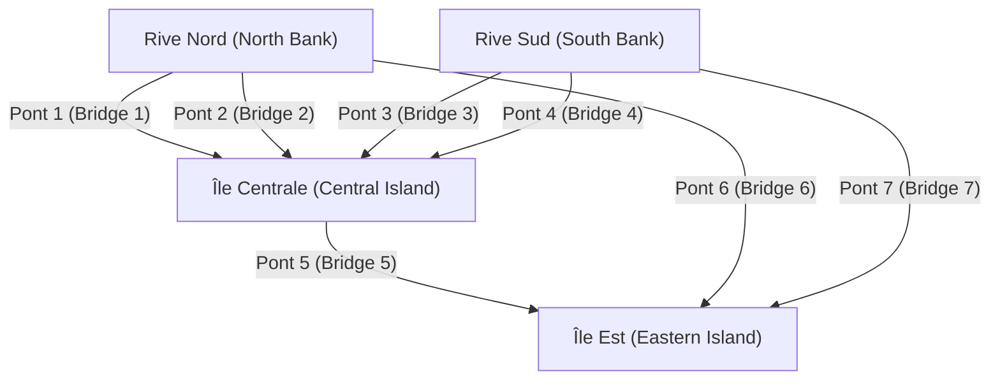
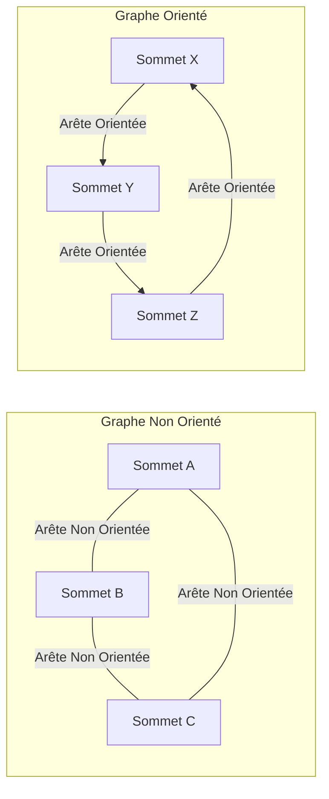

## 1. Introduction : Le Monde est Fait de Réseaux

Dans la société moderne, nous sommes constamment connectés à quelque chose. Qu'il s'agisse de la communication entre les ordinateurs via Internet, des relations humaines complexes sur les services de réseaux sociaux (SNS), des vastes réseaux routiers et ferroviaires reliant les villes, des chaînes d'approvisionnement mondiales pour la logistique ou des innombrables connexions neuronales au sein de nos propres cerveaux, il n'est pas exagéré de dire que le monde est composé de réseaux innombrables.

Fournissant un cadre puissant pour représenter et analyser de manière simple et mathématiquement rigoureuse ces réseaux qui, à première vue, semblent très complexes et même chaotiques, c'est la **Théorie des Graphes** ([Graph Theory](https://kenji.blog/fr/p/graph-theory-dijkstra-a-star/)). En utilisant la théorie des graphes, nous pouvons démêler les structures et les propriétés cachées au sein de systèmes complexes, trouver des itinéraires de communication optimaux et évaluer la vulnérabilité de réseaux entiers.

Cet article expliquera de manière exhaustive et systématique la théorie des graphes, en commençant par ses origines historiques, en couvrant les définitions mathématiques de base et les structures de données pour la programmation informatique, et en présentant des algorithmes représentatifs qui soutiennent les fondations de la technologie moderne.

## 2. La Naissance de la Théorie des Graphes : Les Sept Ponts de Königsberg

L'histoire de la théorie des graphes remonte au 18ème siècle. En 1736, le brillant mathématicien suisse [Leonhard Euler](https://kenji.blog/fr/p/euler/) a résolu avec élégance un célèbre puzzle mathématique, marquant ainsi le début de ce domaine. Ce puzzle est connu sous le nom des « Sept Ponts de Königsberg ».

Dans la belle ville de Königsberg, dans le royaume de Prusse (aujourd'hui Kaliningrad, en Russie), coulait la rivière Pregel, avec deux îles au milieu et un total de sept ponts les reliant aux rives. Un jeu est devenu populaire parmi les citoyens : « Est-il possible de traverser chaque pont exactement une fois et de revenir au point de départ initial ? » Beaucoup de gens ont essayé, mais personne n'a réussi.

Pour résoudre ce problème, Euler a adopté une approche révolutionnaire consistant à abstraire la carte réelle de la ville jusqu'à sa limite. Il a représenté les masses terrestres (îles et rives) par des « points » et les ponts les reliant par des « lignes », éliminant tous les éléments non pertinents à l'essence du problème, tels que la distance et la direction.



Euler s'est rendu compte que pour « traverser » un point, il doit toujours y avoir une paire constituée d'un « pont d'entrée » et d'un « pont de sortie ». Autrement dit, il a prouvé mathématiquement que pour tous les points à l'exception du point de départ et du point d'arrivée, le nombre de ponts connectés doit être « pair ».

Dans le graphe abstrait des ponts de Königsberg, le nombre de ponts connectés aux quatre masses terrestres (points) était « impair » (soit 3, soit 5). Par conséquent, il a été conclu qu'il est impossible de tracer une ligne continue traversant tous les ponts exactement une fois.

Cette découverte d'Euler a été le moment exact où la **Théorie des Graphes** est née. En écartant le terrain physique complexe et en se concentrant uniquement sur les relations de connexion (topologie) des points et des lignes, il a ouvert un tout nouveau domaine des mathématiques.

## 3. Concepts de Base et Définitions Mathématiques de la Théorie des Graphes

En théorie des graphes, un « graphe » ne fait pas référence à des méthodes de visualisation de données statistiques comme les graphiques linéaires ou les diagrammes circulaires. Il désigne une structure mathématique qui représente un ensemble d'objets et les relations qui les unissent.

### 3.1. Structure de Base d'un Graphe : Sommets et Arêtes

Un graphe $G$ est généralement défini comme une paire constituée d'un ensemble de sommets $V$ et d'un ensemble d'arêtes $E$, notée mathématiquement $G = (V, E)$.

*   **Sommet / Nœud (Vertex / Node)** : Représente les composants d'un réseau. Visuellement dessiné comme un point. Le nombre d'éléments dans l'ensemble $V$ (nombre de sommets) est noté $|V|$.
*   **Arête / Lien (Edge / Link)** : Représente la relation ou la connexion entre les sommets. Visuellement dessinée comme une ligne. Le nombre d'éléments dans l'ensemble $E$ (nombre d'arêtes) est noté $|E|$.

Par exemple, une arête reliant le sommet $u$ et $v$ est représentée par $e = (u, v)$.

### 3.2. Graphes Orientés et Non Orientés

Les graphes sont globalement classés en deux types selon que les arêtes ont une direction ou non.

*   **Graphe Non Orienté (Undirected [Graph](https://kenji.blog/fr/p/tree-graph-data-structures-search-dfs-bfs-dijkstra/))** : Un graphe dont les arêtes n'ont pas de direction. Utilisé lorsque la relation est toujours mutuelle et bidirectionnelle, comme les lignes de communication, les routes à double sens ou les relations d'« amis » sur Facebook.
*   **Graphe Orienté (Directed Graph)** : Un graphe dont les arêtes ont une direction. Utilisé pour exprimer des relations unidirectionnelles, comme l'écoulement de l'eau, les rues à sens unique ou les relations d'« abonnement » (follow) sur Twitter (X). Dans les graphes orientés, les arêtes sont clairement dessinées sous forme de flèches.



### 3.3. Graphes Pondérés

Lors de la modélisation de problèmes du monde réel, nous voulons souvent exprimer non seulement « s'ils sont connectés », mais aussi la « facilité de connexion » ou le « coût ». Dans de tels cas, un **Graphe Pondéré (Weighted [Graph](https://kenji.blog/fr/p/tree-graph-data-structures-search-dfs-bfs-dijkstra/))** est utilisé, où une valeur numérique (poids) est attribuée à chaque arête. Le poids peut représenter la distance entre des villes, le temps de retard de communication ou le coût de déplacement.

### 3.4. Chemins et Cycles

Le concept de déplacement à l'intérieur d'un graphe est également très important.

*   **Marche (Walk)** : Une séquence alternant entre sommets et arêtes. Les mêmes sommets ou arêtes peuvent être parcourus plusieurs fois.
*   **Chemin (Path)** : Une marche où aucun sommet n'est visité plus d'une fois.
*   **Cycle (Cycle)** : Un chemin dont le point de départ et le point d'arrivée sont identiques.

Ces concepts constituent les éléments de base fondamentaux pour retracer le flux de données sur un réseau ou dans les algorithmes de routage du trafic.

### 3.5. Degré et Connexité

Le nombre d'arêtes directement connectées à un sommet est appelé le **Degré (Degree)** de ce sommet. Le degré du sommet $v$ est noté mathématiquement $\deg(v)$.

Dans un graphe orienté, nous distinguons clairement le **Degré Entrant (In-degree)**, le nombre de flèches entrant dans un sommet, et le **Degré Sortant (Out-degree)**, le nombre de flèches sortant d'un sommet.

De plus, s'il existe toujours un chemin entre n'importe quels deux sommets arbitraires dans un graphe, ce graphe est dit **Connexe (Connected)**. Dans les réseaux de communication comme Internet, le fait que l'ensemble du réseau soit un graphe connexe est une condition absolue pour garantir que tous les ordinateurs peuvent communiquer entre eux.

## 4. Structures de Données pour la Manipulation de Graphes sur Ordinateur

Afin d'implémenter les concepts mathématiques de la théorie des graphes sous forme de programmes et de permettre aux ordinateurs de les calculer rapidement, il est nécessaire de représenter les graphes en mémoire à l'aide de structures de données appropriées. En pratique, deux méthodes principales sont utilisées : la « Matrice d'Adjacence » et la « Liste d'Adjacence ».

### 4.1. Matrice d'Adjacence (Adjacency Matrix)

Une matrice d'adjacence est une méthode de représentation d'un graphe utilisant un tableau (matrice) en 2 dimensions. Un graphe à $N$ sommets est représenté par une matrice $A$ de $N \times N$. S'il existe une arête du sommet $i$ au sommet $j$, l'élément de la matrice $A_{i,j}$ est défini à $1$ ; s'il n'existe pas, il est défini à $0$. Pour les graphes pondérés, la valeur numérique du poids de l'arête est placée au lieu de $1$.

Mathématiquement, elle est définie comme suit :

$$
A_{i,j} = \begin{cases} 
1 & (\text{s'il existe une arête du sommet } i \text{ au sommet } j) \\
0 & (\text{sinon})
\end{cases}
$$

*   **Avantages** : Il est possible de déterminer immédiatement si une arête existe entre n'importe quels deux sommets en un temps $\mathcal{O}(1)$ (temps constant). Elle est également directement liée à l'analyse algébrique des graphes (comme la théorie spectrale des graphes) utilisant la multiplication de matrices.
*   **Inconvénients** : La consommation de mémoire est de $\mathcal{O}(N^2)$ pour le nombre de sommets $N$, ce qui épuisera la mémoire pour les graphes géants. Particulièrement pour les **Graphes Creux (Sparse Graphs)**, où le nombre d'arêtes est très faible par rapport au carré du nombre de sommets, la majeure partie de la matrice devient $0$, ce qui la rend hautement inefficace.

### 4.2. Liste d'Adjacence (Adjacency List)

Une liste d'adjacence est une méthode qui maintient une « liste de sommets adjacents (comme un tableau ou une liste chaînée) » directement connectés par une arête pour chaque sommet.

*   Sommet A : `[B, C]`
*   Sommet B : `[A, D, E]`
*   Sommet C : `[A, F]`

*   **Avantages** : La consommation de mémoire est proportionnelle à la somme du nombre de sommets et d'arêtes, ce qui donne $\mathcal{O}(|V| + |E|)$, la rendant extrêmement efficace en mémoire pour les graphes creux, fréquents dans le monde réel.
*   **Inconvénients** : Pour vérifier si un sommet spécifique $i$ et un sommet $j$ sont connectés, il est nécessaire de rechercher séquentiellement dans la liste, ce qui prend un temps $\mathcal{O}(|V|)$ dans le pire des cas.

## 5. Algorithmes Représentatifs Autour des Graphes

Pour résoudre efficacement les problèmes sur les graphes, de nombreux excellents algorithmes ont été conçus tout au long de l'histoire de l'informatique. Nous présentons ici quelques algorithmes représentatifs considérés comme essentiels dans le génie logiciel moderne.

### 5.1. Parcours en Largeur ([BFS](https://kenji.blog/fr/p/tree-graph-data-structures-search-dfs-bfs-dijkstra/)) et Parcours en Profondeur ([DFS](https://kenji.blog/fr/p/tree-graph-data-structures-search-dfs-bfs-dijkstra/))

Les algorithmes les plus fondamentaux pour visiter systématiquement tous les sommets d'un réseau sans omission sont le **Parcours en Largeur (Breadth-First Search, BFS)** et le **Parcours en Profondeur (Depth-First Search, DFS)**.

*   **Parcours en Largeur (BFS)** : Explore de manière concentrique, en privilégiant les sommets les plus proches du point de départ. C'est comme des ondulations qui s'étendent lorsqu'une pierre est jetée dans l'eau. Il est idéal pour trouver le chemin le plus court (le chemin avec le nombre minimum d'arêtes) dans un graphe non pondéré. Il est implémenté à l'aide d'une structure de données File (Queue).
*   **Parcours en Profondeur (DFS)** : Explore aussi profondément que possible, et lorsqu'il arrive dans une impasse, revient au point de ramification précédent pour explorer un autre chemin. C'est comme résoudre un labyrinthe en suivant les murs. Utilisé pour détecter les cycles dans un graphe ou pour le tri topologique. Il est implémenté à l'aide d'une Pile (Stack) ou d'appels de fonctions récursives.

Voici un exemple d'implémentation simple du Parcours en Largeur (BFS) utilisant Python.

```python
from collections import deque

def bfs(graph, start_vertex):
    """
    Fonction pour exécuter le Parcours en Largeur (BFS) sur un graphe
    :param graph: Dictionnaire du graphe représenté au format de liste d'adjacence
    :param start_vertex: Sommet initial pour commencer l'exploration
    """
    visited = set() # Ensemble pour enregistrer les sommets visités
    queue = deque([start_vertex]) # File pour gérer les sommets à explorer
    visited.add(start_vertex)
    
    while queue:
        # Retirer un sommet de l'avant de la file
        vertex = queue.popleft()
        print(f"Sommet actuellement visité : {vertex}")
        
        # Ajouter tous les sommets adjacents non visités à la file
        for neighbor in graph[vertex]:
            if neighbor not in visited:
                visited.add(neighbor)
                queue.append(neighbor)

# Définition du graphe (format de liste d'adjacence)
graph_data = {
    'A': ['B', 'C'],
    'B': ['A', 'D', 'E'],
    'C': ['A', 'F'],
    'D': ['B'],
    'E': ['B', 'F'],
    'F': ['C', 'E']
}

print("Journal des résultats de l'exécution de BFS :")
bfs(graph_data, 'A')
```

### 5.2. Problème du Plus Court Chemin : Algorithme de [Dijkstra](https://kenji.blog/fr/p/graph-theory-dijkstra-a-star/)

Lors de la recherche de l'itinéraire le plus rapide vers une destination sur une application cartographique, ce qui opère au cœur du système est un **Algorithme du Plus Court Chemin**. L'itinéraire a des coûts (poids) tels que la « distance » et le « temps de trajet », et l'objectif est de trouver le chemin qui minimise le coût cumulé du point de départ à la destination.

Inventé par l'informaticien néerlandais Edsger W. [Dijkstra](https://kenji.blog/fr/p/tree-graph-data-structures-search-dfs-bfs-dijkstra/) en 1956, l'**Algorithme de Dijkstra** est un algorithme extrêmement célèbre pour calculer efficacement le chemin le plus court à partir d'une seule source vers tous les autres sommets d'un réseau, à condition que tous les poids des arêtes soient non négatifs (0 ou plus).

La logique centrale de l'algorithme de Dijkstra est de répéter le processus consistant à « sélectionner le sommet avec la distance non confirmée la plus courte parmi l'ensemble des sommets dont la distance la plus courte depuis le départ est déjà confirmée, et de mettre à jour les informations de distance la plus courte des sommets environnants via des itinéraires passant par ce sommet ». En utilisant une File de Priorité (Priority Queue), le temps d'exécution peut être considérablement réduit.

```python
import heapq

def dijkstra(graph, start):
    """
    Calcul des coûts du chemin le plus court à l'aide de l'algorithme de Dijkstra
    """
    # Dictionnaire pour conserver la distance la plus courte depuis le départ. La valeur initiale est l'infini.
    distances = {vertex: float('infinity') for vertex in graph}
    distances[start] = 0
    
    # File de priorité pour stocker des tuples (distance cumulée, sommet)
    priority_queue = [(0, start)]
    
    while priority_queue:
        # Extraire le sommet ayant la distance la plus courte actuellement
        current_distance, current_vertex = heapq.heappop(priority_queue)
        
        # Ignorer le traitement si la distance extraite de la file est supérieure à la distance déjà enregistrée
        if current_distance > distances[current_vertex]:
            continue
            
        # Essayer de mettre à jour les distances pour tous les sommets adjacents
        for neighbor, weight in graph[current_vertex].items():
            distance = current_distance + weight
            
            # Si un chemin plus court qu'auparavant est trouvé, mettre à jour la distance et le pousser dans la file
            if distance < distances[neighbor]:
                distances[neighbor] = distance
                heapq.heappush(priority_queue, (distance, neighbor))
                
    return distances

# Définition d'un graphe orienté pondéré
weighted_graph = {
    'A': {'B': 2, 'C': 5},
    'B': {'C': 2, 'D': 4},
    'C': {'D': 1},
    'D': {'C': 3} # Un cycle existe
}

print("\nRésultat de l'exécution de l'algorithme de Dijkstra (distance la plus courte depuis le sommet A) :")
print(dijkstra(weighted_graph, 'A'))
```

### 5.3. Problème de l'Arbre Couvrant de Poids Minimum : Algorithme de Kruskal

Imaginez la nécessité de connecter physiquement toutes les bases dans un vaste réseau avec le coût total le plus bas possible. Par exemple, lors de la construction d'un réseau électrique pour alimenter une nouvelle zone résidentielle, ou de la pose de câbles en fibre optique entre plusieurs villes, la situation exige de minimiser le coût de construction de l'infrastructure.

Ainsi, un sous-graphe qui inclut tous les sommets du graphe, qui n'a absolument aucun cycle (c'est-à-dire une structure arborescente), et qui minimise la somme des poids des arêtes utilisées est appelé un **Arbre Couvrant de Poids Minimum (Minimum Spanning [Tree](https://kenji.blog/fr/p/tree-graph-data-structures-search-dfs-bfs-dijkstra/), MST)**.

L'un des algorithmes représentatifs pour trouver cet arbre couvrant minimum est l'**Algorithme de Kruskal**. L'algorithme de Kruskal est un exemple typique d'un « Algorithme Glouton (Greedy Algorithm) » qui accumule des solutions optimales locales, en suivant des étapes extrêmement simples et intuitives.

1.  Triez toutes les arêtes présentes dans le graphe par ordre croissant de leurs poids.
2.  Extrayez les arêtes une par une en commençant par celle ayant le plus petit poids, et adoptez-la officiellement dans l'arbre couvrant uniquement si l'ajout de cette arête ne forme pas de « cycle (boucle) ».
3.  Terminez l'algorithme lorsque le nombre d'arêtes adoptées dans l'arbre couvrant atteint le « nombre total de sommets - 1 ».

Une structure de données spéciale appelée Ensemble Disjoint (Union-Find Tree) joue un rôle actif pour déterminer rapidement si un cycle est formé.

### 5.4. Flot de Réseau et Problème du Flot Maximum

Dans le réseau de conduites d'eau d'une ville ou les lignes de communication principales d'Internet, la question « Quelle est la quantité maximale (d'eau ou de paquets de données) qui peut circuler simultanément à travers l'ensemble du système du point de départ (source) au point final (puits) ? » est appelée le **Problème du Flot Maximum (Maximum Flow Problem)**.

Chaque arête (tuyau ou câble) composant le réseau possède une « Capacité (Capacity) » strictement définie indiquant la quantité maximale qui peut circuler par unité de temps, et il est physiquement impossible que le flux dépasse cette capacité sur n'importe quel itinéraire. Ce problème complexe peut être résolu avec précision mathématique à l'aide d'algorithmes tels que l'Algorithme de Ford-Fulkerson pour dériver le débit maximum. La théorie du flot maximum est appliquée à un éventail étonnamment large de domaines, notamment la modélisation et l'atténuation des embouteillages, la résolution des goulots d'étranglement dans les réseaux logistiques et même l'extraction d'objets (coupes de graphes) dans le traitement d'images.

## 6. Graphes Bipartis et Problèmes de Couplage

Le **Graphe Biparti (Bipartite [Graph](https://kenji.blog/fr/p/tree-graph-data-structures-search-dfs-bfs-dijkstra/))** occupe une position unique au sein de la théorie des graphes. Un graphe biparti est un graphe où, lorsque tous les sommets sont divisés en deux groupes (par exemple, le groupe $U$ et le groupe $V$), chaque arête relie toujours un sommet dans $U$ et un sommet dans $V$, et il n'y a absolument aucune arête reliant des sommets au sein du même groupe.

Les graphes bipartis sont idéaux pour modéliser les relations entre deux ensembles ayant des propriétés différentes, tels que les « chercheurs d'emploi » et les « entreprises de recrutement », les « étudiants » et les « laboratoires », ou les « taxis » et les « passagers ».

L'un des problèmes les plus importants dans les graphes bipartis est le **Problème de Couplage (Matching Problem)**. Il s'agit du problème consistant à sélectionner un ensemble d'arêtes (couplage) du graphe qui ne partagent pas de points finaux entre elles. En particulier, le « couplage biparti maximum », qui forme autant de paires que possible, est directement lié aux problèmes d'allocation optimale des ressources. De plus, les problèmes maximisant la satisfaction ou le profit de chaque paire ont été résolus par l'« Algorithme de Gale-Shapley », qui a fait l'objet du prix Nobel d'économie, et sont profondément intégrés dans les conceptions de systèmes sociaux du monde réel, tels que les affectations des hôpitaux pour les médecins internes et les systèmes de choix d'écoles.

## 7. Applications de la Théorie des Graphes dans la Société Moderne

La théorie des graphes ne se limite pas aux mathématiques abstraites sur un tableau noir ; elle est utilisée dans une grande variété de domaines en tant que technologie d'infrastructure qui soutient fondamentalement notre vie quotidienne.

### 7.1. Moteurs de Recherche et l'Algorithme PageRank

Le mécanisme du moteur de recherche de Google, qui évalue instantanément d'innombrables pages web dispersées dans le monde entier et les classe par ordre d'utilité, connu sous le nom d'algorithme **PageRank**, est une réussite définitive de la modélisation du monde du web sous la forme d'un graphe orienté massif.

*   **Sommet** : Pages web individuelles sur Internet
*   **Arête** : Hyperliens sautant d'une page à l'autre

À la racine de PageRank se trouve l'idée d'évaluation récursive selon laquelle « une page liée par de nombreuses pages web de haute qualité a une forte probabilité d'être elle-même une page de haute qualité ». En représentant la structure des liens comme une matrice d'adjacence massive et en calculant le vecteur propre principal de cette matrice (une application de la théorie spectrale des graphes), ils ont réussi à calculer mathématiquement et objectivement l'importance relative de l'information sur Internet, couvrant des centaines de milliards de pages.

### 7.2. Analyse Structurelle des Réseaux Sociaux

Les plateformes de SNS telles que Twitter, Facebook, LinkedIn et Instagram forment des **Graphes Sociaux (Social Graphs)** massifs exprimant des connexions entre les personnes, ou entre les personnes et le contenu. En appliquant la théorie des graphes, la structure de communautés massives peut être analysée de manière précise.

Par exemple, pour répondre à la question « Qui est la figure centrale (influenceur) ayant le plus d'influence dans l'ensemble du réseau ? », on utilise le concept de **Centralité (Centrality)**. En calculant diverses métriques telles que la « centralité de degré » basée sur le simple nombre d'arêtes connectées à un sommet, la « centralité d'intermédiarité » mesurant à quelle fréquence on apparaît sur les chemins les plus courts du réseau, et la « centralité de proximité » évaluant la facilité d'accès à tous les autres sommets, des activités telles que l'identification d'influenceurs, la prédiction d'itinéraires de diffusion d'informations et la détection de phénomènes de chambre d'écho sont réalisées.

### 7.3. Apprentissage Automatique et Réseaux de Neurones sur Graphes (GNN)

Ces dernières années, à l'avant-garde de l'intelligence artificielle (IA) et de l'apprentissage automatique, les **Réseaux de Neurones sur Graphes (Graph Neural Networks, GNN)**, qui peuvent directement apprendre des données ayant des structures de graphes, ont suscité une attention explosive.

Les modèles d'apprentissage automatique traditionnels, tels que les CNN utilisés dans la reconnaissance d'images ou les Transformers utilisés dans le traitement du langage naturel, ont été conçus pour gérer des données régulières comme des tableaux de pixels en grille ou des séquences de mots unidimensionnelles. Cependant, gérer des données de graphes irrégulières et complexes comme les connexions complexes des SNS ou les structures de liaisons atomiques constituant les molécules était extrêmement difficile.

Les GNN ont franchi cette barrière en propageant et en apprenant simultanément les informations de quantité de caractéristiques de chaque sommet sur le graphe et la topologie (relations de connexion) de l'ensemble du graphe. Aujourd'hui, les GNN ont été mis en pratique en tant que technologies de base indispensables dans les applications d'IA de pointe, notamment dans le domaine de la découverte de médicaments (Drug Discovery) prédisant les propriétés de nouveaux composés, les systèmes de recommandation avancés sur Amazon et Netflix, et la prédiction de l'heure d'arrivée sur Google Maps.

## 8. Conclusion et Perspectives d'Avenir

Dans cet article, nous avons décrit comment la **Théorie des Graphes**, née d'un simple puzzle à Königsberg au 18ème siècle, a évolué pour devenir « l'outil ultime » pour démêler les réseaux extrêmement complexes de la société moderne.

Bien que les graphes soient composés uniquement des éléments les plus simples et les plus abstraits possibles : des points (sommets) et des lignes (arêtes), le monde des théories mathématiques et des algorithmes informatiques qui leur sont appliqués est aussi profond que l'univers et recèle une puissance écrasante. [Pour les ingénieurs](https://kenji.blog/fr/p/prompt-engineering-for-engineers/) logiciels, les scientifiques des données ou toute personne intéressée par les systèmes complexes, des connaissances systématiques de la théorie des graphes amélioreront de manière exponentielle la capacité d'abstraction de haut niveau face à des problèmes difficiles et la réflexion logique pour dériver des solutions optimales.

Si vous apprenez la programmation, veuillez utiliser cet article comme un tremplin et essayez de coder et d'exécuter réellement des algorithmes comme celui de [Dijkstra](https://kenji.blog/fr/p/graph-theory-dijkstra-a-star/) ou le parcours en largeur sur votre propre ordinateur. Lorsque vous ferez l'expérience du processus de réseaux complexes et invisibles en train d'être démêlés de manière vivante par le code que vous écrivez, vous réaliserez véritablement la véritable beauté et la fascination de la théorie des graphes. Le monde est rempli de graphes plus beaux et calculables que vous ne le pensez.
