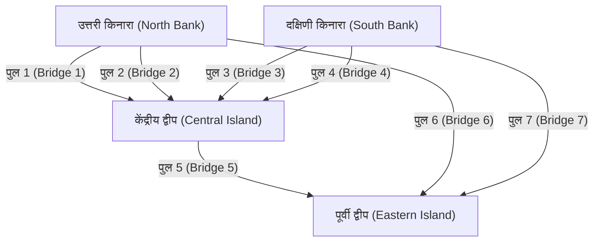
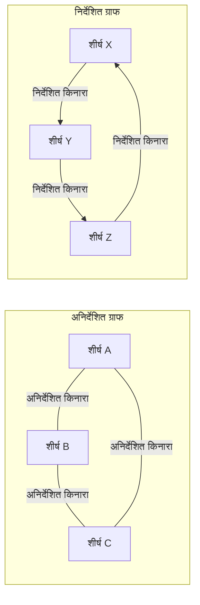

## 1. परिचय: दुनिया नेटवर्क से बनी है

आधुनिक समाज में, हम लगातार किसी न किसी चीज़ से जुड़े हुए हैं। चाहे वह इंटरनेट के माध्यम से कंप्यूटर के बीच संचार हो, सोशल नेटवर्किंग सेवाओं (SNS) पर जटिल मानवीय संबंध हों, शहरों को जोड़ने वाले विशाल सड़क और रेलवे नेटवर्क हों, रसद के लिए वैश्विक आपूर्ति श्रृंखलाएं हों, या हमारे अपने दिमाग के भीतर अनगिनत तंत्रिका कनेक्शन हों - यह कहना अतिशयोक्ति नहीं होगी कि दुनिया अनगिनत नेटवर्क से बनी है।

इन नेटवर्कों को सरलता और गणितीय रूप से कठोरता से प्रस्तुत करने और उनका विश्लेषण करने के लिए एक शक्तिशाली रूपरेखा प्रदान करना, जो पहली नज़र में अत्यधिक जटिल और यहां तक ​​कि अराजक लगते हैं, **ग्राफ सिद्धांत** (Graph Theory) है। ग्राफ सिद्धांत का उपयोग करके, हम जटिल प्रणालियों के भीतर छिपी संरचनाओं और गुणों को उजागर कर सकते हैं, इष्टतम संचार मार्ग खोज सकते हैं, और पूरे नेटवर्क की भेद्यता का मूल्यांकन कर सकते हैं।

यह लेख अपने ऐतिहासिक उद्गम से शुरू होकर, कंप्यूटर प्रोग्रामिंग के लिए बुनियादी गणितीय परिभाषाओं और डेटा संरचनाओं को कवर करते हुए, और आधुनिक तकनीक की नींव का समर्थन करने वाले प्रतिनिधि एल्गोरिदम को पेश करते हुए, ग्राफ सिद्धांत को व्यापक और व्यवस्थित रूप से समझाएगा।

## 2. ग्राफ सिद्धांत का जन्म: [कोनिग्सबर्ग के सात पुल](https://kenji.blog/p/seven-bridges-of-konigsberg/)

ग्राफ सिद्धांत का इतिहास 18वीं शताब्दी का है। 1736 में, शानदार स्विस गणितज्ञ [लियोनहार्ड यूलर](https://kenji.blog/p/euler/) ([Leonhard Euler](https://kenji.blog/p/euler/)) ने एक प्रसिद्ध गणितीय पहेली को शानदार ढंग से हल किया, जिससे इस क्षेत्र की शुरुआत हुई। इस पहेली को "[कोनिग्सबर्ग के सात पुल](https://kenji.blog/p/seven-bridges-of-konigsberg/)" के रूप में जाना जाता है।

प्रशिया साम्राज्य (अब कैलिनिनग्राद, रूस) के खूबसूरत शहर कोनिग्सबर्ग में, प्रेगेल नदी बहती थी, जिसके बीच में दो द्वीप थे और उन्हें नदी के किनारों से जोड़ने वाले कुल सात पुल थे। नागरिकों के बीच एक खेल लोकप्रिय हो गया: "क्या हर पुल को ठीक एक बार पार करना और मूल शुरुआती बिंदु पर लौटना संभव है?" कई लोगों ने कोशिश की, लेकिन कोई सफल नहीं हुआ।

इस समस्या को हल करने के लिए, यूलर ने शहर के वास्तविक नक्शे को उसकी सीमा तक अमूर्त करने का एक क्रांतिकारी दृष्टिकोण अपनाया। उन्होंने भूभाग (द्वीपों और किनारों) को "बिंदुओं" के रूप में और उन्हें जोड़ने वाले पुलों को "रेखाओं" के रूप में प्रस्तुत किया, दूरी और दिशा जैसे समस्या के सार के लिए अप्रासंगिक सभी तत्वों को समाप्त कर दिया।



यूलर ने महसूस किया कि किसी बिंदु से "गुजरने" के लिए, हमेशा एक "आने वाले पुल" और एक "जाने वाले पुल" की जोड़ी होनी चाहिए। अर्थात्, उन्होंने गणितीय रूप से साबित कर दिया कि प्रारंभिक और अंतिम बिंदुओं को छोड़कर सभी बिंदुओं के लिए, जुड़े हुए पुलों की संख्या "सम" होनी चाहिए।

कोनिग्सबर्ग पुलों के अमूर्त ग्राफ में, सभी चार भूभागों (बिंदुओं) पर जुड़े पुलों की संख्या "विषम" (या तो 3 या 5) थी। इसलिए, यह निष्कर्ष निकाला गया कि सभी पुलों को ठीक एक बार पार करते हुए एक निरंतर रेखा खींचना असंभव है।

यूलर की यह खोज ठीक वही क्षण था जब **ग्राफ सिद्धांत** का जन्म हुआ था। जटिल भौतिक इलाके को त्यागकर और केवल बिंदुओं और रेखाओं के कनेक्शन संबंधों (टोपोलॉजी) पर ध्यान केंद्रित करके, उन्होंने गणित का एक पूरी तरह से नया क्षेत्र खोल दिया।

## 3. ग्राफ सिद्धांत की बुनियादी अवधारणाएँ और गणितीय परिभाषाएँ

ग्राफ सिद्धांत में, "ग्राफ" का अर्थ सांख्यिकीय डेटा विज़ुअलाइज़ेशन विधियों जैसे कि लाइन चार्ट या पाई चार्ट से नहीं है। यह एक गणितीय संरचना को संदर्भित करता है जो वस्तुओं के एक सेट और उनके बीच के संबंधों का प्रतिनिधित्व करता है।

### 3.1. एक ग्राफ की मूल संरचना: शीर्ष (Vertices) और किनारे (Edges)

एक ग्राफ $G$ को आम तौर पर शीर्षों (Vertex) के एक सेट $V$ और किनारों (Edge) के एक सेट $E$ की एक जोड़ी के रूप में परिभाषित किया जाता है, जिसे गणितीय रूप से $G = (V, E)$ के रूप में दर्शाया जाता है।

*   **शीर्ष / नोड (Vertex / Node)**: यह एक नेटवर्क के घटकों का प्रतिनिधित्व करता है। दृष्टिगत रूप से एक बिंदु के रूप में खींचा जाता है। सेट $V$ में तत्वों की संख्या (शीर्षों की संख्या) को $|V|$ द्वारा दर्शाया जाता है।
*   **किनारा / लिंक (Edge / Link)**: यह शीर्षों के बीच संबंध या कनेक्शन का प्रतिनिधित्व करता है। दृष्टिगत रूप से एक रेखा के रूप में खींचा जाता है। सेट $E$ में तत्वों की संख्या (किनारों की संख्या) को $|E|$ द्वारा दर्शाया जाता है।

उदाहरण के लिए, शीर्ष $u$ और $v$ को जोड़ने वाले किनारे को $e = (u, v)$ के रूप में दर्शाया जाता है।

### 3.2. निर्देशित (Directed) और अनिर्देशित (Undirected) ग्राफ

किनारों की दिशा है या नहीं, इसके आधार पर ग्राफ़ को मोटे तौर पर दो प्रकारों में वर्गीकृत किया जाता है।

*   **अनिर्देशित ग्राफ (Undirected Graph)**: एक ग्राफ जहां किनारों की कोई दिशा नहीं होती है। इसका उपयोग तब किया जाता है जब संबंध हमेशा पारस्परिक और दो-तरफा होता है, जैसे संचार लाइनें, दो-तरफ़ा सड़कें, या फेसबुक "मित्र" संबंध।
*   **निर्देशित ग्राफ (Directed Graph)**: एक ग्राफ जहां किनारों की एक दिशा होती है। इसका उपयोग एकतरफा संबंधों को व्यक्त करने के लिए किया जाता है, जैसे पानी का प्रवाह, एकतरफा सड़कें, या ट्विटर (X) "फ़ॉलो" संबंध। निर्देशित ग्राफ़ में, किनारों को स्पष्ट रूप से तीरों के रूप में खींचा जाता है।



### 3.3. भारित ग्राफ (Weighted Graphs)

वास्तविक दुनिया की समस्याओं को मॉडल करते समय, हम अक्सर न केवल "क्या वे जुड़े हुए हैं" बल्कि "कनेक्शन में आसानी" या "लागत" भी व्यक्त करना चाहते हैं। ऐसे मामलों में, एक **भारित ग्राफ (Weighted Graph)** का उपयोग किया जाता है, जहां प्रत्येक किनारे को एक संख्यात्मक मान (वजन) सौंपा जाता है। वजन शहरों के बीच की दूरी, संचार विलंब समय या यात्रा लागत का प्रतिनिधित्व कर सकता है।

### 3.4. पथ (Paths) और चक्र (Cycles)

ग्राफ के भीतर चलने की अवधारणा भी बहुत महत्वपूर्ण है।

*   **चाल (Walk)**: शीर्षों और किनारों के बीच एक अनुक्रम बारी-बारी से। एक ही शीर्ष या किनारों को कई बार पार किया जा सकता है।
*   **पथ (Path)**: एक चाल जहां किसी भी शीर्ष का एक से अधिक बार दौरा नहीं किया जाता है।
*   **चक्र (Cycle)**: एक पथ जहां प्रारंभिक बिंदु और अंतिम बिंदु समान होते हैं।

ये अवधारणाएँ किसी नेटवर्क पर या ट्रैफ़िक रूटिंग एल्गोरिदम में डेटा प्रवाह को ट्रैक करने के लिए मूलभूत निर्माण खंड हैं।

### 3.5. डिग्री (Degree) और कनेक्टिविटी

किसी शीर्ष से सीधे जुड़े किनारों की संख्या को उस शीर्ष की **डिग्री (Degree)** कहा जाता है। शीर्ष $v$ की डिग्री को गणितीय रूप से $\deg(v)$ के रूप में दर्शाया जाता है।

एक निर्देशित ग्राफ में, हम **इन-डिग्री (In-degree)**, किसी शीर्ष में आने वाले तीरों की संख्या, और **आउट-डिग्री (Out-degree)**, किसी शीर्ष से बाहर जाने वाले तीरों की संख्या के बीच स्पष्ट रूप से अंतर करते हैं।

इसके अलावा, यदि किसी ग्राफ में किन्हीं दो मनमाने ढंग से शीर्षों के बीच हमेशा एक पथ मौजूद होता है, तो उस ग्राफ को **जुड़ा हुआ (Connected)** कहा जाता है। इंटरनेट जैसे संचार नेटवर्क में, संपूर्ण नेटवर्क का एक जुड़ा हुआ ग्राफ होना यह सुनिश्चित करने के लिए एक पूर्ण आवश्यकता है कि सभी कंप्यूटर एक दूसरे के साथ संवाद कर सकें।

## 4. कंप्यूटर में ग्राफ़ को संभालने के लिए डेटा संरचनाएँ

ग्राफ सिद्धांत की गणितीय अवधारणाओं को कार्यक्रमों के रूप में लागू करने और कंप्यूटर द्वारा उन्हें जल्दी से गणना करने के लिए, उपयुक्त डेटा संरचनाओं का उपयोग करके ग्राफ़ को मेमोरी में प्रस्तुत करना आवश्यक है। व्यवहार में, दो मुख्य विधियों का उपयोग किया जाता है: "आसन्नता मैट्रिक्स" और "आसन्नता सूची"।

### 4.1. आसन्नता मैट्रिक्स (Adjacency Matrix)

एक आसन्नता मैट्रिक्स 2-आयामी सरणी (मैट्रिक्स) का उपयोग करके ग्राफ़ का प्रतिनिधित्व करने की एक विधि है। $N$ शीर्षों वाले ग्राफ़ को $N \times N$ मैट्रिक्स $A$ द्वारा दर्शाया जाता है। यदि शीर्ष $i$ से शीर्ष $j$ तक कोई किनारा मौजूद है, तो मैट्रिक्स तत्व $A_{i,j}$ को $1$ पर सेट किया जाता है; यदि यह मौजूद नहीं है, तो इसे $0$ पर सेट किया जाता है। भारित ग्राफ के लिए, $1$ के बजाय किनारे के वजन का संख्यात्मक मान रखा जाता है।

गणितीय रूप से, इसे निम्नानुसार परिभाषित किया गया है:

$$
A_{i,j} = \begin{cases} 
1 & (\text{यदि शीर्ष } i \text{ से शीर्ष } j \text{ तक किनारा मौजूद है}) \\
0 & (\text{अन्यथा})
\end{cases}
$$

*   **पेशेवर (Pros)**: किसी भी दो शीर्षों के बीच एक किनारा मौजूद है या नहीं, यह $\mathcal{O}(1)$ (निरंतर समय) में तुरंत निर्धारित करना संभव है। यह मैट्रिक्स गुणन का उपयोग करके बीजगणितीय ग्राफ विश्लेषण (जैसे वर्णक्रमीय ग्राफ सिद्धांत) से भी सीधे जुड़ता है।
*   **दोष (Cons)**: शीर्षों की संख्या $N$ के लिए मेमोरी की खपत $\mathcal{O}(N^2)$ है, जो विशाल ग्राफ़ के लिए मेमोरी को समाप्त कर देगी। विशेष रूप से **विरल ग्राफ़ (Sparse Graphs)** के लिए, जहाँ शीर्षों की संख्या के वर्ग की तुलना में किनारों की संख्या बहुत कम है, मैट्रिक्स का अधिकांश भाग $0$ हो जाता है, जिससे यह अत्यधिक अक्षम हो जाता है।

### 4.2. आसन्नता सूची (Adjacency List)

एक आसन्नता सूची एक विधि है जो प्रत्येक शीर्ष के लिए एक किनारे द्वारा सीधे "आसन्न शीर्षों (जैसे एक सरणी या लिंक्ड सूची) की सूची" बनाए रखती है।

*   शीर्ष A: `[B, C]`
*   शीर्ष B: `[A, D, E]`
*   शीर्ष C: `[A, F]`

*   **पेशेवर (Pros)**: मेमोरी की खपत शीर्षों और किनारों की संख्या के योग के समानुपाती होती है, जिसके परिणामस्वरूप $\mathcal{O}(|V| + |E|)$ होता है, जिससे यह वास्तविक दुनिया में आम विरल ग्राफ़ के लिए बेहद मेमोरी-कुशल बन जाता है।
*   **दोष (Cons)**: यह जांचने के लिए कि क्या कोई विशिष्ट शीर्ष $i$ और शीर्ष $j$ जुड़े हुए हैं, सूची को क्रमिक रूप से खोजना आवश्यक है, जिसमें सबसे खराब स्थिति में $\mathcal{O}(|V|)$ समय लगता है।

## 5. ग्राफ़ के आसपास प्रतिनिधि एल्गोरिदम

ग्राफ़ पर समस्याओं को कुशलतापूर्वक हल करने के लिए, कंप्यूटर विज्ञान के पूरे इतिहास में कई उत्कृष्ट एल्गोरिदम तैयार किए गए हैं। यहां हम कुछ प्रतिनिधि एल्गोरिदम पेश करते हैं जिन्हें आधुनिक सॉफ्टवेयर इंजीनियरिंग में आवश्यक माना जाता है।

### 5.1. चौड़ाई-पहली खोज (BFS) और गहराई-पहली खोज (DFS)

बिना किसी चूक के नेटवर्क में सभी शीर्षों पर व्यवस्थित रूप से जाने के लिए सबसे मूलभूत एल्गोरिदम **चौड़ाई-पहली खोज (Breadth-First Search, BFS)** और **गहराई-पहली खोज (Depth-First Search, DFS)** हैं।

*   **चौड़ाई-पहली खोज (BFS)**: शुरुआती बिंदु के करीब के शीर्षों को प्राथमिकता देते हुए, संकेंद्रित रूप से अन्वेषण करता है। यह पानी में पत्थर फेंकने पर फैलने वाली लहरों की तरह है। यह एक भारहीन ग्राफ में सबसे छोटा पथ (न्यूनतम संख्या में किनारों वाला पथ) खोजने के लिए आदर्श है। इसे कतार (Queue) डेटा संरचना का उपयोग करके कार्यान्वित किया जाता है।
*   **गहराई-पहली खोज (DFS)**: यथासंभव गहराई तक अन्वेषण करता है, और जब एक गतिरोध से टकराता है, तो किसी अन्य मार्ग का अन्वेषण करने के लिए पिछले शाखा बिंदु पर वापस आ जाता है। यह दीवारों का अनुसरण करके भूलभुलैया को हल करने जैसा है। एक ग्राफ में चक्रों का पता लगाने या टोपोलॉजिकल छँटाई के लिए उपयोग किया जाता है। इसे स्टैक (Stack) या पुनरावर्ती फ़ंक्शन कॉल का उपयोग करके कार्यान्वित किया जाता है।

पायथन का उपयोग करके चौड़ाई-पहली खोज (BFS) का एक सरल कार्यान्वयन उदाहरण नीचे दिया गया है।

```python
from collections import deque

def bfs(graph, start_vertex):
    """
    ग्राफ पर चौड़ाई-पहली खोज (BFS) निष्पादित करने का फ़ंक्शन
    :param graph: आसन्नता सूची प्रारूप में दर्शाया गया ग्राफ शब्दकोश
    :param start_vertex: अन्वेषण शुरू करने के लिए प्रारंभिक शीर्ष
    """
    visited = set() # विज़िट किए गए शीर्षों को रिकॉर्ड करने के लिए सेट
    queue = deque([start_vertex]) # अन्वेषण किए जाने वाले शीर्षों के प्रबंधन के लिए कतार
    visited.add(start_vertex)
    
    while queue:
        # कतार के सामने से एक शीर्ष को हटाना
        vertex = queue.popleft()
        print(f"वर्तमान में शीर्ष का दौरा कर रहा है: {vertex}")
        
        # सभी आसन्न बिना देखे गए शीर्षों को कतार में जोड़ना
        for neighbor in graph[vertex]:
            if neighbor not in visited:
                visited.add(neighbor)
                queue.append(neighbor)

# ग्राफ परिभाषा (आसन्नता सूची प्रारूप)
graph_data = {
    'A': ['B', 'C'],
    'B': ['A', 'D', 'E'],
    'C': ['A', 'F'],
    'D': ['B'],
    'E': ['B', 'F'],
    'F': ['C', 'E']
}

print("BFS निष्पादन परिणाम लॉग:")
bfs(graph_data, 'A')
```

### 5.2. सबसे छोटे पथ की समस्या: दिज्क्स्ट्रा का एल्गोरिथ्म

मानचित्र अनुप्रयोग पर गंतव्य तक सबसे तेज़ मार्ग की खोज करते समय, सिस्टम के मूल में जो काम करता है वह है **सबसे छोटा पथ एल्गोरिदम**। मार्ग में "दूरी" और "यात्रा समय" जैसी लागतें (वजन) होती हैं, और इसका उद्देश्य वह पथ खोजना है जो प्रारंभिक बिंदु से गंतव्य तक संचयी लागत को कम करता हो।

1956 में डच कंप्यूटर वैज्ञानिक एड्सगर डब्ल्यू दिज्क्स्ट्रा द्वारा आविष्कृत, **दिज्क्स्ट्रा का एल्गोरिथ्म** इस शर्त के तहत नेटवर्क में सभी अन्य शीर्षों के लिए एक स्रोत से सबसे छोटे पथ की कुशलतापूर्वक गणना करने के लिए एक अत्यंत प्रसिद्ध एल्गोरिथ्म है कि सभी किनारे के वजन गैर-नकारात्मक (0 या अधिक) हों।

दिज्क्स्ट्रा के एल्गोरिथ्म का मुख्य तर्क "उन शीर्षों के समूह से सबसे कम अपुष्ट दूरी वाले शीर्ष का चयन करने की प्रक्रिया को दोहराना है, जिनकी शुरुआत से सबसे कम दूरी पहले से ही पुष्टि की जा चुकी है, और उस शीर्ष से होकर गुजरने वाले मार्गों के माध्यम से आसपास के शीर्षों की सबसे कम दूरी की जानकारी को अद्यतन करना है"। प्राथमिकता कतार (Priority Queue) का उपयोग करके, निष्पादन समय को काफी कम किया जा सकता है।

```python
import heapq

def dijkstra(graph, start):
    """
    दिज्क्स्ट्रा के एल्गोरिथ्म का उपयोग करके सबसे छोटे पथ की लागत की गणना
    """
    # शुरुआत से सबसे कम दूरी बनाए रखने के लिए शब्दकोश। प्रारंभिक मान अनंत है।
    distances = {vertex: float('infinity') for vertex in graph}
    distances[start] = 0
    
    # (संचयी दूरी, शीर्ष) के टुपल्स को संग्रहीत करने के लिए प्राथमिकता कतार
    priority_queue = [(0, start)]
    
    while priority_queue:
        # वर्तमान में सबसे कम दूरी वाले शीर्ष को निकालें
        current_distance, current_vertex = heapq.heappop(priority_queue)
        
        # यदि कतार से निकाली गई दूरी पहले से दर्ज की गई दूरी से अधिक है, तो प्रसंस्करण छोड़ दें
        if current_distance > distances[current_vertex]:
            continue
            
        # सभी आसन्न शीर्षों के लिए दूरी अद्यतन करने का प्रयास करें
        for neighbor, weight in graph[current_vertex].items():
            distance = current_distance + weight
            
            # यदि पहले की तुलना में छोटा पथ मिलता है, तो दूरी अद्यतन करें और इसे कतार में धकेलें
            if distance < distances[neighbor]:
                distances[neighbor] = distance
                heapq.heappush(priority_queue, (distance, neighbor))
                
    return distances

# एक भारित निर्देशित ग्राफ की परिभाषा
weighted_graph = {
    'A': {'B': 2, 'C': 5},
    'B': {'C': 2, 'D': 4},
    'C': {'D': 1},
    'D': {'C': 3} # एक चक्र मौजूद है
}

print("\nदिज्क्स्ट्रा के एल्गोरिथ्म निष्पादन परिणाम (शीर्ष A से सबसे छोटी दूरी):")
print(dijkstra(weighted_graph, 'A'))
```

### 5.3. न्यूनतम फैले हुए पेड़ (Minimum Spanning Tree) की समस्या: क्रुसकल का एल्गोरिथ्म

एक विशाल नेटवर्क में सभी ठिकानों को न्यूनतम संभव कुल लागत के साथ भौतिक रूप से जोड़ने की आवश्यकता की कल्पना करें। उदाहरण के लिए, एक नए आवासीय क्षेत्र में बिजली की आपूर्ति के लिए पावर ग्रिड का निर्माण करते समय, या कई शहरों के बीच फाइबर ऑप्टिक केबल बिछाते समय, स्थिति बुनियादी ढांचे के निर्माण लागत को कम करने की मांग करती है।

इस तरह, एक उप-ग्राफ जिसमें ग्राफ के सभी शीर्ष शामिल होते हैं, जिसका कोई चक्र नहीं होता है (अर्थात्, एक वृक्ष संरचना), और उपयोग किए गए किनारों के भार के योग को कम करता है, **न्यूनतम फैले हुए पेड़ (Minimum Spanning Tree, MST)** कहलाता है।

इस न्यूनतम फैले हुए पेड़ को खोजने के लिए प्रतिनिधि एल्गोरिदम में से एक **क्रुसकल का एल्गोरिथ्म** है। क्रुसकल का एल्गोरिथ्म "लालची एल्गोरिथ्म (Greedy Algorithm)" का एक विशिष्ट उदाहरण है जो अत्यंत सरल और सहज चरणों का पालन करते हुए स्थानीय इष्टतम समाधानों को जमा करता है।

1.  ग्राफ में मौजूद सभी किनारों को उनके वजन के आरोही क्रम में क्रमबद्ध करें।
2.  सबसे कम वजन वाले से शुरू करते हुए एक-एक करके किनारों को निकालें, और इसे आधिकारिक तौर पर फैले हुए पेड़ में तभी अपनाएं जब उस किनारे को जोड़ने से "चक्र (लूप)" नहीं बनता है।
3.  जब फैले हुए पेड़ में अपनाए गए किनारों की संख्या "शीर्षों की कुल संख्या - 1" तक पहुँच जाती है, तो एल्गोरिथ्म को समाप्त करें।

डिसजॉइंट सेट (Union-Find Tree) नामक एक विशेष डेटा संरचना यह तेज़ी से निर्धारित करने में सक्रिय भूमिका निभाती है कि चक्र बनता है या नहीं।

### 5.4. नेटवर्क फ्लो और अधिकतम फ्लो समस्या

किसी शहर के पानी के पाइप नेटवर्क या इंटरनेट की रीढ़ की हड्डी संचार लाइनों में, "प्रारंभिक बिंदु (स्रोत) से अंत बिंदु (सिंक) तक संपूर्ण प्रणाली के माध्यम से एक साथ बहने वाली अधिकतम मात्रा (पानी या डेटा पैकेट) क्या है?" प्रश्न को **अधिकतम फ्लो समस्या (Maximum Flow Problem)** कहा जाता है।

नेटवर्क बनाने वाले प्रत्येक किनारे (पाइप या केबल) की एक सख्ती से परिभाषित "क्षमता (Capacity)" होती है जो प्रति इकाई समय में प्रवाहित होने वाली अधिकतम मात्रा को इंगित करती है, और किसी भी मार्ग पर इस क्षमता से अधिक प्रवाह होना भौतिक रूप से असंभव है। अधिकतम प्रवाह दर प्राप्त करने के लिए फोर्ड-फल्कर्सन एल्गोरिथ्म जैसे एल्गोरिदम का उपयोग करके इस जटिल समस्या को गणितीय रूप से सटीक रूप से हल किया जा सकता है। अधिकतम प्रवाह सिद्धांत को आश्चर्यजनक रूप से विस्तृत क्षेत्रों में लागू किया जाता है, जिसमें यातायात भीड़ मॉडलिंग और शमन, रसद नेटवर्क बाधा समाधान, और यहां तक ​​कि छवि प्रसंस्करण में ऑब्जेक्ट निष्कर्षण (ग्राफ कट) शामिल हैं।

## 6. द्विदलीय ग्राफ (Bipartite Graphs) और मिलान समस्याएँ (Matching Problems)

ग्राफ सिद्धांत के भीतर एक अद्वितीय स्थिति रखने वाला **द्विदलीय ग्राफ (Bipartite Graph)** है। एक द्विदलीय ग्राफ एक ग्राफ है जहां, जब सभी शीर्षों को दो समूहों (उदाहरण के लिए, समूह $U$ और समूह $V$) में विभाजित किया जाता है, तो प्रत्येक किनारा हमेशा $U$ में एक शीर्ष और $V$ में एक शीर्ष को जोड़ता है, और एक ही समूह के भीतर शीर्षों को जोड़ने वाले कोई भी किनारे नहीं होते हैं।

द्विदलीय ग्राफ विभिन्न गुणों वाले दो सेटों के बीच संबंधों को मॉडल करने के लिए आदर्श होते हैं, जैसे "नौकरी चाहने वाले" और "भर्ती करने वाली कंपनियाँ," "छात्र" और "प्रयोगशालाएँ," या "टैक्सी" और "यात्री।"

द्विदलीय ग्राफ़ में सबसे महत्वपूर्ण समस्याओं में से एक **मिलान समस्या (Matching Problem)** है। यह ग्राफ से किनारों (मिलान) के एक सेट को चुनने की समस्या है जो एक दूसरे के साथ समापन बिंदुओं को साझा नहीं करते हैं। विशेष रूप से, "अधिकतम द्विदलीय मिलान," जो अधिक से अधिक जोड़े बनाता है, सीधे इष्टतम संसाधन आवंटन समस्याओं से जुड़ता है। इसके अलावा, प्रत्येक जोड़ी की संतुष्टि या लाभ को अधिकतम करने वाली समस्याओं को "गेल-शैपली एल्गोरिथ्म" द्वारा हल किया गया है, जो अर्थशास्त्र में नोबेल पुरस्कार का विषय था, और वास्तविक दुनिया के सामाजिक प्रणाली डिज़ाइनों में गहराई से एकीकृत हैं, जैसे कि मेडिकल रेजिडेंट अस्पताल असाइनमेंट और स्कूल चयन प्रणाली।

## 7. आधुनिक समाज में ग्राफ सिद्धांत के अनुप्रयोग

ग्राफ सिद्धांत केवल ब्लैकबोर्ड पर अमूर्त गणित तक ही सीमित नहीं है; इसका उपयोग विभिन्न प्रकार के डोमेन में एक बुनियादी ढांचे की तकनीक के रूप में किया जाता है जो मूल रूप से हमारे दैनिक जीवन का समर्थन करता है।

### 7.1. खोज इंजन और PageRank एल्गोरिथ्म

Google का खोज इंजन तंत्र, जो दुनिया भर में बिखरे हुए अनगिनत वेब पेजों का तुरंत मूल्यांकन करता है और उन्हें उपयोगिता के क्रम में रैंक करता है, जिसे **PageRank** एल्गोरिथ्म के रूप में जाना जाता है, वेब दुनिया को एक बड़े पैमाने पर निर्देशित ग्राफ के रूप में मॉडलिंग करने की एक निश्चित सफलता की कहानी है।

*   **शीर्ष**: इंटरनेट पर व्यक्तिगत वेब पेज
*   **किनारा**: हाइपरलिंक जो एक पेज से दूसरे पेज पर जाते हैं

PageRank की जड़ में यह पुनरावर्ती मूल्यांकन विचार है कि "कई उच्च-गुणवत्ता वाले वेब पेजों से जुड़ा एक पेज स्वयं एक उच्च-गुणवत्ता वाला पेज होने की अत्यधिक संभावना है।" लिंक संरचना को एक बड़े पैमाने पर आसन्नता मैट्रिक्स के रूप में प्रस्तुत करके और उस मैट्रिक्स के प्रमुख ईजेनवेक्टर की गणना करके (वर्णक्रमीय ग्राफ सिद्धांत का एक अनुप्रयोग), वे गणितीय रूप से और निष्पक्ष रूप से इंटरनेट जानकारी के सापेक्ष महत्व की गणना करने में सफल रहे, जिसमें सैकड़ों अरबों पेज शामिल हैं।

### 7.2. सोशल नेटवर्क का संरचनात्मक विश्लेषण

Twitter, Facebook, LinkedIn और Instagram जैसे SNS प्लेटफ़ॉर्म बड़े पैमाने पर **सोशल ग्राफ़ (Social Graphs)** बनाते हैं जो लोगों या लोगों और सामग्री के बीच संबंध व्यक्त करते हैं। ग्राफ सिद्धांत को लागू करके, बड़े समुदायों की संरचना का सटीक विश्लेषण किया जा सकता है।

उदाहरण के लिए, "संपूर्ण नेटवर्क में सबसे अधिक प्रभाव वाला केंद्रीय व्यक्ति (इन्फ्लुएंसर) कौन है?" प्रश्न का उत्तर देने के लिए, **केंद्रीकरण (Centrality)** की अवधारणा का उपयोग किया जाता है। एक शीर्ष से जुड़े किनारों की साधारण संख्या के आधार पर "डिग्री सेंट्रैलिटी", "बीचनेस सेंट्रैलिटी" जो मापती है कि नेटवर्क में सबसे छोटे रास्तों पर कोई व्यक्ति कितनी बार दिखाई देता है, और "क्लोसनेस सेंट्रैलिटी" जो सभी अन्य शीर्षों तक पहुंच में आसानी का मूल्यांकन करती है, जैसे विभिन्न मीट्रिक की गणना करके, इन्फ्लुएंसर की पहचान, सूचना प्रसार मार्ग की भविष्यवाणी, और इको चैंबर घटना का पता लगाने जैसी गतिविधियां की जाती हैं।

### 7.3. मशीन लर्निंग और ग्राफ न्यूरल नेटवर्क (GNN)

हाल के वर्षों में, कृत्रिम बुद्धिमत्ता (AI) और मशीन लर्निंग में सबसे आगे, **ग्राफ न्यूरल नेटवर्क (Graph Neural Networks, GNN)**, जो ग्राफ संरचनाओं वाले डेटा को सीधे सीख सकते हैं, ने विस्फोटक ध्यान आकर्षित किया है।

पारंपरिक मशीन लर्निंग मॉडल, जैसे कि छवि पहचान में उपयोग किए जाने वाले CNN या प्राकृतिक भाषा प्रसंस्करण में उपयोग किए जाने वाले ट्रांसफॉर्मर, को ग्रिड-जैसे पिक्सेल एरेज़ या एक-आयामी शब्द अनुक्रमों जैसे नियमित डेटा को संभालने के लिए डिज़ाइन किया गया था। हालाँकि, अनियमित और जटिल ग्राफ डेटा जैसे जटिल SNS कनेक्शन या अणुओं को बनाने वाली परमाणु बंधन संरचनाओं को संभालना बेहद मुश्किल था।

GNN ने ग्राफ पर प्रत्येक शीर्ष की विशेषता मात्रा की जानकारी और संपूर्ण ग्राफ की टोपोलॉजी (कनेक्शन संबंधों) को एक साथ प्रचारित और सीखकर इस बाधा को तोड़ दिया। आज, GNN को अत्याधुनिक AI अनुप्रयोगों में अपरिहार्य मुख्य तकनीकों के रूप में व्यावहारिक उपयोग में लाया गया है, जिसमें नए यौगिकों के गुणों की भविष्यवाणी करने वाले दवा खोज (Drug Discovery) का क्षेत्र, अमेज़ॅन और नेटफ्लिक्स पर उन्नत अनुशंसा प्रणाली, और Google मानचित्र पर आगमन समय की भविष्यवाणी शामिल है।

## 8. निष्कर्ष और भविष्य की संभावनाएं

इस लेख में, हमने रेखांकित किया है कि कैसे **ग्राफ सिद्धांत**, जो 18वीं शताब्दी में कोनिग्सबर्ग में एक सरल पहेली से पैदा हुआ था, आधुनिक समाज के अत्यंत जटिल नेटवर्क को सुलझाने के लिए "अंतिम उपकरण" के रूप में विकसित हुआ है।

यद्यपि ग्राफ केवल सबसे सरल और अमूर्त तत्वों से बने होते हैं: बिंदु (शीर्ष) और रेखाएँ (किनारे), उन पर लागू गणितीय सिद्धांतों और कम्प्यूटेशनल एल्गोरिदम की दुनिया ब्रह्मांड की तरह गहरी है और अत्यधिक शक्ति को आश्रय देती है। सॉफ्टवेयर इंजीनियरों, डेटा वैज्ञानिकों, या जटिल प्रणालियों में रुचि रखने वाले किसी भी व्यक्ति के लिए, ग्राफ सिद्धांत का व्यवस्थित ज्ञान कठिन समस्याओं के खिलाफ उच्च-स्तरीय अमूर्त क्षमता और इष्टतम समाधान प्राप्त करने के लिए तार्किक सोच में तेजी से सुधार करेगा।

यदि आप प्रोग्रामिंग सीख रहे हैं, तो कृपया इस लेख का उपयोग एक स्प्रिंगबोर्ड के रूप में करें और दिज्क्स्ट्रा के एल्गोरिदम या चौड़ाई-पहली खोज जैसे एल्गोरिदम को अपने कंप्यूटर पर कोडिंग और चलाने का प्रयास करें। जब आप उस प्रक्रिया का अनुभव करेंगे जिसमें आपके द्वारा लिखे गए कोड द्वारा अदृश्य, जटिल नेटवर्क स्पष्ट रूप से सुलझाए जाते हैं, तो आप वास्तव में ग्राफ सिद्धांत की वास्तविक सुंदरता और आकर्षण का एहसास करेंगे। दुनिया आपके विचार से कहीं अधिक सुंदर, गणना योग्य ग्राफ़ से भरी है।
