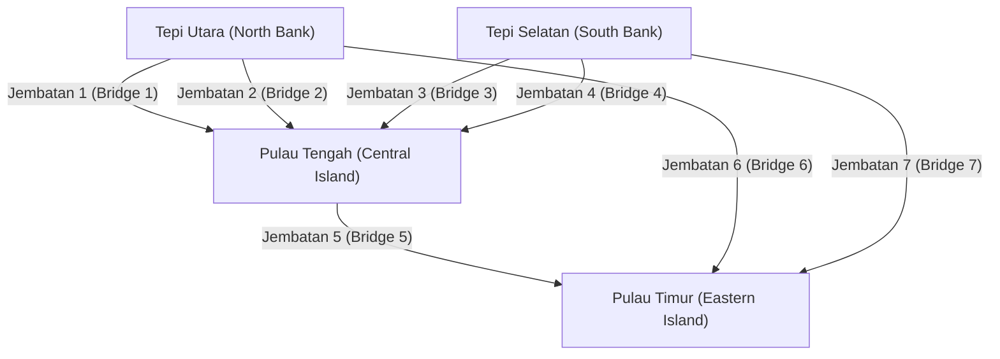
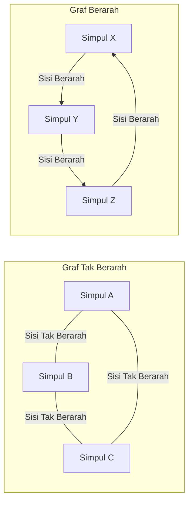

## 1. Pendahuluan: Dunia Terbuat dari Jaringan

Dalam masyarakat modern, kita terus-menerus terhubung ke suatu hal. Baik itu komunikasi antar komputer melalui internet, hubungan manusia yang kompleks pada layanan jejaring sosial (SNS), jaringan jalan dan kereta api luas yang menghubungkan kota-kota, rantai pasokan global untuk logistik, atau koneksi saraf yang tak terhitung jumlahnya di dalam otak kita sendiri—tidak berlebihan untuk mengatakan bahwa dunia terdiri dari jaringan yang tak terhitung jumlahnya.

Menyediakan kerangka kerja yang kuat untuk merepresentasikan dan menganalisis jaringan-jaringan ini secara sederhana dan ketat secara matematis, yang pada pandangan pertama tampak sangat kompleks dan bahkan kacau, adalah **[Teori Graf](/id/p/graph-theory-dijkstra-a-star/)** ([Graph Theory](https://kenji.blog/id/p/graph-theory-dijkstra-a-star/)). Dengan menggunakan [teori graf](/id/p/graph-theory-dijkstra-a-star/), kita dapat mengungkap struktur dan sifat tersembunyi di dalam sistem yang kompleks, menemukan rute komunikasi yang optimal, dan mengevaluasi kerentanan seluruh jaringan.

Artikel ini akan secara komprehensif dan sistematis menjelaskan [teori graf](/id/p/graph-theory-dijkstra-a-star/), mulai dari asal-usul historisnya, mencakup definisi matematis dasar dan struktur data untuk pemrograman komputer, dan memperkenalkan algoritma representatif yang mendukung fondasi teknologi modern.

## 2. Kelahiran Teori Graf: [Tujuh Jembatan Königsberg](https://kenji.blog/id/p/seven-bridges-of-konigsberg/)

Sejarah [teori graf](/id/p/graph-theory-dijkstra-a-star/) berawal pada abad ke-18. Pada tahun 1736, ahli matematika Swiss yang brilian [Leonhard Euler](https://kenji.blog/id/p/euler/) secara elegan memecahkan teka-teki matematika yang terkenal, menandai dimulainya bidang ini. Teka-teki ini dikenal sebagai "[Tujuh Jembatan Königsberg](https://kenji.blog/id/p/seven-bridges-of-konigsberg/)".

Di kota Königsberg yang indah di Kerajaan Prusia (sekarang Kaliningrad, Rusia), mengalir Sungai Pregel, dengan dua pulau di tengahnya dan total tujuh jembatan yang menghubungkannya ke tepi sungai. Sebuah permainan menjadi populer di kalangan warga: "Apakah mungkin untuk menyeberangi setiap jembatan tepat satu kali dan kembali ke titik awal semula?" Banyak orang mencoba, tetapi tidak ada yang berhasil.

Untuk mengatasi masalah ini, Euler mengambil pendekatan revolusioner dengan mengabstraksi peta sebenarnya dari kota itu ke batas kemampuannya. Dia merepresentasikan daratan (pulau dan tepi) sebagai "titik" dan jembatan yang menghubungkannya sebagai "garis", menghilangkan semua elemen yang tidak relevan dengan esensi masalah, seperti jarak dan arah.



Euler menyadari bahwa untuk "melewati" suatu titik, harus selalu ada sepasang "jembatan masuk" dan "jembatan keluar". Artinya, ia secara matematis membuktikan bahwa untuk semua titik kecuali titik awal dan titik akhir, jumlah jembatan yang terhubung harus "genap".

Dalam graf abstrak dari jembatan Königsberg, jumlah jembatan yang terhubung pada keempat daratan (titik) adalah "ganjil" (baik 3 atau 5). Oleh karena itu, disimpulkan bahwa tidak mungkin menggambar garis kontinu melintasi semua jembatan tepat satu kali.

Penemuan Euler inilah saat yang tepat **[Teori Graf](/id/p/graph-theory-dijkstra-a-star/)** lahir. Dengan membuang medan fisik yang kompleks dan hanya berfokus pada hubungan koneksi (topologi) dari titik dan garis, ia membuka bidang matematika yang sama sekali baru.

## 3. Konsep Dasar dan Definisi Matematis Teori Graf

Dalam [teori graf](/id/p/graph-theory-dijkstra-a-star/), "graf" tidak mengacu pada metode visualisasi data statistik seperti diagram garis atau diagram lingkaran. Ini mengacu pada struktur matematika yang mewakili sekumpulan objek dan hubungan di antara mereka.

### 3.1. Struktur Dasar Graf: Simpul (Vertices) dan Sisi (Edges)

Graf $G$ umumnya didefinisikan sebagai pasangan himpunan simpul (Vertex) $V$ dan himpunan sisi (Edge) $E$, secara matematis dilambangkan sebagai $G = (V, E)$.

*   **Simpul / Node (Vertex / Node)**: Merepresentasikan komponen jaringan. Secara visual digambar sebagai sebuah titik. Jumlah elemen dalam himpunan $V$ (jumlah simpul) dilambangkan dengan $|V|$.
*   **Sisi / Tautan (Edge / Link)**: Merepresentasikan hubungan atau koneksi antar simpul. Secara visual digambar sebagai garis. Jumlah elemen dalam himpunan $E$ (jumlah sisi) dilambangkan dengan $|E|$.

Misalnya, sisi yang menghubungkan simpul $u$ dan $v$ direpresentasikan sebagai $e = (u, v)$.

### 3.2. Graf Berarah (Directed) dan Tak Berarah (Undirected)

Graf diklasifikasikan secara luas menjadi dua jenis tergantung pada apakah sisinya memiliki arah.

*   **Graf Tak Berarah (Undirected [Graph](https://kenji.blog/id/p/tree-graph-data-structures-search-dfs-bfs-dijkstra/))**: Graf di mana sisinya tidak memiliki arah. Digunakan saat hubungan selalu timbal balik dan dua arah, seperti jalur komunikasi, jalan dua arah, atau hubungan "teman" Facebook.
*   **Graf Berarah (Directed Graph)**: Graf di mana sisi memiliki arah. Digunakan untuk menyatakan hubungan satu arah, seperti aliran air, jalan satu arah, atau hubungan "mengikuti" (follow) Twitter (X). Dalam graf berarah, sisinya digambar dengan jelas sebagai panah.



### 3.3. Graf Berbobot (Weighted Graphs)

Saat memodelkan masalah dunia nyata, kita sering ingin mengekspresikan tidak hanya "apakah mereka terhubung" tetapi juga "kemudahan koneksi" atau "biaya". Dalam kasus seperti itu, digunakan **Graf Berbobot (Weighted [Graph](https://kenji.blog/id/p/tree-graph-data-structures-search-dfs-bfs-dijkstra/))**, di mana nilai numerik (bobot) ditetapkan ke setiap sisi. Bobot dapat mewakili jarak antar kota, waktu tunda komunikasi, atau biaya perjalanan.

### 3.4. Jalur (Paths) dan Siklus (Cycles)

Konsep perpindahan dalam sebuah graf juga sangat penting.

*   **Perjalanan (Walk)**: Urutan bergantian antara simpul dan sisi. Simpul atau sisi yang sama dapat dilintasi beberapa kali.
*   **Jalur (Path)**: Perjalanan di mana tidak ada simpul yang dikunjungi lebih dari satu kali.
*   **Siklus (Cycle)**: Jalur di mana titik awal dan titik akhir adalah sama.

Konsep-konsep ini merupakan blok bangunan dasar untuk melacak aliran data di jaringan atau dalam algoritma perutean lalu lintas.

### 3.5. Derajat (Degree) dan Konektivitas

Jumlah sisi yang terhubung langsung ke simpul disebut **Derajat (Degree)** dari simpul tersebut. Derajat simpul $v$ secara matematis dilambangkan sebagai $\deg(v)$.

Dalam graf berarah, kami membedakan dengan jelas antara **Derajat Masuk (In-degree)**, jumlah panah yang masuk ke dalam sebuah simpul, dan **Derajat Keluar (Out-degree)**, jumlah panah yang keluar dari sebuah simpul.

Lebih lanjut, jika selalu ada jalur antara sembarang dua simpul arbitrer dalam sebuah graf, graf tersebut dikatakan **Terhubung (Connected)**. Dalam jaringan komunikasi seperti Internet, seluruh jaringan menjadi graf yang terhubung adalah persyaratan mutlak untuk memastikan bahwa semua komputer dapat berkomunikasi satu sama lain.

## 4. Struktur Data untuk Menangani Graf di Komputer

Untuk mengimplementasikan konsep matematika dari [teori graf](/id/p/graph-theory-dijkstra-a-star/) sebagai program dan meminta komputer menghitungnya dengan cepat, penting untuk merepresentasikan graf dalam memori menggunakan struktur data yang sesuai. Praktisnya, dua metode utama yang digunakan: "Matriks Ketetanggaan" (Adjacency Matrix) dan "Daftar Ketetanggaan" (Adjacency List).

### 4.1. Matriks Ketetanggaan (Adjacency Matrix)

Matriks ketetanggaan adalah metode yang merepresentasikan graf menggunakan larik 2 dimensi (matriks). Sebuah graf dengan $N$ simpul direpresentasikan oleh matriks $A$ berukuran $N \times N$. Jika ada sisi dari simpul $i$ ke simpul $j$, elemen matriks $A_{i,j}$ ditetapkan ke $1$; jika tidak ada, diatur ke $0$. Untuk graf berbobot, nilai numerik dari bobot sisi ditempatkan sebagai ganti $1$.

Secara matematis, ini didefinisikan sebagai berikut:

$$
A_{i,j} = \begin{cases} 
1 & (\text{jika ada sisi dari simpul } i \text{ ke simpul } j) \\
0 & (\text{jika tidak})
\end{cases}
$$

*   **Kelebihan**: Hal ini memungkinkan untuk segera menentukan apakah ada sisi antara sembarang dua simpul dalam $\mathcal{O}(1)$ (waktu konstan). Ini juga mengikat langsung ke analisis graf aljabar (seperti [teori graf spektral](/id/p/spectral-graph-theory/)) menggunakan perkalian matriks.
*   **Kekurangan**: Konsumsi memori adalah $\mathcal{O}(N^2)$ untuk jumlah simpul $N$, yang akan menghabiskan memori untuk graf raksasa. Khususnya untuk **Graf Jarang (Sparse Graphs)**, di mana jumlah sisi sangat kecil dibandingkan dengan kuadrat jumlah simpul, sebagian besar matriks menjadi $0$, menjadikannya sangat tidak efisien.

### 4.2. Daftar Ketetanggaan (Adjacency List)

Daftar ketetanggaan adalah metode yang memelihara "daftar simpul yang berdekatan (seperti larik atau daftar tertaut)" yang terhubung langsung dengan sebuah sisi untuk setiap simpul.

*   Simpul A: `[B, C]`
*   Simpul B: `[A, D, E]`
*   Simpul C: `[A, F]`

*   **Kelebihan**: Konsumsi memori sebanding dengan jumlah titik dan sisi, yang menghasilkan $\mathcal{O}(|V| + |E|)$, membuatnya sangat efisien memori untuk graf jarang yang umum terjadi di dunia nyata.
*   **Kekurangan**: Untuk memeriksa apakah simpul spesifik $i$ dan simpul $j$ terhubung, penting untuk mencari daftar secara berurutan, yang membutuhkan waktu $\mathcal{O}(|V|)$ dalam kasus terburuk.

## 5. Algoritma Representatif Seputar Graf

Untuk memecahkan masalah pada graf secara efisien, banyak algoritma unggul telah dirancang sepanjang sejarah ilmu komputer. Di sini kami memperkenalkan beberapa algoritma representatif yang dianggap penting dalam rekayasa perangkat lunak modern.

### 5.1. Pencarian Melebar-Pertama ([BFS](https://kenji.blog/id/p/tree-graph-data-structures-search-dfs-bfs-dijkstra/)) dan Pencarian Mendalam-Pertama ([DFS](https://kenji.blog/id/p/tree-graph-data-structures-search-dfs-bfs-dijkstra/))

Algoritma paling mendasar untuk mengunjungi semua simpul dalam jaringan secara sistematis tanpa kelalaian adalah **Pencarian Melebar-Pertama (Breadth-First Search, BFS)** dan **Pencarian Mendalam-Pertama (Depth-First Search, DFS)**.

*   **Pencarian Melebar-Pertama (BFS)**: Menjelajahi secara konsentris, memprioritaskan simpul yang lebih dekat ke titik awal. Ini seperti riak yang menyebar ketika batu dilempar ke dalam air. Ideal untuk menemukan jalur terpendek (jalur dengan jumlah sisi minimum) dalam graf tak berbobot. Ini diimplementasikan menggunakan struktur data Antrean (Queue).
*   **Pencarian Mendalam-Pertama (DFS)**: Menjelajahi sedalam mungkin, dan saat menemui jalan buntu, mundur ke titik percabangan sebelumnya untuk menjelajahi jalur lain. Ini seperti memecahkan labirin dengan menelusuri dinding. Digunakan untuk mendeteksi siklus dalam graf atau untuk pengurutan topologi. Ini diimplementasikan menggunakan Tumpukan ([Stack](https://kenji.blog/id/p/c-language-pointers-memory-management-stack-heap/)) atau pemanggilan fungsi rekursif.

Di bawah ini adalah contoh implementasi sederhana dari Pencarian Melebar-Pertama (BFS) menggunakan Python.

```python
from collections import deque

def bfs(graph, start_vertex):
    """
    Fungsi untuk mengeksekusi Pencarian Melebar-Pertama (BFS) pada graf
    :param graph: Kamus graf yang direpresentasikan dalam format daftar ketetanggaan
    :param start_vertex: Simpul awal untuk memulai penjelajahan
    """
    visited = set() # Himpunan untuk merekam simpul yang dikunjungi
    queue = deque([start_vertex]) # Antrean untuk mengelola simpul yang akan dijelajahi
    visited.add(start_vertex)
    
    while queue:
        # Menghapus simpul dari antrean depan
        vertex = queue.popleft()
        print(f"Saat ini sedang mengunjungi simpul: {vertex}")
        
        # Tambahkan semua simpul tetangga yang belum dikunjungi ke antrean
        for neighbor in graph[vertex]:
            if neighbor not in visited:
                visited.add(neighbor)
                queue.append(neighbor)

# Definisi graf (format daftar ketetanggaan)
graph_data = {
    'A': ['B', 'C'],
    'B': ['A', 'D', 'E'],
    'C': ['A', 'F'],
    'D': ['B'],
    'E': ['B', 'F'],
    'F': ['C', 'E']
}

print("Log hasil eksekusi BFS:")
bfs(graph_data, 'A')
```

### 5.2. Masalah Jalur Terpendek: Algoritma [Dijkstra](https://kenji.blog/id/p/graph-theory-dijkstra-a-star/)

Mencari rute tercepat ke tujuan pada aplikasi peta, apa yang beroperasi pada inti sistem adalah **Algoritma Jalur Terpendek**. Rute tersebut memiliki biaya (bobot) seperti "jarak" dan "waktu tempuh", dan tujuannya adalah menemukan jalur yang meminimalkan biaya kumulatif dari titik awal ke tujuan.

Diciptakan oleh ilmuwan komputer Belanda Edsger W. [Dijkstra](https://kenji.blog/id/p/tree-graph-data-structures-search-dfs-bfs-dijkstra/) pada tahun 1956, **Algoritma Dijkstra** merupakan algoritma yang sangat terkenal untuk menghitung secara efisien jalur terpendek dari satu sumber ke semua simpul lainnya di jaringan, di bawah syarat bahwa semua bobot sisi adalah non-negatif (0 atau lebih besar).

Logika inti dari algoritma Dijkstra adalah mengulangi proses "memilih simpul dengan jarak terpendek yang belum dikonfirmasi dari sekumpulan simpul yang jarak terpendeknya dari awal telah dikonfirmasi, dan memperbarui informasi jarak terpendek dari simpul-simpul di sekitarnya melalui rute yang melewati simpul tersebut". Dengan menggunakan Antrean Prioritas (Priority Queue), waktu eksekusi dapat dikurangi secara signifikan.

```python
import heapq

def dijkstra(graph, start):
    """
    Perhitungan biaya jalur terpendek menggunakan algoritma Dijkstra
    """
    # Kamus untuk menyimpan jarak terpendek dari titik awal. Nilai awal tidak terbatas (infinity).
    distances = {vertex: float('infinity') for vertex in graph}
    distances[start] = 0
    
    # Antrean prioritas untuk menyimpan tupel (jarak kumulatif, simpul)
    priority_queue = [(0, start)]
    
    while priority_queue:
        # Ekstrak simpul dengan jarak terpendek saat ini
        current_distance, current_vertex = heapq.heappop(priority_queue)
        
        # Lewati pemrosesan jika jarak yang diekstraksi dari antrean lebih panjang dari jarak yang telah dicatat
        if current_distance > distances[current_vertex]:
            continue
            
        # Mencoba untuk memperbarui jarak untuk semua simpul yang berdekatan
        for neighbor, weight in graph[current_vertex].items():
            distance = current_distance + weight
            
            # Jika jalur yang lebih pendek dari sebelumnya ditemukan, perbarui jarak dan masukkan ke antrean
            if distance < distances[neighbor]:
                distances[neighbor] = distance
                heapq.heappush(priority_queue, (distance, neighbor))
                
    return distances

# Definisi graf berarah berbobot
weighted_graph = {
    'A': {'B': 2, 'C': 5},
    'B': {'C': 2, 'D': 4},
    'C': {'D': 1},
    'D': {'C': 3} # Ada siklus
}

print("\nHasil eksekusi algoritma Dijkstra (jarak terpendek dari simpul A):")
print(dijkstra(weighted_graph, 'A'))
```

### 5.3. Masalah Pohon Rentang Minimum: Algoritma Kruskal

Bayangkan kebutuhan untuk menghubungkan secara fisik semua pangkalan di jaringan yang luas dengan total biaya serendah mungkin. Misalnya, ketika membangun jaringan listrik untuk mensuplai listrik ke daerah pemukiman baru, atau memasang kabel serat optik di antara beberapa kota, situasinya menuntut meminimalkan biaya pembangunan infrastruktur.

Dengan cara ini, subgraf yang menyertakan semua simpul graf, sama sekali tidak memiliki siklus (yakni, [struktur pohon](/id/p/tree-graph-data-structures-search-dfs-bfs-dijkstra/)), dan meminimalkan jumlah bobot tepi yang digunakan disebut **Pohon Rentang Minimum (Minimum Spanning [Tree](https://kenji.blog/id/p/tree-graph-data-structures-search-dfs-bfs-dijkstra/), MST)**.

Salah satu algoritma representatif untuk menemukan pohon rentang minimum ini adalah **Algoritma Kruskal**. Algoritma Kruskal adalah contoh khas "Algoritma Serakah (Greedy Algorithm)" yang mengakumulasikan solusi optimal lokal, mengikuti langkah-langkah yang sangat sederhana dan intuitif.

1.  Urutkan semua sisi yang ada dalam graf dalam urutan menaik dari bobotnya.
2.  Ekstrak tepi satu per satu mulai dari yang berbobot paling kecil, dan secara resmi mengadopsinya ke dalam pohon rentang hanya jika penambahan sisi tersebut tidak membentuk "siklus (lingkaran)".
3.  Akhiri algoritma ketika jumlah tepi yang diadopsi ke dalam pohon rentang mencapai "jumlah total simpul - 1".

Struktur data khusus yang disebut Himpunan Saling Lepas (Union-Find Tree) berperan aktif dalam secara cepat menentukan apakah suatu siklus terbentuk.

### 5.4. Aliran Jaringan dan Masalah Aliran Maksimum

Dalam jaringan pipa air kota atau jalur komunikasi tulang punggung Internet, pertanyaan "Berapa jumlah maksimum (air atau paket data) yang secara bersamaan dapat mengalir melalui keseluruhan sistem dari titik awal (sumber) ke titik akhir (muara)?" disebut **Masalah Aliran Maksimum (Maximum Flow Problem)**.

Setiap sisi (pipa atau kabel) yang menyusun jaringan memiliki "Kapasitas (Capacity)" yang ditentukan dengan ketat yang menunjukkan jumlah maksimum yang dapat mengalir per satuan waktu, dan secara fisik tidak mungkin mengalir melebihi kapasitas ini pada setiap rute. Masalah kompleks ini secara matematis dan akurat dapat diselesaikan menggunakan algoritma seperti Algoritma Ford-Fulkerson untuk mendapatkan tingkat aliran maksimum. Teori aliran maksimum diterapkan pada bidang yang sangat luas, termasuk pemodelan dan mitigasi kemacetan lalu lintas, resolusi kemacetan jaringan logistik, dan bahkan ekstraksi objek (pemotongan graf) dalam pemrosesan gambar.

## 6. Graf Bipartit dan Masalah Pencocokan (Matching)

Menempati posisi unik dalam [teori graf](/id/p/graph-theory-dijkstra-a-star/) adalah **Graf Bipartit (Bipartite [Graph](https://kenji.blog/id/p/tree-graph-data-structures-search-dfs-bfs-dijkstra/))**. Graf bipartit adalah graf yang, ketika semua simpul dibagi menjadi dua kelompok (misalnya, kelompok $U$ dan kelompok $V$), setiap sisi selalu menghubungkan simpul di $U$ dan simpul di $V$, dan sama sekali tidak ada tepi yang menghubungkan simpul dalam grup yang sama.

Graf bipartit ideal untuk memodelkan hubungan antara dua himpunan dengan properti berbeda, seperti "pencari kerja" dan "perusahaan perekrut", "siswa" dan "laboratorium", atau "taksi" dan "penumpang".

Salah satu masalah terpenting dalam graf bipartit adalah **Masalah Pencocokan (Matching Problem)**. Ini adalah masalah memilih sekumpulan tepi (pencocokan) dari graf yang tidak berbagi titik akhir satu sama lain. Secara khusus, "pencocokan bipartit maksimum," yang membentuk pasangan sebanyak mungkin, terhubung langsung dengan masalah alokasi sumber daya yang optimal. Selanjutnya, masalah yang memaksimalkan kepuasan atau keuntungan setiap pasangan telah diselesaikan oleh "Algoritma Gale-Shapley," yang menjadi subyek Hadiah Nobel bidang Ekonomi, dan terintegrasi secara mendalam ke dalam desain sistem sosial dunia nyata, seperti penugasan rumah sakit residen medis dan sistem pemilihan sekolah.

## 7. Penerapan Teori Graf dalam Masyarakat Modern

[Teori graf](/id/p/graph-theory-dijkstra-a-star/) tidak terbatas pada matematika abstrak di papan tulis; ia digunakan di berbagai domain sebagai teknologi infrastruktur yang pada dasarnya mendukung kehidupan sehari-hari kita.

### 7.1. Mesin Pencari dan Algoritma PageRank

Mekanisme mesin pencari Google, yang secara instan mengevaluasi halaman web yang tak terhitung jumlahnya yang tersebar di seluruh dunia dan memeringkatnya dalam urutan kegunaan, yang dikenal sebagai algoritma **PageRank**, adalah kisah sukses definitif memodelkan dunia web sebagai graf berarah yang masif.

*   **Simpul**: Halaman web individual di Internet
*   **Sisi**: Hyperlink yang melompat dari satu halaman ke halaman lain

Di akar PageRank adalah ide evaluasi rekursif bahwa "halaman yang ditautkan oleh banyak halaman web berkualitas tinggi kemungkinan besar merupakan halaman berkualitas tinggi itu sendiri." Dengan merepresentasikan struktur tautan sebagai matriks ketetanggaan yang masif dan menghitung vektor eigen utama dari matriks tersebut (sebuah penerapan dari [teori graf spektral](/id/p/spectral-graph-theory/)), mereka berhasil menghitung secara matematis dan obyektif kepentingan relatif informasi Internet, yang mencakup ratusan miliar halaman.

### 7.2. Analisis Struktural Jejaring Sosial

Platform SNS seperti Twitter, Facebook, LinkedIn, dan Instagram membentuk **Graf Sosial (Social Graphs)** masif yang mengekspresikan koneksi antar individu, atau individu dan konten. Dengan menerapkan [teori graf](/id/p/graph-theory-dijkstra-a-star/), struktur komunitas masif dapat dianalisis secara akurat.

Misalnya, untuk menjawab pertanyaan "Siapa tokoh sentral (influencer) dengan pengaruh paling besar di seluruh jaringan?", digunakan konsep **Sentralitas (Centrality)**. Dengan menghitung berbagai metrik seperti "sentralitas derajat" (degree centrality) berdasarkan pada jumlah sisi sederhana yang terhubung ke sebuah simpul, "sentralitas keperantaraan" (betweenness centrality) yang mengukur seberapa sering seseorang muncul di jalur terpendek di dalam jaringan, dan "sentralitas kedekatan" (closeness centrality) yang mengevaluasi kemudahan akses ke semua simpul lain, aktivitas seperti identifikasi influencer, prediksi rute penyebaran informasi, dan deteksi fenomena ruang gema (echo chamber) dilakukan.

### 7.3. Pembelajaran Mesin dan Jaringan Saraf Graf (GNN)

Dalam beberapa tahun terakhir, di garis depan kecerdasan buatan (AI) dan pembelajaran mesin, **Jaringan Saraf Graf (Graph Neural Networks, GNN)**, yang dapat secara langsung mempelajari data dengan struktur graf, telah menarik perhatian yang luar biasa.

Model pembelajaran mesin tradisional, seperti CNN yang digunakan dalam pengenalan gambar atau [Transformer](https://kenji.blog/id/p/large-language-models-llm-transformer-prompt-engineering/)s yang digunakan dalam pemrosesan bahasa alami, dirancang untuk menangani data biasa seperti larik piksel mirip kisi atau urutan kata satu dimensi. Namun, menangani data graf yang tidak teratur dan kompleks seperti koneksi SNS yang kompleks atau struktur ikatan atom yang menyusun molekul sangatlah sulit.

GNN mendobrak batasan ini dengan menyebarkan dan mempelajari secara bersamaan informasi kuantitas fitur masing-masing simpul di graf dan topologi (hubungan koneksi) seluruh graf. Saat ini, GNN telah dipraktikkan sebagai teknologi inti yang sangat diperlukan di aplikasi AI mutakhir, termasuk bidang penemuan obat (Drug Discovery) yang memprediksi properti senyawa baru, sistem rekomendasi lanjutan di Amazon dan Netflix, dan prediksi waktu tiba pada Google Maps.

## 8. Kesimpulan dan Prospek Masa Depan

Dalam artikel ini, kami telah menguraikan bagaimana **[Teori Graf](/id/p/graph-theory-dijkstra-a-star/)**, yang lahir dari teka-teki sederhana di Königsberg pada abad ke-18, telah berevolusi menjadi "alat pamungkas" untuk mengungkap jaringan yang sangat kompleks di masyarakat modern.

Meskipun graf hanya terdiri dari elemen yang paling sederhana dan abstrak yang mungkin ada: titik (simpul) dan garis (sisi), dunia teori matematika dan algoritma komputasi yang diterapkan padanya sedalam alam semesta dan menyimpan kekuatan yang luar biasa. Bagi insinyur perangkat lunak, ilmuwan data, atau siapa saja yang tertarik dengan sistem yang kompleks, pengetahuan sistematis tentang [teori graf](/id/p/graph-theory-dijkstra-a-star/) akan secara eksponensial meningkatkan kemampuan untuk melakukan abstraksi tingkat tinggi terhadap masalah-masalah sulit dan pemikiran logis untuk menurunkan solusi optimal.

Jika Anda sedang belajar pemrograman, silakan gunakan artikel ini sebagai batu loncatan dan cobalah untuk benar-benar membuat kode dan menjalankan algoritma seperti algoritma [Dijkstra](https://kenji.blog/id/p/graph-theory-dijkstra-a-star/) atau pencarian melebar-pertama di komputer Anda sendiri. Saat Anda merasakan proses di mana jaringan kompleks dan tidak terlihat diungkap secara jelas dengan kode yang Anda tulis, Anda akan benar-benar menyadari keindahan sejati serta pesona [teori graf](/id/p/graph-theory-dijkstra-a-star/). Dunia ini dipenuhi dengan graf yang jauh lebih indah dan dapat dihitung daripada yang Anda bayangkan.
